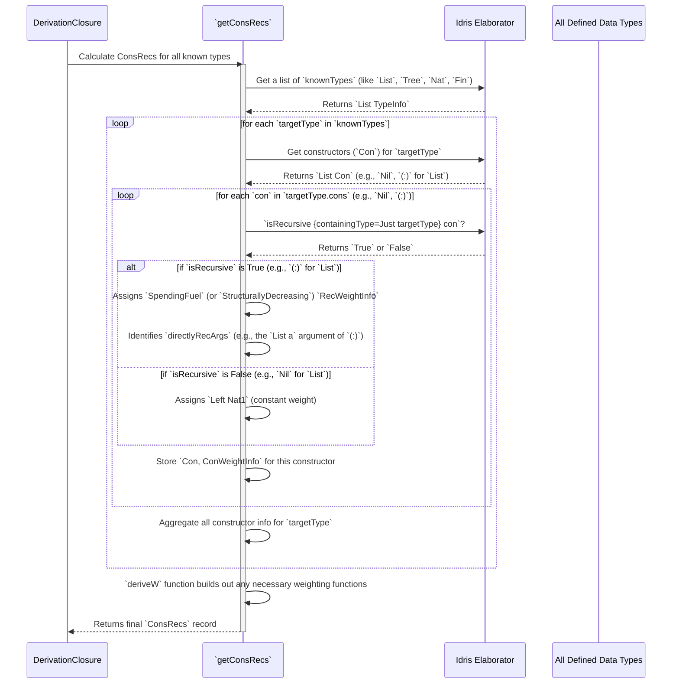

# Chapter 8: ConsRecs (Constructor Recursiveness)

Welcome back! In [Chapter 7: DerivationClosure (Derivation Context)](07_derivationclosure__derivation_context__.md), we learned about the "construction manager" that orchestrates `deriveGen`. Now, let's zoom in on a very specific, but crucial, task this manager performs: handling recursive data types using `ConsRecs`.

## The Building Inspector: What is `ConsRecs`?

Imagine you're trying to build a LEGO tower. A constructor is like a specific type of LEGO block (e.g., a "2x4 brick" or a "door block"). If you build a tower using only "2x4 bricks," you could potentially build it *forever*! This is a recursive structure.

In `DepTyCheck`, data types can also be recursive. The most common example is a `List`:
*   `Nil` (empty list)
*   `(:) head tail` (a list with a `head` element followed by a `tail` list)

Notice how the `tail` of the list *is another list*. If a generator just blindly followed this rule, it would try to build an infinitely long list! This is where `ConsRecs` (Constructor Recursiveness) comes in.

`ConsRecs` is like a **smart building inspector** for your data types. Its job is to:
1.  **Identify recursive blocks**: It checks which constructors (like `(:)`) refer back to their own type or a similar type, making them potentially lead to endless structures.
2.  **Assign a "weight"**: For these recursive blocks, it assigns a "weight" that represents how much "fuel" (from [Chapter 5: DeriveGen (Automatic Generator Derivation)](05_derivegen__automatic_generator_derivation__.md)) a generator should "spend" when using that block.
3.  **Ensure termination**: By properly managing this "fuel," `ConsRecs` helps `deriveGen` build structures that are deep enough to be interesting but always finite, preventing infinite loops during generation.

The core problem `ConsRecs` solves is how to make generators for recursive data types terminate. Without it, `deriveGen` would just loop forever trying to build an infinite list or tree.

## Why is `ConsRecs` Important?

`ConsRecs` is vital for generating realistic and finite examples of recursive data. If you have a data type like a `Tree`:

```idris
data Tree a = Leaf a | Node (Tree a) (Tree a)
```

A generator for `Tree` needs to know:
*   `Leaf a`: This constructor is **not recursive**. It just brings some data `a`. It should have a lower "cost" in terms of "fuel."
*   `Node (Tree a) (Tree a)`: This constructor is **recursive**. It calls itself twice to build sub-trees. This should "spend fuel" because using it takes us deeper into the tree structure.

`ConsRecs` provides this intrinsic knowledge, allowing `deriveGen` to correctly limit the depth of lists, trees, and other recursive structures.

## How `ConsRecs` Works: Identifying and Weighting Recursion

`ConsRecs` determines two key things for each constructor of a data type:
1.  **Is it recursive?**: Does this constructor directly or indirectly refer to its own type?
2.  **How much "fuel" does it spend?**: If it's recursive, what's its "cost"?

Let's look at the `List` example:

```idris
data List a = Nil | (::) a (List a)
```

`ConsRecs` would analyze each constructor:

### Constructor `Nil`:
*   **Is it recursive?**: No. It doesn't contain `List a`.
*   **Fuel spend?**: 1 (a constant, minimal "weight"). It just represents finishing a list.

### Constructor `(::) a (List a)`:
*   **Is it recursive?**: Yes! The second argument `(List a)` is exactly the type we are building.
*   **Fuel spend?**: This is where `ConsRecs` gets smart. It recognizes this as `SpendingFuel`. This means using `(:)` for `List a` will typically consume one unit of `Fuel`, and the *remaining fuel* will be passed to the generator for the `tail` (`List a`).

This "spending fuel" logic is what makes sure your generated lists don't go on forever. When the `Fuel` runs out, `deriveGen` will default to using non-recursive constructors (like `Nil`) to terminate the structure.

`ConsRecs` stores this information internally in a record:

```idris
record ConsRecs where
  constructor MkConsRecs
  conWeights : SortedMap Name (givenTyArgs : SortedSet Nat) -> List (Con, ConWeightInfo)
  deriveWeightingFun : TypeInfo -> Maybe (Decl, Decl)
```

*   `conWeights`: This is the core. It's a map where keys are type names (like `List` or `Tree`). The values tell you, for different type arguments (like `a` in `List a`), a list of all constructors (`Con`) and their `ConWeightInfo`.

### The `ConWeightInfo`

This record holds the specific "weight" details for a constructor:

```idris
data RecWeightInfo : Type where
  SpendingFuel : ((leftFuelVarName : Name) -> TTImp) -> RecWeightInfo
  StructurallyDecreasing : (decrTy : TypeInfo) -> (wExpr : TTImp) -> RecWeightInfo

record ConWeightInfo where
  constructor MkConWeightInfo
  weight : Either Nat1 RecWeightInfo
```

Let's unpack `ConWeightInfo`:
*   `weight : Either Nat1 RecWeightInfo`:
    *   `Left Nat1`: This is for non-recursive constructors (like `Nil` or `Leaf`). They just have a fixed cost (usually `1`).
    *   `Right RecWeightInfo`: This is for recursive constructors.
        *   `SpendingFuel`: This is the common case for `List`s and `Tree`s. It tells the generator to decrement the `Fuel` and pass the reduced `Fuel` to the recursive call. The argument `leftFuelVarName -> TTImp` helps build the syntax for decreasing the fuel, often using `(`Deriving.DepTyCheck.Gen.ConsRecs.leftDepth`)` (a helper function that computes remaining depth based on fuel).
        *   `StructurallyDecreasing`: This is for more advanced cases, where recursion might not spend a direct "fuel" but instead uses a "structurally decreasing" argument. Think of `Vect n a` where `n` decreases. This case is less common for simple data types but important for dependent types.

## How `DeriveGen` Uses `ConsRecs`

When `deriveGen` (from [Chapter 5: DeriveGen (Automatic Generator Derivation)](05_derivegen__automatic_generator_derivation__.md)) is asked to build a generator for a recursive type (for example, `List Nat`), here's how it uses `ConsRecs`:

1.  **Get `ConsRecs`**: The `DerivationClosure` (from [Chapter 7: DerivationClosure (Derivation Context)](07_derivationclosure__derivation_context__.md)) ensures that `ConsRecs` information is available to `deriveGen`.
2.  **Analyze constructors**: For `List Nat`, `deriveGen` looks at `Nil` and `(:)`. It queries `ConsRecs` for their `ConWeightInfo`.
3.  **Prioritize non-recursive constructors at low fuel**: When `Fuel` gets very low or is `Dry`, `deriveGen` knows it *must* use `Nil` to finish the list to avoid an infinite loop.
4.  **Spend fuel for recursive constructors**: When `Fuel` is available, `deriveGen` knows that using `(:)` means spending one unit of `Fuel` for the current step, and the recursive call for the `List Nat` (tail) should be passed `Fuel.More previousFuel`.
5.  **Build the `oneOf`**: `deriveGen` creates an `oneOf` generator that chooses between `Nil` and `(:)`. The `ConsRecs` information guides the weighting (probability) of choosing `Nil` versus `(:)` based on the available `Fuel`.

The `deriveGen` will construct something like this (conceptually):

```idris
-- Simplified internal logic for deriveGenListNat using ConsRecs
deriveGenListNat : Fuel -> Gen MaybeEmpty (List Nat)
deriveGenListNat Dry = pure Nil -- No fuel left, MUST use Nil
deriveGenListNat (More fuel') = oneOf
  [ (weight 1) pure Nil -- Option 1: Terminate the list
  , (weight recWeight) [| (::) (genNat fuel') (deriveGenListNat fuel') |] -- Option 2: Add an element, recurse with less fuel
  ]
  where
    recWeight = -- Determined by ConsRecs, often proportional to fuel left
```
*(Note: The actual weighting and fuel decrementing logic is more sophisticated, often using `deriveWeightingFun` to generate specialized functions, but the core idea is exactly this.)*

## Internal Peek: How `ConsRecs` is Built

The `getConsRecs` function is where all the magic happens to calculate the `ConsRecs` information.

```idris
export
getConsRecs : Elaboration m => NamesInfoInTypes => m ConsRecs
getConsRecs = do
  consRecs <- for knownTypes $ \targetType => /* ... */
  -- ... many internal steps ...
  pure $ MkConsRecs finalConsRecs $ deriveW consRecs
```

Let's trace the high-level steps `getConsRecs` takes:



The key helper function is `isRecursive`:

```idris
-- Simplified from internal use in `getConsRecs`
w : Either Nat1 (TTImp -> TTImp, SortedSet $ Fin con.args.length) <- case isRecursive {containingType=Just targetType} con of
    False => pure $ Left $ /* ... constant weight ... */
    True  => Right <$> do
        -- ... logic for SpendingFuel or StructurallyDecreasing ...
        pure (fuelWeightExpr, fromList directlyRecArgs)
```
*   `isRecursive {containingType=Just targetType} con`: This helper function (not directly part of the `ConsRecs` interface but used internally) takes a `Con` (constructor) and its `targetType` and determines if it creates a recursive call. If it does, it tries to identify which arguments are responsible for that recursion (`directlyRecArgs`).

Based on whether `isRecursive` is `True` or `False`, `getConsRecs` then builds the appropriate `ConWeightInfo` (either a fixed `Nat1` or a `RecWeightInfo` like `SpendingFuel`).

### `deriveWeightingFun`

For types where recursion is more complex than simply decrementing `Fuel` (e.g., types that use `Nat` arguments that decrease structurally, like `Vect n a` where `n` decreases), `ConsRecs` can also `deriveWeightingFun`. This produces a custom Idris function (as a `Decl` pair) that calculates the appropriate "weight" or "structural decrease" for the generator to use.

This demonstrates the depth of `DepTyCheck`'s analysis: it understands not just *that* a type is recursive, but *how* it's recursive, and generates specialized code to handle it correctly!

## Conclusion

`ConsRecs` is your generator's built-in "building inspector" for recursive data types. It precisely identifies which constructors lead to recursive calls and assigns them a "weight" based on how much `Fuel` they should consume. This ensures that `deriveGen` can create finite, yet well-structured, examples of recursive data like lists and trees, preventing infinite generation loops.

Understanding `ConsRecs` helps you appreciate how `DepTyCheck` ensures termination and depth control in automatically generated test data, especially for complex structures.

Next, we'll see how this `ConsRecs` information, along with `GenSignature` and `DerivationClosure`, is used to finally build the actual body of a constructor's generator in [Chapter 9: DeriveBodyRhsForCon (Constructor RHS Derivation)](09_derivebodyrhsforcon__constructor_rhs_derivation__.md).

[Chapter 9: DeriveBodyRhsForCon (Constructor RHS Derivation)](09_derivebodyrhsforcon__constructor_rhs_derivation__.md)

---

Generated by [AI Codebase Knowledge Builder](https://github.com/The-Pocket/Tutorial-Codebase-Knowledge)