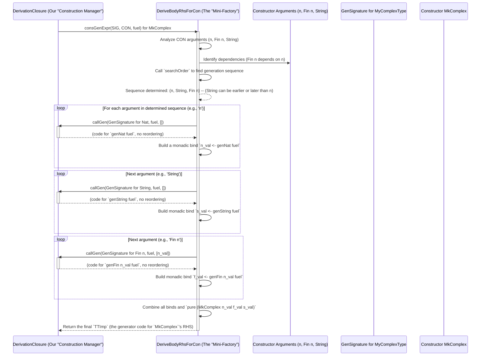

# Chapter 9: DeriveBodyRhsForCon (Constructor RHS Derivation)

Welcome back! In [Chapter 8: ConsRecs (Constructor Recursiveness)](08_consrecs__constructor_recursiveness__.md), we explored how `DepTyCheck` intelligently manages recursion in data types to ensure our generators always produce finite values. Now, let's tie many of these concepts together with `DeriveBodyRhsForCon`.

## The Mini-Factory: What is `DeriveBodyRhsForCon`?

Imagine you're building a LEGO set, and you have several instruction manuals. The main manual (like `DeriveGen`) tells you how to build the entire model. But for each specific type of LEGO piece (a constructor), there's a smaller, specialized instruction sheet explaining *exactly* how to snap smaller pieces together to make *that one specific piece*.

`DeriveBodyRhsForCon` is this specialized instruction sheet, or "mini-factory." Once the main "architect" (`DeriveGen`) has decided to build a generator for a `data type`, and the "construction manager" (`DerivationClosure`) has allocated resources, `DeriveBodyRhsForCon` is delegated the task of generating the actual code for **each individual constructor** within that data type.

For example, if you have a `List a` type, `DeriveBodyRhsForCon` will be separately invoked for the `Nil` constructor and for the `::` (cons) constructor. Its job is to figure out:
1.  How to get all the arguments needed for *this specific constructor*.
2.  In what *order* to generate those arguments, especially when some arguments depend on others (dependent types).
3.  How to incorporate any custom, "external" generators you've provided.

The core problem `DeriveBodyRhsForCon` solves is breaking down the complex task of generating a full data structure into manageable, constructor-specific steps, making smart decisions about argument generation order and external dependencies.

## Why is `DeriveBodyRhsForCon` Important?

This abstraction is crucial because:
*   **Encapsulation**: It keeps the logic for handling each constructor separate and manageable.
*   **Order of Operations**: For dependent types (like `Fin n`), the `n` needs to be generated *before* `Fin n`. `DeriveBodyRhsForCon` figures out this intricate order.
*   **External Generators**: It ensures that if you've provided a specific generator for `String`, for example, that one is used when crafting a constructor that takes a `String`.
*   **Generality**: It allows different "tactics" (strategies) for generating arguments, accommodating various scenarios and user preferences.

## Your First Constructor RHS Derivation (Implicitly)

You won't directly call `DeriveBodyRhsForCon`. It's an internal "worker" that `deriveGen` uses. When you write something like this:

```idris
%language ElabReflection

data MyComplexType : Type where
  MkComplex : (n : Nat) -> Fin n -> String -> MyComplexType

genMyComplexType : Fuel -> Gen MaybeEmpty MyComplexType
genMyComplexType = deriveGen
```

The `deriveGen` macro will:
1.  Analyze `MyComplexType`'s `GenSignature` (as seen in [Chapter 6: GenSignature (Generator Signature)](06_gensignature__generator_signature__.md)).
2.  Realize `MyComplexType` has one constructor: `MkComplex`.
3.  Delegate to `DeriveBodyRhsForCon` to generate the right-hand side (RHS) of the generator specifically for `MkComplex`.

For `MkComplex (n : Nat) (f : Fin n) (s : String)`:
*   `DeriveBodyRhsForCon` will first figure out how to generate `n : Nat`.
*   Then, it will use that generated `n` to generate `f : Fin n`.
*   Finally, it will generate `s : String` (potentially using an external generator if one is supplied).
*   All these generation steps will be chained together using `do` notation due to `Fin n` being depenendent on `n`.

## The `DeriveBodyRhsForCon` Interface

Like many architectural components in `DepTyCheck`, `DeriveBodyRhsForCon` is an interface:

```idris
-- src/Deriving/DepTyCheck/Gen/ForOneTypeConRhs/Interface.idr
public export
interface DeriveBodyRhsForCon where
  consGenExpr : DerivationClosure m => GenSignature -> (con : Con) -> (given : SortedSet $ Fin con.args.length) -> (fuel : TTImp) -> m TTImp
```

Let's break down the `consGenExpr` function:
*   `DerivationClosure m =>`: It runs within the `DerivationClosure` environment (our "construction manager" from [Chapter 7: DerivationClosure (Derivation Context)](07_derivationclosure__derivation_context__.md)). This means it has access to:
    *   `callGen`: To request generators for individual arguments.
    *   `needWeightFun`: If it encounters recursive types.
    *   The overall state of the derivation process.
*   `GenSignature`: The blueprint for the *entire* generator we're building (for `MyComplexType` in our example).
*   `(con : Con)`: The specific constructor `DeriveBodyRhsForCon` is currently responsible for (e.g., `MkComplex`).
*   `(given : SortedSet $ Fin con.args.length)`: A set of indices indicating which of the constructor's arguments are *already provided* (e.g., if `MkComplex` were `MkComplex : (val : Nat) -> (n : Nat) -> Fin n -> MyComplexType` and `val` was an input). In our `MkComplex` example, this would be empty.
*   `(fuel : TTImp)`: The `Fuel` argument, passed down from the main generator, to control recursion depth.
*   `m TTImp`: It returns the Idris code (`TTImp`) for the right-hand side of the generator for *this constructor*. This will be a `Gen` expression (e.g., `[| MkComplex <genNat> <genFin> <genString> |]` or a `do` block).

## Internal Peek: A Tale of Tactics

`DeriveBodyRhsForCon` isn't just one way of doing things; it has different "tactics" or strategies implemented. The provided code snippet shows:

1.  **`[LeastEffort] DeriveBodyRhsForCon` (Non-obligatory tactic)**: This is the default and often the simplest. It prioritizes finding the most straightforward generation order without being too strict about using *all* available external generators if there are conflicts.
2.  **BestEffort (commented out in the provided code)**: A more advanced non-obligatory tactic that tries harder to use external generators.
3.  **FailFast, DecEqConflicts (commented out)**: These are "obligatory" tactics where external generators are *required* to be used. They address conflicts in different ways.

Let's simplify and trace the core logic of the `LeastEffort` tactic using our `MkComplex` example.

```idris
-- Simplified from LeastEffort's consGenExpr in src/Deriving/DepTyCheck/Gen/ForOneTypeConRhs/Impl.idr

-- Initial call:
-- consGenExpr sig (MkComplex : (n : Nat) -> Fin n -> String -> MyComplexType) empty fuel_val

consGenExpr sig con givs fuel = do
    -- 1. Analyze constructor arguments ("getTypeApps")
    -- It finds:
    --   arg 0: Nat (no dependencies initially)
    --   arg 1: Fin n (depends on arg 0, 'n')
    --   arg 2: String (no dependencies initially)
    argsTypeApps <- getTypeApps con

    -- 2. Determine "bindNames"
    -- This sets up names for generated variables, like `n_val`, `f_val`, `s_val`

    -- 3. The most crucial part: "searchOrder"
    -- This function analyzes the dependencies (like Fin n depending on n)
    -- and determines the optimal order to generate the constructor's arguments.
    -- For MkComplex, it will determine the order: [Nat (arg 0), String (arg 2), Fin n (arg 1)]
    -- (The String and Nat order might vary, but Fin n MUST come after Nat)
    let theOrder = searchOrder determ -- 'determ' is derived from argsTypeApps

    -- 4. Loop through 'theOrder' using 'genForOrder'
    -- This builds up a chain of monadic binds (do notation)
    let genForOrder : List (Fin con.args.length) -> m TTImp
        genForOrder order = map (foldr apply callCons) $ evalStateT givs $ for order $ \genedArg => do
            -- A. For each 'genedArg' (e.g., first 'n:Nat'):
            --    - Determine its GenSignature (e.g., Gen MaybeEmpty Nat)
            --    - Call 'callGen' to get the Idris code for generating Nat (e.g., `genNat fuel`)
            --    - Record that 'n' is now "present" (generated)
            --    - Return a 'bindRHS' to chain this generation with the next.
            -- After n is generated, then for 'f:Fin n':
            --    - It sees 'Fin n' depends on 'n', which is now "present".
            --    - It generates `genFin n_val`.
            --    - Chained with next.
            -- ... and so on.
            -- (This part constructs large parts of the `do` block body)
            -- An important detail: 'callGen' will ensure to pass 'fuel' but might change it to `subfuel`
            -- if there is mutual recursion detected (as discussed in DerivationClosure).
            (subgenCall, reordering) <- callGen subsig subfuel $ subgivens
            pure $ \cont => `(~subgenCall >>= ~bindRHS cont)`

    -- 5. Finally, wrap with labels and return
    with FromString.(.label)
    labelGen "\{show con.name} (orders)".label <$> genForOrder theOrder
```

### The `searchOrder` Function

This is a clever algorithm within `DeriveBodyRhsForCon` that figures out the best sequence for generating arguments to a constructor. It examines the "determination" of each argument:
*   `stronglyDeterminingArgs`: Which arguments *must* be determined first because they influence others (e.g., `n` influences `Fin n`).
*   `argsDependsOn`: Which arguments *depend on* others (e.g., `Fin n` depends on `n`).

It builds a dependency graph and finds an order that satisfies all dependencies, usually prioritizing arguments that influence many others or have no dependencies themselves. This ensures that when `genFin n` is called, the `n` value is *already available*.

The `LeastEffort` tactic implements `searchOrder` using `assignPriorities` and `findFirstMax` to pick the next argument to generate based on how many other arguments depend on it.


*(Note: `fuel` is also threaded through. In the diagram above, `n_val` and `s_val` are used as direct variables because they were already generated, making the `Fin n` call dependent on `n_val`.)*

The `consGenExpr` function in `DeriveBodyRhsForCon` acts as a template. It takes the specific constructor and its arguments, and dynamically generates Idris code that will:
1.  Generate `fuel`-dependent `Nat` via `callGen`.
2.  Generate `String` via `callGen`.
3.  Generate `Fin n` via `callGen`, passing the previously generated `n`.
4.  Finally, `pure` (lift) the `MkComplex` constructor applied to all the generated values.

This complex logic is condensed into the compact `genMyComplexType = deriveGen` syntax you write, thanks to `DeriveBodyRhsForCon` working behind the scenes.

## Conclusion

`DeriveBodyRhsForCon` is the specialized "mini-factory" within `DepTyCheck`'s automatic derivation process. It focuses on the intricate task of generating the right-hand side (RHS) of the generator for each individual constructor. It intelligently determines the optimal order for generating dependent arguments, integrates external generators, and uses various "tactics" to achieve this.

By understanding `DeriveBodyRhsForCon`, you gain insight into how `DepTyCheck` constructs the actual body of your derived generators, making smart decisions about argument generation, dependencies, and external influences.

Next, we'll examine [GnOrderTuning (Generator Order Tuning)](10_gnordertuning__generator_order_tuning__.md), which shows how you can explicitly influence the generation order that `DeriveBodyRhsForCon` determines.

[Chapter 10: GnOrderTuning (Generator Order Tuning)](10_gnordertuning__generator_order_tuning__.md)

---

Generated by [AI Codebase Knowledge Builder](https://github.com/The-Pocket/Tutorial-Codebase-Knowledge)