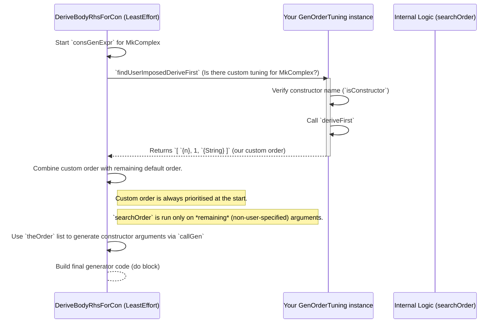

# Chapter 10: GnOrderTuning (Generator Order Tuning)

Welcome back! In [Chapter 9: DeriveBodyRhsForCon (Constructor RHS Derivation)](09_derivebodyrhsforcon__constructor_rhs_derivation__.md), we saw how `DepTyCheck` intelligently figures out the order to generate arguments for a constructor, especially for dependent types. Now, sometimes `DepTyCheck`'s automatic order might not be exactly what you want, or you might need to nudge it in a specific direction. This is where `GnOrderTuning` comes in!

## The Custom Assembly Instruction: What is `GnOrderTuning`?

Imagine you're building a fancy model airplane. Usually, the instructions tell you a perfectly good order to attach all the parts. But what if you have a special paint job you want to do *before* attaching the wings, even though the standard instructions say to attach the wings first? You need some way to **override** the default assembly instructions.

In `DepTyCheck`, `GnOrderTuning` is like writing these custom assembly instructions for your generators. It allows you to tell the automatic generator (`deriveGen`) exactly which arguments of a constructor to generate first, and in what order.

This is especially helpful in these situations:

1.  **Performance Tuning**: Sometimes, generating a certain argument first might be faster or lead to a more balanced distribution of random values.
2.  **Specific Test Cases**: You might want to ensure a particular argument is generated early to explore specific dependent scenarios.
3.  **Complex Dependencies**: Although `DepTyCheck` is smart, for very intricate dependent types, you might have insight into a better generation order than the default.

The core problem `GnOrderTuning` solves is giving you fine-grained control over the internal generation order of arguments within a constructor's generator, which `deriveGen` normally decides automatically.

## Why is `GnOrderTuning` Important? A Dependent Type Example

Let's revisit our `MyComplexType` from the previous chapter:

```idris
data MyComplexType : Type where
  MkComplex : (n : Nat) -> Fin n -> String -> MyComplexType
```

And its derived generator:

```idris
%language ElabReflection

genMyComplexType : Fuel -> Gen MaybeEmpty MyComplexType
genMyComplexType = deriveGen
```

As we explained, `DepTyCheck` will figure out that `n : Nat` must be generated *before* `Fin n` because `Fin n` depends on `n`. The `String` can be generated almost anywhere (before, after `n`, or after `Fin n`).

The default `DeriveBodyRhsForCon` (with the `LeastEffort` tactic) tries to find an optimal order. It might produce `n`, then `String`, then `Fin n`. Or `String`, then `n`, then `Fin n`. This is usually fine.

But what if, for some reason, you *really* want to ensure that `n` is generated, then `Fin n`, and *only then* the `String`? `GnOrderTuning` lets you enforce this specific order.

## How to Tune the Generation Order

To influence the generation order, you need to implement the `GenOrderTuning` interface for your data type's constructors.

The `GenOrderTuning` interface needs two things:
1.  `isConstructor`: This is a helper that confirms you're specifying a valid constructor.
2.  `deriveFirst`: This is where you list the arguments you want generated first, in the order you prefer.

Here's how we'd tune `MkComplex` to ensure `n` then `Fin n` then `String`:

```idris
%language ElabReflection
import Deriving.DepTyCheck.Gen.Tuning

data MyComplexType : Type where
  MkComplex : (n : Nat) -> Fin n -> String -> MyComplexType

-- 1. Create a GenOrderTuning instance for our constructor
GenOrderTuning "MyComplexType"."MkComplex" where
  -- 2. This simply confirms that "MkComplex" is indeed a constructor.
  --    If you mistype the constructor name, Idris will give you an error here.
  isConstructor = itIsConstructor

  -- 3. The magic happens in `deriveFirst`.
  --    - `gt`: given type arguments (for the *data type*, not the constructor)
  --    - `gc`: given constructor arguments (arguments that are already fixed, not generated)
  --    - We return a List of `ConArg` specifying the desired generation order.
  deriveFirst gt gc =
    -- Argument indices: n is 0, Fin n is 1, String is 2.
    -- You can specify by index (e.g., `0`) or by name (e.g., `{n}`).
    [ `{n} -- Explicitly generate argument 'n' first
    , 1   -- Then generate argument #1 (Fin n)
    , `{String} -- Then generate the 'String' argument (we can also use 2)
    ]

genMyComplexType : Fuel -> Gen MaybeEmpty MyComplexType
genMyComplexType = deriveGen
```

**Let's break down the `GenOrderTuning` instance:**

*   `GenOrderTuning "MyComplexType"."MkComplex"`: This tells Idris that we are providing tuning instructions specifically for the `MkComplex` constructor (part of the `MyComplexType` data type). The type argument is the fully qualified name of the constructor.
*   `isConstructor = itIsConstructor`: This line is boilerplate. `itIsConstructor` is a macro that checks if the name you provided ("MyComplexType"."MkComplex") actually refers to a constructor in your program. If it's not, you'll get a compile-time error, which is great for catching typos!
*   `deriveFirst gt gc = [...]`: This is where you specify the desired order.
    *   `gt` (given type args) and `gc` (given constructor args) are lists of indices corresponding to arguments that **you don't want `deriveGen` to generate**. For `genMyComplexType`, both `gt` and `gc` would be empty because `deriveGen` generates *all* parts of `MkComplex`. You don't usually need to use `gt` or `gc` in returning `deriveFirst`.
    *   `List $ ConArg isConstructor.fst.conInfo`: The return type is a list of `ConArg`. `ConArg` is a type that can represent either an argument's index (`0`, `1`, `2`) or its name (`{n}`, `{String}`). Both are valid ways to refer to constructor arguments.
    *   `[ `{n}, 1, `{String} ]`: This is our custom instruction list!
        *   `` `{n} ``: Explicitly requests `n` (argument index 0) to be generated first.
        *   `1`: Requests `Fin n` (argument index 1) to be generated second.
        *   `` `{String} ``: Requests `String` (argument index 2) to be generated third.

**What if you don't list all arguments?**
If you only list `[ `{n} ]`, `DepTyCheck` will generate `n` first, and then use its default logic to order the remaining arguments (`Fin n` and `String`). Since `Fin n` depends on `n`, `Fin n` would still come after `n`, and `String` could be anywhere else. The `GnOrderTuning` only **overrides** what you specify; it doesn't force you to specify everything.

This explicit tuning allows you to guarantee the generation order of `MkComplex`'s arguments, even if `DepTyCheck` might have chosen a different order by default.

## Internal Peek: How `DeriveBodyRhsForCon` Uses `GnOrderTuning`

Recall from [Chapter 9: DeriveBodyRhsForCon (Constructor RHS Derivation)](09_derivebodyrhsforcon__constructor_rhs_derivation__.md) that the `LeastEffort` tactic has a `consGenExpr` function that generates the RHS code for a constructor. A crucial step inside `consGenExpr` is `searchOrder`, which determines the generation sequence.

Here's how `GnOrderTuning` interplays with `searchOrder`:

```idris
-- Simplified from LeastEffort's consGenExpr in src/Deriving/DepTyCheck/Gen/ForOneTypeConRhs/Impl.idr

consGenExpr sig con givs fuel = do
  -- ... (preparation part, analyzing arguments and their dependencies) ...

  -- New step: find user-imposed tuning for the order
  userImposed <- findUserImposedDeriveFirst

  -- Compute the order:
  -- 1. `nonDetermGivs`: Arguments whose generation order is not yet determined by dependencies.
  let nonDetermGivs = removeDeeply givs determ
  -- 2. `userImposed` is added, with strong determinations enriched.
  let userImposedList = enrichStrongDet nonDetermGivs userImposed
  -- 3. `theOrder`: The final order. User-imposed arguments come first,
  --    followed by arguments determined by `searchOrder` from the *remaining* arguments.
  let theOrder = userImposedList ++ searchOrder (removeDeeply userImposedList nonDetermGivs)

  -- ... (then proceed to generate code based on `theOrder`) ...
```

**The `findUserImposedDeriveFirst` function:**

This function is responsible for looking up your `GenOrderTuning` implementation:

```idris
-- Simplified from findUserImposedDeriveFirst in src/Deriving/DepTyCheck/Gen/ForOneTypeConRhs/Impl.idr

findUserImposedDeriveFirst : m $ List $ Fin con.args.length
findUserImposedDeriveFirst = do
  -- 1. Try to find an implementation of `GenOrderTuning` for the current constructor (`con.name`).
  --    `search` is an Idris meta-programming primitive to find type class instances.
  Just impl <- search $ GenOrderTuning $ Con.name con | Nothing => pure []

  -- 2. If an implementation is found, extract the `deriveFirst` function from it.
  --    (Error checks for matching types are omitted for simplicity)
  let df = deriveFirst @{impl} (Prelude.toList sig.givenParams) (Prelude.toList givs)

  -- 3. Process the user's `df` list (remove duplicates, ignore already-given args).
  let userImposed = filter (not . contains' givs) $ nub $ conArgIdx <$> df
  pure userImposed
```

**The Flow:**

1.  When `DeriveBodyRhsForCon` starts figuring out the generation order for a constructor (e.g., `MkComplex`), it first calls `findUserImposedDeriveFirst`.
2.  `findUserImposedDeriveFirst` tries to locate any `GenOrderTuning` instances associated with `MkComplex`.
3.  If it finds your `GenOrderTuning "MyComplexType"."MkComplex"` instance, it calls your `deriveFirst` function.
4.  Your `deriveFirst` returns `[ `{n}, 1, `{String} ]`.
5.  `DeriveBodyRhsForCon` then builds `theOrder`: it puts your `userImposedList` (which comes from `deriveFirst`) at the beginning.
6.  For any remaining arguments not in `userImposedList`, it uses `searchOrder` to determine their relative order and appends them.
7.  Finally, `DeriveBodyRhsForCon` uses this combined `theOrder` to generate the `do` block (or `Applicative` expression) for generating the constructor's arguments.



This interaction ensures that your explicit tuning instructions are respected and take precedence over `DepTyCheck`'s default (but smart) order determination.

## Conclusion

`GnOrderTuning` is your gateway to manually influencing the generation order of constructor arguments within `DepTyCheck`'s `deriveGen` framework. By implementing the `GenOrderTuning` interface for a specific constructor, you can provide a prioritized list of arguments that `DepTyCheck` will generate first. This gives you fine-grained control for performance, specific test scenarios, or complex dependent type patterns where `DepTyCheck`'s default order might not be ideal.

This chapter concludes our deep dive into the inner workings of `DepTyCheck`'s generation framework. You've now seen how generators are defined, combined, derived, and even tuned, providing a powerful foundation for property-based testing in a dependent type setting.

---

Generated by [AI Codebase Knowledge Builder](https://github.com/The-Pocket/Tutorial-Codebase-Knowledge)