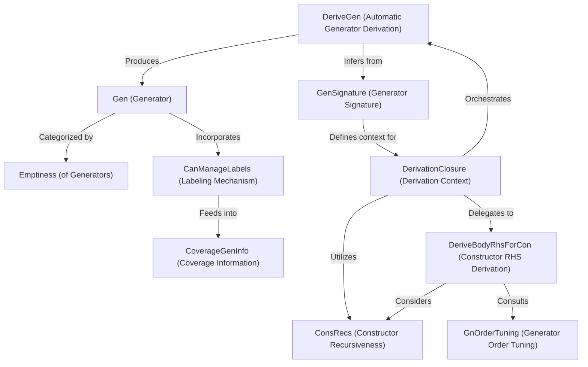

# Tutorial: DepTyCheck

`DepTyCheck` is an Idris 2 library for **property-based testing**, focusing on *dependent types*.
It features a powerful `Gen` (Generator) abstraction that creates test data, ranging from simple values to complex, recursive data structures.
The library's core strength lies in its ability to *automatically derive* these generators based on datatype definitions, significantly simplifying the process of setting up comprehensive tests for sophisticated type-driven programs.

**Source Repository:** [None](None)

## Chapters

1. [Gen (Generator)
](01_gen__generator__.md)
2. [Emptiness (of Generators)
](02_emptiness__of_generators__.md)
3. [CanManageLabels (Labeling Mechanism)
](03_canmanagelabels__labeling_mechanism__.md)
4. [CoverageGenInfo (Coverage Information)
](04_coveragegeninfo__coverage_information__.md)
5. [DeriveGen (Automatic Generator Derivation)
](05_derivegen__automatic_generator_derivation__.md)
6. [GenSignature (Generator Signature)
](06_gensignature__generator_signature__.md)
7. [DerivationClosure (Derivation Context)
](07_derivationclosure__derivation_context__.md)
8. [ConsRecs (Constructor Recursiveness)
](08_consrecs__constructor_recursiveness__.md)
9. [DeriveBodyRhsForCon (Constructor RHS Derivation)
](09_derivebodyrhsforcon__constructor_rhs_derivation__.md)
10. [GnOrderTuning (Generator Order Tuning)
](10_gnordertuning__generator_order_tuning__.md)

---

Generated by [AI Codebase Knowledge Builder](https://github.com/The-Pocket/Tutorial-Codebase-Knowledge)