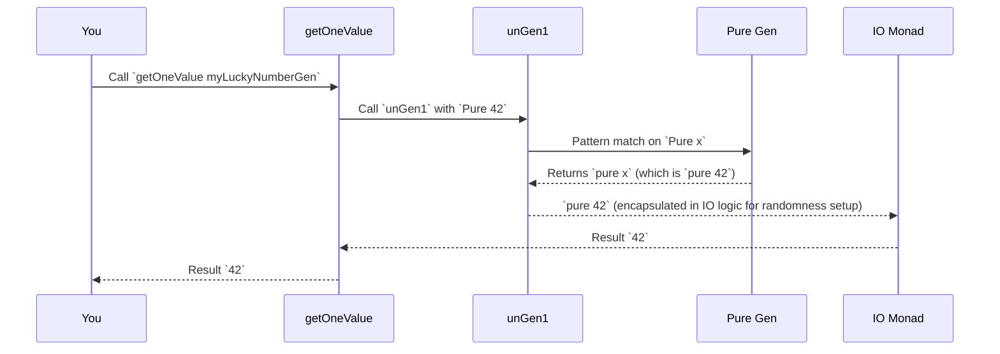

# Chapter 2: Gen (Generator)

In the previous chapter, we learned about `deriveGen`, a powerful macro that automatically creates code to generate test data for our custom types. This "automatic test data factory" significantly simplifies setting up our testing environment. But what exactly does `deriveGen` *produce*? It produces something called a `Gen`, which is short for "Generator."

## What is a `Gen`? The Blueprint for Randomness

Imagine you're developing a role-playing game and you want to test various scenarios. You need a way to create random items: swords, shields, potions, maybe even different types of monsters. You don't want to hand-craft every single test item; that would be tedious!

This is where a `Gen` comes in. A `Gen` is like a *blueprint* or a *recipe* for creating random values of a specific type. It knows how to "cook up" various instances of your data, following certain rules you define (or that `deriveGen` figures out for you).

Let's use our `Point` example from Chapter 1:

```idris
data Point = MkPoint Nat Nat
```

We wanted a way to generate random `Point`s. If you used `deriveGen`, it gave you a `genPoint` that looked like this:

```idris
-- From Chapter 1:
genPoint : Fuel -> Gen MaybeEmpty Point
genPoint = deriveGen
```

This `genPoint` is an actual `Gen`! Specifically, it's a `Gen MaybeEmpty Point`. Let's break that down:

*   **`Gen`**: This is the core type, indicating that we have a generator.
*   **`MaybeEmpty`**: This tells us something about whether the generator *always* produces a value or if it *might sometimes fail* to produce one. We'll explore this more in detail in [Emptiness (NonEmpty, MaybeEmpty)](04_emptiness__nonempty__maybeempty__.md), but for now, think of `MaybeEmpty` as saying, "This generator *might* be able to give you a `Point`, but it's not guaranteed." (Don't worry, for `Point`, it will almost always succeed.)
*   **`Point`**: This is the type of value the generator will produce. So, `genPoint` knows how to create random `Point`s.

Think of it like this:

*   **`Gen`**: "I am a creator of random things."
*   **`MaybeEmpty`**: "Sometimes I can't create anything."
*   **`Point`**: "What I create are `Point`s."

## Why do we need `Gen`?

The primary purpose of `Gen` is to automate the creation of diverse test data. Instead of writing `MkPoint 1 2`, `MkPoint 5 10`, `MkPoint 0 0` manually, you can just `unGen genPoint` and get a random `Point` every time. This is invaluable for property-based testing, where you want to test your code with many different inputs to catch edge cases.

## How to use a `Gen`? Running the Blueprint

You have a blueprint (the `Gen`), but how do you actually *make* the random values? You need to "run" or "unroll" the generator. In `DepTyCheck`, this is typically done using functions like `unGen` or `unGen1`.

Let's look at a very simple `Gen` first. A `Gen` that always produces the same value:

```idris
-- This generator always produces the number 42
myLuckyNumberGen : Gen NonEmpty Nat
myLuckyNumberGen = Pure 42
```

Here, `NonEmpty` means it *always* produces a value (it can't fail). `Pure` is one of the simplest ways to create a `Gen`.

Now, to get a value from it:

```idris
-- Helper to get a single value from a Gen
import System.Random

getOneValue : Gen NonEmpty a -> IO a
getOneValue g = do
    seed <- mkSeed
    evalRandIO seed (unGen1 g)

-- To try it:
-- myResult <- getOneValue myLuckyNumberGen
-- putStrLn (show myResult)
-- Output: 42
```

In this `getOneValue` example, `unGen1` is the function that actually extracts a value from the `Gen`. It takes our `myLuckyNumberGen` and produces the `42`.

What if we have a generator that *can* fail? Like a `Gen MaybeEmpty`?

```idris
genMaybeFin0 : Gen MaybeEmpty (Fin 0)
genMaybeFin0 = Empty
```

`Fin 0` represents natural numbers strictly less than 0. There are no such numbers, so a generator for `Fin 0` *must* be empty. `Empty` is the constructor that explicitly says "this generator produces nothing."

To extract from a `Gen MaybeEmpty`:

```idris
import Control.Monad.Error.Interface -- For `MonadError`
import Test.DepTyCheck.Gen         -- For `Gen` and `unGen`

-- `unGen` can return an error if the generator is empty
getMaybeValue : Gen MaybeEmpty a -> IO (Maybe a)
getMaybeValue g = do
  seed <- mkSeed
  evalRandIO seed (unGen' g)

-- Example:
-- result1 <- getMaybeValue myLuckyNumberGen -- Would return `Just 42`
-- result2 <- getMaybeValue genMaybeFin0     -- Would return `Nothing`
```

The key difference here is `unGen'` (or `unGen`). Since `genMaybeFin0` is `Empty`, `unGen'` will return `Nothing`, indicating no value could be generated. This capability to signal "no value produced" is crucial for working with dependent types where some types might be uninhabited (like `Fin 0`).

## Combining `Gen`s: More Complex Blueprints

The real power of `Gen`s comes from combining them. You can build complex generators from simpler ones, much like building intricate structures with LEGOs.

Let's revisit `genPoint` from `deriveGen`:

```idris
genPoint : Fuel -> Gen MaybeEmpty Point
genPoint = deriveGen
```

This `genPoint` needs `Fuel` (which we'll discuss later) and results in a `Gen MaybeEmpty Point`.

The `DepTyCheck` library provides many ways to combine `Gen`s. We saw a hint of this in Chapter 1 with code like `x <- genNat fuel`. This uses `do` notation, which means `Gen`s are built on the `Monad` type class.

Here's a simple example of combining generators (`Gen`s are `Applicative`s too!):

```idris
genTwoNats : Gen NonEmpty (Nat, Nat)
genTwoNats = [| (elements [1,2,3], elements [4,5,6]) |]
```

This `genTwoNats` will create pairs of `Nat`s. The `elements` generator itself is a `Gen`. We use `[| ... |]` syntax, which is `DepTyCheck`'s special way of using `Applicative` style combination for generators. Its output might be `(1, 4)`, `(2, 5)`, `(3, 6)`, etc.

A more direct way, using `do` notation for more control:

```idris
genSumOfTwoNats : Gen NonEmpty Nat
genSumOfTwoNats = do
  val1 <- elements [1, 2, 3] -- Get a random value from this list
  val2 <- elements [4, 5, 6] -- Get another random value from this list
  pure (val1 + val2)         -- Combine them
```

Here, `val1` and `val2` are actual `Nat` values, taken from the two `elements` generators. `genSumOfTwoNats` now becomes a generator that produces the sum of two random numbers from those lists.

The `do` notation helps us sequence generation steps, allowing the generation of `val2` to potentially depend on `val1`'s value.

## `Gen` Internals: A Glimpse Behind the Curtain

How does a `Gen` actually work under the hood? Let's check out its definition:

```idris
-- Simplified definition from src/Test/DepTyCheck/Gen.idr
data Gen : Emptiness -> Type -> Type where
  Empty : Gen MaybeEmpty a
  Pure  : a -> Gen em a
  Raw   : RawGen a -> Gen em a
  OneOf : ... -> Gen em a
  Bind  : ... -> Gen em a
  Labelled : ... -> Gen em a
```
The `Gen` type is a *data type* itself, with several constructors:

*   **`Empty`**: As we saw, explicitly declares an empty generator.
*   **`Pure x`**: Creates a generator that always produces `x`.
*   **`Raw rawGen`**: This is a more primitive generator that wraps a `RawGen`. A `RawGen` is directly responsible for performing monadic random actions (`m a`), without the overhead of tracking alternatives. Functions like `getRandom` or `getRandomR` (provided by `Control.Monad.Random`) are key to defining these.
*   **`OneOf gs`**: This is a generator that chooses uniformly from a list of other generators (`gs`). If you have `[genA, genB, genC]`, `OneOf` will pick `genA`, `genB`, or `genC` with equal probability.
*   **`Bind (RawGen c) (c -> Gen em a)`**: This is the core of the `Monad` implementation. It first runs a `RawGen` to get a value `c`, and then uses that `c` to *decide which subsequent `Gen` to use*. This is how chaining logic in `do` blocks works.
*   **`Labelled Label Gen`**: This attaches a `Label` to a generator. Labels are useful for debugging or tracking the source of generated values, particularly when many generators are composed. Labels are covered in [CanManageLabels](08_canmanagelabels_.md).

The critical part of `Gen` is that it's designed to track the *possibility of being empty* (`Emptiness`) and can be composed using standard monadic and applicative interfaces (`map`, `<*>`, `>>=`).

The `unGen` and `unGen1` functions (and their variants like `pick` and `getOneValue`) are the interpreters. They "read" the `Gen` structure and execute the random choices.

Let's trace `unGen1` for a `Pure` generator:



And for a more complex `OneOf` generator:

```idris
compoundGen : Gen NonEmpty Nat
compoundGen = oneOf [elements [1, 2], elements [10, 20]]

-- `oneOf` uses the `OneOf` constructor internally
```

```mermaid
sequenceDiagram
    participant You
    participant getOneValue
    participant unGen1
    participant OneOf Gen
    participant Weighted Picker
    participant Random Number Gen
    participant Sub-Gen (e.g., elements [10,20])
    participant IO Monad

    You->>getOneValue: Call `getOneValue compoundGen`
    getOneValue->>unGen1: Call `unGen1` with `compoundGen` (which is `OneOf`)
    unGen1->>OneOf Gen: Pattern match on `OneOf oo`
    OneOf Gen-->>unGen1: Provides `oo` (which contains `[(weight, Lazy (Gen NonEmpty Nat))]`)
    unGen1->>Random Number Gen: Requests a random number based on `oo.totalWeight`
    Random Number Gen-->>unGen1: Provides a number (e.g., `1`)
    unGen1->>Weighted Picker: Uses number to `pickWeighted` sub-generator
    Weighted Picker-->>unGen1: Returns a chosen sub-generator (e.g., `Lazy (elements [10,20])`)
    unGen1->>unGen1: Recursively calls `unGen1` on the chosen sub-generator (`elements [10,20]`)
    unGen1->>IO Monad: (after resolving `elements` to `Raw` or `Pure` internally) produces random value
    IO Monad-->>getOneValue: Result (e.g., `10` or `20`)
    getOneValue-->>You: Result
```

This shows how `unGen1` recursively unwraps the `Gen` structure, making random choices as it goes, until it reaches a `Raw` or `Pure` generator that directly produces a value.

## Conclusion

A `Gen` is the fundamental building block for creating random test data in `DepTyCheck`. It's a blueprint for values of a specific type, capable of generating values (or sometimes indicating that no value can be generated). By combining simpler `Gen`s, you can construct sophisticated data generation strategies for complex types. Understanding `Gen` is key to generating test data, whether you're using `deriveGen` or building generators by hand.

Next up, we'll delve into [GenSignature (Generator Signature)](03_gensignature__generator_signature__.md), which is how `deriveGen` understands what kind of generator it needs to produce.

---

Generated by [AI Codebase Knowledge Builder](https://github.com/The-Pocket/Tutorial-Codebase-Knowledge)