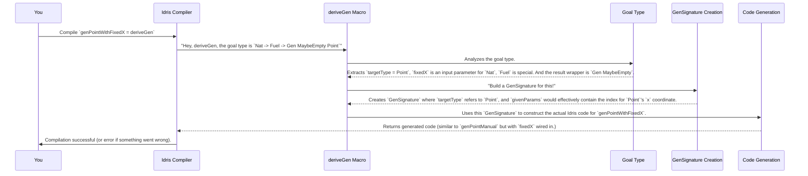

# Chapter 3: GenSignature (Generator Signature)

In the previous chapter, we explored the `Gen` type, which serves as a blueprint for creating random data. We saw how `deriveGen` automatically generates these blueprints for us. But how does `deriveGen` know *what kind of blueprint* to create? How does it understand what we expect the generator to do, and for which data type?

This is where the `GenSignature` comes in! Think of `GenSignature` as the detailed "design document" or "contract" for a `Gen` (generator). When you ask `deriveGen` to create a generator, it first looks at the *signature* (the type) of the function you're defining, and it transforms that into a `GenSignature`. This `GenSignature` then tells `deriveGen` exactly what needs to be *generated* randomly and what parts are *provided* by you.

## What Problem Does `GenSignature` Solve?

Let's revisit our `Point` example:

```idris
data Point = MkPoint Nat Nat

genPoint : Fuel -> Gen MaybeEmpty Point
genPoint = deriveGen
```

When `deriveGen` sees `genPoint : Fuel -> Gen MaybeEmpty Point`, it doesn't just see "Point". It needs to know:

1.  **What *type* are we generating for?** In this case, `Point`.
2.  **Which parts of that type should be generated randomly?** For `Point`, both `Nat` fields (x and y) need to be generated.
3.  **Which parts (if any) are *given* by the user (inputs to the generator function)?** In this simple `genPoint`, no parts of `Point` are given by the user; `Fuel` is just a control mechanism.

Imagine a more complex scenario. What if we want to generate points, but we *always* want the `x` coordinate to be 10, and only `y` should be random?

```idris
-- We want a generator that takes an 'x' value and generates a random 'y'
genPointWithFixedX : Nat -> Fuel -> Gen MaybeEmpty Point
genPointWithFixedX fixedX fuel = deriveGen
```

Here, the `GenSignature` for `genPointWithFixedX` would capture that `x` is *given* (the `fixedX` argument) and `y` is *generated*. The beauty is that `deriveGen` figures this out by analyzing the type `Nat -> Fuel -> Gen MaybeEmpty Point`.

The `GenSignature` is the internal representation that `deriveGen` uses to understand these requirements.

## Anatomy of a `GenSignature`

The `GenSignature` keeps track of several key pieces of information:

*   **`targetType`**: This is the type we want to generate instances of (e.g., `Point`). It's represented internally as `TypeInfo`, which holds detailed information about the type's constructors and fields.
*   **`givenParams`**: These are the parameters of the `targetType` that are *provided as arguments* to the generator function by the user. For `genPointWithFixedX`, `x` would be a given parameter.
*   **`generatedParams`**: These are the parameters of the `targetType` that the `Gen` itself should *randomly create*. For `genPointWithFixedX`, `y` would be a generated parameter.

Let's look at the simplified definition of `GenSignature`:

```idris
-- From file: src/Deriving/DepTyCheck/Gen/Signature.idr
public export
record GenSignature where
  constructor MkGenSignature
  targetType : TypeInfo
  givenParams : SortedSet $ Fin targetType.args.length
```

*   `targetType : TypeInfo`: This tells `GenSignature` *which type* we're working with. `TypeInfo` is a powerful reflection type that describes data types, including their name, arguments, and constructors.
*   `givenParams : SortedSet $ Fin targetType.args.length`: This is a set of indices (`Fin` is like "finite numbers up to N-1") that point to the arguments of `targetType` that are *given* by you, the user. If `targetType` had three arguments, and only the first and third were given, this set might contain `{0, 2}`.

Wait, where are `generatedParams`? The `GenSignature` doesn't explicitly store them! Instead, it figures them out: anything that's *not* in `givenParams` is considered *generated*. This is expressed by the `.generatedParams` property:

```idris
-- From file: src/Deriving/DepTyCheck/Gen/Signature.idr
public export %inline
(.generatedParams) : (sig : GenSignature) -> SortedSet $ Fin sig.targetType.args.length
sig.generatedParams = fromList (allFins sig.targetType.args.length) `difference` sig.givenParams
```

This line means: "Take all possible argument positions for `targetType`, then remove the ones that are `given`, and what's left are the `generated` ones."

## How `deriveGen` Uses `GenSignature`

Let's trace what happens when `deriveGen` is called:

```idris
genPointWithFixedX : Nat -> Fuel -> Gen MaybeEmpty Point
genPointWithFixedX fixedX fuel = deriveGen
```



## Example: A `List` with a specific length `n`

Let's imagine we have a `List` type, but we want to generate lists of a very specific length `n`.

```idris
data MyList (n : Nat) (a : Type) where
  Nil  : MyList 0 a
  (::) : a -> MyList n a -> MyList (S n) a
```

Now, let's say we want to generate a `MyList` of a given length `n`, and its elements should be generated randomly.

```idris
-- A generator that *takes* a length 'len' and *generates* a list of that length
genMyList : (len : Nat) -> Fuel -> Gen MaybeEmpty (MyList len Nat)
genMyList = deriveGen
```

When `deriveGen` processes `genMyList`:

1.  **`targetType`**: It identifies `MyList` as the target type. `MyList` itself has two parameters: `n` (the length) and `a` (the type of elements).
2.  **`givenParams`**: From the function signature `(len : Nat) -> ... -> Gen MaybeEmpty (MyList len Nat)`, `deriveGen` sees that `len` (which corresponds to the `n` parameter of `MyList`) is provided as an argument. So, the `GenSignature` will mark the first parameter of `MyList` (`n`) as "given."
3.  **`generatedParams`**: Since `a` (the element type) is not given as a parameter to `genMyList` (it's fixed to `Nat` in the return type), and the actual *elements* of the list need to be generated, `deriveGen` understands it needs to generate these parts.

The `GenSignature` is the bridge between how you *declare your generator function* and how `deriveGen` *interprets those declarations* to build the actual generator. It's the blueprint that guides the derivation process.

## Connecting `GenSignature` to `deriveGen` Internals

The `deriveGen` macro, internally, uses a function called `checkTypeIsGen` to build this `GenSignature`.

This function takes your generator's type (like `Nat -> Fuel -> Gen MaybeEmpty Point`) as `TTImp` (Idris's internal representation of types) and dissects it:

```idris
-- A simplified snip from src/Deriving/DepTyCheck/Gen.idr
checkTypeIsGen : (checkSide : GenCheckSide) -> TTImp -> Elab $ CheckResult checkSide
checkTypeIsGen checkSide origsig@sig = do
  -- ... lots of checks and parsing ...

  -- check the given expression is a type, and normalise it
  sig <- normaliseAsType sig

  -- treat the given type expression as a (possibly 0-ary) function type
  let (sigArgs, sigResult) = unPi sig -- Separates `Nat`, `Fuel` from `Gen MaybeEmpty Point`

  -- ... checks for Fuel argument, Gen wrapper, MaybeEmpty ...

  -- treat the generated type as a dependent pair ("b : B n ** X a b c")
  let Just (paramsToBeGenerated, targetType) = unDPairUnAlt targetType
    | Nothing => failAt (getFC targetType) "Unable to interpret type under `Gen` as a dependent pair"

  -- acquire `TypeInfo` out of the target type `TTImp` expression
  targetType <- case targetType of
    IVar _ targetType => getInfo' targetType -- Gets TypeInfo for `Point`, `MyList` etc.
    -- ... other cases for primitive types ...

  -- ... more analysis of arguments ...

  -- make the resulting signature
  let genSig = MkExternalGenSignature targetType givenParams givensOrder gendOrder
  -- ...
```
This snippet shows how `checkTypeIsGen` systematically breaks down the input type, identifies the `targetType` (like `Point`), extracts the `givenParams` (like `fixedX` in `genPointWithFixedX`), and eventually constructs an `ExternalGenSignature` (a more detailed version of `GenSignature` used internally, which also tracks the names and explicitness of given parameters).

## Conclusion

The `GenSignature` is the hidden contract that `deriveGen` relies on. It precisely details which parts of a complex data type a generator should receive as input (`givenParams`) and which parts it should randomly conjure up (`generatedParams`). By understanding this contract, `deriveGen` can tailor the generation process to your exact needs, making it incredibly flexible and powerful for creating test data.

Next, we'll dive into another crucial aspect of generators: [Emptiness (NonEmpty, MaybeEmpty)](04_emptiness__nonempty__maybeempty__.md), which determines whether a generator is guaranteed to produce a value or if it might sometimes come up empty-handed.

---

Generated by [AI Codebase Knowledge Builder](https://github.com/The-Pocket/Tutorial-Codebase-Knowledge)