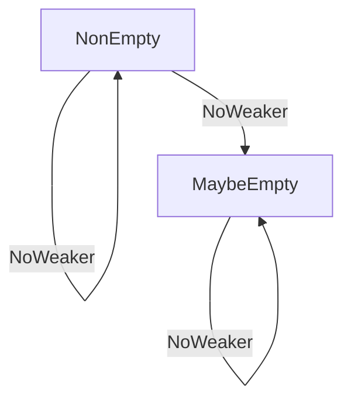

# Chapter 4: Emptiness (NonEmpty, MaybeEmpty)

In the last chapter, we looked at [GenSignature (Generator Signature)](03_gensignature__generator_signature__.md) and how it helps `deriveGen` understand the "contract" for a generator. Now, let's dive into another crucial aspect of generators: their "emptiness."

## What is Emptiness (NonEmpty, MaybeEmpty)?

Imagine you're trying to get a cup of coffee from a vending machine. Most of the time, you put in your money, press a button, and *voilà*, a cup of coffee. But what if the machine is out of coffee? Or what if you press a button for "banana coffee" and the machine never stocked such a thing? In these cases, the machine, despite its best efforts, can't give you what you asked for. It comes up "empty."

This is exactly what `Emptiness` in `DepTyCheck` generators refers to. A generator describes how to create random values of a certain type. But sometimes, especially with dependent types (where types can depend on values), it might be *impossible* to create a valid value for a given type.

`Emptiness` tells you one of two things about a generator:

1.  **`NonEmpty`**: This generator is **guaranteed** to produce a value. It's like a vending machine that always has coffee available. It will *never* "come up empty."
2.  **`MaybeEmpty`**: This generator **might sometimes fail** to produce a value. It's like a vending machine where a particular slot might be empty, or you ask for something it just doesn't have. It *might* give you a value, or it might not.

### Why is this crucial?

This concept becomes incredibly important when you're working with dependent types where some types might be "un-inhabitable." An un-inhabitable type is a type for which no value can possibly exist.

For example, consider `Fin 0` in Idris 2. `Fin n` represents natural numbers strictly less than `n`. So, `Fin 0` would mean "natural numbers strictly less than 0." There are no such numbers! So, `Fin 0` is an un-inhabitable type.

If you try to create a generator for `Fin 0`, it *must* be `MaybeEmpty` because it's impossible to produce a valid `Fin 0` value. The generator will always return "empty."

## How `DepTyCheck` uses Emptiness

When you define a generator, especially using `deriveGen`, you specify its `Emptiness` as part of its type signature.

Let's look at our `Point` example again:

```idris
data Point = MkPoint Nat Nat

genPoint : Fuel -> Gen MaybeEmpty Point
genPoint = deriveGen
```

Here, `genPoint` is specified as `Gen MaybeEmpty Point`. This means that `genPoint` is a generator that produces `Point` values, and it *might* be empty. However, for a simple `Point` (which is always possible to construct), this specific generator will almost certainly be `NonEmpty` in practice. It's `MaybeEmpty` by default because `deriveGen` is designed to be safe and broadly applicable, and it's easier to relax guarantees than to make them stronger later.

Think of it as the `Gen` type having a "seal of guarantee."
*   `Gen NonEmpty A`: "I'm guaranteed to give you an `A`."
*   `Gen MaybeEmpty A`: "I'll try my best to give you an `A`, but I might fail."

### Using `NonEmpty` explicitly:

Suppose you have a generator that you *know* will always produce a value, like a generator for `Nat` (natural numbers):

```idris
import Data.Fuel
import Test.DepTyCheck.Gen

-- A generator for natural numbers using 'elements', which always succeed if the list is not empty
genNonEmptyNat : Fuel -> Gen NonEmpty Nat
genNonEmptyNat _ = elements [1, 2, 3, 4, 5]
```

Here, `genNonEmptyNat` has the type `Gen NonEmpty Nat`. We can safely declare it as `NonEmpty` because the `elements` generator, given a non-empty list `[1, 2, 3, 4, 5]`, always succeeds in picking one of them.

If you omit the specific `Emptiness` when defining a generator that doesn't explicitly mention `MaybeEmpty` or `NonEmpty` (e.g. `genSomeValue : Gen _ MyType`), `DepTyCheck` will generally infer `NonEmpty` if it can prove it, or `MaybeEmpty` as a fallback.

## The `Empty` Constructor: Explicitly Empty Generators

Sometimes, you need to explicitly create a generator that *always* fails. This is done using the `Empty` constructor.

```idris
import Test.DepTyCheck.Gen

-- A generator for Fin 0 must always be empty
genFin0 : Gen MaybeEmpty (Fin 0)
genFin0 = empty
```

Here, `genFin0` is of type `Gen MaybeEmpty (Fin 0)` precisely because `Fin 0` cannot be inhabited. The `empty` function (which ultimately uses the `Empty` constructor) creates a generator that will never produce a value.

If you try to declare `genFin0` as `Gen NonEmpty (Fin 0)`, the Idris compiler will give you an error because it can't prove that `empty` (or any other generator for `Fin 0`) can always produce a value for an un-inhabitable type. The `Emptiness` system helps enforce type safety.

## How `unGen` and `unGen1` Handle Emptiness

Recall from [Gen (Generator)](02_gen__generator__.md) that we use functions like `unGen` or `unGen1` to extract values from a generator. Their behavior changes depending on the generator's `Emptiness`.

*   **`unGen1`**: This function is used for generators that are `Gen NonEmpty a`. It expects a value to *always* be produced. If you try to use `unGen1` on a `MaybeEmpty` generator that might fail, the type system will prevent it.

    ```idris
    -- This works because genNonEmptyNat is declared as NonEmpty
    getNatValue : IO Nat
    getNatValue = do
      seed <- mkSeed
      evalRandIO seed (unGen1 (genNonEmptyNat defaultFuel))
    ```

*   **`unGen`**: This function is for `Gen MaybeEmpty a` generators. Since it might fail, `unGen` (and its variants like `unGen'`) returns a `Maybe a` or uses a `MonadError` context to report failure.

    ```idris
    -- This generator always fails to produce a value (Fin 0)
    genFin0 : Gen MaybeEmpty (Fin 0)
    genFin0 = empty

    getFin0Value : IO (Maybe (Fin 0))
    getFin0Value = do
      seed <- mkSeed
      evalRandIO seed (unGen' genFin0)

    -- Running getFin0Value would result in Nothing
    ```

    ```idris
    -- This is valid, even though genPoint is declared MaybeEmpty, it will usually succeed
    getPointValue : IO (Maybe Point)
    getPointValue = do
      seed <- mkSeed
      evalRandIO seed (unGen' (genPoint defaultFuel))
    ```

The type system uses `Emptiness` to either guarantee success with `unGen1` or force you to handle potential failure with `unGen`.

## Emptiness Internals: The `NoWeaker` Relation

The `Emptiness` is defined as a simple data type:

```idris
-- From src/Test/DepTyCheck/Gen/Emptiness.idr
public export
data Emptiness = NonEmpty | MaybeEmpty
```

But what's really interesting is how `DepTyCheck` determines which generators are "stronger" or provide "more guarantees." This is done with the `NoWeaker` relation:

```idris
-- From src/Test/DepTyCheck/Gen/Emptiness.idr
public export
data NoWeaker : (from, to : Emptiness) -> Type where
  NN : NonEmpty `NoWeaker` NonEmpty
  AS : em       `NoWeaker` MaybeEmpty
```

`NoWeaker` essentially means "is as strong as or stronger than."

*   `NonEmpty `NoWeaker` NonEmpty`: A `NonEmpty` generator is as strong as a `NonEmpty` generator. (This is `NN`)
*   `em `NoWeaker` MaybeEmpty`: *Any* `Emptiness` (`NonEmpty` or `MaybeEmpty`) is stronger than or equal to `MaybeEmpty`. (This is `AS`)

This `NoWeaker` relation is a "preorder" on `Emptiness`, meaning it describes a hierarchy of guarantees. `NonEmpty` gives the strongest guarantee, and `MaybeEmpty` gives the weakest.



This relation is used throughout the `Gen` implementation. For example, when you combine two generators with `bind` (`>>=`) or `apply` (`<*>`), the resulting generator's `Emptiness` will be the "minimum" or "weakest" of the two.

If you combine a `Gen NonEmpty A` with a `Gen MaybeEmpty B`, the result will be `Gen MaybeEmpty C`. This is because if *either* component might fail, the combined result might also fail. You can't make a strong guarantee (`NonEmpty`) if one of your parts is weak seasonality (`MaybeEmpty`).

```idris
import Test.DepTyCheck.Gen

genGoodNat : Gen NonEmpty Nat
genGoodNat = Pure 5

genBadFin : Gen MaybeEmpty (Fin 0)
genBadFin = empty

-- Combining them:
combinedGen : Gen MaybeEmpty (Fin 0)
combinedGen = do
  _ <- genGoodNat   -- This is NonEmpty
  _ <- genBadFin    -- This is MaybeEmpty (it will fail)
  pure (the (Fin 0) ?hole) -- Type checker will require a Fin 0, which is impossible
                           -- But the point is the `MaybeEmpty` type.
```

The type of `combinedGen` reflects that the overall generation *could* fail because `genBadFin` could fail.

## Conclusion

`Emptiness` is a vital concept in `DepTyCheck` generators. It provides a formal way to track whether a generator is guaranteed to produce a value (`NonEmpty`) or if it might sometimes fail (`MaybeEmpty`). This allows the type system to enforce correctness, especially when dealing with dependent types that might be un-inhabitable. By understanding `NonEmpty` and `MaybeEmpty`, you can write more robust and type-safe data generators.

Next, we'll explore [DeepConsAnalysisRes (Deep Constructor Analysis Result)](05_deepconsanalysisres__deep_constructor_analysis_result__.md), which dives into how `DepTyCheck` analyzes the constructors of your data types to understand their structure.

---

Generated by [AI Codebase Knowledge Builder](https://github.com/The-Pocket/Tutorial-Codebase-Knowledge)