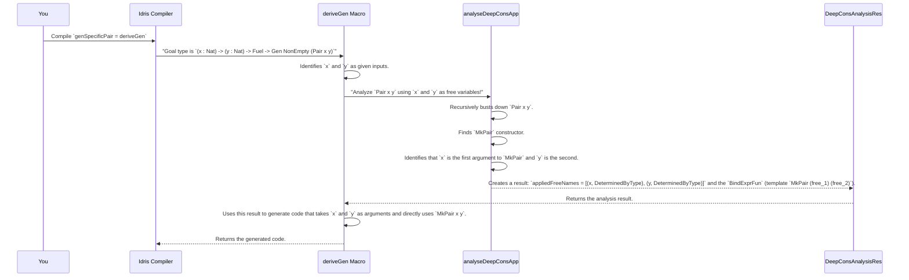

# Chapter 5: DeepConsAnalysisRes (Deep Constructor Analysis Result)

In the previous chapter, we explored [Emptiness (NonEmpty, MaybeEmpty)](04_emptiness__nonempty__maybeempty__.md) and how generators signal whether they can always produce a value or might sometimes come up empty. Now, let's explore a concept called `DeepConsAnalysisRes`. This is a bit of a mouthful, but don't worry, we'll break it down into something much more understandable.

## Understanding the "Inside" of Your Data: What Problem Does `DeepConsAnalysisRes` Solve?

Imagine you have a complex LEGO structure. If someone hands you this structure and asks you to build a similar one, you wouldn't just look at the outside. You'd probably start taking it apart, piece by piece, to see what smaller LEGOs were used and how they're connected. You'd notice, "Oh, this part uses a red 2x4 block, connected to a blue 1x1 block, and that blue block is also used over here."

In `DepTyCheck`, when `deriveGen` is asked to generate data for a type, it needs to do something similar. It needs to "look inside" the data type it's trying to generate. It needs to understand:
*   **What are the basic "pieces" (constructors) that make up this data type?**
*   **Are there any "free variables" (values that are given as input) that are used in these pieces?**
*   **How are these free variables connected through the constructors?**

`DeepConsAnalysisRes` (Deep Constructor Analysis Result) is the **report** that `deriveGen` gets *after* it performs this "deep analysis." It's the detailed list of what free variables were found inside the data type's definition and how they were wired together by its constructors. This report is crucial because it tells `deriveGen` how to properly build a generator that respects the structure of your data.

## A Concrete Example: The `Pair` Type

Let's use a simple data type definition to illustrate:

```idris
data Pair a b = MkPair a b
```

This `Pair` type has one constructor, `MkPair`, which takes two arguments, `a` and `b`.

Now, imagine we want to generate a `Pair` where *both* `a` and `b` are provided to the generator directly. This is a bit different from our `Point` where `x` and `y` were always generated randomly.

What if we want a generator that *takes two natural numbers* and wraps them in a `Pair`?

```idris
genSpecificPair : (x : Nat) -> (y : Nat) -> Fuel -> Gen NonEmpty (Pair x y)
genSpecificPair = deriveGen
```

Look at the type of `genSpecificPair`: `(x : Nat) -> (y : Nat) -> Fuel -> Gen NonEmpty (Pair x y)`.
Here, `x` and `y` are the "free variables" we're talking about. They are provided as inputs to the generator. `deriveGen` needs to understand that these `x` and `y` values should be used directly in the `MkPair` constructor.

When `deriveGen` analyzes `Pair x y`, it internally asks: "How can I construct a `Pair` that uses specific `x` and `y` values?" The `DeepConsAnalysisRes` would tell it: "You need `MkPair` and the `x` and `y` you were given are the arguments for it."

## Breaking Down `DeepConsAnalysisRes`

The `DeepConsAnalysisRes` essentially provides two main pieces of information when `collectConsDetermInfo` is set to `True` (which is often the case during generator derivation):

1.  **`appliedFreeNames`**: A list of the names of the free variables that were actually used in the expression, along with `ConsDetermInfo`.
2.  **`BindExprFun`**: A special function that helps rebuild the expression, replacing the free variables with "bind variables" (placeholders).

It's essentially saying: "Here are the inputs I found you using, and here's a template for how they fit into the bigger picture."

### 1. `appliedFreeNames`: Which Free Variables Are Used?

This is a list that tells you exactly which input variables were consumed by the constructors.

For `(x : Nat) -> (y : Nat) -> Fuel -> Gen NonEmpty (Pair x y)`, when analyzing the return type `Pair x y`, `DeepConsAnalysisRes` would identify `x` and `y` as `appliedFreeNames`. It means that `x` and `y` are directly used as parameters for the type `Pair`.

It also comes with `ConsDetermInfo`, which tells us if a constructor's argument is "determined by type." This detail is more advanced, but it's important for `deriveGen` to know if a value needs to be generated or if its type already nails down what it should be.

### 2. `BindExprFun`: The "Template" for the Structure

This is a function that gives `DepTyCheck` a recipe for how to reconstruct the expression, but instead of using the *actual* free variable names, it uses special "bind expressions" (`IVar` refers to `IBindVar` in this context, which is an internal representation of a variable in Idris).

Think of it like this:

*   You have the final LEGO structure.
*   `appliedFreeNames` tells you: "You used two specific red bricks."
*   `BindExprFun` tells you: "The structure looks like `MkPair (brick_1) (brick_2)`, where `brick_1` and `brick_2` are placeholders for anything that gets put in those spots.

This template is critical for `deriveGen` to generate code that correctly plugs the given `x` and `y` values into the `MkPair` constructor.

## How `deriveGen` Uses `DeepConsAnalysisRes`

Let's walk through our `genSpecificPair` example `(x : Nat) -> (y : Nat) -> Fuel -> Gen NonEmpty (Pair x y)`:

```idris
data Pair a b = MkPair a b

genSpecificPair : (x : Nat) -> (y : Nat) -> Fuel -> Gen NonEmpty (Pair x y)
genSpecificPair = deriveGen
```

Here's a simplified sequence of events:



The `analyseDeepConsApp` function (shown in the relevant code snippets provided earlier) is the workhorse here. It's the function that performs this "deep analysis."

## `analyseDeepConsApp` Internals: A Glimpse

The `analyseDeepConsApp` function is recursive, meaning it calls itself to break down complex expressions.

Let's look at a simplified core part from the real source code:

```idris
-- From file: src/Deriving/DepTyCheck/Util/DeepConsApp.idr
export
analyseDeepConsApp : NameInfoInTypes =>
                     MonadError String m =>
                     MonadWriter (List Name) m => -- collects names found
                     (collectConsDetermInfo : Bool) ->
                     (freeNames : SortedSet Name) ->
                     (analysedExpr : TTImp) ->
                     m $ DeepConsAnalysisRes collectConsDetermInfo
analyseDeepConsApp ccdi freeNames = isD where

  isD : TTImp -> m $ DeepConsAnalysisRes ccdi
  isD e = do

    -- Treat given expression as a function application to some name
    let (IVar _ lhsName, args) = unAppAny e
      | (IType {}   , _) => pure $ noFree e -- If it's just a type, no free vars.
      | (IPrimVal {}, _) => pure $ noFree e -- If it's a primitive value, no free vars.
      | _ => throwError "not an application to a variable"

    -- Check if this is a free name (one of our given inputs like `x` or `y`)
    let False = contains lhsName freeNames
      | True => if null args
                  then do tell [lhsName] -- Add to list of used names
                          pure $ if ccdi then ([(lhsName, neutral)] ** \f => f FZ) else [lhsName]
                  else throwError "applying free name to some arguments"

    -- If not a free name, check if it's a CONSTRUCTOR name (like `MkPair`)
    let Just con = lookupCon lhsName
      | Nothing => if ccdi then throwError "name `\{lhsName}` is not a constructor" else pure $ noFree implicitTrue

    -- This is where it digs deeper into each argument of the constructor
    deepArgs <- for (args.asVect `zip` typeDetermInfo) $
      \(anyApp, typeDetermined) => do
        -- RECURSIVE CALL: call `isD` again for each argument!
        subResult <- isD $ assert_smaller e $ getExpr anyApp
        -- ... combine results ...
        pure (anyApp, subResult)

    -- ... and finally combine all the results ...
    pure $ foldl (mergeApp _) (noFree $ var lhsName) deepArgs
```

**Explanation of the simplified `analyseDeepConsApp`:**

1.  **`isD : TTImp -> m $ DeepConsAnalysisRes ccdi`**: This is the recursive helper function. `TTImp` is Idris's internal representation of a type or expression. It takes an expression `e` and tries to analyze it.
2.  **`unAppAny e`**: This helper tries to break down the expression `e` into a main part (`lhsName`) and a list of arguments (`args`). For example, if `e` was `MkPair x y`, `lhsName` would be `MkPair`, and `args` would hold `x` and `y`. If `e` was just `x`, `lhsName` would be `x`, and `args` would be empty.
3.  **Check if `lhsName` is a `freeName`**: It first checks if the main part (`lhsName`) is one of the input "free variables" we provided (like `x` or `y`). If it is, and it has no arguments (meaning `x` is just `x`, not `x blah`), then `lhsName` is recorded as an `appliedFreeName`.
4.  **Check if `lhsName` is a `Constructor`**: If it's not a free variable, it then checks if `lhsName` is a *constructor* (like `MkPair`).
5.  **`deepArgs <- for ... subResult <- isD ...`**: This is the crucial recursive step. For *each argument* of the constructor (`MkPair` has `x` and `y` as arguments), `analyseDeepConsApp` calls itself (`isD $ assert_smaller e $ getExpr anyApp`). It means, "Now, go analyze *this argument* in the same way!" This is how `DepTyCheck` "digs deep" into the structure.
6.  **`foldl (mergeApp _)`**: After recursively analyzing all arguments, `mergeApp` combines all the `DeepConsAnalysisRes` from the sub-expressions into one final `DeepConsAnalysisRes`. It merges the lists of `appliedFreeNames` and stitches together the `BindExprFun` templates.

This recursive process ensures that `DepTyCheck` understands the entire, potentially nested, structure of your data type and how any provided "free variables" fit into it.

## Conclusion

`DeepConsAnalysisRes` is the sophisticated report that `DepTyCheck` generates after performing a "deep dive" into your data type's constructors and their arguments. It identifies which free variables (inputs to your generator) are used and provides a template for how they are integrated into the data structure. This detailed understanding allows `deriveGen` to correctly construct generators, especially for types that take specific values as parameters. It's like having a detailed architectural drawing that tells `deriveGen` exactly how to assemble the required data.

Next, we'll continue exploring how `deriveGen` dissects data types by looking at [ConsRecs (Constructors Recursiveness)](06_consrecs__constructors_recursiveness_.md), which explains how `DepTyCheck` handles recursive types like lists and trees.

---

Generated by [AI Codebase Knowledge Builder](https://github.com/The-Pocket/Tutorial-Codebase-Knowledge)