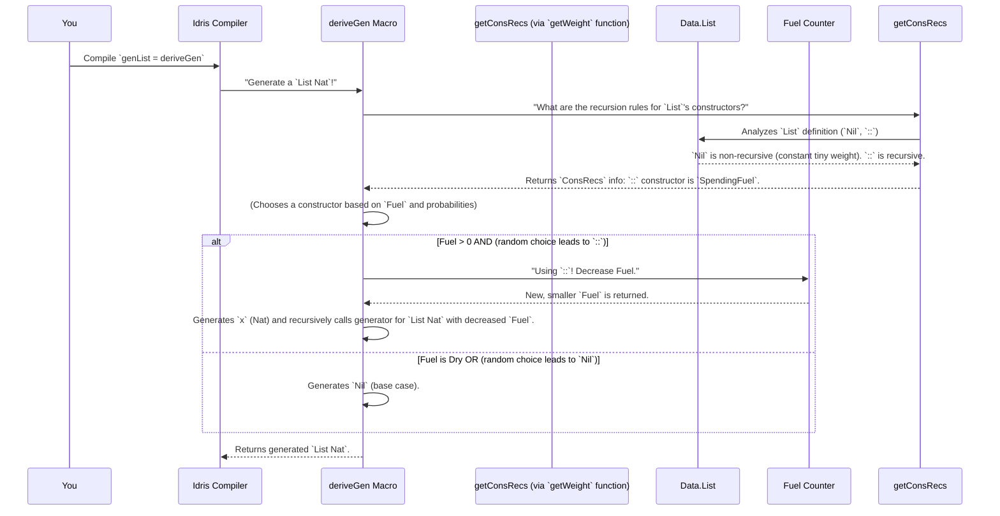

# Chapter 6: ConsRecs (Constructors Recursiveness)

In the previous chapter, [DeepConsAnalysisRes (Deep Constructor Analysis Result)](05_deep_constructor_analysis_result__.md), we saw how `DepTyCheck` "looks inside" your data types to understand their structure and how input parameters (`free variables`) fit in. Now, we're going to tackle one of the trickiest parts of data generation: dealing with *recursive* data structures.

## The Challenge of Recursion: What Problem Does `ConsRecs` Solve?

Imagine you want to generate a `List` of numbers. A list is a classic example of a recursive data structure: a list can be either empty (`Nil`) or it can be an element followed by *another list* (`Cons x xs`).

```idris
data List a = Nil | (::) a (List a)
```

If `DepTyCheck` simply tried to generate elements for `Cons x xs` without any rules, it would quickly get into trouble. It would say: "Okay, I need an `x` (say, 1), and then I need *another list*." Then for that inner list, it would say, "Okay, I need another element (say, 2), and then I need *another list*," and so on, forever! This would lead to an **infinite loop**, trying to create an infinitely long list.

This is where `ConsRecs` (Constructors Recursiveness) comes in! `ConsRecs` is like a **rulebook or a "smart counter"** that helps `DepTyCheck` decide how deep it should go when generating recursive data. It keeps track of how much "fuel" (recursion depth) a constructor consumes to prevent infinite loops.

**The central use case:** Generating a list (or any recursive data structure) that has a reasonable, finite, and controllable size.

## `Fuel`: The Recursion Counter

Before diving into `ConsRecs`, let's quickly remember `Fuel` from earlier chapters (like [deriveGen (Generator Derivation Macro)](01_derivegen__generator_derivation_macro__.md)). `Fuel` is a special object that acts as a counter for recursion depth. Think of it as a limited supply of "recursion tokens." Every time `DepTyCheck` decides to go one step deeper into a recursive structure, it consumes one unit of `Fuel`. When the `Fuel` runs out, the generator must stop recursing and usually return a base case (like `Nil` for a list).

```idris
-- Simplified Fuel
data Fuel = Dry | More Fuel
```

*   `Dry`: No fuel left, must stop.
*   `More Fuel`: One unit of fuel left, and then more.

Now, how does `ConsRecs` relate to this `Fuel`?

## `ConsRecs`: The Rulebook for Constructors

`ConsRecs` is a detailed record of how each *constructor* (like `Nil` or `::` for `List`, or `Leaf` and `Node` for a tree) behaves with respect to recursion. For each constructor, `ConsRecs` provides `ConWeightInfo`, which tells us:

1.  **Is this constructor recursive?** (Does it refer to its own type?)
2.  **How much `Fuel` does it use?** (Do we spend a "recursion token" here?)
3.  **Does it become less recursive if certain inputs are provided?** (Can we make its sub-recursion shallower? For example, building a list of numbers less than a certain Nat, the Nat argument itself can be made structurally smaller.)

Let's look at a simple example: a `List` of `Nat` values.

```idris
data List a = Nil | (::) a (List a)

genList : Fuel -> Gen MaybeEmpty (List Nat)
genList = deriveGen
```

What `ConsRecs` would tell `deriveGen` about `List a`:

*   **`Nil` constructor**: This is the "base case." It's not recursive. It uses a very small, constant "weight" (like `1`) because it's simple and always terminates. It doesn't consume `Fuel`.
*   **`(::)` constructor (Cons)**: This *is* recursive. It takes an element `a` and then a `List a` (itself!). `ConsRecs` would mark this as "spending `Fuel`." Every time `deriveGen` chooses `(::)`, it takes a unit of `Fuel` to generate the `List a` part.

## Breaking Down `ConsRecs` and `ConWeightInfo`

`ConsRecs` itself is a record that mainly holds a map (`conWeights`). This map tells us, for each type, how its constructors consume "weight" (or `Fuel`).

```idris
-- From src/Deriving/DepTyCheck/Gen/ConsRecs.idr (Simplified)
public export
record ConsRecs where
  constructor MkConsRecs
  conWeights : SortedMap Name $ (givenTyArgs : SortedSet Nat) -> List (Con, ConWeightInfo)
  -- ... other fields ...
```

The core information is in `ConWeightInfo`:

```idris
-- From ConsRecs.idr (Simplified)
public export
record ConWeightInfo where
  constructor MkConWeightInfo
  weight : Either Nat1 RecWeightInfo
```

This `weight` field is key:

*   **`Left Nat1`**: This means the constructor is *not recursive* (or its recursion is otherwise resolved) and just has a constant `Nat1` weight (like `1`). This doesn't consume `Fuel`. `Nat1` means "natural number starting from 1."
*   **`Right RecWeightInfo`**: This means the constructor *is recursive*, and `RecWeightInfo` tells us *how* it handles recursion.

### `RecWeightInfo`: How Recursive Constructors Act

`RecWeightInfo` has two main cases for recursive constructors:

```idris
-- From ConsRecs.idr (Simplified)
public export
data RecWeightInfo : Type where
  SpendingFuel : ((leftFuelVarName : Name) -> TTImp) -> RecWeightInfo
  StructurallyDecreasing : (decrTy : TypeInfo) -> (wExpr : TTImp) -> RecWeightInfo
```

1.  **`SpendingFuel : ...`**: This is the most common case for recursive constructors (like `::` for lists). It means: "Yes, this constructor is recursive, and every time I use it, I need to spend a unit of `Fuel`." The `TTImp` is a function that generates an expression to access the remaining `Fuel`.
    *   **Analogy**: This is like a train with a limited number of coal shovels. Each time you use the `Cons` carriage, you burn one shovel of coal.

2.  **`StructurallyDecreasing : (decrTy : TypeInfo) -> (wExpr : TTImp) -> RecWeightInfo`**: This is a more advanced case. Sometimes, an argument to a constructor *itself* makes the recursion "smaller" or "less deep" without needing to consume `Fuel`. This happens when a type parameter influences the size of the recursive call.
    *   **Example**: Imagine a list generator `genVec : (n : Nat) -> Fuel -> Gen (Vec n A)`. If `n` refers to the length, then `(::) x xs` means `xs` has length `n-1`. This `n-1` is "structurally decreasing" compared to `n`. In such cases, `ConsRecs` might decide *not* to consume `Fuel` for that step, because the `n` argument provides a structural guarantee of termination. `decrTy` identifies this decreasing argument, and `wExpr` is an expression to get its value.
    *   **Analogy**: This is like building a tower. If one of your building blocks has a number `N` on it, and the next block *must* have `N-1`, you don't need a separate "fuel" counter because the numbers themselves guarantee you'll eventually reach `0` and stop.

## How `deriveGen` Uses `ConsRecs`

When `deriveGen` needs to create a generator for a `List Nat`, here's how `ConsRecs` guides it:



Every time `deriveGen` makes a choice among constructors for `List`, it consults the `ConWeightInfo` from `ConsRecs`. If it chooses `::` and it's marked `SpendingFuel`, it will pass `More fuel` to generating the internal `List` while consuming `fuel`. If it chooses `Nil`, it just generates `Nil`. When `Fuel` is `Dry`, the probabilities of choosing `SpendingFuel` constructors drop significantly (or become 0) to ensure termination.

## A Glimpse into `getConsRecs` for `List`

The `getConsRecs` function (which is quite complex internally) does all this analysis. For our `List` type, here's what it finds (simplified):

```idris
-- Very simplified internal thought process of `getConsRecs` for `List a`

-- For constructor `Nil`:
--   - Is it recursive? No.
--   - ConWeightInfo: Left 1 (a constant, small weight)

-- For constructor `(::) a (List a)`:
--   - Is it recursive? Yes, because of `List a (List a)` within its arguments.
--   - Does it detect a structurally decreasing argument? No, the `a` is just an element, and no specific `Nat` parameter is making it smaller.
--   - ConWeightInfo: Right (SpendingFuel (expression to decrement fuel))
```

The function `isRecursive {containingType=Just targetType} con` within `getConsRecs` is the magic part that identifies if a constructor (`con`) for a specific `targetType` is recursive. It checks if any of the constructor's arguments have the `targetType` itself.

The `SpendingFuel` option uses `leftDepth : Fuel -> Nat1` internally. This function essentially converts `Fuel` into a `Nat1` value, allowing the `Fuel` to be used in calculations (like probabilities).

```idris
-- From ConsRecs.idr
public export
leftDepth : Fuel -> Nat1
leftDepth = go 1 where
  go : Nat1 -> Fuel -> Nat1
  go n Dry      = n
  go n (More x) = go (succ n) x
```

This `leftDepth` function is used to convert the `Fuel` into a number, so that when a `SpendingFuel` constructor is picked, `deriveGen` can reduce this number, effectively limiting the recursion depth. For example, if `Fuel` is `More (More Dry)`, `leftDepth` would give `3`. `More Dry` would give `2`, and `Dry` would give `1`.

## Advanced Use: Structurally Decreasing

While `List` mostly uses `SpendingFuel`, let's consider another example: a `Tree` where leaves store `Nat` values, and nodes store a `Nat` that must be less than the parent's `Nat`.

```idris
data Tree : Nat -> Type where
  Leaf : Tree 0
  Node : (val : Nat) -> {auto 0 prf : val < n} -> Tree val -> Tree val -> Tree n
```

Here, the `Node` constructor takes `val : Nat` and then two recursive calls `Tree val`. Notice that `val` is *less than* the `n` of the `Tree n`. This `val < n` provides a structural guarantee, meaning `deriveGen` might use `StructurallyDecreasing` here because `val` is strictly smaller than `n`, ensuring eventual termination without solely relying on global `Fuel`.

The `getConsRecs` function also generates `deriveWeightingFun`s for such types, which are specialized helper functions that measure the "size" of the `StructurallyDecreasing` argument.

## Conclusion

`ConsRecs` is a sophisticated mechanism that empowers `deriveGen` to handle recursive data structures safely and effectively. It provides a rulebook for each constructor, dictating whether it's recursive, how much `Fuel` it should consume, or if it has structurally decreasing arguments that inherently limit recursion. This prevents infinite loops and ensures that generated recursive data structures have a finite, controllable size, which is critical for property-based testing.

Next, we'll delve into [DerivationClosure](07_derivationclosure_.md), which explains how all these pieces (like `ConsRecs` and type analysis) are brought together to allow `deriveGen` to work its magic.

---

Generated by [AI Codebase Knowledge Builder](https://github.com/The-Pocket/Tutorial-Codebase-Knowledge)