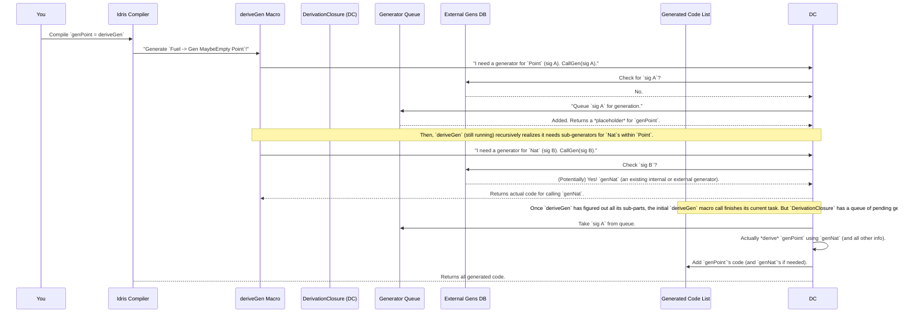

# Chapter 7: DerivationClosure

In the previous chapter, we learned about [ConsRecs (Constructors Recursiveness)](06_consrecs__constructors_recursiveness_.md), which showed how `DepTyCheck` masterfully handles recursive data types. We've talked about many individual puzzle pieces: `deriveGen` as the main factory, `Gen` as the blueprint, `GenSignature` as the design document, `Emptiness` as the guarantee, `DeepConsAnalysisRes` as the internal X-ray, and `ConsRecs` as the recursion rulebook.

Now, imagine you have a big team working on a new car. You have an engine designer, a chassis designer, an interior designer, etc. But you also need a **project manager** who coordinates everyone, makes sure they talk to each other, shares information, and ensures the whole car is built correctly.

This is exactly the role of `DerivationClosure`! It's not a single function or data type you directly interact with much. Instead, `DerivationClosure` is an **interface** (a set of rules for how components should behave) that defines the "project manager" for the entire `deriveGen` factory. It coordinates all the necessary information and steps to make sure `deriveGen` can successfully build all the required generators.

## What Problem Does `DerivationClosure` Solve? The Orchestrator for `deriveGen`

The central use case for `DerivationClosure` is to **orchestrate the entire code generation process** when `deriveGen` is called.

Think about `deriveGen` again:

```idris
data Point = MkPoint Nat Nat

genPoint : Fuel -> Gen MaybeEmpty Point
genPoint = deriveGen -- Magic happens here!
```

When `deriveGen` works its magic, it doesn't just generate `genPoint`. It might need to:

1.  **Understand `Point`'s structure** (`DeepConsAnalysisRes`).
2.  **Figure out recursion rules** if `Point` was recursive (`ConsRecs`).
3.  **Find or generate generators for `Nat`** (the sub-parts of `Point`).
4.  **Keep track of what generators have *already* been requested** to avoid generating the same thing twice.
5.  **Manage "external" generators** (generators that already exist and `deriveGen` shouldn't try to build).
6.  **Queue up new generation tasks** if a sub-generator is needed but not yet available.
7.  **Generate the actual Idris code** for all these generators.

`DerivationClosure` is the interface that defines how all these tasks are managed. It's the central intelligence unit that ensures the `deriveGen` factory runs smoothly and efficiently.

## Key Capabilities of `DerivationClosure`

The `DerivationClosure` interface provides two main capabilities (functions) that a "project manager" needs:

1.  **`needWeightFun`**: "Hey, I need a 'weighting function' for this type!" (Used for [ConsRecs (Constructors Recursiveness)](06_consrecs__constructors_recurisveness_.md) to determine recursion depth).
2.  **`callGen`**: "I need a generator for this specific `GenSignature`! Either find an existing one or create a new one."

Let's look at the simplified interface directly from `src/Deriving/DepTyCheck/Gen/ForAllNeededTypes/Interface.idr`:

```idris
interface Elaboration m => NamesInfoInTypes => ConsRecs => DerivationClosure m where
  needWeightFun : TypeInfo -> m ()
  callGen : (sig : GenSignature) -> (fuel : TTImp) -> Vect sig.givenParams.size TTImp -> m (TTImp, Maybe (gend ** Vect gend $ Fin gend))
```

*   **`needWeightFun : TypeInfo -> m ()`**:
    *   This function tells the `DerivationClosure` that a "weighting function" is required for a given `TypeInfo` (e.g., for `List Nat`). Weighting functions are used by [ConsRecs (Constructors Recursiveness)](06_consrecs__constructors_recursiveness_.md) to guide recursion.
    *   The `DerivationClosure` then checks if this weighting function has already been requested/generated. If not, it marks it for generation.

*   **`callGen : (sig : GenSignature) -> (fuel : TTImp) -> Vect ... TTImp -> m (...)`**:
    *   This is the core function. When `deriveGen` needs a generator (let's say for `Nat` because `Point` has `Nat` fields), it calls `callGen` with the specific [GenSignature (Generator Signature)](03_gensignature__generator_signature__.md) required (e.g., "a generator for `Nat` that takes `Fuel` as input").
    *   The `DerivationClosure` then performs several checks:
        1.  **Has this exact generator been asked for before?** If yes, just return a reference to it.
        2.  **Is there an *external* generator for this signature?** (Meaning, one that you've already defined and told `DepTyCheck` about). If yes, use that.
        3.  **If not, queue this generator up for derivation.** This means `DerivationClosure` adds it to a list of generators that still need to be built.
    *   This function returns the generated code for calling the generator (`TTImp`) and some optional information about its outputs.

## How `DerivationClosure` Works: Simplified Flow

Let's trace how `deriveGen` (with the help of `DerivationClosure`) generates `genPoint`:



The magic here is that `DerivationClosure` manages a **queue** of generators that need to be built. When `deriveGen` needs a generator that's not yet available, `DerivationClosure` queues it up and returns a placeholder. Once the main `deriveGen` call is finished, `DerivationClosure` then loops through its queue, building all the pending generators one by one, making sure all dependencies are met.

## Deep Dive: `ClosuringContext` and `runCanonic`

The actual implementation of `DerivationClosure` for `DepTyCheck` uses `ClosuringContext`. This is not a single type but a *set of contexts* that `DepTyCheck` expects to be available. It uses various "monad transformers" (a way to combine different programming contexts) to manage state, readers, writers, etc.

From `src/Deriving/DepTyCheck/Gen/ForAllNeededTypes/Impl.idr`:

```idris
ClosuringContext : (Type -> Type) -> Type
ClosuringContext m =
  ( MonadReader (SortedMap GenSignature (ExternalGenSignature, Name)) m -- external gens (Read-only)
  , MonadState  (SortedMap GenSignature Name) m                         -- gens already asked to be derived (Read/Write)
  , MonadState  (List (GenSignature, Name)) m                         -- queue of gens to be derived (Read/Write)
  , MonadState  Bool m                                                  -- flag that derivation loop is needed (Read/Write)
  , MonadState  (SortedSet Name) m                                      -- type names for weighting functions (Read/Write)
  , MonadWriter (List Decl, List Decl) m                                -- accumulated generated function declarations (Write-only)
  )
```

Each line here describes a piece of state or capability that `DerivationClosure` relies on:

*   `MonadReader ... ExternalGenSignature ...`: This is a "global library" of generators that already exist (either built-in or provided by the user). `DerivationClosure` can *read* from it.
*   `MonadState ... GenSignature Name ...`: This is a map of generators that `DerivationClosure` has *already promised to derive*. It stores the `GenSignature` and the program `Name` it will have. This is how it avoids duplicate work.
*   `MonadState ... List (GenSignature, Name) ...`: This is the crucial **queue** of "to-do" generators that still need their bodies generated.
*   `MonadState Bool m`: A simple flag to know if `deriveGen` is the *first* to start the derivation process. If it is, it's responsible for running the loop that processes the queue.
*   `MonadState (SortedSet Name) m`: Tracks which weighting functions (for [ConsRecs (Constructors Recursiveness)](06_consrecs__constructors_recursiveness_.md)) have been requested.
*   `MonadWriter (List Decl, List Decl) m`: This is where all the generated Idris code (declarations and bodies of the generator functions) gets accumulated.

The `runCanonic` function is where this whole `ClosuringContext` is set up and executed:

```idris
export
runCanonic : DeriveBodyForType => NamesInfoInTypes => ConsRecs =>
             SortedMap ExternalGenSignature Name -> (forall m. DerivationClosure m => m a) -> Elab (a, List Decl)
runCanonic exts calc = do
  -- ... setup of initial state ...
  (x, defs, bodies) <- evalRWST
                         -- ... initial Reader context (external generators) ...
                         -- ... initial Writer context (empty generated code) ...
                         (empty, empty, empty, True) -- initial state for states (maps, lists, boolean flag)
                         calc -- The computation that uses DerivationClosure
                         -- ... type arguments ...
  pure (x, defs ++ bodies)
```

`runCanonic` essentially creates the environment (`ClosuringContext`) where `deriveGen` can operate. It initializes all the maps, lists, and flags. Then, it runs the `calc` function (which is where `deriveGen` does its work). Once `calc` has finished requesting all needed generators, `runCanonic` takes all the accumulated generated code and returns it to the Idris compiler.

## Conclusion

`DerivationClosure` serves as the indispensable "project manager" for the `deriveGen` macro. It coordinates all aspects of the code generation process, from tracking requested generators and managing external dependencies to queuing up new generation tasks and accumulating the final Idris code. By abstracting these complex coordination efforts, `DerivationClosure` ensures that `deriveGen` can seamlessly and efficiently create generators for even the most intricate data types.

Next, we'll look at [CanManageLabels](08_canmanagelabels_.md), which deals with attaching helpful debugging information to our generated values.

---

Generated by [AI Codebase Knowledge Builder](https://github.com/The-Pocket/Tutorial-Codebase-Knowledge)