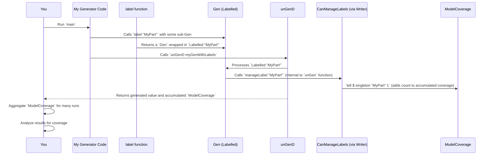

# Chapter 8: CanManageLabels

In the previous chapter, we explored [DerivationClosure](07_derivationclosure_.md), the "project manager" that coordinates all the complex tasks of `deriveGen`. Now, let's talk about something incredibly useful for understanding and debugging your generators: `CanManageLabels`.

## What is `CanManageLabels`? The Generator's Debugging Diary

Imagine you're trying to figure out why your random generator for `Point`s (from [Chapter 1: deriveGen](01_derivegen__generator_derivation_macro__.md)) isn't producing `Point`s with `x` greater than `100`. Or maybe your complex `List` generator (from [Chapter 6: ConsRecs](06_consrecs__constructors_recursiveness_.md)) is generating too many empty lists, and you want to know which part of the list-building process is leading to `Nil`.

This is where `CanManageLabels` comes in! Think of `CanManageLabels` as a **logging system or a "debugging diary"** for your generators. It allows you to attach little "tags" or "stickers" (called `Label`s) to different steps or parts of your value generation process.

When you run your generator, `CanManageLabels` provides a way for these labels to be collected or "managed." This lets you see, after the generation is done, exactly which parts of your generator were "involved" in creating a particular value or set of values.

**Central Use Case**: Understanding the *coverage* of your generators. This means knowing which distinct parts (types, constructors, choices within `oneOf` or `frequency`) of your data structure your random tests are actually hitting. It's invaluable for debugging and for ensuring the quality of your property-based tests.

## Attaching Labels with `label`

The primary way to use `CanManageLabels` is through the `label` function, which wraps a `Gen` with a `Label`.

```idris
import Data.Fuel
import Test.DepTyCheck.Gen
import Test.DepTyCheck.Gen.Labels

-- A simple generator for Nat
genNat : Fuel -> Gen NonEmpty Nat
genNat _ = elements [1, 2, 3]

-- Now, let's label it!
genLabelledNat : Fuel -> Gen NonEmpty Nat
genLabelledNat fuel = label "SmallNat" (genNat fuel)
```

The `label` function takes a `Label` (which you can easily create from a `String`) and a `Gen`. It returns a new `Gen` that behaves exactly like the original, but now, whenever a value is generated *through this labelled part*, the `Label` (`"SmallNat"`) will be recorded.

### What is a `Label`?

A `Label` is a simple tag. In `DepTyCheck`, it's defined as:

```idris
-- From src/Test/DepTyCheck/Gen/Labels.idr
export
data Label : Type where
  StringLabel : String -> Label

export %inline
FromString Label where
  fromString = StringLabel
```

This means you can easily create labels using string literals:

```idris
myLabel : Label
myLabel = "This is my label" -- Uses the FromString instance
```

## How `CanManageLabels` Works: The Interface

`CanManageLabels` itself is an *interface* (a type class in Idris) that defines a single function: `manageLabel`. Any `Monad` `m` that implements `CanManageLabels` must provide a way to handle a `Label`.

```idris
-- From src/Test/DepTyCheck/Gen/Labels.idr
public export
interface Monad m => CanManageLabels (0 m : Type -> Type) where
  manageLabel : Label -> m ()
```

When you use `label "MyLabel" myGen`, the `Labelled` constructor of `Gen` (which we briefly saw in [Chapter 2: Gen (Generator)](02_gen__generator__.md)) wraps `myGen`. When `unGen` or `unGen1` later processes this `Labelled` generator, it will call `manageLabel "MyLabel"`.

The power comes from *how* `manageLabel` is implemented by different `Monad`s:

1.  **`IgnoreLabels`**: The simplest implementation, which does nothing. This is the default if you don't specify anything else, meaning no labels are tracked.

    ```idris
    -- From src/Test/DepTyCheck/Gen/Labels.idr
    export %defaulthint
    IgnoreLabels : Monad m => CanManageLabels m
    IgnoreLabels = I where
      [I] CanManageLabels m where
        manageLabel _ = pure () -- Just does nothing (returns unit value)
    ```
    This is useful for performance if you don't need label tracking.

2.  **`PrintAllLabels`**: This implementation simply prints each label as it's encountered. Great for quick debugging!

    ```idris
    -- From src/Test/DepTyCheck/Gen/Labels.idr
    export
    [PrintAllLabels] HasIO io => CanManageLabels io where
      manageLabel = putStrLn . show -- Prints the label to the console
    ```

3.  **Integrating with `ModelCoverage`**: This is where `CanManageLabels` truly shines for analysis. When combined with a `Writer` monad that accumulates `ModelCoverage` information, `manageLabel` can record how many times each label has been hit.

    ```idris
    -- From src/Test/DepTyCheck/Gen/Coverage.idr
    MonadWriter ModelCoverage m => CanManageLabels m where
      manageLabel l = tell $ MkModelCoverage $ singleton l 1
    ```
    Here, a `ModelCoverage` instance for `CanManageLabels` is provided. `tell` is a function from `MonadWriter` that adds `MkModelCoverage (singleton l 1)` to the accumulated `ModelCoverage`. `singleton l 1` means "this label `l` was seen 1 time." The `(<+>)` operator for `ModelCoverage` (from `Semigroup`) then merges these counts, so if `l` is seen again, its count increases.

## Using Labels for Coverage Analysis with `unGenD`

To actually collect labels and see what parts of your generator are being used, you'll typically use functions like `unGenD` (or its variants) which are designed for "debug" or "coverage" evaluation. These functions wrap the underlying `Gen` in a `Writer` monad that leverages the `ModelCoverage` instance of `CanManageLabels`.

```idris
import Data.Fuel
import System.Random
import Test.DepTyCheck.Gen
import Test.DepTyCheck.Gen.Coverage -- Needed for unGenD and ModelCoverage

-- A slightly more complex generator for a (Maybe Nat)
genMaybeNat : Fuel -> Gen MaybeEmpty (Maybe Nat)
genMaybeNat fuel =
  oneOf [ label "JustNat" (pure <$> genNat fuel)
        , label "Nothing" (pure Nothing)
        ]

-- Helper to get multiple values and their coverage
getCoverageInfo : (n : Nat) -> Gen em a -> IO ModelCoverage
getCoverageInfo numRuns gen = do
  seed <- mkSeed
  -- Collect coverage by running unGenD' multiple times
  let results = take (limit numRuns) $ unGenTryAllD' seed gen
  let allCoverages = mapMaybe (\(_, ma) => fst <$> ma) results
  pure $ foldr (<+>) neutral allCoverages

main : IO ()
main = do
  putStrLn "Generating Maybe Nats with labels for coverage:"
  let myGen = genMaybeNat defaultFuel

  -- Run the generator many times
  coverage <- getCoverageInfo 1000 myGen

  -- Print the collected coverage: which labels (parts of the generator) were hit how many times
  putStrLn "--- Coverage Results ---"
  traverse_ (\(lab, count) => putStrLn $ "Label '" ++ show lab ++ "': " ++ show count ++ " times") (toAscList coverage.unModelCoverage)
```

**Output (simplified, might vary slightly):**

```text
Generating Maybe Nats with labels for coverage:
--- Coverage Results ---
Label 'JustNat': 647 times
Label 'Nothing': 353 times
```

**Explanation:**

1.  **`genMaybeNat`**: This generator uses `oneOf` to choose between two branches:
    *   `label "JustNat" (pure <$> genNat fuel)`: If this is chosen, `manageLabel "JustNat"` will be called.
    *   `label "Nothing" (pure Nothing)`: If this is chosen, `manageLabel "Nothing"` will be called.
2.  **`getCoverageInfo`**: We run `unGenTryAllD'` a thousand times. This function uses a `Writer ModelCoverage` monad instance for `CanManageLabels`. Each time a `label` is encountered, `manageLabel` adds to the `ModelCoverage` store.
3.  **`foldr (<+>) neutral allCoverages`**: We combine all the individual `ModelCoverage` results into a single one using the `Semigroup` instance for `ModelCoverage`. This aggregates the counts for each label.
4.  **Output**: The output clearly shows how many `Maybe Nat`s were produced by the `"JustNat"` branch versus the `"Nothing"` branch. This is your coverage information!

## How `withCoverage` Macro Provides Automatic Labelling

Labeling every part of a complex custom generator can be tedious. `DepTyCheck` provides a powerful macro, `withCoverage`, that automatically inserts labels into your existing generators! It helps you put a "type label" on generated values and also "constructor labels" for the constructor that was used.

```idris
-- From src/Test/DepTyCheck/Gen/Coverage.idr
export %macro
withCoverage : {em : _} -> (gen : Gen em a) -> Elab $ Gen em a
withCoverage gen = do
  tyExpr <- quote a -- Get the type of the generated value
  let (dpairLefts, tyRExpr) = unDPair tyExpr
  let (IVar _ tyName, _) = unAppAny tyRExpr
    | (genTy, _) => failAt (getFC genTy) "Expected a normal type name"
  tyInfo <- getInfo' tyName -- Get TypeInfo for the actual generated type

  -- Generate a helper function that given a value, returns a label for its constructor
  let consLabellingFun = deriveMatchingCons
                           `(Test.DepTyCheck.Gen.Labels.Label)
                           (\con => var "fromString" .$ primVal (Str $ "\{show con.name} (user-defined)"))
                           labellingFunName tyInfo

  -- Create a lambda that takes the generated value, applies the constructor
  -- labelling function, and then wraps the original value in a general type label.
  labeller <- check $ lam (lambdaArg labelledValName) $ ...

  -- Return the original generator, but now wrapped with the "type label" and
  -- then bound to the 'labeller' function to apply "constructor labels".
  pure $ label (fromString tyLabelStr) $ gen >>= labeller
```

**Simplified Usage:**

```idris
import Data.Fuel
import System.Random
import Test.DepTyCheck.Gen
import Test.DepTyCheck.Gen.Coverage as Cov

data TrafficLight = Red | Yellow | Green

genTrafficLight : Fuel -> Gen NonEmpty TrafficLight
genTrafficLight _ = elements [Red, Yellow, Green]

main : IO ()
main = do
  putStrLn "Generating TrafficLights with automatic coverage:"
  let myGenWithCoverage = Cov.withCoverage (genTrafficLight defaultFuel)

  -- Run the generator many times
  coverage <- getCoverageInfo 1000 myGenWithCoverage

  putStrLn "--- Automatic Coverage Results ---"
  traverse_ (\(lab, count) => putStrLn $ "Label '" ++ show lab ++ "': " ++ show count ++ " times") (toAscList coverage.unModelCoverage)
```

**Output (simplified, might vary slightly):**

```text
Generating TrafficLights with automatic coverage:
--- Automatic Coverage Results ---
Label 'Green (user-defined)': 330 times
Label 'Red (user-defined)': 335 times
Label 'TrafficLight[?]': 1000 times
Label 'Yellow (user-defined)': 335 times
```

**Explanation:**

*   `Cov.withCoverage` took `genTrafficLight` and automatically wrapped it.
*   It added a general label `TrafficLight[?]` (showing the type that was generated).
*   It also added labels for each constructor: `Red (user-defined)`, `Yellow (user-defined)`, `Green (user-defined)`.
*   Now, you can see if all constructors of `TrafficLight` were actually generated and with what frequency. This is incredibly powerful for validating your generators.



## Conclusion

`CanManageLabels` provides a simple but powerful mechanism for injecting debugging and analysis points into your `DepTyCheck` generators. By attaching descriptive `Label`s to different parts of your generation logic, and then using `unGenD` and `ModelCoverage`, you can gain invaluable insight into how your generators are actually behaving. This allows you to verify that your generators cover all the necessary parts of your data structures, making your property-based tests more thorough and effective. It's an essential tool for ensuring the quality of your test data.

---

Generated by [AI Codebase Knowledge Builder](https://github.com/The-Pocket/Tutorial-Codebase-Knowledge)