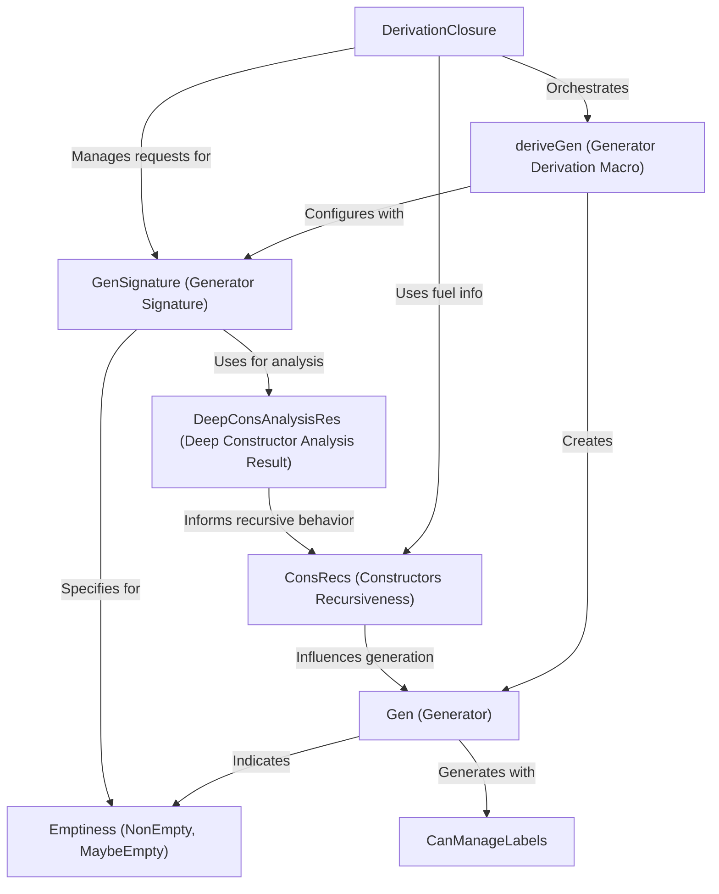

# Tutorial: DepTyCheck

`DepTyCheck` is an Idris 2 library for **property-based testing** with **dependent types**. Its core functionality lies in automatically
deriving *test data generators* for complex data structures. This allows developers to easily create random inputs for testing, even
for types where values can be *un-inhabitable*, ensuring robust and comprehensive test coverage.

**Source Repository:** [None](None)

## Chapters

1. [deriveGen (Generator Derivation Macro)
](01_derivegen__generator_derivation_macro__.md)
2. [Gen (Generator)
](02_gen__generator__.md)
3. [GenSignature (Generator Signature)
](03_gensignature__generator_signature__.md)
4. [Emptiness (NonEmpty, MaybeEmpty)
](04_emptiness__nonempty__maybeempty__.md)
5. [DeepConsAnalysisRes (Deep Constructor Analysis Result)
](05_deepconsanalysisres__deep_constructor_analysis_result__.md)
6. [ConsRecs (Constructors Recursiveness)
](06_consrecs__constructors_recursiveness__.md)
7. [DerivationClosure
](07_derivationclosure_.md)
8. [CanManageLabels
](08_canmanagelabels_.md)

---

Generated by [AI Codebase Knowledge Builder](https://github.com/The-Pocket/Tutorial-Codebase-Knowledge)