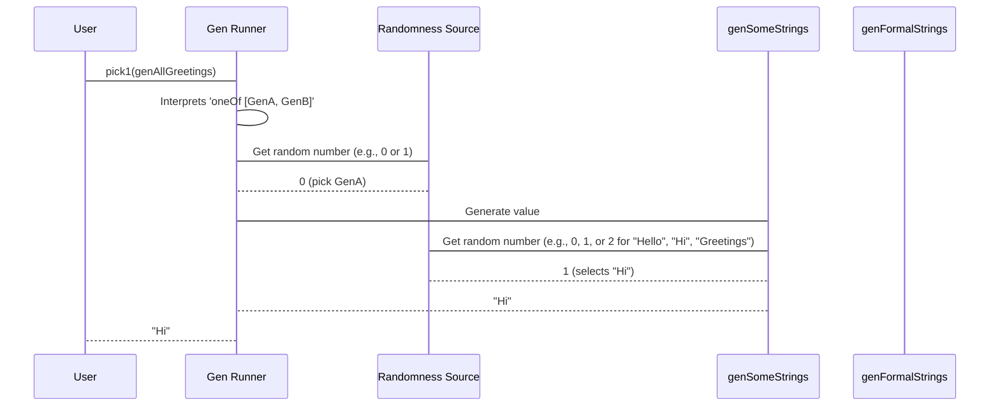

# Chapter 1: Gen (Generator)

Welcome to the exciting world of `DepTyCheck`! In this chapter, we're going to dive into the very first and one of the most fundamental concepts: the `Gen` type, which stands for "Generator."

## What is a `Gen` and Why Do We Need It?

Imagine you're trying to test a program that deals with strings. You could manually type out a few test strings like "hello", "world", "Idris". But what if your program has a bug that only shows up with a very specific, unusual string, like "a_b-c_123"? It would be nearly impossible to find this bug by manually creating test cases!

This is where `Gen` comes in handy! A `Gen` is like a **special instruction manual** that tells Idris how to _randomly create values_ of a certain type. Instead of you coming up with test data, the generator does it for you, exploring many possibilities. This is known as "property-based testing" – you define what a valid input looks like and what the output should generally satisfy (a "property"), and the system tries to find inputs that break your property.

Let's start with a very simple goal: **we want to generate some basic greetings.**

## Building Simple Generators

### Generating from a List of Elements

The simplest way to create a `Gen` is to give it a list of values it can choose from. For our greetings example, we can use the `elements` function.

```idris
-- genSomeStrings is a generator that can produce strings.
-- NonEmpty means it will always create a string (it won't fail to generate).
genSomeStrings : Gen NonEmpty String
genSomeStrings = elements ["Hello", "Hi", "Greetings"]
```

**Explanation:**
*   `genSomeStrings` is the name of our generator.
*   `Gen NonEmpty String` tells us a few things:
    *   `Gen`: It's a generator!
    *   `NonEmpty`: This generator will *always* produce a `String`. It will never fail to find a value from its list. We'll explore `MaybeEmpty` later, which means it *might* fail.
    *   `String`: The type of data this generator creates.
*   `elements ["Hello", "Hi", "Greetings"]`: This is the instruction manual. It says, "Pick one of these three strings randomly." Each string has an equal chance of being picked.

To actually "run" this generator and get a value, you'd use functions like `pick1` (which tries to generate one value) or `unGenAll` (which generates an infinite stream of values). For now, just understand that `genSomeStrings` *describes* how to make a string, rather than being a string itself.

### Combining Generators with `oneOf`

What if we want to combine our existing `genSomeStrings` with some other greetings? Maybe we have another list of more formal greetings. We can use the `oneOf` function to combine multiple generators into one.

```idris
-- genFormalStrings is another simple generator.
genFormalStrings : Gen NonEmpty String
genFormalStrings = elements ["Good morning", "Good afternoon"]

-- genAllGreetings combines genSomeStrings and genFormalStrings.
genAllGreetings : Gen NonEmpty String
genAllGreetings = oneOf [genSomeStrings, genFormalStrings]
```

**Explanation:**
*   `genFormalStrings` is similar to `genSomeStrings` but generates different phrases.
*   `oneOf [genSomeStrings, genFormalStrings]`: This is a very important concept! It means "Choose *one* of the generators in this list, and then use that chosen generator to produce a value."
    *   In this case, `genSomeStrings` has a 50% chance of being chosen, and `genFormalStrings` also has a 50% chance.
    *   If `genSomeStrings` is chosen, then "Hello", "Hi", or "Greetings" will be generated (each with equal probability from that generator).
    *   If `genFormalStrings` is chosen, then "Good morning" or "Good afternoon" will be generated (each with equal probability from that generator).

This is like building with Lego blocks! Each `Gen` is a block, and `oneOf` lets you decide which block to use at a certain step.

**Important Note on `oneOf` Distribution:**
`oneOf` treats each generator in its list as a *whole unit*. This means that in `genAllGreetings`, the entire `genSomeStrings` has the same probability of being chosen as the entire `genFormalStrings`. The individual values within `genSomeStrings` (like "Hello") will be less likely than values within `genFormalStrings` (like "Good morning") because `genSomeStrings` has more internal choices.

If you wanted *all* strings to have an equal chance, you'd put them all in one `elements` list:

```idris
genAllGreetingsUniform : Gen NonEmpty String
genAllGreetingsUniform = elements ["Hello", "Hi", "Greetings", "Good morning", "Good afternoon"]
```
In `genAllGreetingsUniform`, each of the five strings has a 1/5 chance of being picked. This is different from `genAllGreetings`, where "Hello" has a (1/2 * 1/3) = 1/6 chance, and "Good morning" has a (1/2 * 1/2) = 1/4 chance. Understanding this distribution is key to building good test data!

## The `Gen` Type Signature: `Gen Emptiness Type`

Let's look closer at `Gen`'s full type: `Gen Emptiness Type`.

*   **`Emptiness`**: This is a crucial concept. It tells us if the generator is guaranteed to always produce a value or if it might sometimes fail.
    *   `NonEmpty`: The generator will *always* succeed in producing a value of `Type`. It means it's impossible for this generator to "run out of options."
    *   `MaybeEmpty`: The generator *might* fail to produce a value. This is important for dependent types where some types (like `Fin 0`, which means a natural number smaller than 0) have no possible values. If you try to generate `Fin 0`, it *must* fail.

```idris
-- A generator for Fin n (numbers smaller than n).
-- If n is 0, there are no possible values, so it's MaybeEmpty.
genFin : (n : Nat) -> Gen MaybeEmpty (Fin n)
genFin Z     = empty -- If n is 0, it's empty!
genFin (S n) = elements' $ allFins n -- Otherwise, pick from 0 to n.
```

**Explanation:**
*   `genFin (n : Nat)`: This generator takes a natural number `n` as an argument.
*   `Gen MaybeEmpty (Fin n)`: The result is a generator for `Fin n`. It's `MaybeEmpty` because `Fin Z` (which is `Fin 0`) has no values.
*   `empty`: This is a special generator that *always* fails. It's how we represent a `MaybeEmpty` generator that has no possible values.
*   `elements'`: This is a helper function similar to `elements` but works with `Foldable` types (like lists). `allFins n` would produce a list of all `Fin` values up to `n`.

### The `empty` Generator

The `empty` generator is conceptually like a broken vending machine. You put in a coin (try to generate a value), but nothing ever comes out successfully. It's important for types that have no inhabitants, like `Fin 0`.

## More Complex Generators: `map` and `bind`

Generators aren't just for picking from lists! You can transform their output or even chain them together. `Gen` supports the `Functor` and `Monad` interfaces, which are powerful concepts from functional programming. Don't worry if you're new to these; we'll break them down.

### `map`: Transforming Values

`map` lets you take the value produced by a generator and apply a function to it, transforming it into a new value.

Imagine we want to greet people by saying "Hello, [Name]". We can generate names and then `map` a function over them.

```idris
genNames : Gen NonEmpty String
genNames = elements ["Alice", "Bob"]

-- We want to transform "Alice" into "Hello, Alice!"
genGreetingsWithName : Gen NonEmpty String
genGreetingsWithName = map (\name => "Hello, " ++ name ++ "!") genNames
```

**Explanation:**
*   `genNames` produces either "Alice" or "Bob".
*   `map (\name => "Hello, " ++ name ++ "!") genNames`:
    *   `map`: Takes a function and a generator.
    *   `(\name => "Hello, " ++ name ++ "!")`: This is an anonymous function. It takes a `name` (which will be generated by `genNames`) and produces a new string like "Hello, Alice!".
    *   So, `genGreetingsWithName` will generate either "Hello, Alice!" or "Hello, Bob!".

This is like taking a "name-generating" Lego block, and sticking a "prefix/suffix-adding" adapter onto it to make a new, more specific, "full-greeting-generating" block.

### `bind` (or `do` notation): Chaining Dependent Generators

`bind` (often written with `do` notation in Idris) allows you to create a value with one generator, and then *use that value* to decide how to create the next part of your value. This is extremely powerful for dependent types.

Let's say we want to generate a random natural number `n`, and *then* generate a `Fin n` (a natural number less than `n`). The value `n` that `genNat` produces directly impacts what `genFin` can generate.

```idris
-- We need a generator for natural numbers.
genNat : Gen NonEmpty Nat
genNat = elements [1, 2, 3] -- Let's keep it simple for now, generating 1, 2, or 3.

-- Combining genNat and genFin using 'do' notation
genAnyFin : Gen MaybeEmpty (n ** Fin n)
genAnyFin = do
  n : Nat <- genNat      -- First, generate a natural number 'n' (e.g., 1, 2, or 3).
  f : Fin n <- genFin n  -- Then, use that 'n' to generate a 'Fin n'.
  pure (n ** f)          -- Combine them into a dependent pair (n ** Fin n).
```

**Explanation:**
*   `genAnyFin` will generate a pair `(n, f)` where `f` is a `Fin n`.
*   `n : Nat <- genNat`: This means "Run `genNat`, take the `Nat` it produces, and call it `n`."
*   `f : Fin n <- genFin n`: This is the crucial part! We use the *already generated `n`* to call `genFin n`. If `n` was `2`, then `genFin` will generate `Fin 2` (which could be `0` or `1`).
*   `pure (n ** f)`: This takes the generated `n` and `f` and wraps them in a `(n ** Fin n)` dependent pair, which is the type `genAnyFin` is supposed to produce.

This is like building a complex Lego model step-by-step: first, you pick the size of the base (`n` from `genNat`), and *then* you pick a piece to put on that base that is guaranteed to fit its size (`f` from `genFin n`).

**Why `MaybeEmpty` for `genAnyFin`?**
Even though `genNat` is `NonEmpty`, if `genNat` were to generate `0`, then `genFin 0` would be `empty`, making the whole `genAnyFin` potentially `MaybeEmpty`. Our current `genNat` only generates `1, 2, 3`, so this specific `genAnyFin` would be `NonEmpty`. However, the `Gen` type system is conservative and automatically deduces the least strong `Emptiness` guarantee. Since `genFin` is `MaybeEmpty`, applying `bind` to it results in a `MaybeEmpty` outer generator.

## How `Gen` Works Internally (Simplified)

At its heart, a `Gen` is fundamentally a recipe for performing computations in a "random" context. Think of it as a function that, when given a source of randomness, can produce a value.

Let's strip away some Idris-specific machinery and imagine `Gen` very simply:

```idris
-- A simplified view of what a RawGen does
record RawGen a where
  constructor MkRawGen
  unRawGen : forall m. MonadRandom m => m a

-- A very simplified Gen type
data Gen : Type -> Type where
  Pure  : a -> Gen a          -- Just returns a specific value
  Raw   : RawGen a -> Gen a   -- Uses a 'raw' random computation
  OneOf : List (Gen a) -> Gen a -- Chooses one generator from a list
  Bind  : RawGen c -> (c -> Gen a) -> Gen a -- monadic bind (simplified)
```

**Non-code/Code-light Walkthrough:**

1.  **You define `genAllGreetings`:**
    ```idris
    genSomeStrings = elements ["Hello", "Hi", "Greetings"]
    genFormalStrings = elements ["Good morning", "Good afternoon"]
    genAllGreetings = oneOf [genSomeStrings, genFormalStrings]
    ```
    *Internally, this means:* `genAllGreetings` is structured as a `OneOf` containing two other `Gen`s. Each `elements` generator is eventually translated into a `RawGen` that knows how to pick from its list.

2.  **You ask to `pick1` a greeting:**
    *   `DepTyCheck` needs to "run" `genAllGreetings`.
    *   It sees `oneOf [genSomeStrings, genFormalStrings]`.
    *   It uses its internal random number generator to decide *which* of the two sub-generators to pick (e.g., it flips a virtual coin, if heads pick the first, if tails pick the second).
    *   Let's say it picks `genSomeStrings`.
    *   Now it needs to run `genSomeStrings`, which is `elements ["Hello", "Hi", "Greetings"]`.
    *   Again, it uses a random number to pick one of "Hello", "Hi", or "Greetings".
    *   Let's say it picks "Hi".
    *   "Hi" is returned as your generated value!

**Simplified `Gen` Internal Flow Diagram (Mermaid Sequence Diagram):**



### Diving into the Code (`src/Test/DepTyCheck/Gen.idr`)

Let's look at the actual `Gen` definition in `src/Test/DepTyCheck/Gen.idr`. Don't worry about understanding every line, but focus on the structure.

```idris
-- Test/DepTyCheck/Gen.idr

-- `RawGen` just wraps a monadic computation (`m a`) that comes from a random source.
record RawGen a where
  constructor MkRawGen
  unRawGen : forall m. MonadRandom m => CanManageLabels m => m a

-- The core `Gen` type, parameterized by Emptiness and the value type.
data Gen : Emptiness -> Type -> Type where

  Empty : Gen MaybeEmpty a -- Represents a generator that always fails.

  Pure  : a -> Gen em a    -- Just wraps a constant value.

  Raw   : RawGen a -> Gen em a -- Wraps a raw random action.

  OneOf : (gs : GenAlternatives True alem a) -> -- Handles combining multiple generators.
          (0 _ : All IsNonEmpty gs) =>           -- Proof that all alternatives are non-empty.
          (0 _ : alem `NoWeaker` em) =>           -- Proof about emptiness levels.
          Gen em a

  Bind  : (0 _ : biem `NoWeaker` em) =>           -- Proof about emptiness.
          RawGen c -> (c -> Gen biem a) -> Gen em a -- Chains raw generations.

  Labelled : Label -> (g : Gen em a) -> (0 _ : IsNonEmpty g) => Gen em a -- For tracking specific generation paths.
```

**Explanation of the `Gen` Data Type:**
*   `Empty`: This is the `MaybeEmpty` generator that definitively produces no values.
*   `Pure x`: This generator always produces the value `x`. It's `NonEmpty`.
*   `Raw sf`: This is the direct wrapper around a `RawGen`, which performs the actual random number generation to get a value.
*   `OneOf`: This is the core `oneOf` combinator we discussed. It takes a `GenAlternatives` (a special list of generators) and picks one. The constraints (`All IsNonEmpty gs`, `alem `NoWeaker` em`) are proofs that the Idris type checker uses to ensure the `Emptiness` level is correctly maintained.
*   `Bind`: This is the monadic bind structure. It takes a `RawGen` to produce an intermediate value `c`, and then uses a function `(c -> Gen biem a)` to produce the final generator.
*   `Labelled`: This allows you to attach a label to a generator, which can be useful for debugging or tracking generation statistics.

The `NoWeaker` relationship (`MaybeEmpty` is "no weaker" than `NonEmpty`, meaning `NonEmpty` is stronger) is a key part of how `DepTyCheck` determines the `Emptiness` of combined generators automatically.

There are many more functions and types around `Gen` in the `DepTyCheck` library that help with combining, analyzing, and running these generators. But `Gen` itself, with its `Emptiness` parameter, `Pure`, `Raw`, `OneOf`, and `Bind` constructors, forms the foundation.

## Conclusion

In this chapter, you've learned about the `Gen` type, which is the cornerstone for property-based testing in `DepTyCheck`. You now know:
*   `Gen` helps automatically create diverse test data.
*   Simple generators can be built using `elements` to pick from fixed lists.
*   Complex generators can be created by combining simpler ones with `oneOf`.
*   The `Emptiness` parameter (`NonEmpty` vs. `MaybeEmpty`) is crucial for specifying whether a generator can always produce a value.
*   You can transform generated values using `map`.
*   You can chain generators where one generation step depends on the result of a previous one using `bind` (or `do` notation).
*   You've had a peek at the internal structure of `Gen` and how it uses randomness to fulfill generation requests.

This understanding of `Gen` will be vital as we explore how to make our generators even more flexible.

Next up, we'll dive into [GenAlternatives](02_genalternatives_.md), which is the specific type used by `OneOf` to manage groups of generators.

---

Generated by [AI Codebase Knowledge Builder](https://github.com/The-Pocket/Tutorial-Codebase-Knowledge)