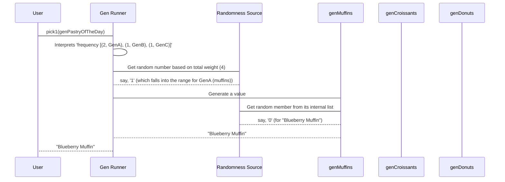

# Chapter 2: GenAlternatives

Welcome back to `DepTyCheck`! In our [previous chapter](01_gen__generator__.md), you learned about the fundamental `Gen` type – our "instruction manual" for creating random data. We saw how `Gen`s can be combined using `oneOf` to pick from different generators.

Now, let's zoom in on a special helper that `oneOf` uses behind the scenes: `GenAlternatives`. Think of `GenAlternatives` as the organized "menu" or "playlist" that `oneOf` can pick from. It's not just a simple list; it also keeps track of important information about each item, like its "weight" or probability of being chosen.

## What Problem Does `GenAlternatives` Solve?

Imagine you're running a bakery. You have different types of pastries, and you want to offer your customers a "random pastry of the day."

*   You have a **simple pastry generator** for muffins (`genMuffins`).
*   You have another **simple pastry generator** for croissants (`genCroissants`).
*   And a third for donuts (`genDonuts`).

If you just combined them like `oneOf [genMuffins, genCroissants, genDonuts]`, each *type* of pastry (muffin, croissant, donut) has an equal chance of being picked. But what if you have a special promotion where you want muffins to be chosen *twice as often* as croissants and donuts?

This is where `GenAlternatives` comes in handy! It lets you assign a specific *weight* to each generator, giving you fine-grained control over the probability distribution. It's like saying, "Put two muffin tickets in the hat, one croissant ticket, and one donut ticket."

## `GenAlternatives` in Action: Weighted Choices

`GenAlternatives` isn't something you'll usually construct directly using its `MkGenAlts` constructor (because it's quite complex!). Instead, you'll work with functions that produce or consume it. The most direct way to get a weighted list of alternatives is through the `frequency` function.

Let's adjust our pastry example:

```idris
-- genMuffins, genCroissants, genDonuts are simple generators for pastries.
-- (Let's assume they exist, similar to genSomeStrings from Chapter 1)
genMuffins : Gen NonEmpty String
genMuffins = elements ["Blueberry Muffin", "Chocolate Chip Muffin"]

genCroissants : Gen NonEmpty String
genCroissants = elements ["Plain Croissant", "Almond Croissant"]

genDonuts : Gen NonEmpty String
genDonuts = elements ["Glazed Donut", "Jelly Donut"]

-- Now, let's create a weighted generator using `frequency`
genPastryOfTheDay : Gen NonEmpty String
genPastryOfTheDay = frequency
  [ (2, genMuffins)      -- Muffins have a weight of 2
  , (1, genCroissants)   -- Croissants have a weight of 1
  , (1, genDonuts)       -- Donuts have a weight of 1
  ]
```

**Explanation:**

*   `genPastryOfTheDay` will pick a pastry for us.
*   The `frequency` function takes a list of `(weight, generator)` pairs. This list is essentially a `GenAlternatives` structure.
*   The total weight is 2 + 1 + 1 = 4.
    *   `genMuffins` will be chosen with a 2/4 (50%) probability.
    *   `genCroissants` will be chosen with a 1/4 (25%) probability.
    *   `genDonuts` will be chosen with a 1/4 (25%) probability.
*   Once a generator is chosen (e.g., `genMuffins`), it then produces a value according to its own logic (e.g., "Blueberry Muffin" or "Chocolate Chip Muffin" with equal probability).

This gives us precise control over the overall distribution, which is super important for testing! For instance, if you're testing an e-commerce platform, you might want to generate more "successful orders" than "failed orders" to ensure your test suite covers common scenarios without getting bogged down in rare edge cases every time.

## Unpacking `GenAlternatives` with `alternativesOf`

In [Chapter 1](01_gen__generator__.md), we introduced `oneOf` which *implicitly* creates `GenAlternatives` internally. Sometimes, you want to get at that underlying list of alternatives. This is where `alternativesOf` comes in.

`alternativesOf` allows you to inspect a `Gen` and get back its conceptual list of alternatives. If a `Gen` was built with `oneOf`, then `alternativesOf` will return the list of generators that `oneOf` was given. If it's a "simple" generator (like `Pure`, `Raw`, or `Bind`), `alternativesOf` will treat it as a single alternative with weight 1.

Let's revisit an example from the previous chapter:

```idris
genSomeStrings : Gen NonEmpty String
genSomeStrings = elements ["Hello", "Hi", "Greetings"]

genFormalStrings : Gen NonEmpty String
genFormalStrings = elements ["Good morning", "Good afternoon"]

genAllGreetings : Gen NonEmpty String
genAllGreetings = oneOf [genSomeStrings, genFormalStrings]

-- What happens if we call alternativesOf on genAllGreetings?
-- alternativesOf genAllGreetings will return a GenAlternatives
-- that looks something like: [(1, genSomeStrings), (1, genFormalStrings)]
-- (conceptually, not literally this Idris code)
```

**Why is this useful?**

Consider the `genAllGreetings` example. If you wanted *all* five strings ("Hello", "Hi", "Greetings", "Good morning", "Good afternoon") to have an equal chance of being picked, `oneOf [genSomeStrings, genFormalStrings]` was not enough. You needed to use `elements` on the combined list:

```idris
genAllGreetingsUniform : Gen NonEmpty String
genAllGreetingsUniform = elements ["Hello", "Hi", "Greetings", "Good morning", "Good afternoon"]
```

But what if `genSomeStrings` and `genFormalStrings` are already defined and complex, and you can't easily get their internal lists? `alternativesOf` helps here:

```idris
genAllGreetingsUniformViaAlts : Gen NonEmpty String
genAllGreetingsUniformViaAlts =
  oneOf $ alternativesOf genSomeStrings ++ alternativesOf genFormalStrings
```

**Explanation:**

*   `alternativesOf genSomeStrings` gives us `[(1, "Hello"), (1, "Hi"), (1, "Greetings")]`. (Conceptually, each `elements` is broken down into its individual string alternatives by `alternativesOf`).
*   `alternativesOf genFormalStrings` gives us `[(1, "Good morning"), (1, "Good afternoon")]`.
*   Concatenating these two `GenAlternatives` lists (`++`) effectively merges them into one longer list: `[(1, "Hello"), (1, "Hi"), (1, "Greetings"), (1, "Good morning"), (1, "Good afternoon")]`.
*   `oneOf` then takes this merged `GenAlternatives` and picks uniformly from *all* of its individual alternatives. Now, each string has a 1/5 chance of being picked!

This is a powerful way to flatten out the probability distribution when combining generators that already have their own internal `oneOf` or `frequency` structure.

## The `GenAlternatives` Type Internals (Code-Light Walkthrough)

Remember our simplified `Gen` internal diagram from [Chapter 1](01_gen__generator__.md)?



When `DepTyCheck` encounters a `frequency` (or `oneOf`), it essentially works with a `GenAlternatives` structure. This structure holds the generators, each tagged with its weight.

When `pick1` is called on a generator constructed with `frequency`:

1.  `DepTyCheck` looks at the `GenAlternatives` you've given it. Let's imagine it's `[(2, genMuffins), (1, genCroissants), (1, genDonuts)]`.
2.  It calculates the total weight: 2 + 1 + 1 = 4.
3.  It then asks its `RandomSrc` for a random number between 1 and the total weight (inclusive), say, between 1 and 4.
4.  If the random number is 1 or 2, `genMuffins` is chosen.
5.  If the random number is 3, `genCroissants` is chosen.
6.  If the random number is 4, `genDonuts` is chosen.
7.  Once a specific generator is chosen (e.g., `genMuffins`), `DepTyCheck` then runs *that* generator to get the final value.

This weighted selection is handled efficiently by `GenAlternatives`, which keeps track of these weights for you.

## `GenAlternatives` in the Code (`src/Test/DepTyCheck/Gen.idr`)

Let's look at the actual definition of `GenAlternatives` in `src/Test/DepTyCheck/Gen.idr`:

```idris
-- src/Test/DepTyCheck/Gen.idr

record GenAlternatives (0 mustBeNotEmpty : Bool) (0 em : Emptiness) (a : Type) where
  constructor MkGenAlts
  unGenAlts : LazyLst mustBeNotEmpty (Nat1, Lazy (Gen em a))
```

**Explanation:**

*   `GenAlternatives` is a `record` type, meaning it bundles some data together. Its constructor is `MkGenAlts`.
*   It has three parameters:
    *   `mustBeNotEmpty : Bool`: This `Bool` (True/False) indicates whether the list of alternatives *must* contain at least one element. This is related to our discussion of `MaybeEmpty` in [Chapter 1](01_gen__generator__.md). If `mustBeNotEmpty` is `True`, then the list of alternatives itself cannot be empty.
    *   `em : Emptiness`: This is the `Emptiness` level (either `NonEmpty` or `MaybeEmpty`) that *all* generators within this `GenAlternatives` will produce. Since `GenAlternatives` often feeds into a `Gen`, it needs to know the capabilities of the generators it holds.
    *   `a : Type`: This is the type of value that the `Gen`s inside this `GenAlternatives` will eventually produce.
*   `unGenAlts : LazyLst mustBeNotEmpty (Nat1, Lazy (Gen em a))`: This is the most important field.
    *   `LazyLst mustBeNotEmpty`: This is a "lazy list" type. The `mustBeNotEmpty` parameter ensures that the type system knows whether this list is guaranteed to have elements. Lazy lists are efficient because elements are only computed when needed.
    *   `(Nat1, Lazy (Gen em a))`: This is the type of each item in the lazy list.
        *   `Nat1`: This is `Nat` (natural number) that is *guaranteed* to be at least 1. This `Nat1` represents the **weight** of the alternative. Our muffin example used `(2, genMuffins)`, `2` would be a `Nat1`.
        *   `Lazy (Gen em a)`: This is the actual generator for that alternative, wrapped in `Lazy`. Using `Lazy` means the generator itself is not fully created or evaluated until it's actually chosen and needed, which saves computation and memory.

Notice how `GenAlternatives` bundles up the weight and the generator itself. This is the mechanism that `frequency` and `oneOf` use to manage the collection of generators they need to choose from. When you write `oneOf [genA, genB]`, `DepTyCheck` internally transforms `[genA, genB]` into a `GenAlternatives` like `MkGenAlts [(1, genA), (1, genB)]` where each generator gets a default weight of 1.

## Conclusion

In this chapter, you've learned about `GenAlternatives`, the specialized list-like structure that holds a collection of generators along with their weights.

You now understand:
*   How `GenAlternatives` allows for fine-grained control over the probability distribution of generated values, particularly when using the `frequency` combinator.
*   How `alternativesOf` can be used to extract the underlying `GenAlternatives` from a `Gen` and how this is helpful for flattening distributions.
*   The conceptual and actual internal structure of `GenAlternatives` and how it stores weights and lazy generators.

This knowledge is crucial for constructing sophisticated and statistically sound test data generators. Up next, we'll delve deeper into the concept of [Emptiness](03_emptiness_.md), which was briefly mentioned in our `Gen` type signature discussions!

---

Generated by [AI Codebase Knowledge Builder](https://github.com/The-Pocket/Tutorial-Codebase-Knowledge)