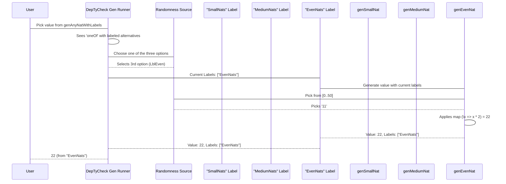

# Chapter 4: CTLabel (Compile-Time Label)

Welcome back to `DepTyCheck`! In our previous chapter, [Emptiness](03_emptiness_.md), we learned how `DepTyCheck` tracks whether a generator is guaranteed to produce a value or might fail. Now, we're going to explore a feature that's less about the *what* but more about the *where and why*: `CTLabel`.

## What is a `CTLabel` and Why Do We Need It?

Imagine you're baking a complex cake using many different steps and ingredients. Each step is like a small generator, and the final cake is the value your main generator produces. Now, let's say the cake turns out a bit... strange. How do you figure out which part of your recipe (which generator) caused the problem?

This is where `CTLabel` comes in! `CTLabel` stands for "Compile-Time Label." It's like adding a special, invisible tag to parts of your generator's recipe. When `DepTyCheck` runs your generators, these tags help you understand:

1.  **Coverage:** Which parts of your complex generator logic were actually "exercised" or used to create a value?
2.  **Debugging:** If something goes wrong, you can see exactly which labeled section of your generator was responsible for the generated (or failed to generate) value.

Unlike a simple `String`, `CTLabel` is designed to be used *during compilation*, and you can combine them to form more detailed descriptions.

### A Concrete Example: Generating Different Kinds of `Nat`s

Let's say we want to generate natural numbers (`Nat`), but with different approaches:
*   Sometimes we want 'small' numbers (0-10).
*   Sometimes we want 'medium' numbers (11-100).
*   Sometimes we want 'even' numbers.

We can define generators for these:

```idris
import Test.DepTyCheck.Gen

genSmallNat : Gen NonEmpty Nat
genSmallNat = elements [0, 1, 2, 3, 4, 5, 6, 7, 8, 9, 10]

genMediumNat : Gen NonEmpty Nat
genMediumNat = elements [11 .. 100] -- generates [11, 12, ..., 100]

genEvenNat : Gen NonEmpty Nat
genEvenNat = map (\x => x * 2) (elements [0 .. 50]) -- generates 0, 2, 4, ..., 100
```

Now, we combine them using `oneOf` to get a general `genAnyNat`:

```idris
genAnyNat : Gen NonEmpty Nat
genAnyNat = oneOf [genSmallNat, genMediumNat, genEvenNat]
```

If we just run `genAnyNat` and get, say, `22`, we don't know *how* `22` was generated. Was it a medium number picked directly? Or was it an even number (2 * 11)? This ambiguity can be a problem when debugging.

## Adding `CTLabel`s to Your Generators

To add labels, we use the `label` function from the `Test.DepTyCheck.Gen` module. It takes a `String` (which `DepTyCheck` converts into a `CTLabel`) and a generator.

Let's modify `genAnyNat` to include labels:

```idris
import Test.DepTyCheck.Gen

genSmallNat : Gen NonEmpty Nat
genSmallNat = elements [0, 1, 2, 3, 4, 5, 6, 7, 8, 9, 10]

genMediumNat : Gen NonEmpty Nat
genMediumNat = elements [11 .. 100]

genEvenNat : Gen NonEmpty Nat
genEvenNat = map (\x => x * 2) (elements [0 .. 50])

-- Now, add labels!
genAnyNatWithLabels : Gen NonEmpty Nat
genAnyNatWithLabels = oneOf
  [ Test.DepTyCheck.Gen.label "SmallNats" genSmallNat
  , Test.DepTyCheck.Gen.label "MediumNats" genMediumNat
  , Test.DepTyCheck.Gen.label "EvenNats" genEvenNat
  ]
```

**Explanation:**
*   `Test.DepTyCheck.Gen.label "SmallNats" genSmallNat`: Now, every time a number is generated through `genSmallNat` (e.g., `5`), it also carries the "SmallNats" label.
*   Similarly for "MediumNats" and "EvenNats".

Now, when you run `genAnyNatWithLabels` and inspect the results (using `DepTyCheck`'s internal reporting tools, which we won't cover in detail here), you won't just see `22`. You might see something like `22 (from "MediumNats")` or `22 (from "EvenNats")`. This immediately tells you which path was taken!

### Combining Labels

One of the cool features of `CTLabel` is that labels can be combined. If you have a deeper nested generator, the labels will "stack up" to show the full path.

Let's say we want to generate "small even numbers" explicitly:

```idris
genSmallEvenNat : Gen NonEmpty Nat
genSmallEvenNat = Test.DepTyCheck.Gen.label "Small" genEvenNat
  where
    genEvenNat : Gen NonEmpty Nat
    genEvenNat = map (\x => x * 2) (elements [0 .. 5]) -- generates 0, 2, ..., 10
```

Now, if we generate `4` from `genSmallEvenNat`, the label associated with it might be something like `"Small"."EvenNats"` (the exact string representation depends on how `DepTyCheck` formats composite labels). This creates a breadcrumb trail showing *how* the value was generated!

## How `DepTyCheck` Uses `CTLabel` Internally

At its heart, `CTLabel` helps `DepTyCheck` build up a trace of how a value was generated. Think of it like this: every time you step into a labeled section of your generator, `DepTyCheck` adds that label to a list. When a value is finally produced, that list of labels becomes its "origin story."

### Non-code/Code-light Walkthrough

Consider our `genAnyNatWithLabels` example:

```idris
genAnyNatWithLabels = oneOf
  [ Test.DepTyCheck.Gen.label "SmallNats" genSmallNat
  , Test.DepTyCheck.Gen.label "MediumNats" genMediumNat
  , Test.DepTyCheck.Gen.label "EvenNats" genEvenNat
  ]
```



As you can see, when `DepTyCheck` runs `Test.DepTyCheck.Gen.label "EvenNats" genEvenNat`, it effectively "pushes" `"EvenNats"` onto a stack of active labels *before* running `genEvenNat`. Any value produced by `genEvenNat` then comes with that label context. If `genEvenNat` itself had nested labels, they would be pushed and popped accordingly.

### Diving into the Code (`src/Test/DepTyCheck/Gen.idr` and `src/Deriving/DepTyCheck/Gen/Labels.idr`)

The actual `Gen` type (from `src/Test/DepTyCheck/Gen.idr`) has a `Labelled` constructor:

```idris
-- src/Test/DepTyCheck/Gen.idr (simplified snippet)
data Gen : Emptiness -> Type -> Type where
  -- ... other constructors ...
  Labelled : Label -> (g : Gen em a) -> (0 _ : IsNonEmpty g) => Gen em a
```

**Explanation:**
*   `Labelled : Label -> (g : Gen em a) -> ...`: This constructor is how a `Gen` can internally hold a `Label` along with another `Gen`. When `DepTyCheck` "evaluates" a `Labelled` generator, it activates the `Label` and then runs the inner `g`.

The `Label` type itself is simple:

```idris
-- src/Test/DepTyCheck/Gen/Labels.idr
export
data Label : Type where
  StringLabel : String -> Label
```

**Explanation:**
*   A `Label` is essentially just a wrapper around a `String`. This is the runtime representation of the label.

Now, where does `CTLabel` fit in? `CTLabel` (from `src/Deriving/DepTyCheck/Gen/ForOneType/Impl.idr`) is a *compile-time* type used by the `DepTyCheck` *deriver* (the part that automatically creates generators).

```idris
-- src/Deriving/DepTyCheck/Gen/Labels.idr
public export
data CTLabel = MkCTLabel TTImp

public export
Semigroup CTLabel where
  MkCTLabel l <+> MkCTLabel r = MkCTLabel `(~l ++ ~r)

-- The function that applies the label in the generated code
export
labelGen : (desc : CTLabel) -> TTImp -> TTImp
labelGen (MkCTLabel desc) expr = `(Test.DepTyCheck.Gen.label (fromString ~desc) ~expr)
```

**Explanation:**
*   `data CTLabel = MkCTLabel TTImp`: `CTLabel` stores a `TTImp`, which is Idris's internal representation of program code *before* it's compiled. This means `CTLabel`s are handled during the compilation phase when `DepTyCheck` is *generating* code for your generators.
*   `MkCTLabel l <+> MkCTLabel r = MkCTLabel `(~l ++ ~r)`: This `Semigroup` instance allows you to combine `CTLabel`s using `<+>`. Behind the scenes, it's essentially telling Idris to generate code that concatenates the string meanings of the labels. For example, if you have `("Outer".label <+> "Inner".label)`, it generates code that effectively produces a string like `"Outer" ++ "Inner"`.
*   `labelGen (MkCTLabel desc) expr = `(Test.DepTyCheck.Gen.label (fromString ~desc) ~expr)`: This is the critical function. It takes a `CTLabel` (the `desc`) and an expression `expr` (which is your generator code). It then wraps your generator expression (`~expr`) with the `Test.DepTyCheck.Gen.label` function, converting the `CTLabel`'s internal `TTImp` string into a runtime `Label` using `fromString`.

So, `CTLabel` (the compile-time concept) is used by the `DepTyCheck` implementation to *generate* actual Idris code that then uses `Label` (the runtime concept) when your generators are actually run. This separation allows `DepTyCheck` to perform powerful analysis and code generation.

## Conclusion

You've now learned about `CTLabel`:
*   It's a way to attach compile-time tags to parts of your generators for tracking coverage and debugging.
*   It allows you to understand the "origin story" of generated values.
*   You can label generators using `Test.DepTyCheck.Gen.label`.
*   `CTLabel`s can be combined, creating hierarchical traces.
*   Internally, `CTLabel` (a compile-time concept) is used to generate code that then uses `Label` (a runtime concept) when your generators are executed.

This powerful feature helps you gain much deeper insight into the behavior of your property-based tests.

Next, we'll continue our exploration by diving into [ModelCoverage](05_modelcoverage_.md), which utilizes these labels (and more!) to assess how thoroughly your generators cover the possible input space.

---

Generated by [AI Codebase Knowledge Builder](https://github.com/The-Pocket/Tutorial-Codebase-Knowledge)