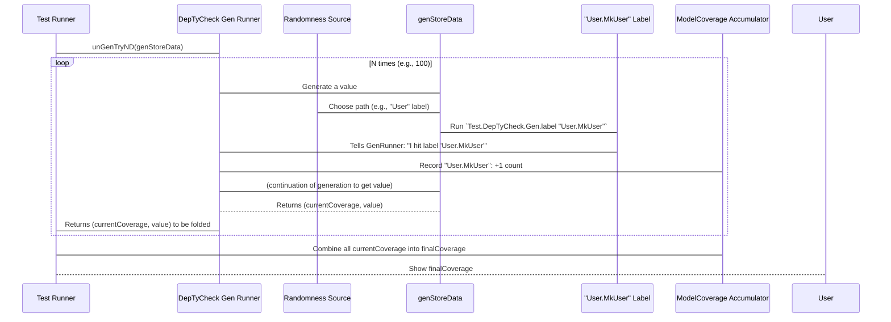

# Chapter 5: ModelCoverage

Welcome back to `DepTyCheck`! In our previous chapter, [CTLabel (Compile-Time Label)](04_ctlabel__compile_time_label__.md), we learned how to tag specific parts of our generators for better introspection and debugging. Now, we're going to put those labels to powerful use with a concept called `ModelCoverage`.

## What is `ModelCoverage` and Why Do We Need It?

Imagine you've built a data model for an online store. It has `User` accounts, `Product` listings, and `Order` objects. To test your online store, you write a property-based test that generates all these types of data.

```idris
-- Simplified example of a generator for our online store data
data StoreData =
    MkUser String String -- Name, Email
  | MkProduct String Nat -- Name, Price
  | MkOrder String (List String) -- CustomerID, List of Product Names

genStoreData : Gen NonEmpty StoreData
genStoreData = oneOf
  [ Test.DepTyCheck.Gen.label "User" (pure $ MkUser "Alice" "alice@example.com")
  , Test.DepTyCheck.Gen.label "Product" (pure $ MkProduct "Book" 10)
  , Test.DepTyCheck.Gen.label "Order" (pure $ MkOrder "AliceID" ["Book", "Pen"])
  ]
```

When you run your tests, `DepTyCheck` generates hundreds or thousands of `StoreData` values. But how do you know if your test is *actually generating* all three types of data – `User`, `Product`, and `Order`? What if, purely by chance or a hidden bias in your `oneOf` weights, `Order`s are never generated? Your tests would miss bugs related to `Order` processing!

This is where `ModelCoverage` shines! `ModelCoverage` is like a **"hit counter"** for your data types and constructors found within your test model. It records how many times specific labels, representing types and constructors, are generated during testing.

It helps you answer crucial questions:
*   Did my fuzzer generate any `User` objects? How many?
*   Did it generate `Product` objects?
*   And `Order` objects?
*   If `User` had different constructors (e.g., `GuestUser` vs. `RegisteredUser`), did it hit both?

By looking at `ModelCoverage`, you can ensure that your property-based tests are sufficiently exercising all parts of your data models. If a part of your model is never "covered," you know you have a blind spot in your testing.

## Using `ModelCoverage` to Understand Your Test Data

To get `ModelCoverage` information, you need to run your generators in a special way that tracks labels. `DepTyCheck` provides functions like `unGenD` or `unGenTryAllD` for this. These functions don't just give you the generated value; they also give you a `ModelCoverage` record.

Let's modify our `genStoreData` example slightly to make it easier to track individual constructors, which `ModelCoverage` is designed to count:

```idris
import Test.DepTyCheck.Gen
import Data.These

-- Updated example of a generator for our online store data
data StoreData =
    MkUser String String -- Name, Email
  | MkProduct String Nat -- Name, Price
  | MkOrder String (List String) -- CustomerID, List of Product Names
  | MkInvalidData -- An extra constructor for error cases

genStoreData : Gen NonEmpty StoreData
genStoreData = oneOf
  [ Test.DepTyCheck.Gen.label "User.MkUser" (pure $ MkUser "Alice" "alice@example.com")
  , Test.DepTyCheck.Gen.label "Product.MkProduct" (pure $ MkProduct "Book" 10)
  , Test.DepTyCheck.Gen.label "Order.MkOrder" (pure $ MkOrder "AliceID" ["Book", "Pen"])
  , Test.DepTyCheck.Gen.label "InvalidData.MkInvalidData" (pure MkInvalidData)
  ]
```

Notice we've made the labels more specific: `"User.MkUser"`, `"Product.MkProduct"` etc. This maps nicely to `ModelCoverage`'s ability to track types and constructors.

Now, how do we get the coverage? We'll use `unGenTryND` which attempts to generate `N` values and gives us a list of `(ModelCoverage, value)` pairs. Later, we'll combine all these `ModelCoverage` records.

```idris
import Test.DepTyCheck.Gen
import Test.DepTyCheck.Gen.Coverage (ModelCoverage, MkModelCoverage, neutral)
import System.Random (mkStdGen, StdGen)
import Data.These
import Data.List (foldl)
import Data.SortedMap (toList)
import Data.Nat (Nat)

-- [Previous code for StoreData and genStoreData would go here]

-- A helper function to generate N values and accumulate ModelCoverage
generateAndCollectCoverage : Nat -> Gen NonEmpty StoreData -> StdGen -> (ModelCoverage, List StoreData)
generateAndCollectCoverage n gen seed =
  let
    generatedResults = Test.DepTyCheck.Gen.unGenTryND n seed gen
    -- generatedResults is a LazyList (ModelCoverage, StoreData)
    -- We want to combine all the ModelCoverage records
    initialCoverage = neutral -- Start with an empty ModelCoverage
    (finalCoverage, generatedValues) = foldl
      (\(accCov, accVals) (currCov, currVal) => (accCov <+> currCov, currVal :: accVals))
      (initialCoverage, [])
      generatedResults
  in
  (finalCoverage, reverse generatedValues)

runCoverageExample : IO ()
runCoverageExample = do
  let mySeed = mkStdGen 42
  let (coverage, values) = generateAndCollectCoverage 100 genStoreData mySeed

  putStrLn "--- Generated Values (first 5) ---"
  mapM_ print (take 5 values)

  putStrLn "\n--- Model Coverage Results ---"
  let coverageMap = toList coverage.unModelCoverage
  if null coverageMap
    then putStrLn "No coverage data collected."
    else mapM_ (\(label, count) => putStrLn $ "  - \{show label}: \{show count} times") coverageMap
```

**Explanation:**
*   `generateAndCollectCoverage`: This function takes a `Nat` `n` (how many values to generate), our generator, and a `StdGen` (for randomness).
*   `Test.DepTyCheck.Gen.unGenTryND n seed gen`: This will run our `genStoreData` `n` times using the provided `seed`. It returns a "lazy list" of `(ModelCoverage, StoreData)` pairs. Each `ModelCoverage` in this list represents the label hit for that *single generation*.
*   `foldl (...) (initialCoverage, []) generatedResults`: We use `foldl` to go through each `(currCov, currVal)` pair.
    *   `accCov <+> currCov`: This is the crucial part! The `<+>` operator for `ModelCoverage` combines two `ModelCoverage` records. If a label exists in both, their counts are added together. If it's only in one, it's included. This sums up all hits for all labels.
    *   `currVal :: accVals`: We also collect the generated values into a list for demonstration.
*   `runCoverageExample`: When you run this, you'll see a few generated `StoreData` values, and then a summary of the `ModelCoverage`.

**Example Output (conceptual):**
```
--- Generated Values (first 5) ---
MkProduct "Book" 10
MkUser "Alice" "alice@example.com"
MkInvalidData
MkOrder "AliceID" ["Book", "Pen"]
MkUser "Alice" "alice@example.com"

--- Model Coverage Results ---
  - "InvalidData.MkInvalidData": 25 times
  - "Order.MkOrder": 24 times
  - "Product.MkProduct": 26 times
  - "User.MkUser": 25 times
```
This output (the counts might vary due to randomness) immediately tells you that all four constructors were generated a roughly equal number of times. This is good! If one of them had `0 times`, you'd know your test wasn't covering that part of your data model.

## How `ModelCoverage` Works Internally

`ModelCoverage` itself is quite simple; it's a map from labels to counts. The magic happens in how `DepTyCheck` collects this data as generators run.

### Non-Code/Code-Light Walkthrough

Here's a simplified sequence of events when `DepTyCheck` collects `ModelCoverage`:



When you wrap a generator with `Test.DepTyCheck.Gen.label "SomeLabel" myGen`, `DepTyCheck` doesn't just attach the label for show. It also modifies the *execution context* of `myGen` so that when `myGen` successfully produces a value, it `tell`s the surrounding machinery (a `Writer` Monad, which we won't go into detail here) about the label that was just "hit."

The `ModelCoverage` record itself (`SortedMap Label Nat`) stores these hits. Every time a label is "told," its count is incremented in the map. The `<+>` operator for `ModelCoverage` knows how to intelligently merge these maps, summing counts for common labels.

### Diving into the Code (`src/Test/DepTyCheck/Gen/Coverage.idr`)

Let's look at the core of `ModelCoverage` from `src/Test/DepTyCheck/Gen/Coverage.idr`:

```idris
-- src/Test/DepTyCheck/Gen/Coverage.idr

||| Raw information of covered labels
public export
record ModelCoverage where
  constructor MkModelCoverage
  unModelCoverage : SortedMap Label Nat

export
Semigroup ModelCoverage where
  (<+>) = MkModelCoverage .: mergeWith (+) `on` unModelCoverage

export
Monoid ModelCoverage where
  neutral = MkModelCoverage empty

MonadWriter ModelCoverage m => CanManageLabels m where
  manageLabel l = tell $ MkModelCoverage $ singleton l 1
```

**Explanation:**

*   `record ModelCoverage ... unModelCoverage : SortedMap Label Nat`: This defines `ModelCoverage` as a wrapper around a `SortedMap`. The map's keys are `Label`s (from [Chapter 4: CTLabel (Compile-Time Label)](04_ctlabel__compile_time_label__.md)), and the values are `Nat` (natural numbers) which store the hit counts. `SortedMap` ensures that the labels are always stored in a consistent order, which is helpful for display and debugging.
*   `Semigroup ModelCoverage where (<+>) = ...`: This is how two `ModelCoverage` records are combined. `mergeWith (+) `on` unModelCoverage` means:
    1.  Get the underlying `SortedMap` from both `ModelCoverage` records.
    2.  Merge them. If a `Label` appears in both maps, add their `Nat` counts. Otherwise, just include the `Label` and its count from whichever map it appeared in.
    3.  Wrap the result back into a `MkModelCoverage`.
*   `Monoid ModelCoverage where neutral = ...`: `neutral` defines the "empty" `ModelCoverage`, which is simply `MkModelCoverage empty` (an empty sorted map). This is our starting point for `foldl` in the example.
*   `MonadWriter ModelCoverage m => CanManageLabels m where manageLabel l = tell $ MkModelCoverage $ singleton l 1`: This is the crucial connection. `CanManageLabels` is an interface that allows something to happen when a label is encountered. `DepTyCheck` implements this using a `MonadWriter` context.
    *   `manageLabel l`: This function is called whenever a generator with `Test.DepTyCheck.Gen.label l ...` is evaluated.
    *   `tell $ MkModelCoverage $ singleton l 1`: This tells the `Writer` monad to "output" a `ModelCoverage` record that contains just this `l`abel with a count of `1`. The `Writer` monad then automatically combines this with any other `ModelCoverage` output using the `Semigroup`'s `<+>` operation we just described. This is how the counts accumulate!

The functions `unGenD`, `unGenD'`, `unGenTryAllD`, `unGenTryAllD'`, and `unGenTryND` are the user-facing wrappers that run a generator *within* this `Writer` monad context, collecting all the `ModelCoverage` outputs and returning them alongside the generated values. `unGenTryND` (which we used) also adds the functionality to generate `N` values and discard failures.

These internal mechanisms ensure that every `Test.DepTyCheck.Gen.label` you add to your generator contributes to the overall `ModelCoverage` statistics, giving you valuable insights into your test suite's effectiveness.

## Conclusion

In this chapter, you've learned about `ModelCoverage`:
*   It's a powerful tool to understand which parts of your data model (types and constructors, indicated by [CTLabel (Compile-Time Label)](04_ctlabel__compile_time_label__.md)s) are being exercised by your property-based tests.
*   You collect `ModelCoverage` by running generators with functions like `unGenTryND` and then combining the individual `ModelCoverage` records using the `<+>` operator.
*   Internally, `ModelCoverage` uses a `SortedMap` to store label counts and leverages Idris's `Semigroup`, `Monoid`, and `MonadWriter` type classes to efficiently accumulate coverage statistics.

This insight into your model's coverage allows you to build more robust and comprehensive test suites, exposing areas where your generators might be falling short.

Next, we'll dive into [DerivationClosure](06_derivationclosure_.md), which is about understanding the dependencies between types when `DepTyCheck` automatically derives generators for them.

---

Generated by [AI Codebase Knowledge Builder](https://github.com/The-Pocket/Tutorial-Codebase-Knowledge)