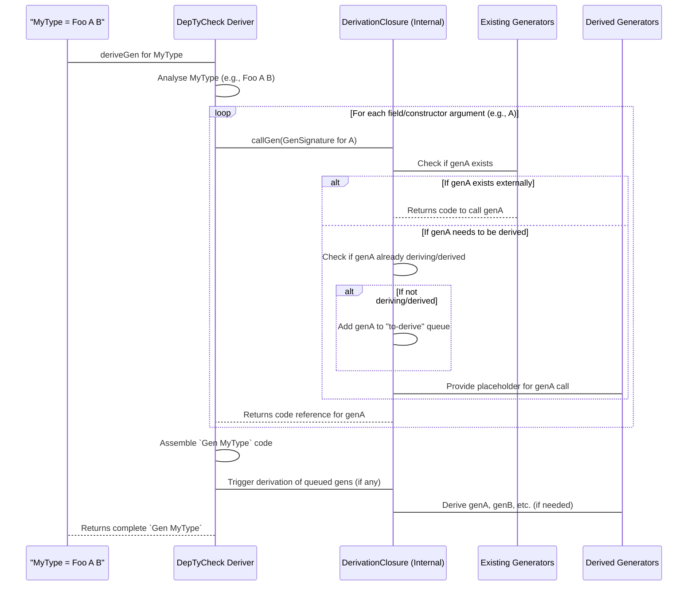

# Chapter 6: DerivationClosure

Welcome back to `DepTyCheck`! In our [previous chapter](05_modelcoverage.md), we explored `ModelCoverage`, which helps us understand how thoroughly our generators hit different parts of our data model. Now, we're moving to a more behind-the-scenes, yet incredibly powerful, concept: `DerivationClosure`.

This chapter will introduce you to `DerivationClosure`, an interface that's crucial for how `DepTyCheck` automatically creates (or "derives") generators for complex types. Think of it as the project manager that knows how to build everything needed for a big software project, even if it has many interconnected parts and dependencies.

## The Big Problem: Deriving Generators for Interconnected Types

Imagine you have two data types: `User` and `Post`. A `User` can write many `Post`s.

```idris
record User where
  id   : Nat
  name : String

record Post where
  id     : Nat
  author : User -- A Post needs a User as its author!
  title  : String
```

Now, you want `DepTyCheck` to automatically derive a generator for `Post`. What happens when `DepTyCheck` tries to build `genPost`?

1.  It knows how to generate `Nat` (for `id`).
2.  It knows how to generate `String` (for `title`).
3.  But then it hits `author : User`. To generate a `Post`, it *first needs to generate a `User`*!

This is a dependency! `genPost` depends on `genUser`. If `DepTyCheck` just tries to generate `genPost` in isolation, it will get stuck when it reaches `author`.

The `DerivationClosure` interface is the mechanism that allows `DepTyCheck` to solve this! It’s like a smart build system: when it needs to compile `Post`, it first checks if `User` needs to be compiled. If so, it compiles `User` first, then links `User` into `Post`, and finally compiles `Post`.

The central use case for `DerivationClosure` is to **recursively discover and build all necessary sub-generators** for a given type, whether those sub-generators are automatically derived or provided by you.

## Key Concepts of `DerivationClosure`

The `DerivationClosure` interface itself is quite abstract, so let's break down its responsibilities into simple terms. It has two main jobs:

1.  **`needWeightFun`**: Asking for a "weighting function" for a type.
2.  **`callGen`**: Calling another generator.

Let's look at them one by one.

### 1. `needWeightFun`: Understanding Constructor Probabilities

When `DepTyCheck` derives a generator for a `data` type (which can have multiple constructors), it needs to know how often to pick each constructor. For example, a `List` can be `Nil` (empty) or `(::)` (a value added to a list). How often should `genList` generate `Nil` versus a non-empty list?

This is determined by a "weighting function" (or "model") for the type. `DerivationClosure`'s `needWeightFun` method is invoked whenever `DepTyCheck` determines that a specific type's weighting function is needed. This function's job is to ensure that `DepTyCheck` can figure out the probabilities for picking different constructors of a type.

**Why is this a `DerivationClosure` responsibility?** Because the process of deriving a `Gen` can also require deriving a weighting function! A recursive dependency loop might occur. `DerivationClosure` helps manage this.

In simple terms: *`needWeightFun` says, "Hey, `DerivationClosure`, I need to know how to pick constructors for this type. Can you make sure that information is available?"*

### 2. `callGen`: Invoking Other Generators

This is the core of `DerivationClosure`. When `DepTyCheck` is deriving a generator for `Post` and encounters `author : User`, it needs to find and call `genUser`. This is where `callGen` comes in.

`callGen` takes a `GenSignature` (which describes *what kind* of generator is needed, e.g., "a generator for `User` that takes no arguments and has a `NonEmpty` guarantee") and then provides the code to call that generator.

**`GenSignature` (Quick Recap from Code Context):**
A `GenSignature` (from `Deriving.DepTyCheck.Gen.Signature`) is like a blueprint for a generator. It describes:
*   The type it generates (`User`, `Nat`, `String`, etc.).
*   Any arguments the generator needs (e.g., `genFin N` needs `N`).
*   The `Emptiness` guarantee ([Chapter 3: Emptiness](03_emptiness.md)).

In simple terms: *`callGen` says, "Hey, `DerivationClosure`, I need a generator that matches this blueprint. Can you either find an existing one or derive a new one, and then give me the code to call it?"*

## Solving Our Use Case with `DerivationClosure`

Let's revisit our `User` and `Post` example.

```idris
module MyProject

import Test.DepTyCheck.Gen
import Deriving.DepTyCheck.Gen

record User where
  id   : Nat
  name : String

record Post where
  id     : Nat
  author : User
  title  : String

-- We want to derive genPost
-- genPost : Fuel -> Gen NonEmpty Post
-- genPost = deriveGen
```

When `DepTyCheck` encounters `genPost = deriveGen`:

1.  **Analyze `Post`**: `DepTyCheck` starts analyzing the `Post` record. It sees the fields `id` (`Nat`), `author` (`User`), and `title` (`String`).
2.  **Dependencies**:
    *   For `id`: It knows how to generate `Nat`.
    *   For `title`: It knows how to generate `String`.
    *   For `author : User`: It registers a new task with `DerivationClosure`: "I need a generator for `User`!"
3.  **Recursive Derivation for `User`**: `DerivationClosure` sees this new task. If `genUser` hasn't been derived or provided yet, it recursively starts the derivation process for `User`:
    *   It analyzes `User`. It sees `id : Nat` and `name : String`.
    *   It knows how to generate `Nat` and `String`. No further complex dependencies.
    *   So, it successfully derives `genUser`.
4.  **Returning `genUser`**: Once `genUser` is ready, `DerivationClosure` provides the necessary code to `genPost` to call `genUser`.
5.  **Finalizing `genPost`**: With `genUser` now available, `genPost` can be fully constructed.

This entire process of detecting dependencies, potentially deriving sub-generators, and providing calls to them is orchestrated by the `DerivationClosure` interface. It manages a "closure" of all necessary generators.

### Code Example (Conceptual)

You don't *directly* implement `DerivationClosure` in your application code. Instead, you use the `deriveGen` macro, and `DepTyCheck` *uses* its internal `DerivationClosure` implementation to make `deriveGen` work.

Consider the generated code logic (this isn't actual generated code, but shows the concept):

```idris
-- This is what `deriveGen` for Post *conceptually* generates:
genPost : Fuel -> Gen MaybeEmpty Post
genPost fuel = do
  -- Call the Nat generator (base case)
  i    : Nat    <- genNat fuel
  -- **This is where DerivationClosure shines!**
  -- It automatically figures out it needs genUser, and calls it.
  user : User   <- callGen (GenSignature {type=User, params=[], ...}) fuel
  t    : String <- genString fuel
  pure $ MkPost i user t
```
The `callGen (GenSignature {type=User, ...}) fuel` is what `DepTyCheck` builds using the `DerivationClosure` logic. It automatically inserts the call to the appropriate generator for `User`.

## How `DerivationClosure` Works Internally

The `DerivationClosure` interface is implemented by `DepTyCheck` internally. It typically runs within a complex monad stack that includes `Reader`, `State`, and `Writer` monads to keep track of:
*   **Already derived generators**: A map of `GenSignature` to `Name` (the name of the generated Idris function for that generator) so it doesn't re-derive them.
*   **Queued generators to derive**: A list of `GenSignature`s that have been discovered as dependencies but haven't been fully derived yet.
*   **External generators**: Generators that you or other libraries have defined explicitly.

When `callGen` is invoked:

1.  It first checks if an *external* generator matching the requested `GenSignature` already exists (e.g., `Tests.Gen.User.genUser`). If so, it returns a `TTImp` (Idris's internal representation of code) to call that external generator.
2.  If no external generator is found, it checks if an *internal* generator for that `GenSignature` has already been derived or is currently in the process of being derived. If so, it returns an `TTImp` to call that (or schedules its derivation if it's new).
3.  If it's a completely new, internal dependency, it adds it to the "queue" of generators to be derived later and returns its placeholder name.

This queuing and memoization (remembering what's already done) system is what prevents infinite loops in recursive types and ensures efficiency. The "Closure" part of `DerivationClosure` refers to this collection of all generators (derived or external) that are needed to fulfill the main derivation request.

### `DerivationClosure` Internal Flow Diagram



### Diving into the Code (`src/Deriving/DepTyCheck/Gen/ForAllNeededTypes/Interface.idr` and `Impl.idr`)

The interface `DerivationClosure` is defined in `Interface.idr`:

```idris
-- src/Deriving/DepTyCheck/Gen/ForAllNeededTypes/Interface.idr

public export
interface Elaboration m => NamesInfoInTypes => ConsRecs => DerivationClosure m where
  needWeightFun : TypeInfo -> m ()
  callGen : (sig : GenSignature) -> (fuel : TTImp) -> Vect sig.givenParams.size TTImp -> m (TTImp, Maybe (gend ** Vect gend $ Fin gend))
  -- ... (type signature details) ...
```

**Explanation:**
*   `interface Elaboration m => ... => DerivationClosure m`: This indicates that `DerivationClosure` is an interface that works within an `Elaboration` monad (Idris's compile-time environment).
*   `needWeightFun : TypeInfo -> m ()`: As discussed, this is how `DepTyCheck` asks for information about constructor probabilities for `TypeInfo` (which holds details about a type, like its constructors). The `m ()` means it performs some action and returns nothing directly.
*   `callGen : (sig : GenSignature) -> (fuel : TTImp) -> ... -> m (TTImp, Maybe ...)`: This is the core function.
    *   `sig : GenSignature`: The blueprint for the generator needed.
    *   `fuel : TTImp`: A reference to the `Fuel` argument required by the generator. (We haven't covered `Fuel` yet, but it's important for preventing infinite loops in generation).
    *   `Vect ... TTImp`: Arguments to pass to the generator.
    *   `m (TTImp, Maybe ...)`: It returns a `TTImp` (the code to call the generator) and some optional metadata about permutations of generated arguments.

The actual implementation of `DerivationClosure` lives in `src/Deriving/DepTyCheck/Gen/ForAllNeededTypes/Impl.idr`. It's complex because it handles all the state management (queues, maps of derived generators, etc.) using `Reader`, `State`, and `Writer` monads. This code is responsible for making the `callGen` and `needWeightFun` functions work as described in the internal flow diagram above.

## Conclusion

`DerivationClosure` is a sophisticated, behind-the-scenes mechanism that enables `DepTyCheck` to automatically derive generators for complex, interconnected types.

You've learned:
*   `DerivationClosure` acts as a central manager for all test data generation logic, much like a build system.
*   It handles dependencies by recursively discovering and building sub-generators.
*   Its `needWeightFun` method ensures information about constructor probabilities is available.
*   Its `callGen` method provides the logic to find, derive, and call any necessary sub-generators.
*   This process uses internal state management to prevent re-derivation and handle recursive dependencies efficiently.

Understanding `DerivationClosure` helps you appreciate the intelligence behind `DepTyCheck`'s powerful `deriveGen` macro, which simplifies the creation of property-based tests for even the most intricate data structures.

Next, we'll dive into [GenSignature](07_gensignature.md), which is the "blueprint" we mentioned that `callGen` uses to specify exactly what kind of generator is needed.

---

Generated by [AI Codebase Knowledge Builder](https://github.com/The-Pocket/Tutorial-Codebase-Knowledge)