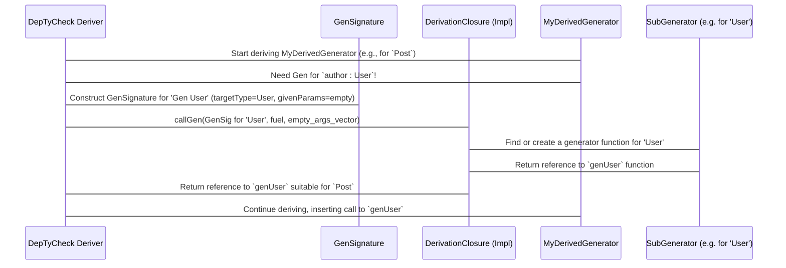

# Chapter 7: GenSignature

Welcome back to `DepTyCheck`! In our [previous chapter](06_derivationclosure.md), we explored `DerivationClosure`, the powerful manager that handles all the dependencies when `DepTyCheck` automatically derives generators. We briefly mentioned that `DerivationClosure` uses something called `GenSignature`.

This chapter is all about demystifying `GenSignature`. Think of `GenSignature` as a **formal contract or blueprint** for a generator function. It precisely describes *what* a generator is supposed to do, *what type* it generates, and *what inputs* it needs.

## The Problem: How Do We Ask for a Specific Generator?

Imagine `DepTyCheck` is trying to derive a generator for a `Post` (from [Chapter 6: DerivationClosure](06_derivationclosure.md)):

```idris
record Post where
  id     : Nat
  author : User
  title  : String
```

When it gets to `author : User`, it needs to ask `DerivationClosure`, "Hey, I need a generator for `User`!" But what exactly does "generator for `User`" mean?

*   Does it take any arguments? (`genUser` vs. `genUserByAge 30`)
*   What is its `Emptiness` guarantee ([Chapter 3: Emptiness](03_emptiness.md))? (`Gen NonEmpty User` vs. `Gen MaybeEmpty User`)
*   What if `User` itself is a parameterized type, like `User age`? (`genUser 30` vs. `genUser 40`)

Without a precise way to describe what generator is needed, `DepTyCheck` would get confused. `GenSignature` solves this problem by providing a standard, unambiguous way to ask for (or describe) a generator.

## What is a `GenSignature`? The Blueprint for Generators

A `GenSignature` is like ordering a custom-made tool. You don't just say "I need a drill." You say, "I need a drill, model X, with a Y-inch bit, and it needs to be corded."

For a generator, its "signature" is made up of a few key pieces of information:

1.  **`targetType`**: The main type that this generator will produce (e.g., `User`, `Nat`). This is the "product" of the generator.
2.  **`givenParams`**: Which of the `targetType`'s arguments are "given by the user" (meaning they are passed into the generator function).
3.  **`generatedParams`**: Which of the `targetType`'s arguments are "generated by DepTyCheck."

Let's illustrate with an example using a hypothetical `Pair` type:

```idris
data Pair (a : Type) (b : Type) where
  MkPair : a -> b -> Pair a b
```

If we want `DepTyCheck` to derive a generator `genPair` like this:

```idris
genPair : Fuel -> Gen NonEmpty (Pair Nat String)
genPair fuel = -- derived by DepTyCheck
```

The `GenSignature` for `genPair` would conceptually look something like this:

*   **`targetType`**: `Pair Nat String` (it generates a `Pair` where the `a` is `Nat` and `b` is `String`).
*   **`givenParams`**: Empty! The user isn't providing `Nat` or `String` as inputs to `genPair`. `DepTyCheck` will generate both.
*   **`generatedParams`**: `Nat` (for `a`) and `String` (for `b`).

Now, what if we wanted to generate a `Pair` where the *first element `a` is given by the user*, and only `b` is generated?

```idris
genSpecialPair : Fuel -> (num : Nat) -> Gen NonEmpty (Pair num String)
genSpecialPair fuel num = -- derived by DepTyCheck
```

The `GenSignature` for `genSpecialPair` would be different:

*   **`targetType`**: `Pair num String` (where `num` is the `Nat` given by the user).
*   **`givenParams`**: Contains the `num` argument.
*   **`generatedParams`**: Contains `String`.

This distinction is crucial for `DepTyCheck` to create the correct function signature and body.

## `GenSignature` in Action: The `callGen` Method

Remember `callGen` from `DerivationClosure`? Its job is to provide the code for a dependent generator. It takes a `GenSignature` as its first argument!

`callGen : (sig : GenSignature) -> (fuel : TTImp) -> Vect sig.givenParams.size TTImp -> m (TTImp, Maybe (gend ** Vect gend $ Fin gend))`

**Explanation:**
*   `sig : GenSignature`: This is the blueprint. `DepTyCheck` tells `DerivationClosure` *exactly* what kind of generator it needs using this `GenSignature`.
*   `fuel : TTImp`: An expression representing the `Fuel` for the generator.
*   `Vect sig.givenParams.size TTImp`: A vector of `TTImp` (Idris's code representation) for each of the "given parameters" defined in the `GenSignature`.

When `DepTyCheck` wants a `Gen User` for the `author` field in `Post`, it constructs a `GenSignature` describing `Gen User` (most likely with no "given params") and passes it to `callGen`. `callGen` then uses this blueprint to find or create the right `genUser` function.

## Internal Structure of `GenSignature`

Let's look at the actual definition of `GenSignature` in `src/Deriving/DepTyCheck/Gen/Signature.idr`.

```idris
-- src/Deriving/DepTyCheck/Gen/Signature.idr

public export
record GenSignature where
  constructor MkGenSignature
  targetType : TypeInfo
  {auto 0 targetTypeCorrect : AllTyArgsNamed targetType}
  givenParams : SortedSet $ Fin targetType.args.length

namespace GenSignature

  export
  characteristics : GenSignature -> (String, List Nat)
  characteristics $ MkGenSignature ty giv = (show ty.name, toNatList giv)

  export
  showGivens : GenSignature -> String
  showGivens sig = joinBy ", " $ do
    let uName : Arg -> Maybe UserName
        uName $ MkArg {name=Just $ UN un, _} = Just un
        uName _ = Nothing
    sig.givenParams.asList <&> \idx => maybe (show idx) (\n => "\{show idx}(\{show n})") $ uName $ index' sig.targetType.args idx

public export %inline
(.generatedParams) : (sig : GenSignature) -> SortedSet $ Fin sig.targetType.args.length
sig.generatedParams = fromList (allFins sig.targetType.args.length) `difference` sig.givenParams
```

**Explanation:**

*   `record GenSignature ... constructor MkGenSignature`: This is how a `GenSignature` is built.
*   `targetType : TypeInfo`: This holds detailed information about the target type, including its name and its list of arguments. (`TypeInfo` is a powerful internal structure that describes data types to `DepTyCheck`).
*   `givenParams : SortedSet $ Fin targetType.args.length`: This is a `SortedSet` containing `Fin` indices. Each `Fin` index corresponds to a specific argument of the `targetType`. If a `Fin` index is in this `SortedSet`, it means that corresponding argument is "given by the user" to the generator. If an index is *not* in `givenParams`, it means `DepTyCheck` should generate that argument.
    *   For `Pair a b`, `a` might be at index `0` and `b` at index `1`.
    *   If `givenParams` is `fromList [0]`, it means `a` is given, `b` is generated.
    *   If `givenParams` is `fromList []`, it means both `a` and `b` are generated.
*   The `characteristics` and `showGivens` functions are helpers to represent and compare `GenSignature`s.
*   `(.generatedParams)`: This is a computed field that simply gives you the complement of `givenParams`. It lists all the arguments of `targetType` that are *not* explicitly given, and thus need to be generated.

### `GenSignature` Flow Diagram



This diagram shows how the `GenSignature` acts as the critical piece of information passed between the `DepTyCheck` deriver and the `DerivationClosure` to ensure the correct generator is obtained.

## Why Do `givenParams` and `generatedParams` Matter?

These parameters are crucial for creating generators for dependent types. Consider `Vect n a` (a list of `a`s of length `n`):

*   If you need `genVect : Fuel -> (n : Nat) -> Gen NonEmpty (Vect n Int)`:
    *   The `GenSignature` would have `targetType = Vect n Int`.
    *   `givenParams` would include the index for `n`.
    *   `generatedParams` would include the index for `Int` (the element type).
    *   The generated function would have `n` as an argument.

*   If you need `genAnyVect : Fuel -> Gen NonEmpty (n ** Vect n Int)`:
    *   The `GenSignature` would have `targetType = (n**Vect n Int)`.
    *   `givenParams` would be empty.
    *   `generatedParams` would include both `n` and `Int`.
    *   The generated function would have no arguments other than `Fuel`.

`DepTyCheck` uses the `GenSignature` to infer the correct types and arguments for all the `Gen` functions it needs to derive, making the whole automatic derivation process possible for even complex dependent types.

## Conclusion

In this chapter, you've learned about `GenSignature`:
*   It's a blueprint that precisely describes a generator function's target type and its "given" versus "generated" type arguments.
*   It's fundamental for `DepTyCheck` to correctly identify and `callGen` dependent generators during automatic derivation.
*   Internally, `GenSignature` uses `TypeInfo` and `SortedSet` of `Fin` indices to specify which arguments are caller-provided.

This clear "contract" is what allows `DepTyCheck` to intelligently compose complex generator logic from simpler parts, especially relevant when dealing with the intricacies of dependent types.

Next, we'll delve into [ConsRecs (Constructors Recursiveness)](08_consrecs__constructors_recursiveness__.md), which helps `DepTyCheck` understand recursive data structures and generate appropriate values without infinite loops.

---

Generated by [AI Codebase Knowledge Builder](https://github.com/The-Pocket/Tutorial-Codebase-Knowledge)