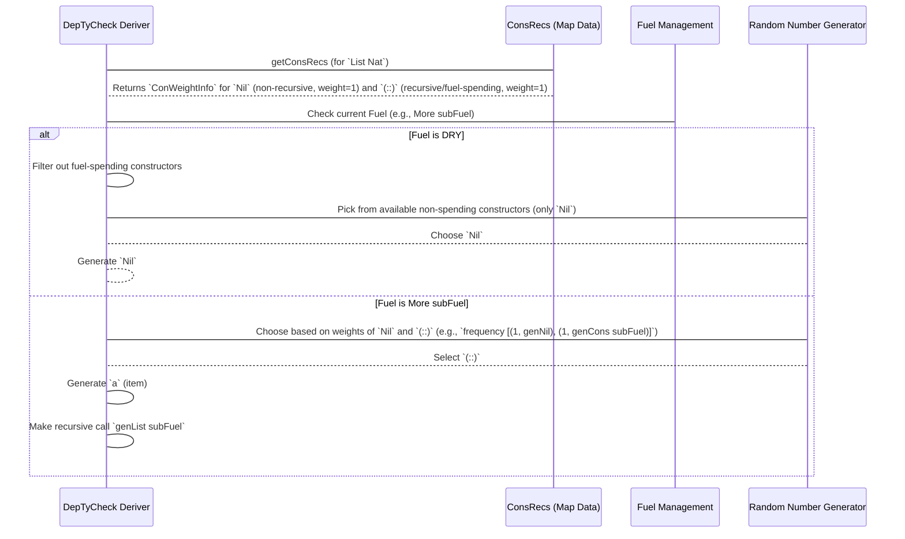

# Chapter 8: ConsRecs (Constructors Recursiveness)

Welcome back to `DepTyCheck`! In our [previous chapter](07_gensignature.md), we explored `GenSignature`, the "blueprint" that precisely describes the generators `DepTyCheck` needs to build. Now, we're diving into `ConsRecs`, a crucial concept that helps `DepTyCheck` handle a very common and tricky situation: **recursive data types**.

## The Problem: Generating Recursive Data Without Infinite Loops

Imagine you want to generate a `List` of items. A `List` is a classic example of a recursive data type:

```idris
data List a where
  Nil  : List a
  (::) : a -> List a -> List a
```

To create a `List`, you can either have `Nil` (an empty list) or `(x :: xs)` (an item `x` followed by another `List xs`).

If `DepTyCheck` tries to randomly build a `List` by just picking `(::)` all the time, it would create an infinitely long list! It would never stop, because `(::)` calls `List` again, which calls `(::)` again, and so on. This is an infinite recursion.

We need a way to tell the generator:
1.  **When to stop recursing:** At some point, you *must* choose `Nil` to finish the list.
2.  **How often to recurse:** Should short lists be more common? Or long ones?
3.  **How to handle "structurally decreasing" arguments:** Sometimes, a recursive call is guaranteed to be "smaller" in some sense, which can help prevent infinite loops (e.g., generating a `Fin n` from a `Fin (S n)`).

This is where `ConsRecs` (Constructors Recursiveness) comes in! `ConsRecs` is a data structure that stores information about the recursive nature and weighting of constructors for a given type. It helps determine how much "fuel" (recursion depth limit) a recursive constructor should consume and how probabilities should be adjusted. It's like a blueprint that dictates how deeply and frequently different parts of a data structure should be generated.

## `ConsRecs` in Simple Terms: Managing Recursion "Fuel"

Think of `ConsRecs` as a smart manager for your recursive data structures. It keeps track of two main things for each constructor:

1.  **Its "Weight"**: How likely is this constructor to be chosen compared to others?
2.  **Its "Recursiveness"**: Does choosing this constructor lead to another recursive call to the same type? If so, `ConsRecs` can associate it with "fuel spending" or "structurally decreasing" properties.

Let's simplify our `List` example motivation. When `DepTyCheck` wants to generate a `List`, `ConsRecs` tells it:

*   For `Nil`: This constructor is non-recursive. It's a "base case" that doesn't need to spend fuel.
*   For `(::)`: This constructor is recursive. Choosing it means you'll eventually need to generate *another* `List`. So, this constructor should "spend some fuel." If there's no fuel left, don't pick this one!

`DepTyCheck` manages this "fuel" (often represented as a `Fuel` type, which is just `More Fuel` or `Dry`) to decide when to stop. When the `Fuel` runs `Dry`, only non-recursive constructors (like `Nil`) are allowed.

## Key Concepts of `ConsRecs`

`ConsRecs` focuses on `ConWeightInfo` for each `Con` (constructor) of a type.

### 1. `ConWeightInfo`: How Much "Weight" Does a Constructor Carry?

Every constructor, whether recursive or not, has a `ConWeightInfo`. This tells `DepTyCheck` two things:

*   **Its base probability (weight)**: How likely it is to be chosen.
*   **Its recursion behavior**: Does it spend "fuel," or is it "structurally decreasing"?

Let's look at a simplified version of `ConWeightInfo`:

```idris
-- Simplified for illustration
record ConWeightInfo where
  constructor MkConWeightInfo
  -- Either a constant 'Nat1' for non-recursive constructors,
  -- or a RecWeightInfo for recursive ones.
  weight : Either Nat1 RecWeightInfo

-- Simplified for illustration
data RecWeightInfo : Type where
  -- This constructor spends 'Fuel' (like a recursive call to a list's tail)
  SpendingFuel : RecWeightInfo
  -- This constructor uses a 'structurally decreasing' argument
  -- (like generating Fin n from Fin (S n))
  StructurallyDecreasing : RecWeightInfo
```

**Explanation:**

*   `Left Nat1`: For non-recursive constructors (like `Nil`), the `weight` is just a fixed number (`Nat1` means a Natural number greater than 0).
*   `Right RecWeightInfo`: For recursive constructors (like `(::)`), `DepTyCheck` also needs to know *how* it recurses.
    *   `SpendingFuel`: This is the default for most recursive structures like `List`. If you pick `(::)`, `DepTyCheck` will decrement the `Fuel` counter.
    *   `StructurallyDecreasing`: This is for more advanced cases where a type's argument strictly becomes "smaller". If such an argument exists, `DepTyCheck` might not need to spend `Fuel` in the usual way, as the type system itself guarantees termination.

### 2. `unConsRecs`: The Map of Constructor Information

The actual `ConsRecs` data structure is a map that holds these `ConWeightInfo` records for all constructors of a type, organized by their `GenSignature` (which includes the type name and its given parameters).

```idris
-- Simplified for illustration (the actual one is more complex!)
record ConsRecs where
  constructor MkConsRecs
  conWeights : SortedMap Name $ (givenTyArgs : SortedSet Nat) -> List (Con, ConWeightInfo)
```

**Explanation:**
*   `conWeights`: This is a `SortedMap` that, for each `Name` (of a type), store a function. This function takes a `SortedSet` of `Nat` (representing which type arguments are "given"), and returns a list of `(Con, ConWeightInfo)` pairs. This allows `ConsRecs` to store information not just about a type, but also about how its constructors behave *depending on its type arguments*.

This `ConsRecs` map is then consulted by `DepTyCheck` during code generation for a type to decide:
*   Which constructors to consider (`Nil` vs. `(::)`).
*   What weights to apply to them.
*   How to handle `Fuel` based on `SpendingFuel` or `StructurallyDecreasing` information.

## How `ConsRecs` is Used: Fuel and Probability

Let's trace the generation of a `List` to see `ConsRecs` in action conceptually:

```idris
genList : Fuel -> Gen NonEmpty (List Nat)
genList fuel = -- derived by DepTyCheck
```

1.  **`DepTyCheck` needs `genList`**: It looks up `List` in its internal `ConsRecs`.
2.  **It finds `Nil` and `(::)`**:
    *   `Nil` has `ConWeightInfo { Left (weight=X) }` (e.g., X=1). It's always an option.
    *   `(::)` has `ConWeightInfo { Right SpendingFuel (weight=Y) }` (e.g., Y=1). If chosen, it will use `More subFuel`.
3.  **Fuel Check**:
    *   **If `fuel` is `Dry`**: `DepTyCheck` only allows constructors that don't spend fuel. So, it *only* considers `Nil`. It means it will always pick `Nil`.
    *   **If `fuel` is `More subFuel`**: `DepTyCheck` considers both `Nil` and `(::)`. It uses their weights (X and Y) to randomly decide.
        *   If `Nil` is chosen: `pure Nil` is generated. Done.
        *   If `(::)` is chosen: It first generates `a` (e.g., a `Nat`), then it makes a recursive call: `genList subFuel`. The `subFuel` ensures that the recursion eventually stops.

This mechanism ensures that your generated recursive types terminate and that you can control the statistical distribution of different list lengths. `DepTyCheck` will try to make shorter lists more probable by default when `Fuel` is higher.

### `ConsRecs` Internal Flow Diagram



The diagram shows how `DepTyCheck` (the `Deriver`) uses the information from `ConsRecsInfo` and the current `Fuel` to decide which constructors are allowed and how to randomly choose among them. The `fuelSpending` behavior of `(::)` is what leads to the recursive call with `subFuel`.

## Diving into the Code (`src/Deriving/DepTyCheck/Gen/ConsRecs.idr`)

Let's look at the actual code for `ConsRecs` and `ConWeightInfo` more closely.

```idris
-- src/Deriving/DepTyCheck/Gen/ConsRecs.idr

public export
data RecWeightInfo : Type where
  SpendingFuel : ((leftFuelVarName : Name) -> TTImp) -> RecWeightInfo
  StructurallyDecreasing : (decrTy : TypeInfo) -> (wExpr : TTImp) -> RecWeightInfo

public export
record ConWeightInfo where
  constructor MkConWeightInfo
  weight : Either Nat1 RecWeightInfo
```

**Explanation of `RecWeightInfo`:**
*   `SpendingFuel : ((leftFuelVarName : Name) -> TTImp) -> RecWeightInfo`: This means a `SpendingFuel` constructor comes with a *function* that, given the name of the `fuel` variable, returns `TTImp` (Idris's compile-time code representation) for how to calculate its weight. By default, this weight depends on the `Fuel` value itself, often reflecting that fewer recursive calls lead to higher probability.
    *   The `((leftFuelVarName : Name) -> TTImp)` parameter is basically saying, "Here's a piece of code that will compute the weight for this constructor (e.g., `succ (leftDepth fuel)`) using the current fuel variable."
*   `StructurallyDecreasing : (decrTy : TypeInfo) -> (wExpr : TTImp) -> RecWeightInfo`: This is for constructors where one of the arguments is structurally smaller than the outer type.
    *   `decrTy : TypeInfo`: The type of the argument that causes the structural decrease.
    *   `wExpr : TTImp`: A `TTImp` expression representing the weight for this constructor, derived from the specific structural decrease.

**Explanation of `getConsRecs` function:**
The core function `getConsRecs` is where `DepTyCheck` analyzes the types to build the `ConsRecs` record.

```idris
-- Example snippet from `getConsRecs` showing how recursion is detected
-- (Simplified and annotated heavily)

export
getConsRecs : Elaboration m => NamesInfoInTypes => m ConsRecs
getConsRecs = do
  consRecs <- for knownTypes $ \targetType => do
    -- For each constructor of the targetType
    crsForTy <- for targetType.cons $ \con => do
      -- Check if this constructor is recursive related to its `targetType`
      isRec : Bool <- isRecursive {containingType=Just targetType} con

      -- Based on `isRec`, determine `ConWeightInfo`
      w : Either Nat1 (TTImp -> TTImp, SortedSet $ Fin con.args.length) <-
        if not isRec -- If not recursive (e.g., `Nil`)
          then pure $ Left one -- Constant weight of 1
          else do              -- If recursive (e.g., `(::)`)
            -- Default behavior: this constructor will spend fuel
            pure $ Right (id, empty) -- 'id' implies default fuel spending, 'empty' means no structurally decreasing args

      pure (con ** w)
    pure (Nothing, crsForTy) -- (simplified return type)
  -- ... more complex logic to combine and build the final ConsRecs
  -- and deriveWeightingFun
  pure $ MkConsRecs finalConsRecs deriveW
```

**Explanation:**
*   `isRecursive {containingType=Just targetType} con`: This is a crucial internal helper function that determines if `con` (a constructor) directly or indirectly makes a call back to `targetType` (the type being constructed) as one of its arguments.
    *   For `(::) : a -> List a -> List a`, `isRecursive` will detect that `List a` appears again, so it's `True`.
    *   For `Nil : List a`, `isRecursive` will be `False`.
*   The `if/else` block then uses this `isRec` boolean to decide whether the `weight` for this constructor should be a simple `Left Nat1` (non-recursive) or a `Right RecWeightInfo` (recursive).
*   `Right (fuelWeightExpr, directlyRecArgs)`: For recursive constructors, `DepTyCheck` prepares the `RecWeightInfo`. By default `fuelWeightExpr` is `id` (meaning it will perform default fuel spending), and `directlyRecArgs` tracks if any arguments are direct recursive calls that could be structurally decreasing.

The `getConsRecs` function ultimately builds a `ConsRecs` record that maps `GenSignature`s to their lists of `(Con, ConWeightInfo)` pairs. This map is then consulted by the derivation logic when generating the actual code for `genList` (or any other recursive type).

## Conclusion

`ConsRecs` is a fundamental data structure within `DepTyCheck` that addresses the challenges of generating recursive data types correctly and efficiently.

You've learned:
*   `ConsRecs` helps prevent infinite recursion by managing "fuel" and tracking the recursive nature of constructors.
*   It contains `ConWeightInfo` for each constructor, dictating its base probability and its recursion behavior (`SpendingFuel` or `StructurallyDecreasing`).
*   `DepTyCheck` intelligently uses `ConsRecs` information and the current `Fuel` level to build terminating and statistically sound generators for recursive types like `List`.

This powerful abstraction ensures that `DepTyCheck` can derive robust generators even for complex and self-referential data structures.

Next, we'll look at [DeepConsAnalysisRes](09_deepconsanalysisres_.md), which is related to `ConsRecs` but focuses on a deeper analysis to understand recursive arguments.

---

Generated by [AI Codebase Knowledge Builder](https://github.com/The-Pocket/Tutorial-Codebase-Knowledge)