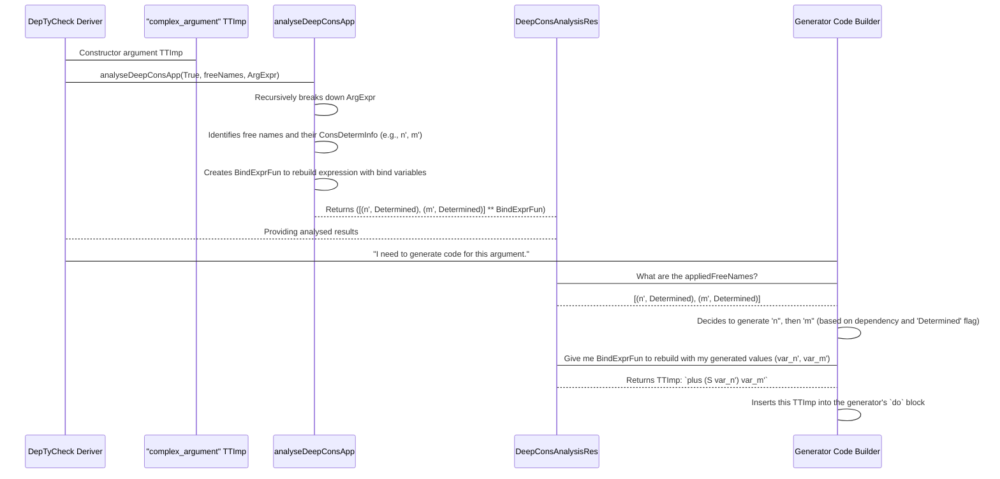

# Chapter 9: DeepConsAnalysisRes

Welcome back to `DepTyCheck`! In our [previous chapter](08_consrecs__constructors_recursiveness__.md), we explored `ConsRecs`, which helps `DepTyCheck` manage the "fuel" for generating recursive data types. Now, we're going to dive into a concept called `DeepConsAnalysisRes`.

While `ConsRecs` focuses on how *often* a constructor is chosen within a recursive structure, `DeepConsAnalysisRes` goes deeper. It's like a special magnifying glass that `DepTyCheck` uses to **inspect constructor applications (how you use a constructor)** and figure out exactly which variables are being used inside them, and importantly, which of these variables are "determining" factors for the final type.

## The Problem: Understanding Complex Type Argument Expressions

Imagine you have a type like `Vect 3 (Fin 3)`. This is a vector of three elements, where each element is a number less than three. Now, consider a constructor application that might produce such a type.

Let's say `DepTyCheck` is trying to derive a generator, and it encounters a part of your type definition that looks like this (simplified):

```idris
-- Simplified illustration
MkFoo (some_complicated_expr)
```

Where `some_complicated_expr` is not just a simple variable, but something like `plus (S n') m'`. `DepTyCheck` needs to understand:
1.  **What free variables are used in `some_complicated_expr`?** (e.g., `n'`, `m'`)
2.  **How are these variables actually bound or produced?** Are they provided as arguments to the current generator, or do they need to be generated internally?
3.  **Are these variables *determining* the final type?** For example, in `Vect n a`, the `n` *determines* the length. If `n` was part of a complex expression, identifying it is key.

This analysis is critical for `DepTyCheck` to:
*   **Generate arguments in the correct order:** If `m'` depends on `n'`, `n'` must be generated first.
*   **Maintain type properties:** Ensure that the generated arguments correctly satisfy the type constraints (like `Fin 3` requiring numbers less than 3).
*   **Optimize argument generation:** Avoid re-calculating or re-generating values that are already provided or determined.

`DeepConsAnalysisRes` is the *structured result* of this deep analysis. It tells `DepTyCheck` exactly which "free variables" (variables not yet bound in the current scope) are found within a constructor's arguments, and how sensitive the type is to these variables. It's like a linguistic parser for type expressions, figuring out the grammar and meaning of how variables are used.

## Key Concepts of `DeepConsAnalysisRes`

The `DeepConsAnalysisRes` abstraction provides two main pieces of information:

1.  **`appliedFreeNames`**: A list of the free variables (names) found within the constructor application.
2.  **`BindExprFun`**: A function that can rebuild the `TTImp` (the internal code representation) of the constructor application, but replacing the original free variables with "bind variables" (variables representing values that will be generated or bound in a monadic context).

And there's an important detail associated with each `Name` in `appliedFreeNames`: `ConsDetermInfo`.

### 1. `ConsDetermInfo`: Type-Determining Information

`ConsDetermInfo` tells us whether a specific variable (or expression it came from) is directly used to *determine* the resultant type.

```idris
// From src/Deriving/DepTyCheck/Util/DeepConsApp.idr
public export
data ConsDetermInfo = DeterminedByType | NotDeterminedByType
```

**Explanation:**
*   `DeterminedByType`: This means the argument expression containing this variable directly helps define the resulting type. For example, in `Vect k Int`, `k` is `DeterminedByType`. If `k` comes from a complex expression like `plus m p`, then `m` and `p` would be marked `DeterminedByType`.
*   `NotDeterminedByType`: This means the argument's value is not directly used to determine the shape or structure of the type. For example, in `Vect n a`, the elements `a` (like `Int`, `String`) are `NotDeterminedByType` (when considering the vector's `n` argument).

This distinction is crucial because `DepTyCheck` needs to find matches for `DeterminedByType` variables much more carefully.

### 2. `appliedFreeNames`: Which Variables are Used?

When `DeepConsAnalysisRes` is `True` (meaning it's collecting detailed `ConsDetermInfo`), `appliedFreeNames` is a list of `(Name, ConsDetermInfo)` pairs.

```idris
// Part of DeepConsAnalysisRes's structure
(appliedFreeNames : List (Name, ConsDetermInfo) ** BindExprFun appliedFreeNames.length)
```

**Explanation:**
*   `List (Name, ConsDetermInfo)`: This is the actual list of free variables found, in the order they appear, along with their `ConsDetermInfo`. For example, `[(n', DeterminedByType), (m', DeterminedByType)]`.

### 3. `BindExprFun`: Rebuilding the Expression

The `BindExprFun` is a function that takes a way to construct "bind variables" and uses them to rebuild the original expression.

```idris
// From src/Deriving/DepTyCheck/Util/DeepConsApp.idr
BindExprFun : Nat -> Type
BindExprFun n = (bindExpr : Fin n -> TTImp) -> {-bind expression-} TTImp
```

Let's say `n` is the length of `appliedFreeNames`.
*   `(bindExpr : Fin n -> TTImp)`: This is a function that, when given an index (like `FZ` for the first variable, `FS FZ` for the second, etc.), produces the *code* (`TTImp`) for a "bind variable". These bind variables are placeholders for values that `DepTyCheck` will generate.
*   `-> TTImp`: The `BindExprFun` then uses these bind variables to reconstruct the original complex expression, but now it's ready to be inserted into a monadic `do` block.

## `analyseDeepConsApp`: The Core Function

The `analyseDeepConsApp` function is what performs this detailed inspection and returns a `DeepConsAnalysisRes`.

```idris
// From src/Deriving/DepTyCheck/Util/DeepConsApp.idr

export
analyseDeepConsApp : NamesInfoInTypes =>
                     MonadError String m =>
                     MonadWriter (List Name) m =>
                     (collectConsDetermInfo : Bool) ->
                     (freeNames : SortedSet Name) ->
                     (analysedExpr : TTImp) ->
                     m $ DeepConsAnalysisRes collectConsDetermInfo
```

**Explanation:**
*   `collectConsDetermInfo : Bool`: This flag tells `analyseDeepConsApp` whether to collect the detailed `ConsDetermInfo` (if `True`) or just the list of names (if `False`).
*   `freeNames : SortedSet Name`: The set of names that `analyseDeepConsApp` should consider as "free variables" in the current context.
*   `analysedExpr : TTImp`: The expression (likely an argument to a constructor) that needs to be analyzed.
*   `m $ DeepConsAnalysisRes collectConsDetermInfo`: The result, wrapped in a monadic context that might report errors or collect additional info.

### Conceptual Walkthrough of `analyseDeepConsApp`

Let's imagine `DepTyCheck` calls `analyseDeepConsApp True {freeNames = {n', m'}} (plus (S n') m')`:

1.  **Input:** `analysedExpr` is `(plus (S n') m')`. `freeNames` contains `n'` and `m'`.
2.  **Recursive Breakdown:** `analyseDeepConsApp` starts breaking down the `analysedExpr`.
    *   It sees `plus`.
    *   It recursively analyzes `(S n')`.
        *   It sees `S` (a constructor).
        *   It recursively analyzes `n'`.
            *   `n'` is in `freeNames`. It's a free name.
            *   Does `n'` determine the type here? Yes, it does (because it's directly used in `S` which then goes into `plus`). So, `analyseDeepConsApp` returns `[(n', DeterminedByType)]` and a `BindExprFun` for `n'`.
        *   It combines the results for `S` and `n'`. It knows `S n'` now uses `n'` and its `ConsDetermInfo`.
    *   It recursively analyzes `m'`.
        *   `m'` is in `freeNames`. It's a free name.
        *   Does `m'` determine the type? Yes. So `analyseDeepConsApp` returns `[(m', DeterminedByType)]` and a `BindExprFun` for `m'`.
3.  **Merging Results:** As it goes back up, `analyseDeepConsApp` merges the `appliedFreeNames` and composes the `BindExprFun`s. The `(n', DeterminedByType)` and `(m', DeterminedByType)` are collected. The `BindExprFun` for `(plus (S n') m')` will now be able to reconstruct `plus (S (bind_var_for_n')) (bind_var_for_m')`.
4.  **Result:** `DeepConsAnalysisRes` returns something like `([(n', DeterminedByType), (m', DeterminedByType)] ** (\f => plus (S (f FZ)) (f (FS FZ))))`.

This detailed analysis allows `DepTyCheck` to understand the internal structure of the argument expression, identify which specific parts are variables, and prepare the code for these variables to be generated within a monadic context.

## How `DeepConsAnalysisRes` is Used by `DepTyCheck`

`DeepConsAnalysisRes` is heavily used within the derivation process, especially in `canonicConsBody` (from `src/Deriving/DepTyCheck/Gen/ForOneTypeCon/Impl.idr`, which we briefly saw in the previous chapter, but its internal workings are complex) and related functions.

Essentially, whenever `DepTyCheck` needs to generate arguments for a constructor, it
1.  **Calls `analyseDeepConsApp`** on the argument expressions.
2.  **Gets a `DeepConsAnalysisRes`**. This tells it:
    *   Which local variables in the argument expression correspond to free names.
    *   Which of these free names are type-determining (`DeterminedByType`).
    *   A function (`BindExprFun`) to rebuild the argument expression with "bind variables."
3.  **Uses `appliedFreeNames`:**
    *   To know which names need to be generated or matched first.
    *   To intelligently match `DeterminedByType` names against constructor arguments.
4.  **Uses `BindExprFun`:**
    *   To construct the actual `do` block code for the generator. For example, if it saw `n' <- genNat fuel`, the `BindExprFun` would allow it to reconstruct the argument expression using the monadic `n'`.

This intricate process helps `DepTyCheck` generate `decEq` conditions (for proving propositions like `n = m`) and correctly order argument generation, which is crucial for dependent types.

### `DeepConsAnalysisRes` Flow Diagram



## Diving into the Code (`src/Deriving/DepTyCheck/Util/DeepConsApp.idr`)

Let's revisit the core `DeepConsAnalysisRes` data type and a crucial part of `analyseDeepConsApp`'s implementation.

```idris
-- src/Deriving/DepTyCheck/Util/DeepConsApp.idr

public export
DeepConsAnalysisRes : (collectConsDetermInfo : Bool) -> Type
DeepConsAnalysisRes False = List Name
DeepConsAnalysisRes True = (appliedFreeNames : List (Name, ConsDetermInfo) ** BindExprFun appliedFreeNames.length)
```

**Explanation:**
*   Notice the `collectConsDetermInfo : Bool` parameter. If it's `False`, the result is simply `List Name` (just the names found). If it's `True`, you get the full, detailed `(appliedFreeNames ** BindExprFun)` structure. `DepTyCheck` uses the `True` variant for its deep analysis.

Inside `analyseDeepConsApp`, when it finds a free name directly:

```idris
-- src/Deriving/DepTyCheck/Util/DeepConsApp.idr (simplified snippet from isD function)

    -- ... (inside analyseDeepConsApp.isD e where e is a free name) ...
    let False = contains lhsName freeNames
      | True => if null args
                  then do tell [lhsName]; pure $ if ccdi then ([(lhsName, neutral)] ** \f => f FZ) else [lhsName]
                  else throwError "applying free name to some arguments"
```

**Explanation:**
*   If `lhsName` is a free variable found in `freeNames` and has no arguments (`null args`), `analyseDeepConsApp` `tell`s the system it found `lhsName`.
*   If `ccdi` is `True` (meaning we want detailed info): `pure $ ([(lhsName, neutral)] ** \f => f FZ)`.
    *   `[(lhsName, neutral)]`: It records the `lhsName` with `neutral` `ConsDetermInfo` (which is `NotDeterminedByType` by default, this can be updated later if it's determined).
    *   `\f => f FZ`: This is the `BindExprFun`. If this is the only free variable found (at index `FZ`), it reconstructs the expression by simply calling the binding function `f` with index `FZ`.

When `analyseDeepConsApp` recursively processes arguments for a constructor (like `S` in `S n'`):

```idris
-- src/Deriving/DepTyCheck/Util/DeepConsApp.idr (simplified snippet from analyseDeepConsApp)

    -- Acquire type-determination info, if needed
    typeDetermInfo <- if ccdi then assert_total {- ... -} $ typeDeterminedArgs con else pure neutral
    let _ : Vect con.args.length (MaybeConsDetermInfo ccdi) := typeDetermInfo

    -- Analyze deeply all the arguments
    deepArgs <- for (args.asVect `zip` typeDetermInfo) $
      \(anyApp, typeDetermined) => do
        subResult <- isD $ assert_smaller e $ getExpr anyApp
        let subResult = if ccdi then mapSnd (<+> typeDetermined) `mapLstDPair` subResult else subResult
        pure (anyApp, subResult)

    -- Collect all the applied names and form proper application expression with binding variables
    pure $ foldl (mergeApp _) (noFree $ var lhsName) deepArgs
```

**Explanation:**
*   `typeDeterminedArgs con`: A helper function `typeDeterminedArgs` is called to figure out which arguments of the *constructor itself* (`con`) are type-determining.
*   `deepArgs <- for (args.asVect `zip` typeDetermInfo) ...`: It iterates through all the arguments (`anyApp`) of the current constructor APPLICATION. Each argument is paired with its `typeDetermined` status (from `typeDeterminedArgs`).
*   `subResult <- isD $ ...`: Recursively calls `isD` (which is `analyseDeepConsApp` itself) on each sub-argument.
*   `let subResult = if ccdi then mapSnd (<+> typeDetermined) `mapLstDPair` subResult else subResult`: This is where the `ConsDetermInfo` is combined. The `ConsDetermInfo` of the free variables in the `subResult` (`subResult`) is combined with the `typeDetermined` status of the overall argument (`typeDetermined`) using `<+>`. This propagates `DeterminedByType` up the expression tree.
*   `pure $ foldl (mergeApp _) (noFree $ var lhsName) deepArgs`: Finally, `mergeApp` combines the results from all sub-arguments into a single `DeepConsAnalysisRes`, stitching together the `appliedFreeNames` lists and composing the `BindExprFun`s.

This intricate process allows `DepTyCheck` to gain a deep understanding of the structure of constructor arguments, preparing them for robust generator derivation.

## Conclusion

`DeepConsAnalysisRes` is a powerful, internal abstraction that provides a structured result of deeply analyzing constructor applications in dependent type expressions.

You've learned:
*   It solves the problem of understanding what free variables are used within complex constructor arguments and how they contribute to type determination.
*   It combines a list of `(Name, ConsDetermInfo)` (`appliedFreeNames`) with a `BindExprFun` to reconstruct the argument expression using generated bind variables.
*   `ConsDetermInfo` (either `DeterminedByType` or `NotDeterminedByType`) indicates whether a variable's value forms a critical part of the resulting type's structure.
*   The `analyseDeepConsApp` function performs this analysis recursively, identifying variables, their `ConsDetermInfo`, and building the `BindExprFun`.

This deep understanding of constructor arguments is fundamental for `DepTyCheck` to correctly and robustly derive generators for a wide array of dependent types.

Next, we'll see where all this deep analysis culminates in [DeriveBodyRhsForCon](10_derivebodyrhsforcon_.md), which is responsible for building the right-hand side of a constructor's generator function.

---

Generated by [AI Codebase Knowledge Builder](https://github.com/The-Pocket/Tutorial-Codebase-Knowledge)