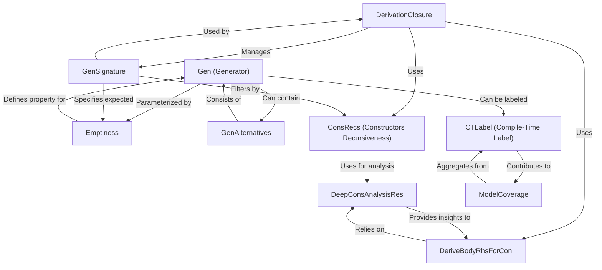

# Tutorial: DepTyCheck

`DepTyCheck` is an Idris library for **property-based testing** that *automates the generation of test data*,
even for **dependent types**. It allows users to define how data should be created using flexible `Gen`erators
and automatically derives these generators from data type definitions. The library also includes mechanisms
to track *test coverage* and analyze the *recursive structure of types*.

**Source Repository:** [None](None)

## Chapters

1. [Gen (Generator)
](01_gen__generator__.md)
2. [GenAlternatives
](02_genalternatives_.md)
3. [Emptiness
](03_emptiness_.md)
4. [CTLabel (Compile-Time Label)
](04_ctlabel__compile_time_label__.md)
5. [ModelCoverage
](05_modelcoverage_.md)
6. [DerivationClosure
](06_derivationclosure_.md)
7. [GenSignature
](07_gensignature_.md)
8. [ConsRecs (Constructors Recursiveness)
](08_consrecs__constructors_recursiveness__.md)
9. [DeepConsAnalysisRes
](09_deepconsanalysisres_.md)
10. [DeriveBodyRhsForCon
](10_derivebodyrhsforcon_.md)

---

Generated by [AI Codebase Knowledge Builder](https://github.com/The-Pocket/Tutorial-Codebase-Knowledge)