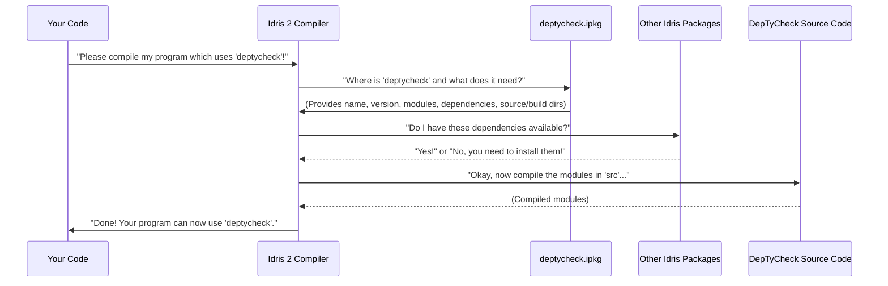

# Chapter 1: DepTyCheck Idris Package

Welcome to the exciting world of `DepTyCheck`! In this very first chapter, we're going to peek behind the curtain and understand what makes `DepTyCheck` tick as an **Idris 2 package**. Think of this chapter as looking at the "blueprint" or "ID card" for the entire `DepTyCheck` project.

## What is a Package?

Imagine you're building with LEGOs. A "package" for Idris 2 is a bit like a pre-made LEGO set. It contains all the instructions, pieces, and details needed to build a specific thing – in our case, the `DepTyCheck` library. When you want to use `DepTyCheck` functionality in your own Idris 2 programs, your computer needs to know *where* to find it, *how* to build it, and *what pieces* (modules) it offers. That's exactly what the `deptycheck.ipkg` file does!

### Our Central Use Case: Using `DepTyCheck`

Ultimately, we want to be able to use `DepTyCheck`'s advanced property-based testing features in our own Idris 2 code. For instance, we might want to automatically generate test data for a complex data type. To do that, Idris 2 needs to understand what `DepTyCheck` is and how to get its "pieces." This `deptycheck.ipkg` file is the very first step in making that happen. It's the front door to using `DepTyCheck`.

## The `deptycheck.ipkg` File: A Manifest for the Library

Let's look at the `deptycheck.ipkg` file itself. It's a plain text file that contains important information about the `DepTyCheck` project.

```idris
package deptycheck

authors = "Denis Buzdalov"

brief = "Property-based testing with dependent types"

license = "MPL-2.0"

sourcedir = "src"
builddir = ".build"

version = 0.0.251013

modules = Deriving.DepTyCheck.Gen
        , Deriving.DepTyCheck.Gen.ConsRecs
        -- ... many more modules ...
        , Test.DepTyCheck.Gen.Emptiness

depends = ansi
        , best-alternative
        -- ... many more dependencies ...
        , typelevel-emptiness-collections
```

Don't worry about all the specific details right now! We'll just focus on what each part means in simple terms.

### Breaking Down the `deptycheck.ipkg` File

Let's go through each part of this "ID card":

#### 1. `package deptycheck`

```idris
package deptycheck
```
This simply tells Idris 2: "Hey, this file describes a package, and its name is `deptycheck`." This is how you'll refer to it when you want to use it in other projects.

#### 2. `authors`

```idris
authors = "Denis Buzdalov"
```
This is like the "author" field on a book. It tells you who created or primarily works on this library.

#### 3. `brief`

```idris
brief = "Property-based testing with dependent types"
```
This is a short, one-sentence description of what the `DepTyCheck` library is all about. It's concise and gives you a quick idea of its purpose: helping with testing using Idris 2's powerful type system.

#### 4. `license`

```idris
license = "MPL-2.0"
```
The license determines how you're allowed to use, share, and modify this software. `MPL-2.0` is a type of license. It's important for understanding open-source projects!

#### 5. `sourcedir` and `builddir`

```idris
sourcedir = "src"
builddir = ".build"
```
These are like instructions for where to find the raw ingredients and where to put the finished product:
*   `sourcedir = "src"`: This tells Idris 2, "All the *source code* (the actual Idris 2 programs that make up `DepTyCheck`) can be found in a folder named `src`."
*   `builddir = ".build"`: This says, "When you compile and build `DepTyCheck`, put all the generated files (like the compiled versions ready to be used) into a folder named `.build`."

#### 6. `version`

```idris
version = 0.0.251013
```
This is the version number of the `DepTyCheck` library. Just like software updates on your phone, `DepTyCheck` gets updated. This number helps track different releases and ensures you're using a specific version of the library.

#### 7. `modules`

```idris
modules = Deriving.DepTyCheck.Gen
        , Deriving.DepTyCheck.Gen.ConsRecs
        -- ... many more modules ...
        , Test.DepTyCheck.Gen.Emptiness
```
This is a very important list! These are *all the individual Idris 2 files* (called "modules") that make up the `DepTyCheck` library. Each module usually contains related functions and data types. When you `import` something from `DepTyCheck` in your own code, you're importing one or more of these modules.

For example, `Deriving.DepTyCheck.Gen` is probably a module about generating data, while `Test.DepTyCheck.Gen.Emptiness` likely deals with testing generators for emptiness. We'll explore many of these modules in future chapters, like the [Generator Signature Definition](06_generator_signature_definition_.md) and the [Test Generator Core](07_test_generator_core_.md).

#### 8. `depends`

```idris
depends = ansi
        , best-alternative
        -- ... many more dependencies ...
        , typelevel-emptiness-collections
```
Just like a complex recipe might need ingredients you didn't make yourself (like flour or sugar), `DepTyCheck` relies on other existing Idris 2 packages to work. This list specifies all those other packages that `DepTyCheck` "depends" on. When you build `DepTyCheck`, Idris 2 will first make sure it can find and use all these listed dependencies.

## How `deptycheck.ipkg` Helps Idris 2 Build and Use the Library

Let's visualize the simple process of how Idris 2 uses this file:



In simpler terms:

1.  **You want to use `DepTyCheck`**: You write an Idris program and tell Idris 2 you want to use the `deptycheck` package.
2.  **Idris 2 consults `deptycheck.ipkg`**: The compiler looks for the `deptycheck.ipkg` file to learn everything about the package.
3.  **Idris 2 checks dependencies**: It sees the `depends` list and makes sure all those other necessary packages are available.
4.  **Idris 2 compiles `DepTyCheck`**: Using the `sourcedir` and `builddir` information, it compiles all the `modules` that make up `DepTyCheck`.
5.  **You can now use `DepTyCheck`**: Once everything is compiled, your program can happily import and use all the functions and types provided by the `DepTyCheck` library!

## Conclusion

The `deptycheck.ipkg` file is the fundamental metadata file for the `DepTyCheck` project. It acts as a manifest, providing crucial information like authors, a brief description, license, version, source and build directories, and a list of all included modules and external dependencies. Understanding this file is the first step to understanding how the `DepTyCheck` library is organized and how Idris 2 manages it.

Next, we'll look at another important file that gives a high-level overview of the project: the project's `README` file.

[Next Chapter: Project README](02_project_readme_.md)

---

Generated by [AI Codebase Knowledge Builder](https://github.com/The-Pocket/Tutorial-Codebase-Knowledge)