# Chapter 2: Project README

Welcome back! In [Chapter 1: DepTyCheck Idris Package](01_deptycheck_idris_package_.md), we learned about the `deptycheck.ipkg` file, which is like the ID card for our `DepTyCheck` project. It tells Idris 2 how to build and use the library. Now, we're going to explore another crucial file: the **Project README**.

## What is a "README" file?

Imagine you just bought a new gadget, say, a fancy coffee maker. Before you start brewing, what's the first thing you look for? Probably an instruction manual or a quick-start guide, right? The `README.md` file in a software project is exactly that! It's the project's **front-page**, its **instruction manual**, and its **introduction** all rolled into one. It's usually the first thing someone sees when they visit a project's repository (like on GitHub).

Its main purpose is to help newcomers quickly understand:
1.  **What is this project?** (Its purpose)
2.  **What does it do?** (Its features)
3.  **How can I get started using it?** (Basic instructions)
4.  **What's its current status?** (Is it ready for use or still experimental?)

## Our Central Use Case: Guiding New Users

For `DepTyCheck`, our central use case for the `README.md` file is simple: **to guide new users from "What is this?" to "How do I use this to automatically generate test data?"** It needs to be clear, concise, and provide enough information to pique interest and get someone started.

Let's look at parts of `DepTyCheck`'s `README.md` file to see how it achieves this.

## Breaking Down the `README.md` File

The `README.md` file is written in Markdown, which is a simple way to format text (like making things bold, italic, or creating lists). The `.md` extension stands for Markdown.

```markdown
<!-- idris
module README

import Data.Fin
import Data.List1

import Deriving.DepTyCheck.Gen

import Test.DepTyCheck.Gen

%default total

%language ElabReflection
-->

# DepTyCheck

<!-- editorconfig-checker-disable -->
[](https://github.com/buzden/deptycheck/actions/workflows/ci-deptycheck.yml)
[](https://github.com/buzden/deptycheck/actions/workflows/ci-super-linter.yml)
[](https://deptycheck.readthedocs.io/en/latest/?badge=latest)
<!-- editorconfig-checker-enable -->

A library for property-based testing with dependent types and automatic derivation of generators for Idris 2
```

### 1. Hidden Idris Code Block

```markdown
<!-- idris
module README

import Data.Fin
import Data.List1

import Deriving.DepTyCheck.Gen

import Test.DepTyCheck.Gen

%default total

%language ElabReflection
-->
```
You might notice this strange `<!-- idris ... -->` block at the very top. This is an HTML comment, which means it won't actually show up when the Markdown is rendered (like on GitHub's website). However, it's used by `DepTyCheck`'s documentation tooling (which we'll discuss in [Chapter 4: Read the Docs Configuration](04_read_the_docs_configuration_.md)) to ensure that the code examples later in the README are valid and can be tested. For our current understanding, you can just ignore it—it's a behind-the-scenes tool for developers, not for users reading the README.

### 2. Main Title and Badges

```markdown
# DepTyCheck

<!-- editorconfig-checker-disable -->
[](https://github.com/buzden/deptycheck/actions/workflows/ci-deptycheck.yml)
[](https://github.com/buzden/deptycheck/actions/workflows/ci-super-linter.yml)
[](https://deptycheck.readthedocs.io/en/latest/?badge=latest)
<!-- editorconfig-checker-enable -->
```
*   `# DepTyCheck`: This is the main title of the project. The single `#` in Markdown signifies a top-level heading. It immediately tells you the project's name.
*   **Badges**: Those little colorful boxes like "Build and test" and "Documentation Status" are called "badges." They are quick visual indicators of the project's health. For example, the "Build and test" badge usually tells you if the project's code is currently compiling and all its automated tests are passing. The "Documentation Status" badge tells you if the project's online documentation is up-to-date. These are super helpful for developers to quickly check the project's stability.

### 3. Project Description

```markdown
A library for property-based testing with dependent types and automatic derivation of generators for Idris 2
```
This is the core purpose statement. It's a single sentence that explains what `DepTyCheck` is: a library for "property-based testing" (a smart way to test code) using "dependent types" (Idris 2's powerful type system) and it "automatically derives generators" (it can create test data for you!). This immediately clarifies what the project is about.

### 4. Status Update

```markdown
## Status

🚧 The library is under heavy construction 🚧

For now, it lacks most of things required for normal property-based testing,
like support for *properties* and fancy testing operations.
Also, for now we do not support such important thing as *shrinking*.

The current focus for now is on *test data generators* and *automatic derivation* of them.
```
The `## Status` section (two `##` means a sub-heading) is incredibly important. It tells users the project's maturity level. Here, it clearly states that `DepTyCheck` is "under heavy construction." This manages expectations: it's not a fully-fledged, ready-for-production library *yet*. It also highlights the *current focus*, which is on "test data generators" and "automatic derivation," letting users know what features are most developed and what they can expect to use right now.

### 5. Generators Section (User Guide Part 1)

This is where the `README` starts getting into the "how-to" part. It introduces the concept of "Generators," which are core to `DepTyCheck`.
```markdown
## Generators

Generators in the simplest case produce a bunch of values of appropriate type:

```idris
genSomeStrings : Gen NonEmpty String
genSomeStrings = elements ["one", "two", "three"]
```
```
Here, the `README` gives a simple Idris code example. `genSomeStrings` is a "generator" that can produce strings like "one", "two", or "three". This shows a basic feature and how to use it. The code is kept short and focused.

Further down, the `README` shows more complex examples, like combining generators or dealing with specific Idris types:
```markdown
Generators can be combined with operations from `Applicative` interface:

```idris
data X = MkX String String

genStrPairs : Gen NonEmpty X
genStrPairs = [| MkX genSomeStrings genMoreStrings |]
```

> [!NOTE]\
> The number of alternatives acquired by `alternativesOf` function of an applicative combination
> of two generators is a product of numbers of alternatives of those generators.
```
This section continues to teach by example, demonstrating how generators can be composed to create more complex test data. The `NOTE` boxes are a great way to highlight important details or warnings without cluttering the main text.

The `README` uses analogies, like comparing `Gen NonEmpty String` to `Gen MaybeEmpty String` to explain the concept of generator emptiness, which is crucial for dependent types:
```markdown
Unlike, say, in QuickCheck, generators can be empty.
This is important for dependent types.
For example, `Fin 0` is not inhabited,
thus we need to have an empty generator
if we want to have a generator for any `Fin n` (and sometimes we really want):

```idris
genFin : (n : Nat) -> Gen MaybeEmpty $ Fin n
genFin Z     = empty
genFin (S n) = elements' $ allFins n
```
```
This directly addresses the "dependent types" aspect mentioned in the project description and explains *why* `DepTyCheck` needs empty generators. These are concrete examples that users can try out.

### 6. Derivation of Generators (User Guide Part 2)

This section focuses on the automatic generation part:
```markdown
## Derivation of generators

DepTyCheck supports automatic derivation of generators using the datatype definition.

For now, it is not tunable at all, however, it is planned to be added.

Derived generators are total.
Since for now generators are finite,
it was decided to use explicit fuel pattern to support recursive data types.
For simplicity, fuel pattern is used for all derived generators.

To invoke derivation, we use `deriveGen` macro:

```idris
genNat : Fuel -> Gen MaybeEmpty Nat
genNat = deriveGen
```
```
Here, the `README` introduces the `deriveGen` macro, which is the key feature for automatic derivation. It shows a simple example (`genNat = deriveGen`) and explains the basic mechanism behind it (using "fuel" for recursive types). It also sets expectations by stating that it's "not tunable at all" *for now*.

It also explains the powerful Idris 2 feature that makes this possible:
```markdown
It uses very powerful metaprogramming facility of Idris 2 programming language
for analysing the data structure which generator is derived for and producing code of the asked generator at compile time.
This facility is called *elaborator reflection*...
To enable it, you have to add `%language ElabReflection` to the source code before the first call to the macro.
```
This gives a little peek "under the hood" at the technical magic (elaborator reflection) without requiring the user to become an expert in it. It tells them what they need to do (`%language ElabReflection`) to make it work.

### 7. Usage and Installation

```markdown
## Usage and installation

For building and testing we use [`pack`](https://github.com/stefan-hoeck/idris2-pack/) package manager.

> [!NOTE]\
> Notice, that we've gone mad as far as possible, so even calling for makefile of Sphinx for building documentation
> is done through `pack` and `prebuild` action inside an appropriate `ipkg` file.
>
> Despite that, to make [LSP](https://github.com/idris-community/idris2-lsp) working well,
> only a single code-related `ipkg` file is left in the top-level folder of the project.
```
This final section tells the user how to get started with the project—specifically, that it uses [`pack`](https://github.com/stefan-hoeck/idris2-pack/) for building. This is essential for anyone wanting to run the code themselves. The `NOTE` explains some advanced design choices, which might be too much for a beginner, but it's okay for a README to have some deeper context for more experienced users.

## How the README Guides a New User (Mental Model)

Let's imagine a new user, 'Alice', encounters the `DepTyCheck` project. Here's a simplified view of her journey, guided by the `README.md`:

```mermaid
sequenceDiagram
    participant Alice as New User
    participant Readme as README.md
    participant Idris2 as Idris 2 Compiler

    Alice->>Readme: "What is 'DepTyCheck'?"
    Readme->>Alice: "Property-based testing with dependent types & auto-derivation! (and it's in progress 🚧)"
    Alice->>Readme: "How do I make a basic generator?"
    Readme->>Alice: "(Shows `genSomeStrings` example code)"
    Alice->>Readme: "How about for my own data types?"
    Readme->>Alice: "(Explains `deriveGen` macro)"
    Alice->>Idris2: (Tries `deriveGen` code with `%language ElabReflection`)
    Idris2-->>Alice: (Compiles and runs, showing auto-generated test data)
    Alice->>Readme: "How do I install/build it?"
    Readme->>Alice: "Use `pack` package manager!"
    Alice-->>Readme: "Great! I'm starting to understand this!"
```



The `README.md` acts as Alice's conversational guide, answering her questions as she discovers the project. It starts with a broad overview and then gradually introduces more specific features with concrete examples until she knows how to use the core functionality and how to set up the project.

## Conclusion

The `README.md` file is the project's welcome mat and quick-start guide. It provides a brief introduction, explains the project's purpose and status, and gives essential examples and instructions on how to use its core features, like generators and automatic derivation. By reading the `README`, a new user can quickly grasp what `DepTyCheck` is, whether it's suitable for their needs, and how to begin experimenting with it. It serves as the primary gateway for project adoption and understanding.

Next, we'll dive deeper into how `DepTyCheck` is configured using `pack`, the package manager mentioned in this README.

[Next Chapter: Pack Configuration](03_pack_configuration_.md)

---

Generated by [AI Codebase Knowledge Builder](https://github.com/The-Pocket/Tutorial-Codebase-Knowledge)