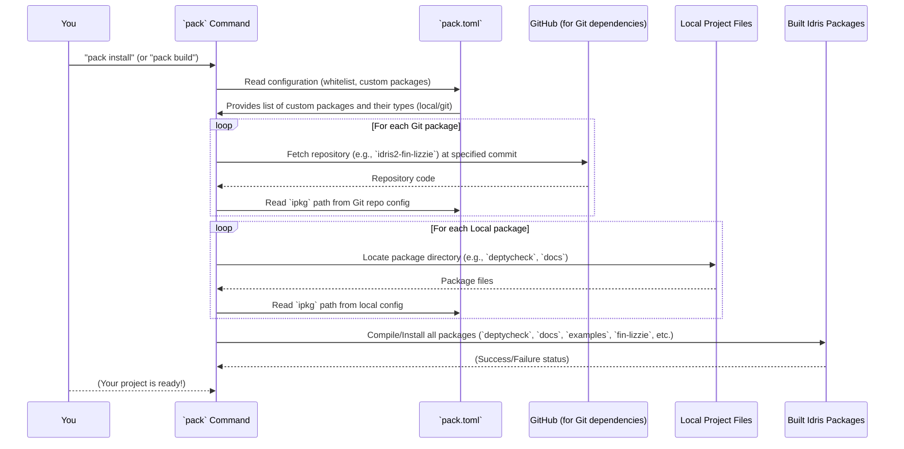

# Chapter 3: Pack Configuration

Welcome back, future Idris 2 wizard! In [Chapter 1: DepTyCheck Idris Package](01_deptycheck_idris_package_.md), we learned about the `deptycheck.ipkg` file – the ID card for our project. In [Chapter 2: Project README](02_project_readme_.md), we explored the `README.md` file, which is like the project's friendly instruction manual. Both of these files are vital, but they don't *assemble* the project. That's where we need a "builder."

## What Problem Does `pack` Solve?

Imagine you're trying to build a complex LEGO castle. You have all the instruction booklets (the `ipkg` files), and you have a big picture guide (the `README`). But you still need a way to gather all the right LEGO sets, make sure they're the correct versions, and then put them together in the right order.

In the world of Idris 2, this "builder" is often handled by a tool called `pack`. `pack` is the Idris package manager, and its job is to manage all the different pieces (packages and libraries) that make up your project. For `DepTyCheck`, there isn't just one `deptycheck` package; there are also internal examples, documentation, and various other helper libraries. `pack` needs to know about all of them!

## Our Central Use Case: Getting `DepTyCheck` Ready

Our central use case for `pack` is to **make sure that when we want to build or run `DepTyCheck`, `pack` can find, download (if necessary), and prepare *all* the different parts of the project.** This includes the main `deptycheck` library, its examples, and even its documentation. Without `pack`, putting everything together would be a manual and error-prone nightmare!

## The `pack.toml` File: A Master Shopping List and Instruction Manual

The `pack.toml` file is like a very detailed shopping list and an instruction manual for `pack`. It tells `pack`:
1.  **What to install**: Which packages are part of this project.
2.  **Where to find them**: Are they local files, or do they need to be downloaded from the internet?
3.  **Specific versions**: If they're from the internet, which specific version or commit should be used?

Let's look at `DepTyCheck`'s `pack.toml` file. It's written in a format called TOML (Tom's Obvious, Minimal Language), which is designed to be easy to read.

```toml
################
### Settings ###
################

[install]
whitelist = [ "deptycheck-docs", "pil-fun", "pil-dyn" ]
```

### 1. `[install]` and `whitelist`

```toml
[install]
whitelist = [ "deptycheck-docs", "pil-fun", "pil-dyn" ]
```
*   `[install]`: This is a section heading for `pack`. It tells `pack` that the settings below apply to how packages should be installed.
*   `whitelist = [...]`: This is a list of specific packages that `pack` should *definitely* install when you ask it to (e.g., when you run `pack install`). In `DepTyCheck`'s case, it ensures that even some of the examples (`pil-fun`, `pil-dyn`) and the project's documentation (`deptycheck-docs`) are installed, not just the main library.

This feature is particularly useful if not all parts of your project are directly depended upon by the "main" package, but you still want them installed for testing or documentation purposes.

### 2. Defining Custom Packages

The real power of `pack.toml` comes from its ability to define "custom" packages. These are packages that are not necessarily on a global package index, but are specific to *this* project.

`pack` can handle packages in a few ways:
*   **Local packages**: These are parts of your project that live right next to your `pack.toml` file, in different folders.
*   **Git packages**: These are packages that `pack` needs to fetch from a Git repository (like GitHub).

Let's look at examples of both from `DepTyCheck`'s `pack.toml`.

#### Local Packages: Our Own `DepTyCheck` Library

```toml
##################
### DepTyCheck ###
##################

[custom.all.deptycheck]
type = "local"
path = "."
ipkg = "deptycheck.ipkg"
test = "tests/tests.ipkg"
```
*   `[custom.all.deptycheck]`: This defines a custom package named `deptycheck`. The `all` part means it applies to all build configurations.
*   `type = "local"`: This tells `pack` that `deptycheck` is a local package, meaning its files are right here in our project.
*   `path = "."`: The `.` means "the current directory." So, the `pack.toml` file and the `deptycheck` package files are in the same top-level folder.
*   `ipkg = "deptycheck.ipkg"`: This points `pack` to the actual package definition file we learned about in [Chapter 1: DepTyCheck Idris Package](01_deptycheck_idris_package_.md).
*   `test = "tests/tests.ipkg"`: This tells `pack` where to find the test suite for this package.

This block is how `pack` knows *everything* about the main `DepTyCheck` library that we want to build.

There are many other local packages defined in `pack.toml`, like for `elab-util-extra` and all the examples:

```toml
#######################
### Elab-util-extra ###
#######################

[custom.all.elab-util-extra]
type = "local"
path = "elab-util-extra"
ipkg = "elab-util-extra.ipkg"
test = "tests/tests.ipkg"

################
### Examples ###
################

[custom.all.sorted-list-tl-pred]
type = "local"
path = "examples/sorted-list-tl-pred"
ipkg = "sorted-list-tl-pred.ipkg"
test = "tests/tests.ipkg"
```
You can see that these follow the exact same pattern: `type = "local"`, a `path` (relative to the `pack.toml` file), and a pointer to the `ipkg` and `test` files.

#### Local Packages: The Documentation

The `DepTyCheck` documentation itself is also treated as a local package by `pack`:

```toml
[custom.all.docs]
type = "local"
path = "docs"
ipkg = "docs.ipkg"
```
Notice this one doesn't have a `test` field, because documentation usually doesn't have a test suite in the same way code does. This entry ensures that `pack` knows how to build the project's documentation. We'll learn more about the `docs.ipkg` and how documentation is generated in [Chapter 4: Read the Docs Configuration](04_read_the_docs_configuration_.md).

#### Git Packages: External Dependencies

Not everything is local. `DepTyCheck` also relies on other Idris libraries that are hosted on GitHub:

```toml
[custom.nightly-251007.fin-lizzie]
type   = "git"
url    = "https://github.com/buzden/idris2-fin-lizzie"
commit = "latest:master"
ipkg   = "fin-lizzie.ipkg"

[custom.nightly-251007.collection-utils]
type   = "git"
url    = "https://github.com/buzden/idris2-collection-utils"
commit = "latest:master"
ipkg   = "collection-utils.ipkg"
```
Let's break down one of these: `fin-lizzie`.
*   `[custom.nightly-251007.fin-lizzie]`: This defines a custom package `fin-lizzie`. The `nightly-251007` part here indicates that these dependencies are specific to a particular version (like a "nightly build") of Idris 2 or a specific configuration target.
*   `type = "git"`: This is the key difference! It tells `pack` to get this package from a Git repository.
*   `url = "https://github.com/buzden/idris2-fin-lizzie"`: This is the web address where `pack` can find the Git repository.
*   `commit = "latest:master"`: This is very important for stability! Instead of just downloading the latest version that might change constantly, `pack` is told to pull the *latest commit from the `master` branch*. This ensures that everyone working on `DepTyCheck` gets the same exact version of this dependency. Sometimes you might see a specific Git commit hash (a long string of numbers and letters) here, which locks it down to an even more exact moment in time.
*   `ipkg = "fin-lizzie.ipkg"`: Just like local packages, `pack` still needs to know the name of the `ipkg` file *within that Git repository* to properly identify and build the package.

## How `pack` Uses `pack.toml`

When you use `pack` to build, install, or manage your project, it reads `pack.toml` to understand the entire ecosystem of `DepTyCheck`.

Here's a simplified sequence of what `pack` does:



This diagram shows that `pack` acts as the central coordinator. It uses the `pack.toml` file to know *what* needs to be done and *where* to find all the pieces. It then fetches remote code, locates local code, and passes it all to the Idris compiler to be built.

## Conclusion

The `pack.toml` file is the master configuration file for the `pack` Idris package manager within the `DepTyCheck` project. It serves as a comprehensive guide, instructing `pack` on how to discover, fetch, and integrate all the project's components—from the main `deptycheck` library and its documentation to various examples and external Git-managed dependencies. By defining custom packages and specifying their types (local or Git) and exact versions, `pack.toml` ensures that the entire `DepTyCheck` ecosystem can be consistently built and managed.

Next, we'll dive into how the `DepTyCheck` documentation, which we saw whitelisted in `pack.toml`, is actually configured and built using Read the Docs.

[Next Chapter: Read the Docs Configuration](04_read_the_docs_configuration_.md)

---

Generated by [AI Codebase Knowledge Builder](https://github.com/The-Pocket/Tutorial-Codebase-Knowledge)