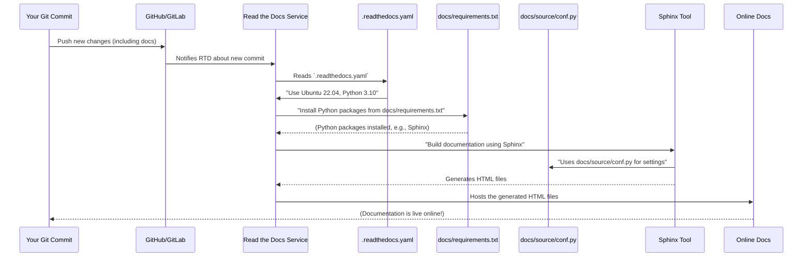

# Chapter 4: Read the Docs Configuration

Welcome back! In [Chapter 1: DepTyCheck Idris Package](01_deptycheck_idris_package_.md) and [Chapter 3: Pack Configuration](03_pack_configuration_.md), we learned how `pack` helps us manage and build all the different parts of `DepTyCheck`, including the documentation. Now, we're going to dive into how that documentation actually gets published online to form a beautiful, easy-to-read website. This is where **Read the Docs Configuration** comes in!

## What Problem Does Read the Docs Solve?

Imagine you've written a fantastic instruction manual for your new coffee maker. It's clear, well-organized, and has great diagrams. But how do you get it out to everyone? You could print it, but that's expensive and hard to update. You could put it on your personal website, but setting that up means designing a website, hosting it, and making sure it looks good on different devices.

This is exactly the problem that **Read the Docs** (often shortened to RTD) solves for software projects. It's a free online service that automatically builds, hosts, and versions your project's documentation. You write your documentation in simple text files (like Markdown or reStructuredText), and Read the Docs turns it into a professional-looking website.

## Our Central Use Case: Publishing Online Documentation

For `DepTyCheck`, our central use case for Read the Docs is to **automatically build and publish our documentation online, making it easily accessible and discoverable for anyone who wants to learn how to use `DepTyCheck`.** We want a clean, searchable website that looks good and is always up-to-date with our latest changes.

The `DepTyCheck` project uses a special file called `.readthedocs.yaml` to tell Read the Docs *exactly how* to build its documentation. Think of it as the recipe for the Read the Docs website.

## The `.readthedocs.yaml` File: A Recipe for a Documentation Website

The `.readthedocs.yaml` file is a plain text file that contains instructions for Read the Docs. It's written in YAML, which is a simple format for configuration files, much like TOML which we saw for `pack.toml`.

Let's look at `DepTyCheck`'s `.readthedocs.yaml` file to understand how it works.

```yaml
# .readthedocs.yaml
# Read the Docs configuration file
# See https://docs.readthedocs.io/en/stable/config-file/v2.html for details

# Required
version: 2

# Set the version of Python and other tools you might need
build:
  os: ubuntu-22.04
  tools:
    python: "3.10"

python:
  install:
    - requirements: docs/requirements.txt

sphinx:
  configuration: docs/source/conf.py
  builder: dirhtml
```

Let's break down this recipe!

### 1. `version: 2`

```yaml
version: 2
```
This is a simple but important line. It tells Read the Docs which version of its configuration file format we are using. `version: 2` is the latest and recommended version, and it includes more features and flexibility.

### 2. `build` Section: Setting up the Build Environment

```yaml
build:
  os: ubuntu-22.04
  tools:
    python: "3.10"
```
This section describes the "computer" where our documentation will be built on Read the Docs.
*   `os: ubuntu-22.04`: This specifies the operating system that Read the Docs should use. Think of it as choosing the type of computer (like a Mac, Windows PC, or a Linux machine). Ubuntu 22.04 is a specific version of a popular Linux operating system.
*   `tools`: This subsection lists any special software tools needed.
    *   `python: "3.10"`: This tells Read the Docs that it needs Python version 3.10 for building the documentation. Many documentation tools (like Sphinx, which we'll see next) are written in Python.

### 3. `python` Section: Installing Dependencies

```yaml
python:
  install:
    - requirements: docs/requirements.txt
```
Just like our `DepTyCheck` Idris package depends on other Idris packages (as seen in [Chapter 1: DepTyCheck Idris Package](01_deptycheck_idris_package_.md)), the documentation *building process* itself depends on some Python packages.
*   `python: install: - requirements: docs/requirements.txt`: This line instructs Read the Docs to find a file named `requirements.txt` inside the `docs/` folder. This `requirements.txt` file is a simple list of Python packages that need to be installed. Read the Docs will automatically install all these packages before it tries to build the documentation.

Why do we need this? Because the tools that turn our raw documentation files into a website format (like HTML) are Python packages. For example, if we use Sphinx (a popular Python documentation generator), we might list `sphinx` itself, along with any special themes or extensions for Sphinx, in `docs/requirements.txt`.

### 4. `sphinx` Section: Building the Docs with Sphinx

```yaml
sphinx:
  configuration: docs/source/conf.py
  builder: dirhtml
```
This is the heart of the documentation building process. It tells Read the Docs to use the **Sphinx** tool. Sphinx is a powerful tool written in Python that can take reStructuredText or Markdown files and turn them into beautiful HTML documentation.
*   `configuration: docs/source/conf.py`: This points to a Python file named `conf.py` inside the `docs/source/` folder. This `conf.py` file is Sphinx's main configuration file. It contains important settings for our documentation, such as the project name, author, and specific Sphinx extensions to use. It's like the detailed style guide and feature list for our documentation website.
*   `builder: dirhtml`: This tells Sphinx *how* to build the HTML files. `dirhtml` means that each page will be in its own directory, resulting in "prettier" URLs (e.g., `yourproject.com/chapter-name/` instead of `yourproject.com/chapter-name.html`).

## How Read the Docs Uses `.readthedocs.yaml`

Let's trace the steps Read the Docs takes when it receives new documentation files for `DepTyCheck`:



In simpler terms:
1.  **You make changes to your documentation files** (or code that gets documented automatically) and push them to GitHub.
2.  **GitHub tells Read the Docs** that there are new changes.
3.  **Read the Docs wakes up** and looks for the `.readthedocs.yaml` file.
4.  It **sets up a temporary build environment** (`os: ubuntu-22.04`, `python: "3.10"`).
5.  It **installs any necessary Python tools** by reading `docs/requirements.txt`.
6.  It then **runs Sphinx** (the `sphinx` section) using the settings specified in `docs/source/conf.py`. Sphinx takes all your documentation files and turns them into a set of HTML web pages.
7.  Finally, **Read the Docs hosts these generated HTML pages** online, making them available as the project's documentation website!

This entire process is automated, meaning every time you update your documentation files and push them to Git, Read the Docs automatically rebuilds and republishes your website. It's incredibly convenient!

## Conclusion

The `.readthedocs.yaml` file is the crucial configuration file that empowers Read the Docs to automatically build, host, and version the documentation for the `DepTyCheck` project. It acts as a detailed blueprint guiding Read the Docs through the entire process, from setting up the correct build environment (Python version, operating system) and installing necessary Python tools (`docs/requirements.txt`), to specifying how the Sphinx documentation generator should operate (`docs/source/conf.py`, `dirhtml builder`). This automation ensures that developers can focus on writing great documentation, knowing that Read the Docs will handle the complex process of turning it into a professional and accessible online resource.

Next, we'll shift our focus from documentation to the core code and explore the concept of a Derivation Entry Point, which is where the magic of automatic code generation begins in `DepTyCheck`.

[Next Chapter: Derivation Entry Point](05_derivation_entry_point_.md)

---

Generated by [AI Codebase Knowledge Builder](https://github.com/The-Pocket/Tutorial-Codebase-Knowledge)