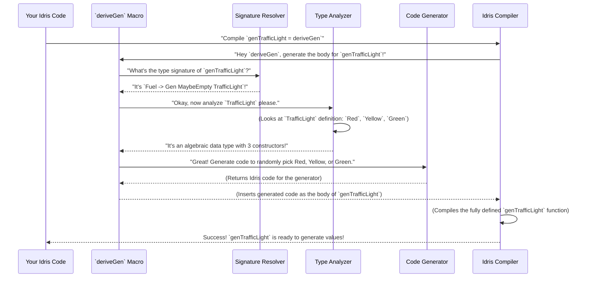

# Chapter 5: Derivation Entry Point

Welcome back, future `DepTyCheck` user! In the last few chapters, we started by understanding the `deptycheck.ipkg` package "ID card", then explored the friendly `README.md` guide, and finally saw how `pack.toml` orchestrates the entire project with the `pack` package manager. We even looked at how `.readthedocs.yaml` helps publish our documentation online. Now, it's time to dive into the core magic of `DepTyCheck` itself: **The Derivation Entry Point**.

## What Problem Do `deriveGen` and `deriveGenFor` Solve?

Imagine you have a complex data structure in Idris 2, like a syntax tree for a programming language, or a deeply nested configuration record. If you wanted to test functions that operate on this data structure, you'd need *lots* of example data. Writing this test data by hand can be incredibly tedious, error-prone, and time-consuming. Every time your data structure changes, you'd have to update all your manual test data!

This is where `DepTyCheck` shines! Its "Derivation Entry Point" is like a magical "test data factory" for your Idris types. You give it the blueprint (your data type definition), and it automatically builds the machinery (the `Gen` instance) to churn out test values for you.

Our central use case for this chapter is: **Automatically creating a test data generator for an Idris 2 data type without writing the generator by hand.** We want to be able to simply say "make a generator for this type," and `DepTyCheck` does all the hard work for us.

## Introducing `deriveGen` and `deriveGenFor`

`DepTyCheck` provides two main macro functions that act as derivation entry points: `deriveGen` and `deriveGenFor`. Think of these as two different doors into our automatic test data factory.

Let's imagine you have a very simple data type called `TrafficLight`:

```idris
data TrafficLight = Red | Yellow | Green
```

To automatically generate `TrafficLight` values, you can use `deriveGen`:

### Using `deriveGen`

```idris
-- src/MyGenerators.idr
module MyGenerators

%language ElabReflection -- We need this for macros!

data TrafficLight = Red | Yellow | Green

-- The magic line!
genTrafficLight : Fuel -> Gen MaybeEmpty TrafficLight
genTrafficLight = deriveGen
```

**Explanation:**

1.  `%language ElabReflection`: This line is super important! `deriveGen` is a "macro," which is a special piece of code that runs *during compilation* to write other code for you. Idris needs `ElabReflection` enabled to allow these powerful macros.
2.  `data TrafficLight = Red | Yellow | Green`: This is our simple data type blueprint.
3.  `genTrafficLight : Fuel -> Gen MaybeEmpty TrafficLight`: This is the *signature* (the type definition) of our desired generator function.
    *   `Fuel`: This is a special type from `Data.Fuel` that helps `DepTyCheck` handle potentially infinite data structures (like lists) without getting stuck. Think of it as a "depth limit" or "resource budget" for generating data.
    *   `Gen MaybeEmpty TrafficLight`: This tells us that `genTrafficLight` will produce a `Gen` (generator) that can create values of type `TrafficLight`. `MaybeEmpty` means this generator *might* sometimes produce nothing (e.g., if `Fuel` runs out, or if the type itself has no possible values). We'll learn more about `Gen` and `MaybeEmpty` in [Chapter 9: Generator Emptiness](09_generator_emptiness_.md).
4.  `genTrafficLight = deriveGen`: This is the *entry point*! We're telling Idris, "Hey, `DepTyCheck`, please look at the type signature of `genTrafficLight` and automatically generate the code for it!"

When you compile this, Idris will run the `deriveGen` macro. `deriveGen` will look at `TrafficLight`, realize it has three constructors (`Red`, `Yellow`, `Green`), and then generate Idris code that randomly picks one of these three constructors. You don't see this generated code, but it's there!

### Using `deriveGenFor`

The `deriveGenFor` macro does the exact same thing as `deriveGen`, but it takes the target type signature as an explicit argument. This is useful if you don't want to write a separate type signature for your generator:

```idris
-- src/MyGenerators.idr (continued)

-- The magic line, alternative way!
genTrafficLightFor : Fuel -> Gen MaybeEmpty TrafficLight
genTrafficLightFor =
  deriveGenFor (Fuel -> Gen MaybeEmpty TrafficLight)
```

**Explanation:**

*   `genTrafficLightFor = deriveGenFor (Fuel -> Gen MaybeEmpty TrafficLight)`: Here, we provide the full type signature `(Fuel -> Gen MaybeEmpty TrafficLight)` directly to `deriveGenFor`. `DepTyCheck` uses this provided signature to understand what kind of generator it needs to build.

Both `deriveGen` and `deriveGenFor` achieve the same goal: automatically generating the `Gen` instance for `TrafficLight`.

## What Happens Under the Hood? (The "Automatic Factory" Process)

Let's simplify how this automatic factory works when you use `deriveGen`:



In short:
1.  **Macro Invocation:** When Idris sees `deriveGen`, it activates the macro.
2.  **Signature Parsing:** The first thing the macro does is figure out the *exact type* of `Gen` you want to create. It parses the signature (`Fuel -> Gen MaybeEmpty TrafficLight`) to understand:
    *   What type are we generating for? (`TrafficLight`)
    *   Are there any input parameters to the generator (besides `Fuel`)? (None in this simple case, but there can be!)
    *   Are there external generators (`Gen Y => ...`) needed? (None here). We'll cover this in [Chapter 6: Generator Signature Definition](06_generator_signature_definition_.md).
3.  **Correctness Check:** It ensures the signature follows the expected pattern (e.g., first argument is `Fuel`, result is `Gen MaybeEmpty ...`). This is where `checkTypeIsGen` comes into play.
4.  **Type Analysis:** It then deeply inspects the `TrafficLight` data type itself to understand its constructors (`Red`, `Yellow`, `Green`) and what arguments each constructor takes. This involves the modules discussed in [Chapter 14: Single Type Generator Derivation](14_single_type_generator_derivation_.md) and [Chapter 15: Constructor Recursiveness Analysis](15_constructor_recursiveness_analysis_.md).
5.  **Code Generation:** Finally, based on the analysis, it writes the actual Idris code for the `Gen TrafficLight` instance. This generated code will correctly handle all the constructors and their arguments, linking up with other `Gen` instances for those argument types. This involves modules like [Chapter 16: Constructor Body Derivation](16_constructor_body_derivation_.md).
6.  **Insertion & Compilation:** The generated code is then inserted as the body of your `genTrafficLight` function, and Idris continues compiling it, just like any other Idris code.

### Code Dive: `deriveGenExpr` (Simplified)

The core logic for `deriveGen` and `deriveGenFor` relies on a function called `deriveGenExpr`. Let's look at a highly simplified version of it to see the key steps (we'll omit many details, especially error handling and complex `Elab` monadic code for clarity):

```idris
-- From src/Deriving/DepTyCheck/Gen.idr (simplified to show main logic)

deriveGenExpr : DeriveBodyForType => (signature : TTImp) -> Elab TTImp
deriveGenExpr signature = do
  -- Step 1: Parse and check the signature
  -- This function ensures the signature looks like `Fuel -> Gen MaybeEmpty MyType`
  checkResult@(targetSig ** externals ** _) <- checkTypeIsGen DerivationTask signature

  -- Step 2: Extract the target type (e.g., `TrafficLight`)
  let targetType = targetSig.targetType

  -- Step 3: Call the main derivation logic to get the generator code
  -- This `callMainDerivedGen` is where the deep analysis and code generation happens.
  -- It returns the core generator and a list of local variables it needs.
  (coreGenCode, localsNeeded) <- callMainDerivedGen targetSig (UN "fuel")

  -- Step 4: Wrap the generated code with the Fuel argument and any other arguments
  -- This creates the complete function body starting with `\fuel => ...`
  wrapFuel (UN "fuel") <$> internalGenCallingLambda checkResult (local localsNeeded coreGenCode)
```

**Explanation of the simplified `deriveGenExpr`:**

1.  `checkTypeIsGen`: This function is extremely important. It takes the given `signature` (as `TTImp`, which is Idris's internal representation of types) and *parses* it. It makes sure the `signature` is in the correct format expected for a generator (e.g., it starts with `Fuel`, produces a `Gen MaybeEmpty`, etc.). It returns a `checkResult` which contains detailed information about the parsed signature, like the `targetType` (`TrafficLight` in our example).
2.  `targetSig.targetType`: From the parsed signature, we extract the actual data type for which we need to generate values.
3.  `callMainDerivedGen`: This is where the heavy lifting happens. This function takes the parsed `targetSig` and the name for the `fuel` argument (e.g., `UN "fuel"`). It will then inspect `TrafficLight`, recursively figure out how to generate its parts, and produce the core Idris expression that represents our generator. The result `coreGenCode` is the generated body of the generator function.
4.  `wrapFuel (UN "fuel") <$> internalGenCallingLambda checkResult (...)`: Finally, the `coreGenCode` is wrapped into a full function definition. `wrapFuel` adds the initial `\fuel =>` part, and `internalGenCallingLambda` handles any other parameters (like external generators if they were in the signature). The `local localsNeeded` ensures any helper functions generated internally are correctly scoped.

This `Elab` monad (`do` block) is a special Idris feature that allows writing code that *generates other code*. It's how macros work!

## Conclusion

The "Derivation Entry Point" in `DepTyCheck`, primarily exposed through the `deriveGen` and `deriveGenFor` macros, is your go-to tool for automatically creating test data generators for your Idris 2 data types. Instead of manually writing `Gen` instances, you provide a type signature (a blueprint), and `DepTyCheck` inspects your data type and orchestrates the generation of the necessary Idris code for you. This saves a tremendous amount of time and effort, letting you focus on writing your core logic rather than boilerplate test data generation.

Next, we'll dive deeper into the structure of these generator signatures in [Chapter 6: Generator Signature Definition](06_generator_signature_definition_.md) to understand all the possibilities and power they offer!

[Next Chapter: Generator Signature Definition](06_generator_signature_definition_.md)

---

Generated by [AI Codebase Knowledge Builder](https://github.com/The-Pocket/Tutorial-Codebase-Knowledge)