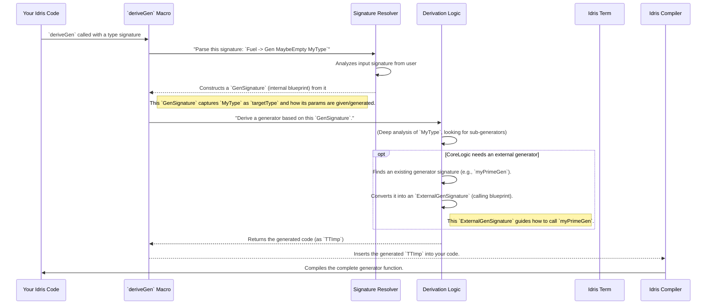

# Chapter 6: Generator Signature Definition

Welcome back! In [Chapter 5: Derivation Entry Point](05_derivation_entry_point_.md), we learned about the magic of `deriveGen` and `deriveGenFor` macros. These macros automatically create data generators for your Idris types. But how do these macros know *exactly* what kind of generator to build? They need a precise "blueprint" for the generator's type signature. That blueprint is what we call a **Generator Signature Definition**.

## What Problem Do Generator Signatures Solve?

Imagine you're asking a chef to bake a cake. You can't just say "bake a cake"; you need to give them specifications: "I want a chocolate cake, with vanilla frosting, for 10 people, and it needs to be gluten-free."

Similarly, when `DepTyCheck` automatically generates a function for you (like `genTrafficLight` from the last chapter), it needs to know all the details about that function's "shape" or "signature." This includes:
*   **What type of data should it generate?** (e.g., `TrafficLight`)
*   **What inputs does the generator function itself need?** (e.g., `Fuel`, or maybe other parameters like a maximum size for a list).
*   **Are there any other custom generators it needs to use?** (e.g., "use *my* special string generator for all strings").

Our central use case for this chapter is: **To precisely define the structure and requirements of an automatically derived generator function, so `DepTyCheck` can generate code that perfectly matches our intended design.** This "definition" is handled by `GenSignature` and `ExternalGenSignature`.

## `GenSignature`: The Blueprint for an Internal Generator

`GenSignature` is an internal record (think of it as a small data structure) `DepTyCheck` uses to keep track of the fundamental structure of a generator. It's like a simplified blueprint used *inside* the factory.

Let's revisit our `genTrafficLight` signature from the previous chapter:

```idris
genTrafficLight : Fuel -> Gen MaybeEmpty TrafficLight
```

When `DepTyCheck` sees this, it converts it into a `GenSignature` record. What information does it store?

### Key Parts of `GenSignature`

1.  `targetType : TypeInfo`: This tells us *what type of data* the generator produces. In our example, `targetType` would capture information about `TrafficLight`. `TypeInfo` is another structure that holds details about a type, like its name and its arguments.
2.  `givenParams : SortedSet $ Fin targetType.args.length`: This might look a bit scary, but it's simple! It's a list (specifically, a `SortedSet` of `Fin` numbers) of the *indices* of the arguments from `targetType` that are *provided* to the generator function.

Let's break down `givenParams` with another example:

Imagine a type `Vec : Nat -> Type -> Type` for a vector of a certain length and element type. If we wanted to generate `Vec`s, our generator signature might look like:

```idris
genVec : (len : Nat) -> Fuel -> Gen MaybeEmpty (Vec len String)
```

Here, `Vec` expects `len` (a `Nat`) and `String` as its arguments. But our generator also *takes* `len` as an argument. So, `len` is part of both `Vec len String` *and* an argument to `genVec`. `givenParams` keeps track of *which* of `Vec`'s parameters are *given* by the generator's input.

In our `TrafficLight` example, `TrafficLight` has no parameters itself (like `len` for `Vec`). So, its `givenParams` would be empty.

The `GenSignature` record itself looks like this:

```idris
record GenSignature where
  constructor MkGenSignature
  targetType : TypeInfo
  givenParams : SortedSet $ Fin targetType.args.length
```
**Explanation:** This defines a new data type called `GenSignature`. It has two fields: `targetType` (which holds information about the type we want to generate) and `givenParams` (which tells us which of the target type's own arguments are supplied as inputs to the generator).

## `ExternalGenSignature`: The Blueprint for a *User-Provided* Generator

Sometimes, you don't want `DepTyCheck` to *derive* a generator, but rather to use one you've *already written* (or one from another library). This is where `ExternalGenSignature` comes in. It's similar to `GenSignature` but adds more details about how to *call* that external generator.

Let's imagine you have a very specific way to generate prime numbers:

```idris
myPrimeGen : (max : Nat) -> Fuel -> Gen MaybeEmpty (Prime max)
myPrimeGen max fuel = -- ... your custom generation logic ...
```

If `DepTyCheck` needs to use `myPrimeGen` inside a larger derived generator, it needs to know:
*   **What type of data does it generate?** (`Prime max`)
*   **What inputs does `myPrimeGen` need?** (`max` and `Fuel`)
*   **How explicitness works?** Is `max` an explicit argument, or implicit?

### Key Parts of `ExternalGenSignature`

`ExternalGenSignature` has the `targetType` and `givenParams` like `GenSignature`, but it also adds:

1.  `givenParams : SortedMap (Fin targetType.args.length) (ArgExplicitness, Name)`: This is a more detailed version of `givenParams`. Instead of just the index, it stores:
    *   The index of the argument.
    *   Its `ArgExplicitness` (whether it's `ExplicitArg` or `ImplicitArg`).
    *   Its `Name` (the name of the argument, like `max`).
2.  `givensOrder` and `gendOrder`: These capture the *order* in which arguments are given/generated. This is important when calling functions because argument order matters!

The `ExternalGenSignature` record looks like this:

```idris
record ExternalGenSignature where
  constructor MkExternalGenSignature
  targetType : TypeInfo
  givenParams : SortedMap (Fin targetType.args.length) (ArgExplicitness, Name)
  givensOrder : Vect givenParams.size $ Fin givenParams.size
  gendOrder   : Vect gendParamsCnt $ Fin gendParamsCnt
```
**Explanation:** This record is similar to `GenSignature` but `givenParams` now also includes `ArgExplicitness` and `Name` for each parameter. It also explicitly tracks the `givensOrder` and `gendOrder` to know the sequence of arguments.

## How `DepTyCheck` Uses These Signatures

When `DepTyCheck` encounters a request to `deriveGen` for, say, `Fuel -> Gen MaybeEmpty MyType`, here's how these signatures come into play:



In short, the `GenSignature` and `ExternalGenSignature` records provide a structured way for `DepTyCheck` to understand and represent the input and output requirements of generator functions, both for the ones it's deriving and the ones it needs to call. It's like having standardized blueprints for different types of generator parts, making the automatic assembly process much smoother.

## Simplified Code Walkthrough

Let's look at a simplified function, `canonicSig`, that takes a `GenSignature` and converts it into an Idris `TTImp`. `TTImp` is Idris's internal way of representing code or types, sort of like a "code template" the compiler understands.

Think back to `genTrafficLight : Fuel -> Gen MaybeEmpty TrafficLight`. The `canonicSig` function helps build the *type* part of this signature (`Fuel -> Gen MaybeEmpty TrafficLight`) from the `GenSignature` specification.

```idris
-- From src/Deriving/DepTyCheck/Gen/Signature.idr

export
canonicSig : GenSignature -> TTImp
canonicSig sig = piAll returnTy $ MkArg MW ExplicitArg Nothing `(Data.Fuel.Fuel) :: (arg <$> Prelude.toList sig.givenParams) where
  -- ... (details about 'arg' and 'returnTy' for brevity) ...

  returnTy : TTImp
  returnTy = `(Test.DepTyCheck.Gen.Gen Test.DepTyCheck.Gen.Emptiness.MaybeEmpty ~(buildDPair targetTypeApplied generatedArgs))
```
**Explanation:**

1.  `canonicSig : GenSignature -> TTImp`: This function takes our `GenSignature` blueprint and produces an `TTImp` (an Idris term representing a type signature).
2.  `piAll returnTy ...`: This is how Idris `TTImp`s represent a function type (a `Pi` type). It says, "this is a function that takes some arguments and returns `returnTy`."
3.  `MkArg MW ExplicitArg Nothing `(Data.Fuel.Fuel)`: This part is creating the `Fuel` argument for our generator function (`Fuel -> ...`).
4.  `(arg <$> Prelude.toList sig.givenParams)`: This adds any arguments defined in `sig.givenParams` (if the target type has parameters that the generator also takes, like `len` in `genVec`).
5.  `returnTy`: This inner part (`Gen MaybeEmpty ~(buildDPair targetTypeApplied generatedArgs)`) constructs the return type of the generator.
    *   `Test.DepTyCheck.Gen.Gen Test.DepTyCheck.Gen.Emptiness.MaybeEmpty`: This explicitly names the `Gen` type constructor and its "emptiness" property. We'll learn more about `MaybeEmpty` in [Chapter 9: Generator Emptiness](09_generator_emptiness_.md).
    *   `~(buildDPair targetTypeApplied generatedArgs)`: This is where the generated type and its generated parameters are put together. `buildDPair` creates a `DPair` (Dependent Pair) which holds the actual type (`TrafficLight`) and then a list of all its generated arguments.

This `canonicSig` function is crucial because it allows `DepTyCheck` to "reflect" on the signature it needs to generate and then build that signature as an internal `TTImp` that the Idris compiler can then use.

## Conclusion

Generator Signature Definitions, primarily through the `GenSignature` and `ExternalGenSignature` records, are the foundational blueprints that `DepTyCheck` uses to understand and structure generator functions. They precisely define the target type, given parameters, and the nature of the generated output. By using these records, `DepTyCheck` can automatically infer and construct the correct type signatures for derived generators and correctly call external ones, ensuring that the generated code aligns perfectly with the user's intentions. This abstraction is key to the robustness and flexibility of `DepTyCheck`'s automatic generation capabilities.

Next, we'll dive into how the *core logic* of our test generators are actually built in [Chapter 7: Test Generator Core](07_test_generator_core_.md).

[Next Chapter: Test Generator Core](07_test_generator_core_.md)

---

Generated by [AI Codebase Knowledge Builder](https://github.com/The-Pocket/Tutorial-Codebase-Knowledge)