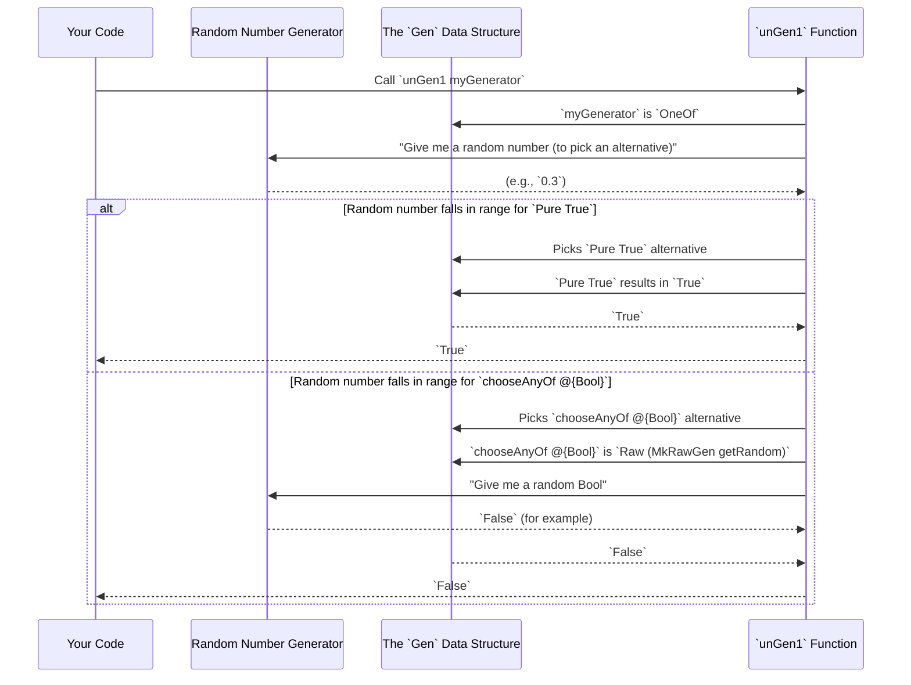

# Chapter 7: Test Generator Core

Welcome back! In [Chapter 6: Generator Signature Definition](06_generator_signature_definition_.md), we explored how `DepTyCheck` uses blueprints (generator signatures) to understand what kind of generators to build. Now, it's time to dive into the very heart of `DepTyCheck`'s property-based testing capabilities: the **Test Generator Core**. This is where the actual "test data" is born!

## What Problem Does the `Gen` Data Type Solve?

Imagine you're building with LEGOs. You have the instruction manual (our generator signature), but you still need the actual LEGO bricks and the ways to connect them. The `Gen` data type is exactly that: it's `DepTyCheck`'s "LEGO set" for building *any kind* of test data generator.

The core problem `Gen` solves is: **how do we create flexible, composable, and potentially random ways to produce values of a specific Idris type?** We want to be able to make simple generators (like one that always gives "hello"), complex ones (like a random list of numbers), and combine them easily.

Our central use case for this chapter is: **To understand the fundamental building blocks (`Gen` constructors) that allow us to create and combine test data generators in `DepTyCheck`.**

## Introducing the `Gen` Data Type: Your Test Data LEGO Set

The `Gen` data type is defined in `src/Test/DepTyCheck/Gen.idr`. It's a special kind of Idris data type that represents a "generator of values." When you have a `Gen` for a type `A`, you can ask it to give you random `A`s.

Let's look at its basic shape (simplified for clarity):

```idris
data Gen : Emptiness -> Type -> Type where
  Empty  : Gen MaybeEmpty a
  Pure   : a -> Gen em a
  Raw    : RawGen a -> Gen em a
  OneOf  : GenAlternatives True em a -> Gen em a
  Bind   : RawGen c -> (c -> Gen biem a) -> Gen em a
  -- ... and some other constructors we'll meet later ...
```

This `Gen em a` might look a bit intimidating at first, but let's break it down:

*   `em`: This is the `Emptiness` parameter. It tells us whether this generator *can* produce nothing (`MaybeEmpty`) or is *guaranteed* to always produce something (`NonEmpty`). We'll dive much deeper into this in [Chapter 9: Generator Emptiness](09_generator_emptiness_.md). For now, think of `NonEmpty` as "always works" and `MaybeEmpty` as "might fail."
*   `a`: This is the `Type` of values the generator produces. So, `Gen NonEmpty String` would be a generator that always makes `String`s.

Now, let's explore the core "LEGO bricks" (constructors) of `Gen`:

### 1. `Empty`: The Generator That Produces Nothing

```idris
Empty : Gen MaybeEmpty a
```

*   **What it does:** This generator is very simple: it *never* produces a value. It's only possible for generators with `MaybeEmpty` emptiness.
*   **Analogy:** It's like an empty LEGO box. No matter how much you shake it, no bricks will come out.
*   **When to use it:** When you explicitly know that for certain inputs, no valid values can be generated for a type. For example, a generator for `Fin 0` (finite sets of size zero) would always be `Empty`.

### 2. `Pure`: The Generator That Always Gives the Same Value

```idris
Pure : a -> Gen em a
```

*   **What it does:** This generator always produces the exact same value `a` you give it. It doesn't use randomness.
*   **Analogy:** It's a LEGO set where you always get the same single, specific brick.
*   **When to use it:** When you need a constant value in your generated data. For example, `Pure 42` is a generator that always gives you the number `42`.

### 3. `Raw`: The Generator That Uses Pure Randomness

```idris
Raw : RawGen a -> Gen em a
```

*   **What it does:** This constructor wraps a `RawGen a`. A `RawGen a` is basically a direct way to interact with the underlying random number generator (`MonadRandom`). It says, "just give me a random `a` from the system's randomness."
*   **Analogy:** You reach into a bag of assorted LEGOs and pull out a random piece.
*   **When to use it:** For fundamental random operations. `DepTyCheck` uses `Raw` for basic types like generating a random `Int` or `Char`. For example, `getRandom` from `Control.Monad.Random` would be wrapped in a `RawGen`.

    ```idris
    -- A very simple generator for any Random type `a`
    chooseAny : Random a => Gen NonEmpty a
    chooseAny = Raw $ MkRawGen getRandom
    ```
    This `chooseAny` generator uses `Raw` to simply ask for a random value of type `a`.

### 4. `OneOf`: Combining Multiple Generators

```idris
OneOf : GenAlternatives True em a -> Gen em a
```

*   **What it does:** This combines several other generators. When `OneOf` is run, it randomly picks *one* of the generators you provided and then runs *that* chosen generator. `GenAlternatives` is a way to hold a list of generators, possibly with weights (frequencies).
*   **Analogy:** You have several different smaller LEGO sets. You randomly pick one of these sets, and then you build whatever that set tells you to build.
*   **When to use it:** When you want to model choices. For example, our `genTrafficLight` from [Chapter 5: Derivation Entry Point](05_derivation_entry_point_.md) would internally use `OneOf` to choose between `Red`, `Yellow`, or `Green`.

    ```idris
    -- An example of using OneOf
    genTrafficLight : Gen NonEmpty TrafficLight
    genTrafficLight = oneOf (altsFromList [Pure Red, Pure Yellow, Pure Green])
    -- 'oneOf' is a helper function that uses the 'OneOf' constructor
    ```
    This example shows `genTrafficLight` using `oneOf` (which then uses `OneOf`) to pick one of the three `Pure` generators.

### 5. `Bind`: Chaining Generators (Monadic Composition)

```idris
Bind : RawGen c -> (c -> Gen biem a) -> Gen em a
```

*   **What it does:** This is the most powerful constructor, enabling sequential operations with generators. It first runs a `RawGen c` to produce a value `c`. Then, it takes that `c` and passes it to a *function* `(c -> Gen biem a)`, which in turn produces *another* generator that is then run. This is exactly what the `>>=` (bind) operator does for `Monad`s!
*   **Analogy:** You build one part of your LEGO project (get `c`), and *then*, based on what `c` turned out to be, you look up the *next* instruction manual (`c -> Gen biem a`) and build the rest of your project accordingly.
*   **When to use it:** When the generation of one part of your data depends on a randomly generated value from another part. For example, to generate a random list of random length: first generate the length (`RawGen Nat`), then use that length to generate a list of that many elements (`Nat -> Gen ... (List a)`).

    ```idris
    -- Example: Generating a list of random length
    genListOfRandomLength : Gen NonEmpty (List Int)
    genListOfRandomLength =
      choose (0, 10) `Bind` \len => sequence (List.replicate len (choose (0, 100)))
    -- 'choose (0, 10)' generates a length, then that length is used to create a list.
    -- (This uses the Monad instance, which internally uses Bind)
    ```

## Interfaces: How Generators Play Together

The `Gen` data type is not just a collection of constructors; it's designed to be composable. This is achieved by making it an instance of standard functional programming interfaces: `Functor`, `Applicative`, and `Monad`.

*   **`Functor (Gen em)`:** Allows you to `map` (transform) the values *inside* a generator without changing how they are generated.
    ```idris
    -- If genInt produces a random integer,
    -- then (+1) <$> genInt produces a random integer plus one.
    incrementedIntGen : Gen NonEmpty Int
    incrementedIntGen = (+1) <$> chooseAnyOf @{Int}
    ```
*   **`Applicative (Gen em)`:** Allows you to combine independent generators. It's useful for building structured data, like records or tuples, where each field is generated independently.
    ```idris
    -- Imagine you have genName (Gen String) and genAge (Gen Int)
    -- This combines them to make a (String, Int) tuple.
    genPersonTuple : Gen NonEmpty (String, Int)
    genPersonTuple = (,) <$> genName <*> genAge

    -- Or using the applicative do notation:
    genPersonTuple' : Gen NonEmpty (String, Int)
    genPersonTuple' = [| (name, age) |]
      where
        name = genName
        age  = genAge
    ```
    The `[| ... |]` syntax is syntactic sugar for `Applicative` expressions.
*   **`Monad (Gen em)`:** Allows you to chain generators where the next generation step depends on the result of a previous one. We saw this with `Bind`.
    ```idris
    -- If genLength makes a Nat, and genStringOfLength takes a Nat to make a String
    genRandomString : Gen NonEmpty String
    genRandomString = do
      len <- genLength      -- Generate a random length
      str <- genStringOfLength len -- Generate a string of that specific length
      pure str            -- Return the string
    ```
    This `do` notation is syntactic sugar for the `>>=` (bind) operator.

These interfaces are crucial because they let you build generators from smaller pieces in a structured and intuitive way, much like how you logically combine operations in regular programming.

## How `Gen` is Used Internally: Running the Generator

Once you've built a `Gen` instance, you need a way to actually *get* values out of it. This is where functions like `unGen1` and `unGen` come in. These functions "run" the generator.

```idris
-- From src/Test/DepTyCheck/Gen.idr

export
unGen1 : MonadRandom m => (labels : CanManageLabels m) => Gen1 a -> m a
unGen1 $ Pure x         = pure x
unGen1 $ Raw sf         = sf.unRawGen
unGen1 $ OneOf @{_} @{nw} oo with 0 (nonEmptyIsMaximal nw)
  _ | Refl = assert_total unGen1 . force . pickWeighted oo.unGenAlts . finToNat =<< randomFin oo.totalWeight
-- ... and so on for other constructors ...
```

**Explanation of `unGen1` (simplified):**

1.  `unGen1 : ... Gen1 a -> m a`: This function takes a `Gen1 a` (a `Gen NonEmpty a`, meaning it's guaranteed to produce a value) and returns an `m a`. `m` is any `MonadRandom` (a monad that can provide randomness) and `CanManageLabels` (for tracking generator usage, which we'll cover in [Chapter 8: Generator Labels](08_generator_labels_.md)).
2.  `unGen1 (Pure x) = pure x`: If the generator is `Pure x`, it just returns `x` wrapped in the monad `m`. No randomness needed.
3.  `unGen1 (Raw sf) = sf.unRawGen`: If it's a `Raw` generator, it delegates to the `unRawGen` field to get the random value.
4.  `unGen1 (OneOf oo) = ... randomFin ... pickWeighted ... unGen1`: If it's `OneOf`, it generates a random number (`randomFin`), uses that to pick one of the alternative generators from `oo.unGenAlts` (using `pickWeighted`, which considers the weights of each alternative), and then recursively calls `unGen1` on the *chosen* alternative generator.

This recursive nature is key! `unGen1` (and `unGen` for possibly empty generators) walks through the `Gen` data structure, performing the random operations, bindings, and picks as defined by its constructors, until it produces a final value `a`.

## Simulating a Generator Run

Let's imagine you have a very simple generator:

```idris
myGenerator : Gen NonEmpty Bool
myGenerator = oneOf (altsFromList [Pure True, chooseAnyOf @{Bool}])
```

Here's how `unGen1` would "run" this (conceptual, not actual code execution):



This shows how `unGen1` (and `unGen`) interprets the `Gen` data type, using randomness where specified, and eventually returning a concrete value.

## Conclusion

The `Gen` data type is the fundamental toolkit, or "LEGO set," for creating test data generators in `DepTyCheck`. Its basic constructors (`Empty`, `Pure`, `Raw`, `OneOf`, `Bind`) provide simple yet powerful ways to define how values are generated, ranging from fixed constants to complex, dependently-generated structures using randomness. By implementing `Functor`, `Applicative`, and `Monad` interfaces, `Gen` instances can be combined and composed in flexible and intuitive ways, forming a robust foundation for property-based testing. The `unGen` and `unGen1` functions serve as the interpreters, running these `Gen` definitions to produce actual test data.

Next, we'll talk about how `DepTyCheck` can track and label generators for better debugging and analysis in [Chapter 8: Generator Labels](08_generator_labels_.md).

[Next Chapter: Generator Labels](08_generator_labels_.md)

---

Generated by [AI Codebase Knowledge Builder](https://github.com/The-Pocket/Tutorial-Codebase-Knowledge)