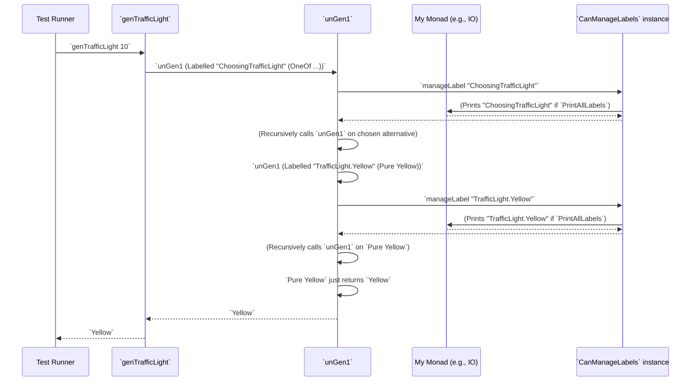

# Chapter 8: Generator Labels

Welcome back! In [Chapter 7: Test Generator Core](07_test_generator_core_.md), we explored the `Gen` data type, which acts as our "LEGO set" for building test data. We learned how its constructors like `Pure`, `OneOf`, and `Bind` help us create diverse values. Now, imagine you've built a really complex LEGO castle using many `Gen` bricks. When something goes wrong – maybe a piece is missing or a part of the castle collapses – how do you figure out *which* specific LEGO brick or sub-assembly caused the problem? That's where **Generator Labels** come in handy!

## What Problem Do Generator Labels Solve?

When `DepTyCheck` automatically generates test data, especially for complex types, it can create thousands of values. If one of these generated values causes a test to fail, it can be very difficult to trace back *where* in the generator definition that specific part of the value came from. Was it from `OneOf` choosing a particular branch? Was it a `Raw` random number that was problematic?

The problem Generator Labels solve is: **how can we tag individual pieces of generated test data with information about which generator produced them, making debugging and coverage analysis much easier?** It's like adding sticky notes to your generated data. These sticky notes tell you the "origin story" of each part of the data.

Our central use case for this chapter is: **To understand how to attach labels to generators so that when a value is generated, we can see a "breadcrumb trail" of which generators contributed to its creation.**

## Introducing `Label` and `CanManageLabels`: The Sticky Notes System

`DepTyCheck` provides a simple `Label` type and an interface called `CanManageLabels` to manage this sticky note system.

### The `Label` Type: Our Simple Sticky Note

A `Label` is just a way to identify a specific part of a generator. Currently, it's mostly a `String`, which makes it easy to add descriptive names.

```idris
-- From Test/DepTyCheck/Gen/Labels.idr (simplified)

export
data Label : Type where
  StringLabel : String -> Label

export %inline
FromString Label where
  fromString = StringLabel

export %inline
Show Label where
  show (StringLabel x) = x
```

**Explanation:**

*   `data Label : Type`: This defines `Label` as a new type.
*   `StringLabel : String -> Label`: The only way to make a `Label` is by giving it a `String`. So, `StringLabel "Choosing a constructor for TrafficLight"` would be a valid label.
*   `FromString` and `Show` instances: These make it convenient to convert `String`s directly into `Label`s and to print `Label`s back as `String`s.

### `CanManageLabels`: The System for Handling Sticky Notes

The `CanManageLabels` interface is a powerful concept in Idris. It defines a "capability" that a monad `m` can have. If a monad `m` is an instance of `CanManageLabels`, it means that `m` knows how to "manage" (record or process) labels.

```idris
-- From Test/DepTyCheck/Gen/Labels.idr

public export
interface Monad m => CanManageLabels (0 m : Type -> Type) where
  manageLabel : Label -> m ()
```

**Explanation:**

*   `interface Monad m => CanManageLabels (0 m : Type -> Type) where`: This declares an interface named `CanManageLabels`. It says, "If `m` is a `Monad`, and `m` wants to be a `CanManageLabels` monad, it must provide a function called `manageLabel`."
*   `manageLabel : Label -> m ()`: This is the function that any `CanManageLabels` monad must implement. It takes a `Label` and performs some action in the monad `m` (represented by `m ()`, meaning it returns nothing of interest, just performs an effect).

### Default Implementations: Ignoring or Printing

`DepTyCheck` provides two default ways `CanManageLabels` can be implemented:

1.  **`IgnoreLabels`:** This is the simplest; it just throws away all labels. It's like having sticky notes but immediately crumpling them up. You use this when you don't care about debugging or coverage.

    ```idris
    -- From Test/DepTyCheck/Gen/Labels.idr

    export %defaulthint
    IgnoreLabels : Monad m => CanManageLabels m
    IgnoreLabels = I where
      [I] CanManageLabels m where
        manageLabel _ = pure () -- Just do nothing!
    ```
    **Explanation:** When `manageLabel` is called in an `IgnoreLabels` context, it simply executes `pure ()`, which does nothing.

2.  **`PrintAllLabels`:** This one is useful for debugging! Every time a generator's label is encountered, it prints that label to the console.

    ```idris
    -- From Test/DepTyCheck/Gen/Labels.idr

    export
    [PrintAllLabels] HasIO io => CanManageLabels io where
      manageLabel = putStrLn . show -- Print the label
    ```
    **Explanation:** For any monad `io` that has `HasIO` (meaning it can perform input/output like `IO`), if it wants to be a `PrintAllLabels` instance of `CanManageLabels`, its `manageLabel` function will simply `putStrLn` (print to standard output) the label.

### How `Gen` Uses Labels

Now, let's connect this back to our `Gen` data type from [Chapter 7: Test Generator Core](07_test_generator_core_.md). When `DepTyCheck` runs a generator, it has a special `label` function that wraps a generator with a label. The `deriveGen` macro uses this `label` function extensively.

```idris
-- From Deriving/DepTyCheck/Gen/Labels.idr

export
labelGen : (desc : CTLabel) -> TTImp -> TTImp
labelGen (MkCTLabel desc) expr = `(Test.DepTyCheck.Gen.label (fromString ~desc) ~expr)

-- From Test/DepTyCheck/Gen.idr (simplified `label` function)
label : CanManageLabels m => Label -> Gen1 a -> Gen1 a
label l g = ...
  -- Internally calls manageLabel l at the appropriate time
```

**Explanation:**

*   `labelGen` is a function used *during compilation* (by the macro) to insert code that adds a label. It takes a `CTLabel` (a compile-time label, often a string) and `expr` (the generator expression) and wraps `expr` with a call to the runtime `label` function.
*   The runtime `label` function in `Gen.idr` actually takes a `Label` and a `Gen1 a`. When this generator is run, the `manageLabel` function of the current `CanManageLabels` instance will be called with this `Label`.

## Central Use Case: Debugging with Labels

Let's revisit our `TrafficLight` example but now we'll imagine `DepTyCheck` automatically added labels.

```idris
data TrafficLight = Red | Yellow | Green

genTrafficLight : Fuel -> Gen NonEmpty TrafficLight -- Imagine it's NonEmpty for simplicity here
genTrafficLight fuel =
  -- This is what deriveGen *might* internally generate (conceptually)
  label "ChoosingTrafficLight" $
    oneOf (altsFromList
      [ label "TrafficLight.Red" $ Pure Red
      , label "TrafficLight.Yellow" $ Pure Yellow
      , label "TrafficLight.Green" $ Pure Green
      ])
```

Now, when you run `genTrafficLight` with `PrintAllLabels`, you'll see something like this:

```idris
-- In the Readme, for example
runGenWd True (genTrafficLight 10) String
```

If you ran this line of code where `String` is the `CanManageLabels` instance with `PrintAllLabels`, the console output (when generating one value) might look like:

```
ChoosingTrafficLight
TrafficLight.Yellow
Yellow
```

**What happened:**

1.  The generator started.
2.  It entered the "ChoosingTrafficLight" part, so `manageLabel "ChoosingTrafficLight"` was called, which printed "ChoosingTrafficLight".
3.  Then, `oneOf` randomly picked the `Pure Yellow` alternative.
4.  It entered the "TrafficLight.Yellow" part, so `manageLabel "TrafficLight.Yellow"` was called, which printed "TrafficLight.Yellow".
5.  Finally, `Pure Yellow` produced the value `Yellow`.

This provides a clear trace! If `Yellow` was the value that caused a test failure, you have a direct path back to *which specific part* of the generator produced it.

## How Labels are Managed (Code-light Walkthrough)

The core `unGen1` (and `unGen`) function in `Test.DepTyCheck.Gen.idr` is responsible for running generators. It takes an implicit `CanManageLabels` argument.

```idris
-- From Test/DepTyCheck/Gen.idr (simplified to show label handling)

export
unGen1 : MonadRandom m => (labels : CanManageLabels m) => Gen1 a -> m a
unGen1 {labels} (Labelled l g) = do
  manageLabel l -- This is where the label is "managed"
  unGen1 {labels} g
unGen1 {labels} (Pure x) = pure x -- No label here
-- ... other constructors ...
```

**Explanation of the simplified `unGen1`:**

1.  `unGen1 : MonadRandom m => (labels : CanManageLabels m) => Gen1 a -> m a`: Notice `(labels : CanManageLabels m)`. This means `unGen1` requires a way to manage labels.
2.  `unGen1 {labels} (Labelled l g) = do ...`: This is the crucial part. If the generator is `Labelled` with label `l` and inner generator `g`:
    *   `manageLabel l`: The `manageLabel` function (provided by the `labels` argument) is called with the current label `l`.
    *   `unGen1 {labels} g`: Then, `unGen1` is recursively called on the inner generator `g`. This means labels are managed *before* the inner generator produces its value.

This sequence diagram illustrates how labels are processed during generation:



## `CTLabel`: Compile-Time Labels for `deriveGen`

When the `deriveGen` macro creates code, it adds labels using a `CTLabel` type (Compile-Time Label). This is slightly different from the `Label` type we saw earlier; `CTLabel` is used *during compilation* to construct the Idris code that will contain the runtime `Label`s.

```idris
-- From Deriving/DepTyCheck/Gen/Labels.idr

public export
data CTLabel = MkCTLabel TTImp

public export
FromString CTLabel where
  fromString = MkCTLabel . primVal . Str

public export
Semigroup CTLabel where
  MkCTLabel l <+> MkCTLabel r = MkCTLabel `(~l ++ ~r)

public export
Monoid CTLabel where
  neutral = ""
```

**Explanation:**

*   `data CTLabel = MkCTLabel TTImp`: A `CTLabel` holds an `TTImp`, which is Idris's internal representation of a term (in this case, the string that will become the runtime label).
*   `FromString` and `Semigroup`/`Monoid` instances: These allow you to easily create `CTLabel`s from strings (e.g., `"myLabel".label`) and combine them (`"part1".label <+> "part2".label` would become a single label like "part1part2"). This is very useful for the macro to build meaningful labels.

The `deriveGen` macro uses these `CTLabel`s internally to build up the descriptive strings that will eventually become the `StringLabel`s at runtime.

## Conclusion

Generator Labels provide a powerful mechanism for introspection and debugging in `DepTyCheck`. By introducing the `Label` type and the `CanManageLabels` interface, `DepTyCheck` allows you to attach descriptive "sticky notes" to different parts of your generators. Whether you choose to `IgnoreLabels` for performance or `PrintAllLabels` for detailed debugging, this system helps you understand the origin of generated values, making it much easier to pinpoint issues in complex property-based tests. The `deriveGen` macro leverages `CTLabel`s to automatically insert these labels, enriching the generated code with valuable context.

Next, we'll explore another critical aspect of generators: the concept of `Emptiness`, which deals with whether a generator is guaranteed to produce a value or might sometimes produce nothing.

[Next Chapter: Generator Emptiness](09_generator_emptiness_.md)

---

Generated by [AI Codebase Knowledge Builder](https://github.com/The-Pocket/Tutorial-Codebase-Knowledge)