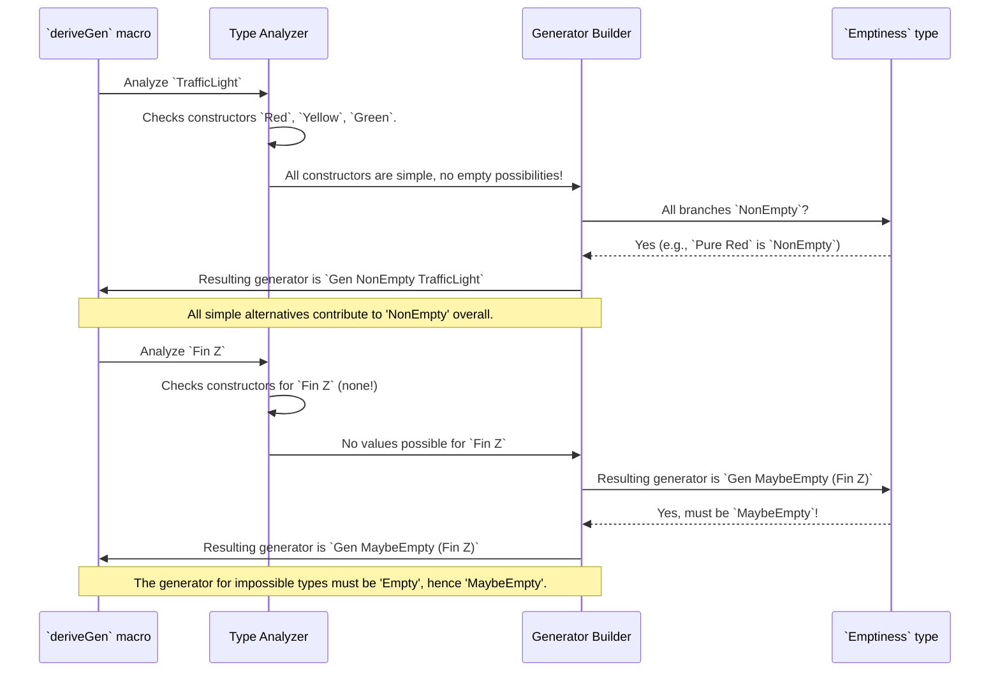

# Chapter 9: Generator Emptiness

Welcome back! In [Chapter 8: Generator Labels](08_generator_labels_.md), we learned how to attach labels to our generators to help us debug and understand the origin of generated values. Now, we're going to dive into a concept that's fundamental when working with type-driven development and property-based testing: **Generator Emptiness**.

## What Problem Does Generator Emptiness Solve?

Imagine you're trying to generate random test data for a type, say, a `List` of `Nat`s. It's easy: you can generate `[]`, `[1]`, `[1, 5]`, etc. But what if you wanted to generate a value of type `Fin 0`? The type `Fin n` represents natural numbers strictly less than `n`. So, `Fin 0` means "natural numbers strictly less than 0." Are there any such numbers? No! `Fin 0` is an *empty type* – it has no possible values.

If you try to generate a value for `Fin 0` with a regular generator, it will just loop forever, trying to find a value that doesn't exist. This is a big problem!

The problem Generator Emptiness solves is: **how can we express whether a generator is guaranteed to always produce a value, or if it might sometimes fail to produce a value (become empty)?** This allows us to handle types like `Fin 0` gracefully and prevents infinite loops or crashes when working with types that might not have any inhabitants.

Our central use case for this chapter is: **To classify generators by their "emptiness guarantee" so that we can clearly state whether a generator will always give us a value or if it might return nothing.** This helps us write safer and more predictable property-based tests, especially with dependent types.

## The `Emptiness` Data Type: Our Traffic Light System

`DepTyCheck` uses a simple data type called `Emptiness` to represent this guarantee. Think of it like a traffic light system for generators:

```idris
-- From src/Test/DepTyCheck/Gen/Emptiness.idr

public export
data Emptiness = NonEmpty | MaybeEmpty
```

Let's break it down:

*   **`NonEmpty` (Green Light):**
    *   **Meaning:** This generator is guaranteed to always produce at least one value. It will never fail.
    *   **Analogy:** A green traffic light means "Go! You are guaranteed to pass through this intersection."
    *   **Example:** A generator for `Bool` (which can always be `True` or `False`) would be `Gen NonEmpty Bool`.

*   **`MaybeEmpty` (Yellow Light):**
    *   **Meaning:** This generator might produce a value, but it might also produce nothing. It's not guaranteed.
    *   **Analogy:** A yellow traffic light means "Be cautious! You might pass, or you might have to stop."
    *   **Example:** A generator for `Fin n`. If `n` is `0`, it's empty. If `n` is `5`, it's not. So, a generator for *any* `Fin n` needs to deal with the `MaybeEmpty` case. `Gen MaybeEmpty (Fin n)`.

## `NoWeaker`: Comparing Emptiness Guarantees

Sometimes, we need to compare these `Emptiness` guarantees. For example, if we have a generator that is `NonEmpty`, it's certainly "not weaker" than a `MaybeEmpty` generator. `DepTyCheck` defines a relation called `NoWeaker` for this purpose.

```idris
-- From src/Test/DepTyCheck/Gen/Emptiness.idr

public export
data NoWeaker : (from, to : Emptiness) -> Type where
  NN : NonEmpty `NoWeaker` NonEmpty
  AS : em       `NoWeaker` MaybeEmpty
```

This `NoWeaker` relation defines an ordering:

*   `NonEmpty `NoWeaker` NonEmpty` (`NN`): A `NonEmpty` generator is not weaker than another `NonEmpty` generator (they are equally strong).
*   `em `NoWeaker` MaybeEmpty` (`AS`): Any `Emptiness` (`em`, which could be `NonEmpty` or `MaybeEmpty`) is not weaker than `MaybeEmpty`. This means:
    *   `NonEmpty `NoWeaker` MaybeEmpty`: A `NonEmpty` generator is *not weaker* than a `MaybeEmpty` one (it's stronger because it gives more guarantees).
    *   `MaybeEmpty `NoWeaker` MaybeEmpty`: A `MaybeEmpty` generator is *not weaker* than another `MaybeEmpty` one (they are equally strong).

What's *not* possible? You cannot have `MaybeEmpty `NoWeaker` NonEmpty`. This is explicitly stated using `Uninhabited`:

```idris
-- From src/Test/DepTyCheck/Gen/Emptiness.idr

Uninhabited (MaybeEmpty `NoWeaker` NonEmpty) where
  uninhabited _ impossible
```
This means Idris knows that it's impossible for a generator that *might* be empty to guarantee that it's *never* empty. This is crucial for soundness!

This `NoWeaker` relation essentially means: if you have a `Gen from_em val` and you need `Gen to_em val`, then `from_em` must be `NoWeaker` than `to_em`. You can "weaken" the guarantee (e.g., convert `NonEmpty` to `MaybeEmpty`), but you can't "strengthen" it without proof.

### The Power of `Ord` and `LinearOrder`

The module also defines `Ord`, `LinearOrder`, `Reflexive`, `Transitive`, `Antisymmetric`, `Preorder`, `PartialOrder`, `Connex`, and `StronglyConnex` instances for `Emptiness` based on `NoWeaker`. This means `Emptiness` behaves like mathematical "orders" (like numbers where `1 < 2`, `2 > 1`, `1 = 1`).

This allows us to compare `Emptiness` values directly and use functions like `min` (minimum).
For `Emptiness`, `min NonEmpty MaybeEmpty` would be `MaybeEmpty`, because `MaybeEmpty` is the "weaker" (smaller guarantee) one. `min NonEmpty NonEmpty` would be `NonEmpty`.

## Central Use Case Example: `genFin`

Let's illustrate our central use case with the `Fin n` example. We want a generator `genFin` that can generate `Fin n` for *any* `n : Nat`.

```idris
-- This is how deriveGen might generate it conceptually
-- (simplified heavily for beginner clarity and to highlight emptiness)

import Test.DepTyCheck.Gen

genFin : (n : Nat) -> Gen MaybeEmpty (Fin n)
genFin Z = Empty  -- If n is 0, there are no Fin 0 values, so the generator is Empty
genFin (S k) = Pure (FS Z) -- If n is S k (means n is at least 1), we can at least generate FS Z (which is 0)
                          -- A real generator would be more complex and generate random values
```

**Explanation:**

1.  `genFin : (n : Nat) -> Gen MaybeEmpty (Fin n)`: The return type here is `Gen MaybeEmpty (Fin n)`. This means that for *any* `n` you give it, this generator *might* be empty. This is correct, because if `n` is `Z` (zero), it *will* be empty.
2.  `genFin Z = Empty`: When `n` is `Z`, we explicitly say the generator is `Empty`. This `Empty` constructor will effectively stop the generation process for `Fin 0` values, preventing an infinite loop and correctly indicating that no such values exist.
3.  `genFin (S k) = Pure (FS Z)`: When `n` is `S k` (meaning `n` is at least `1`), we *can* produce a value (like `FS Z`, which is `0`). So, for these cases, the generator is *not* empty.

Because `genFin` *can* produce `Empty` (when `n` is `Z`), its overall `Emptiness` must be `MaybeEmpty`.

Contrast this with `genBool`:

```idris
genBool : Gen NonEmpty Bool
genBool = Pure True -- A simple non-empty generator for Bool
```

Here, `genBool` is `Gen NonEmpty Bool` because `Bool` always has values (`True`, `False`), so a generator for it will never be empty.

### How `Emptiness` Affects Generator Combinators

The `Emptiness` parameter on the `Gen` type is tracked very carefully throughout `DepTyCheck`. When you combine generators (e.g., using `Applicative` or `Monad`), the resulting generator's `Emptiness` is automatically determined based on the `Emptiness` of its parts.

For example, if you `AND` two conditions, and one *might* be false, the whole thing *might* be false. Similarly, if you combine two `MaybeEmpty` generators, the result will probably be `MaybeEmpty`. If you combine a `NonEmpty` and a `MaybeEmpty` generator, the smallest common `Emptiness` (the `min` of the two) is used, which would be `MaybeEmpty`, because the result *could* be empty if the `MaybeEmpty` part fails.

```idris
-- Conceptual example of combining:

-- g1 : Gen NonEmpty A
-- g2 : Gen MaybeEmpty B

-- g3 : Gen MaybeEmpty (A, B) -- The result of combining g1 and g2 must be MaybeEmpty
--                             -- because g2 might fail, making the tuple impossible.
```

## How `Emptiness` Is Used Internally

The `Emptiness` parameter lives directly in the type of `Gen`: `Gen : Emptiness -> Type -> Type`. This is a powerful feature of Idris's dependent types! It means the compiler *knows* at compile time whether a generator might return nothing.

When `DepTyCheck` generates code (e.g., via `deriveGen`), it tries to infer the strongest possible `Emptiness` guarantee. This involves analyzing the data type:
*   If *all* constructors of a data type are guaranteed to produce values, and all arguments to those constructors are also `NonEmpty`, then the derived generator can be `NonEmpty`.
*   If *any* constructor is impossible, or any argument to any constructor *might* be empty, then the whole derived generator must be `MaybeEmpty`.

### Code Walkthrough: Enforcing `NonEmpty`

Let's look into the implementation slightly. There's a helper function (not shown explicitly in `Emptiness.idr` but crucial) `nonEmptyIsMaximal` which can prove that if `em` is `NoWeaker` than `NonEmpty`, then `em` *must* be `NonEmpty`.

```idris
-- From src/Test/DepTyCheck/Gen/Emptiness.idr

export
nonEmptyIsMaximal : (0 _ : em `NoWeaker` NonEmpty) -> em = NonEmpty
nonEmptyIsMaximal nw = irrelevantEq $ case nw of NN => Refl
```

**Explanation:**

*   `(0 _ : em `NoWeaker` NonEmpty)`: This is an *implicit argument*. It means "give me a proof that `em` is not weaker than `NonEmpty`."
*   `em = NonEmpty`: The function returns a proof that `em` *must be exactly* `NonEmpty`.
*   `case nw of NN => Refl`: The only way `em `NoWeaker` NonEmpty` can be constructed is with `NN`, which implies that `em` *is* `NonEmpty`. So, we can indeed prove `em = NonEmpty`.

This seemingly abstract `nonEmptyIsMaximal` function is used by the `Gen` library to ensure type safety. For example, some higher-order functions over `Gen` might require their input generators to be `NonEmpty`. This function helps the Idris type checker verify such requirements.

### Sequence Diagram: Emptiness in `OneOf`

Consider how `Emptiness` works for the `OneOf` constructor:



The diagram shows that `Emptiness` isn't just an afterthought; it's a fundamental part of the type system that flows through the derivation process. The `deriveGen` macro actively uses knowledge about `Emptiness` to assign the correct type to the generated generator.

## Conclusion

Generator Emptiness, represented by the `Emptiness` data type (`NonEmpty` or `MaybeEmpty`), allows `DepTyCheck` to explicitly track whether a generator is guaranteed to always produce a value or if it might sometimes fail. This intelligent tracking, enforced by Idris's dependent type system and the `NoWeaker` relation, prevents runtime errors and infinite loops when dealing with types that have no valid inhabitants or when combining generators with varying guarantees. By clearly distinguishing between `NonEmpty` (green light) and `MaybeEmpty` (yellow light) generators, we build more robust and predictable property-based tests.

Next, we'll shift gears slightly and explore how we can fine-tune our generators' behavior using the Generator Tuning Interface.

[Next Chapter: Generator Tuning Interface](10_generator_tuning_interface_.md)

---

Generated by [AI Codebase Knowledge Builder](https://github.com/The-Pocket/Tutorial-Codebase-Knowledge)