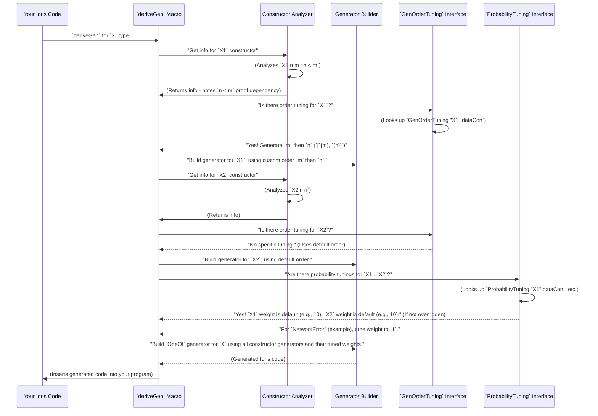

# Chapter 10: Generator Tuning Interface

Welcome back! In [Chapter 9: Generator Emptiness](09_generator_emptiness_.md), we got a handle on whether our generators will always give us a value (`NonEmpty`) or might sometimes come up empty (`MaybeEmpty`). While knowing this is great for safety, what if we want more control over *how* our generators produce values? This is where the **Generator Tuning Interface** comes in.

## What Problem Does Generator Tuning Solve?

Imagine `DepTyCheck` is like an automatic bakery that makes cakes for you. By default, it does a pretty good job. But sometimes, you want a specific kind of cake. Maybe you want the frosting to be put on before the sprinkles, or you want more chocolate cakes than vanilla ones for your party. The automatic bakery doesn't know your preferences!

In `DepTyCheck`, when you use `deriveGen` to automatically create a generator for a data type, it usually makes sensible choices. But "sensible" isn't always "ideal" for your specific tests. You might need to:
1.  **Prioritize generation order:** For a data type `Foo X Y Z`, maybe `Z` has to be generated before `X` and `Y` because `Z` constrains them.
2.  **Influence probabilities:** If your data type has `ConstructorA` and `ConstructorB`, maybe `ConstructorA` leads to a common case, and you want it to be generated 90% of the time, while `ConstructorB` is a rare edge case, generated only 10% of the time.

The problem Generator Tuning solves is: **how can users provide custom instructions to `DepTyCheck`'s automatic generator derivation process, allowing them to fine-tune the generation order of constructor arguments and control the probability of specific constructors being chosen?** It's like adding special order forms to our automatic bakery.

Our central use case for this chapter is: **To learn how to influence the order in which constructor arguments are generated and how to set custom probabilities for choosing different constructors within a derived generator.**

## Introducing `GenOrderTuning` and `ProbabilityTuning`: Your Control Panel

`DepTyCheck` provides two interfaces (like special forms) that you can implement for your data types to provide these tuning instructions: `GenOrderTuning` and `ProbabilityTuning`.

### 1. `GenOrderTuning`: Controlling the Sequence of Generation

`GenOrderTuning` allows you to tell `DepTyCheck`: "When generating a value for *this constructor*, please generate *these arguments first*, in *this order*." This is extremely useful for dependent types, where the value of one argument might constrain the possible values of another.

Let's look at an example data type `X`:

```idris
data X : Nat -> Nat -> Type where
  X1 : (n, m : Nat) -> n `LT` m => X n m
  X2 : X n n
```

*   `X1 n m`: This constructor has two `Nat` arguments, `n` and `m`, AND a proof that `n` is strictly less than `m` (`n `LT` m`). If `DepTyCheck` generates `n` and `m` randomly *first*, it might generate `n=5, m=3`. Then it would try to find a proof that `5 < 3`, which is impossible! This would lead to an empty or failing generator.
    Instead, it's better to generate `m` first, then generate `n` such that `n < m`.
*   `X2 n n`: This constructor ensures that its two `Nat` parameters are equal.

To make `DepTyCheck` generate `m` before `n` for `X1`, we use `GenOrderTuning`:

```idris
GenOrderTuning "X1".dataCon where
  isConstructor = itIsConstructor
  deriveFirst gt gc = [`{m}, `{n}] -- Generate `m` then `n`
```

**Explanation:**

1.  `GenOrderTuning "X1".dataCon`: This implements the `GenOrderTuning` interface *specifically for the constructor `X1`* of the type `X`. `"X1".dataCon` is how we refer to the constructor `X1`.
2.  `isConstructor = itIsConstructor`: This is a boilerplate line. It's a special macro (`itIsConstructor`) that uses Idris's reflection capabilities to confirm that `"X1".dataCon` is indeed a constructor and to extract its details. If you typed `X3` here, it would fail to compile!
3.  `deriveFirst gt gc = [`{m}, `{n}]`: This is where the magic happens!
    *   `deriveFirst` is the function you implement. It takes `givenTyArgs` (arguments of the type `X`, which are `n` and `m` here) and `givenConArgs` (arguments of the constructor `X1`, and its proof `n `LT` m`). These `givenTyArgs` and `givenConArgs` can tell you what arguments might already be "known" or generated.
    *   `[`{m}, `{n}]`: This is a list of constructor arguments that `DepTyCheck` should try to generate *first*. Here, we're explicitly saying: "First, generate the argument named `m`, then generate the argument named `n`." The `{}` syntax is for "name literals" in Idris, letting us refer to an argument by its name. We could also use indices, like `[1, 0]` for `m` (index 1) and `n` (index 0).

With this `GenOrderTuning` instance, `DepTyCheck` will intelligently generate `m` first, then pick an `n` that satisfies `n < m`, making the generation of `X1` values much more robust.

### 2. `ProbabilityTuning`: Influencing Constructor Choice

`ProbabilityTuning` allows you to assign custom weights (probabilities) to constructors. By default, `DepTyCheck` tries to pick constructors with roughly an equal chance or applies some heuristic based on size. But you might want to force a specific distribution.

Let's say we have a data type `Event`:

```idris
data Event = MouseClick | KeyPress | NetworkError
```

Normally, `MouseClick`, `KeyPress`, and `NetworkError` would be chosen with equal probability (1/3 each). But what if `NetworkError` is a very rare and important edge case that we want to test specifically, say, 5% of the time, while the others are 47.5% each?

```idris
ProbabilityTuning "NetworkError".dataCon where
  isConstructor = itIsConstructor
  tuneWeight = const 1 -- Assign a weight of 1 for NetworkError
-- For MouseClick, KeyPress, leave default or tune separately
```
If other constructors have default weights, and you set `NetworkError` to `1`, and imagine if others had a default weight of `10`, then `NetworkError` would be picked `1 / (1 + 10 + 10) = 1/21` of the time. The `tuneWeight` function takes the default weight `(Nat1)` and returns the new weight `(Nat1)`. Here, `const 1` ignores the default weight and always makes it 1.

**Explanation:**

1.  `ProbabilityTuning "NetworkError".dataCon`: This implements `ProbabilityTuning` for the `NetworkError` constructor.
2.  `isConstructor = itIsConstructor`: Again, boilerplate to confirm it's a constructor.
3.  `tuneWeight = const 1`: This is the custom tuning. `tuneWeight` is a function that takes the *default calculated weight* (of type `Nat1`, meaning "natural number starting from 1") and returns the *new custom weight*. Here, `const 1` means we ignore the default weight and assign a fixed weight of `1` to `NetworkError`.

By implementing `ProbabilityTuning` for other constructors (`MouseClick` and `KeyPress`) with higher `tuneWeight` values, you can achieve the desired probability distribution.

## How Tuning Interfaces Influence `deriveGen` (Code-Light Walkthrough)

When you call `deriveGen`, `DepTyCheck` does a lot of work under the hood. The `GenOrderTuning` and `ProbabilityTuning` interfaces get consulted during this process.



The key takeaway is that these tuning interfaces allow you to "intercept" `DepTyCheck`'s default behavior *during the compilation process* and inject your own custom rules for generation order and probabilities.

## Diving into the Code: (`src/Deriving/DepTyCheck/Gen/Tuning.idr`)

The core definitions of these interfaces are found in `src/Deriving/DepTyCheck/Gen/Tuning.idr`. Let's re-examine them for slightly more detail.

### `GenOrderTuning` Definition

```idris
namespace GenOrder
  public export
  interface GenOrderTuning (0 n : Name) where
    isConstructor : (con : IsConstructor n ** GenuineProof con)
    deriveFirst : (givenTyArgs : List $ Fin isConstructor.fst.typeInfo.args.length) ->
                  (givenConArgs : List $ Fin isConstructor.fst.conInfo.args.length) ->
                  List $ ConArg isConstructor.fst.conInfo
```

**Explanation:**

*   `interface GenOrderTuning (0 n : Name) where`: This declares the interface. The `0 n : Name` indicates that `n` is an implicit argument (it's often deduced by Idris) and is the `Name` of the constructor we're tuning (e.g., `"X1".dataCon`).
*   `isConstructor : (con : IsConstructor n ** GenuineProof con)`: This field takes proof that `n` is indeed a constructor. `itIsConstructor` is the macro that provides this proof. This ensures type safety and helps `DepTyCheck` get detailed information about the constructor.
*   `deriveFirst : (givenTyArgs : List $ Fin ...) -> (givenConArgs : List $ Fin ...) -> List $ ConArg isConstructor.fst.conInfo`: This is the function you implement.
    *   `givenTyArgs` and `givenConArgs` can tell you which arguments of the overall type or the constructor are already known or provided, allowing for more intelligent ordering decisions.
    *   `List $ ConArg isConstructor.fst.conInfo`: You return a list of `ConArg`s. `ConArg` is a type that can represent either an index (`Fin`) or a name (`Name`) of a constructor's argument. The `isConstructor.fst.conInfo` part gives you access to all the detailed information about the constructor's arguments.

### `ProbabilityTuning` Definition

```idris
namespace Probability
  public export
  interface ProbabilityTuning (0 n : Name) where
    0 isConstructor : (con : IsConstructor n ** GenuineProof con)
    tuneWeight : Nat1 -> Nat1
```

**Explanation:**

*   `interface ProbabilityTuning (0 n : Name) where`: Similar to `GenOrderTuning`, `n` is the `Name` of the constructor.
*   `0 isConstructor : (con : IsConstructor n ** GenuineProof con)`: Again, boilerplate to ensure `n` is a valid constructor.
*   `tuneWeight : Nat1 -> Nat1`: This is the function you implement. It takes the *default weight* (a strictly positive natural number `Nat1`) calculated by `DepTyCheck` and returns your *custom weight* (also a `Nat1`). This allows you to either entirely override the weight (`const 5`) or modify it based on the default (`\defWeight => defWeight + 2`).

## Conclusion

The Generator Tuning interfaces, `GenOrderTuning` and `ProbabilityTuning`, provide powerful control panels for users to fine-tune the automatic derivation of generators in `DepTyCheck`. By implementing these interfaces for specific constructors, you can precisely control the order in which arguments are generated (crucial for dependent types) and assign custom probabilities to constructor choices, allowing for more targeted and efficient property-based testing. This prevents common problems like generating impossible values and helps you focus your testing efforts on important or rare cases.

Next, we'll explore another utility module, [Type Primitives Utility](11_type_primitives_utility_.md), which helps `DepTyCheck` understand the basic building blocks of Idris types.

[Next Chapter: Type Primitives Utility](11_type_primitives_utility_.md)

---

Generated by [AI Codebase Knowledge Builder](https://github.com/The-Pocket/Tutorial-Codebase-Knowledge)