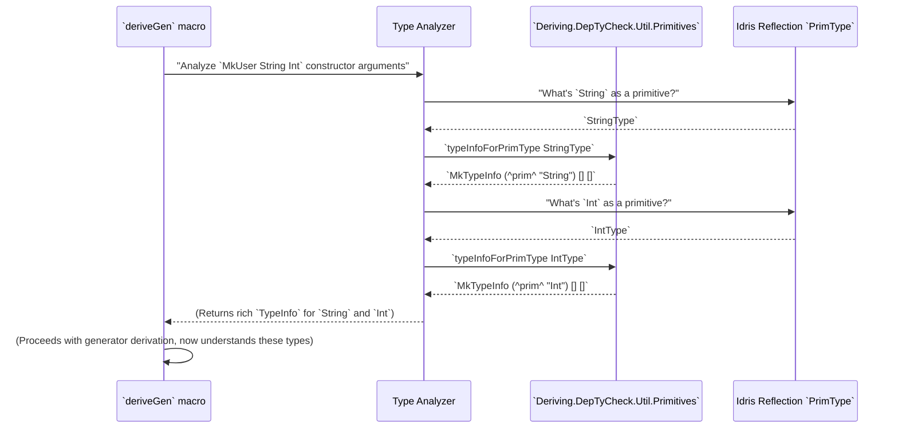

# Chapter 11: Type Primitives Utility

Welcome back! In [Chapter 10: Generator Tuning Interface](10_generator_tuning_interface_.md), we learned how to fine-tune the generation process using `GenOrderTuning` and `ProbabilityTuning`. Now, we're going to dive into a more foundational aspect of `DepTyCheck`: how it understands and works with the most basic building blocks of the Idris type system. This is our **Type Primitives Utility**.

## What Problem Does Type Primitives Utility Solve?

Imagine you're an architect designing a house. You have complex blueprints for walls, roofs, and rooms (these are like your custom data types in Idris). But you also need to incorporate standard, pre-made components like doors, windows, and electrical outlets (these are like Idris's *primitive types* such as `Int`, `String`, `Bool`).

When `DepTyCheck` is deriving a generator for a complex data type, it needs to know how to handle these fundamental, built-in types. The problem is that Idris represents these primitive types a little differently internally than how it represents custom `data` types.

The problem Type Primitives Utility solves is: **how can `DepTyCheck` consistently understand and represent both custom-defined data types AND Idris's built-in primitive types (like `Int`, `String`) in a uniform way during the automatic derivation process?** It's like having a universal translator for all your architectural components, whether they are custom-designed or off-the-shelf.

Our central use case for this chapter is: **To ensure that when `DepTyCheck` needs to generate values for basic types like `Int` or `String` (perhaps as part of a larger data structure), it can correctly identify them and translate their internal representation into a format that its derivation logic understands.**

## What are Primitive Types in Idris?

In Idris, primitive types (`PrimType`) are the fundamental types that the language provides directly, without you having to define them with `data`. Examples include:
*   `Int`, `Integer`, `Int8`, `Int16`, `Int32`, `Int64` (various kinds of numbers)
*   `Bits8`, `Bits16`, `Bits32`, `Bits64` (bit-level numbers)
*   `String`, `Char` (text and characters)
*   `Double` (floating-point numbers)
*   `%World` (a special type for I/O operations)
*   `Type` (the type of types itself!)

`DepTyCheck` needs to "recognize" these special types because it won't find `data Int = ...` or `data String = ...` definitions for them.

## `TypeInfo` and `PrimType`: The Translation Bridge

The `DepTyCheck` derivation process heavily relies on a data structure called `TypeInfo` (which we briefly mentioned in [Chapter 6: Generator Signature Definition](06_generator_signature_definition_.md)). `TypeInfo` is `DepTyCheck`'s internal rich representation of *any* type, whether it's a simple `Nat` or a complex recursive tree.

The `Type Primitives Utility` module (`src/Deriving/DepTyCheck/Util/Primitives.idr`) provides functions that act as a bridge, translating between bare `PrimType` values and `DepTyCheck`'s richer `TypeInfo` structure, and converting back where necessary.

### 1. `typeInfoForPrimType`: From Primitive to `TypeInfo`

This function takes an Idris `PrimType` and converts it into a `TypeInfo` record, making it recognizable by `DepTyCheck`'s reflection machinery.

```idris
-- From src/Deriving/DepTyCheck/Util/Primitives.idr

primTypeInfo : String -> TypeInfo
primTypeInfo s = MkTypeInfo (NS (MkNS ["^prim^"]) $ UN $ Basic s) [] []

export
typeInfoForPrimType : PrimType -> TypeInfo
typeInfoForPrimType IntType     = primTypeInfo "Int"
typeInfoForPrimType IntegerType = primTypeInfo "Integer"
typeInfoForPrimType StringType  = primTypeInfo "String"
typeInfoForPrimType CharType    = primTypeInfo "Char"
-- ... (other primitive types) ...
```

**Explanation:**

*   `primTypeInfo : String -> TypeInfo`: This helper function, common to all primitive types, creates a `TypeInfo` record.
    *   `MkTypeInfo`: This is the constructor for `TypeInfo`.
    *   `(NS (MkNS ["^prim^"]) $ UN $ Basic s)`: This creates a special `Name` for the primitive type. It uses the namespace `^prim^` to mark it as a primitive, and `Basic s` for its actual name (like "Int", "String").
    *   `[] []`: Primitive types typically don't have arguments themselves (unless they are type constructors, which `Type` does in reflection context), so their `args` and `params` lists are empty in this simplified `TypeInfo`.

*   `typeInfoForPrimType IntType = primTypeInfo "Int"`: This is an example of the pattern. If you give `IntType` (the internal Idris representation for `Int`), it will create a `TypeInfo` for it, marked with `^prim^ "Int"`.

**Central Use Case in Action:**

When `DepTyCheck` is analyzing a data type like `data User = MkUser String Int`, it will encounter `String` and `Int`. The derivation process won't find a `data` definition for them. Instead, it will use:

```idris
-- Conceptual call during derivation
stringTypeInfo = typeInfoForPrimType StringType
intTypeInfo    = typeInfoForPrimType IntType
```

Now, `DepTyCheck` has proper `TypeInfo` records for `String` and `Int`, allowing it to treat them similarly to user-defined types for certain parts of its logic, even though they are primitives.



### 2. `typeInfoForTypeOfTypes`: Handling the Special "Type" Type

There's one primitive type that's so special, it gets its own dedicated conversion: `Type`. `Type` is the type of all types.

```idris
-- From src/Deriving/DepTyCheck/Util/Primitives.idr

export
typeInfoForTypeOfTypes : TypeInfo
typeInfoForTypeOfTypes = primTypeInfo "Type"
```

This simply leverages the `primTypeInfo` helper, but having a dedicated export for it makes it clear that `Type` is also treated as a primitive in this context and given a `TypeInfo`.

### 3. `extractTargetTyExpr`: From `TypeInfo` Back to `TTImp` (Internal Idris Term)

After `DepTyCheck` has analyzed types and decided what code to generate, it often needs to reconstruct the `TTImp` (Idris's internal term representation) for these types. This is where `extractTargetTyExpr` comes in. It takes the `TypeInfo` (which was marked as a primitive) and converts it back into the `TTImp` for that primitive.

```idris
-- From src/Deriving/DepTyCheck/Util/Primitives.idr

extractTargetTyExpr : TypeInfo -> TTImp
extractTargetTyExpr $ MkTypeInfo (NS (MkNS ["^prim^"]) $ UN $ Basic "Int"    ) [] [] = primVal $ PrT IntType
extractTargetTyExpr $ MkTypeInfo (NS (MkNS ["^prim^"]) $ UN $ Basic "Integer") [] [] = primVal $ PrT IntegerType
extractTargetTyExpr $ MkTypeInfo (NS (MkNS ["^prim^"]) $ UN $ Basic "String" ) [] [] = primVal $ PrT StringType
extractTargetTyExpr $ MkTypeInfo (NS (MkNS ["^prim^"]) $ UN $ Basic "Char"   ) [] [] = primVal $ PrT CharType
extractTargetTyExpr $ MkTypeInfo (NS (MkNS ["^prim^"]) $ UN $ Basic "Type"   ) [] [] = type -- Special case for 'Type'
extractTargetTyExpr ti = var ti.name -- For non-primitive TypeInfo
```

**Explanation:**

*   `extractTargetTyExpr : TypeInfo -> TTImp`: This function takes a `TypeInfo` record and returns an Idris `TTImp`.
*   `$ MkTypeInfo (NS (MkNS ["^prim^"]) $ UN $ Basic "Int") [] [] = primVal $ PrT IntType`: This is a pattern match. If the `TypeInfo` matches the specific structure for "primitive Int" (which `typeInfoForPrimType IntType` produces), it converts it back into `primVal $ PrT IntType`. `primVal` and `PrT` are reflection constructs for representing primitive types.
*   `extractTargetTyExpr ... "Type" ... = type`: The `Type` type is handled specially directly with the `type` reflection term.
*   `extractTargetTyExpr ti = var ti.name`: If the `TypeInfo` is *not* one of the recognized primitives (meaning it's likely a user-defined data type), it defaults to simply returning a `TTImp` that represents the type by its name (`var ti.name`).

**Where this is used:**

When `DepTyCheck` is generating code, it needs to write down the types correctly. For instance, if it needs to say `Gen Int` in the generated code, it will take the `TypeInfo` for `Int`, pass it through `extractTargetTyExpr`, and get back the `TTImp` that correctly says `Int`.

## Conclusion

The "Type Primitives Utility" module is a small but critical component of `DepTyCheck`. It acts as a translator, allowing the derivation logic to seamlessly handle both custom-defined data types and Idris's core primitive types like `Int` and `String`. By converting `PrimType` values into `TypeInfo` (DepTyCheck's internal rich type representation) and back into `TTImp` terms, it ensures that the automatic generator derivation process can correctly recognize, process, and generate code involving these fundamental building blocks of the Idris language. This uniform handling is essential for the robustness and completeness of `DepTyCheck`'s metaprogramming capabilities.

Next, we'll look at the "Argument Permutation Utility" which helps in intelligently arranging arguments when building generators for dependent types.

[Next Chapter: Argument Permutation Utility](12_argument_permutation_utility_.md)

---

Generated by [AI Codebase Knowledge Builder](https://github.com/The-Pocket/Tutorial-Codebase-Knowledge)