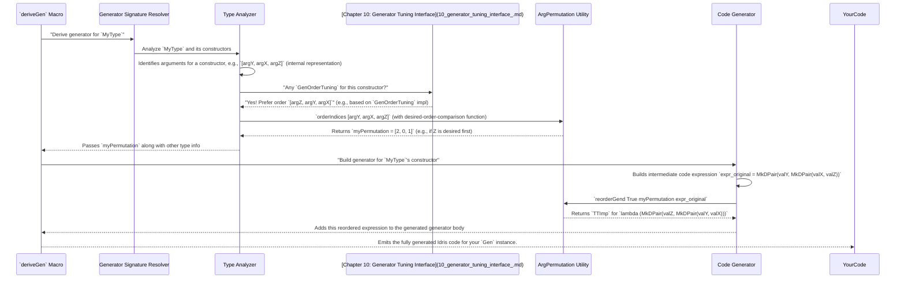

# Chapter 12: Argument Permutation Utility

Welcome back! In [Chapter 11: Type Primitives Utility](11_type_primitives_utility_.md), we learned how `DepTyCheck` recognizes and handles fundamental Idris types like `Int` and `String`. Now, we're going to tackle a concept that's vital for correctly building generators for the more complex types we often encounter in Idris: **Argument Permutation Utility**.

## What Problem Does Argument Permutation Solve?

Imagine you're trying to assemble a piece of IKEA furniture. The instructions tell you to attach "Leg A" to "Panel 1", then "Leg B" to "Panel 2". If you accidentally swap "Leg A" and "Leg B", the furniture won't fit together correctly! The *order* in which you handle the pieces matters a lot.

In Idris, especially with dependent types, the order of arguments can be just as crucial. Consider a type that has arguments `(Index : Fin N)` and `(Value : SomeType Index)`. Here, `Value` *depends* on `Index`. This means you *must* generate `Index` first, and *then* generate `Value` using the information from `Index`. If `DepTyCheck` tries to generate `Value` before `Index`, it won't know what `Index` is yet, and the generation will fail.

The problem Argument Permutation Utility solves is: **how can `DepTyCheck` reorder arguments (like the inputs to a constructor or function) to ensure that they are processed in the correct, dependency-respecting sequence, even if they were given in a different order initially?** It's like having a smart assistant who rearranges your furniture instructions to always put dependent steps in the right order.

Our central use case for this chapter is: **To understand how `DepTyCheck` can determine the correct order for a list of arguments and then apply that ordering to re-arrange either a list of values or a code expression.** This ensures that arguments are always handled in a way that respects their type dependencies.

## The Core Idea: Shuffle and Un-Shuffle

The heart of this utility is about two main operations:
1.  **Finding the correct order:** Given a list of items (like a list of argument names), figure out the "sorted" or "preferred" order, often based on type dependencies or user-defined preferences (like those from [Chapter 10: Generator Tuning Interface](10_generator_tuning_interface_.md)).
2.  **Applying the order:** Take that newly found order (a "permutation") and apply it to another list of items (like the actual argument values, or pieces of code representing those arguments).

Let's look at the key functions that make this happen.

### 1. `orderIndices`: Figuring Out the "Correct" Order

```idris
-- From src/Deriving/DepTyCheck/Util/ArgsPerm.idr (simplified to show key logic)

export
orderIndices : Ord a => (xs : List a) -> Vect xs.length $ Fin xs.length
orderIndices [] = []
orderIndices xs@(_::_) = do
  let sorted_xs = sort xs -- Sort the list
  let indexed_map = SortedMap.fromList $ mapWithIndex (\idx val => (val, idx)) sorted_xs
  fromMaybe FZ . lookup' indexed_map <$> xs.asVect
```

**Explanation:**

*   `orderIndices : Ord a => (xs : List a) -> Vect xs.length $ Fin xs.length`: This function takes a list `xs` (where elements can be ordered, `Ord a`) and returns a `Vect` (a fixed-size list) of `Fin xs.length`. A `Fin xs.length` is a number from `0` up to `xs.length - 1`. These numbers represent the *original indices* of the items in `xs` but arranged in the *sorted order*.
*   `sort xs`: This sorts the input list `xs`. Let's say `xs = ["Z", "A", "M"]`. `sort xs` would be `["A", "M", "Z"]`.
*   `mapWithIndex (\idx val => (val, idx)) sorted_xs`: This creates a map from the sorted values to their *new* sorted indices. For `["A", "M", "Z"]`, this would be `[("A", 0), ("M", 1), ("Z", 2)]`.
*   `lookup' indexed_map <$> xs.asVect`: This is the clever part. For each element in the *original* list (`xs`), it looks up its value in the `indexed_map`. This tells us where that original value *would be* in the sorted list.
    *   Example: `xs = ["Z", "A", "M"]`
    *   Look up "Z": it's at index 2 in the sorted list.
    *   Look up "A": it's at index 0 in the sorted list.
    *   Look up "M": it's at index 1 in the sorted list.
    *   The result is `[2, 0, 1]`. This `Vect` `[2, 0, 1]` is our "permutation"! It tells us that to get from the original order to the sorted order, you need to pick the item at index 2, then index 0, then index 1.

**Central Use Case in Action (Finding the Order):**

Imagine `DepTyCheck` has identified three arguments for a constructor, let's call them by their names: `"y", "x", "z"`. It determines that for correctness, they need to be sorted alphabetically.
```idris
-- Example Input
myArgs : List String
myArgs = ["y", "x", "z"]

-- What `orderIndices` computes
permutation : Vect 3 (Fin 3)
permutation = orderIndices myArgs -- returns [2, 0, 1]
```
The `[2, 0, 1]` means: "Take the element originally at index 2, then the element originally at index 0, then the element originally at index 1."

### 2. `reorder`: Applying the Permutation to a List

Once we have the `permutation` from `orderIndices` (or from [Chapter 10: Generator Tuning Interface](10_generator_tuning_interface_.md)), we can use it to reorder any list of items (like names, actual values, or generated code expressions).

```idris
-- From src/Deriving/DepTyCheck/Util/ArgsPerm.idr

export
reorder : (perm : Vect n $ Fin n) -> Vect n a -> Vect n a
reorder perm orig = perm <&> flip index orig
```

**Explanation:**

*   `reorder takes` a `permutation` (a `Vect` of `Fin n`) and the `original` list (`Vect n a`).
*   `perm <&> flip index orig`: This is a concise way to apply the permutation. For each `Fin` index in `perm`, it fetches the element from `orig` at that index.
    *   Example: `perm = [2, 0, 1]` and `orig = ["y", "x", "z"]`
    *   First element of `perm` is `2`. `orig` at index `2` is `"z"`.
    *   Second element of `perm` is `0`. `orig` at index `0` is `"y"`.
    *   Third element of `perm` is `1`. `orig` at index `1` is `"x"`.
    *   Result: `["z", "y", "x"]`.

**Central Use Case in Action (Applying the Order):**

Using our `permutation = [2, 0, 1]` and some values:
```idris
myValues : Vect 3 String
myValues = ["value_for_y", "value_for_x", "value_for_z"]

reorderedValues : Vect 3 String
reorderedValues = reorder permutation myValues -- returns ["value_for_z", "value_for_y", "value_for_x"]
```

This function transforms the list of values to match the desired order.

### 3. `reorderGend`: Reordering Generated Code Expressions

This is where the utility module truly helps `DepTyCheck`. When `DepTyCheck` automatically generates code for a constructor, the arguments in that generated code might need to be reordered. `reorderGend` helps generate Idris code that constructs a `DPair` (dependent pair) with its elements reordered according to a given permutation.

```idris
-- From src/Deriving/DepTyCheck/Util/ArgsPerm.idr (simplified)

export
reorderGend : (direct : Bool) -> {n : _} -> (perm : Vect n $ Fin n) -> TTImp -> TTImp
reorderGend direct perm e = do
  -- ... (logic to check if reordering is actually needed)
  -- Generate Idris reflection code that creates a lambda function that
  -- takes the original expression 'e' and reorders its components.
  -- This typically involves pattern matching on the original structure
  -- and then reconstructing it using MkDPair in the new order.
  -- Key parts: (lam (lambdaArg lamName) (iCase (var lamName) implicitFalse $ pure $ patClause lhs rhs))
```

**Explanation:**

*   `reorderGend direct perm e`: This function generates a `TTImp` (an Idris reflection term, which is code that Idris will compile).
    *   `direct : Bool`: If `True`, it permutes `e`. If `False`, it permutes back (doing the inverse transformation).
    *   `perm : Vect n (Fin n)`: The permutation to apply.
    *   `e : TTImp`: The `TTImp` representing the expression whose arguments need reordering.
*   The function generates a lambda function that takes the expression `e`, and then uses pattern matching (`iCase`, `patClause`) and `MkDPair` to reconstruct a new `DPair` where the components are reordered according to `perm`.

**Central Use Case in Action (Reordering Code):**

Let's imagine `DepTyCheck` initially generates a `TTImp` `expr_original` that looks like `MkDPair "y_val" (MkDPair "x_val" "z_val")` internally. It needs to become `MkDPair "z_val" (MkDPair "y_val" "x_val")`.

```idris
-- Conceptual call to reorderGend during compilation:
generatedReorderCode : TTImp
generatedReorderCode = reorderGend True [2, 0, 1] expr_original
```
`generatedReorderCode` would be an Idris `TTImp` that, when compiled and run, would take `expr_original` and effectively reorder its components.

## How it Works Internally (Code-Light Walkthrough)

Let's trace how these functions might be used together inside the `DepTyCheck` derivation process.



This sequence diagram illustrates that the permutation utility acts as a crucial intermediary, taking ordering instructions (potentially from user tuning) and applying them to ensure the generated code correctly respects argument dependencies.

## Conclusion

The "Argument Permutation Utility" module is a quiet but essential workhorse within `DepTyCheck`. It provides the tools (`orderIndices`, `reorder`, `reorderGend`) to intelligently reorder lists of arguments or even generated code expressions based on a calculated or specified permutation. This capability is absolutely vital for consistently handling argument order, especially in the context of dependent types where the generation of one argument might fundamentally depend on another. By ensuring arguments are always processed in the correct sequence, `DepTyCheck` can generate robust and type-safe test data generators, even for the most complex Idris data structures.

Next, we'll delve into "Derivation Closure Management", which helps `DepTyCheck` keep track of all the generators it needs to derive a complete solution.

[Next Chapter: Derivation Closure Management](13_derivation_closure_management_.md)

---

Generated by [AI Codebase Knowledge Builder](https://github.com/The-Pocket/Tutorial-Codebase-Knowledge)