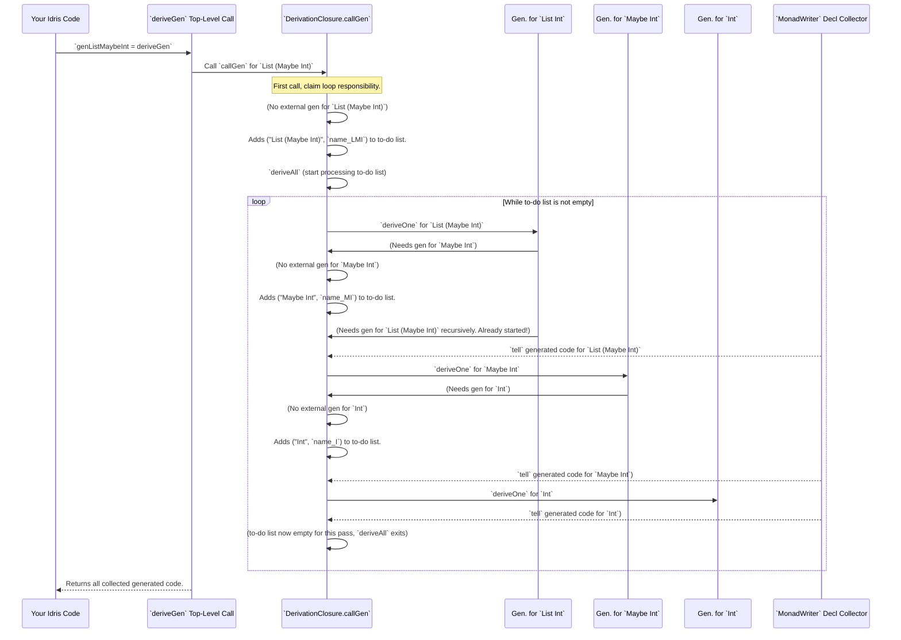

# Chapter 13: Derivation Closure Management

Welcome back! In [Chapter 12: Argument Permutation Utility](12_argument_permutation_utility_.md), we explored how `DepTyCheck` intelligently reorders arguments to respect dependencies, which is crucial for generating correct values for complex types. Now, we're building on that complexity to understand how `DepTyCheck` manages the *entire orchestra* of generator derivations: **Derivation Closure Management**.

## What Problem Does Derivation Closure Management Solve?

Imagine you're trying to build a very complex LEGO model, say, a spaceship. This spaceship needs many smaller sub-assemblies: an engine, a cockpit, wings, landing gear, etc. Each sub-assembly might itself need even smaller pieces. As the chief builder, you need to:
1.  **Keep a list** of all the sub-assemblies you need to build.
2.  **Avoid building the same sub-assembly twice** if it's used in multiple places.
3.  **Know when a sub-assembly is already pre-built** (like using an existing string generator).
4.  **Ensure all necessary sub-assemblies are actually built** before declaring the spaceship complete.

This is exactly the problem `DepTyCheck` faces when deriving generators for complex, often recursive, data structures. When `deriveGen` is called for `MyType`, `MyType` might use `OtherType`, which in turn uses `AnotherType`, and so on.

The problem Derivation Closure Management solves is: **how can `DepTyCheck` efficiently keep track of all the internal generators it needs to derive (or external generators it needs to call) to complete the main derivation task, ensuring no redundancies and managing dependencies?** It's like a project manager for the entire generator-building process, keeping track of all the individual sub-projects and ensuring they are completed or properly linked.

Our central use case for this chapter is: **To understand how `DepTyCheck` discovers and manages all the interconnected generators required to finish the automatic derivation for a complex, nested data type.**

## The Core Idea: A To-Do List for Generators

At its heart, Derivation Closure Management is about maintaining a "to-do list" (a queue) of generators that still need to be derived. When `DepTyCheck` starts deriving `MyType`, it finds out it needs `OtherType`. It adds `OtherType` to the to-do list. Then, when it processes `OtherType`, it might find it needs `AnotherType`, adding that to the list, and so on. This continues until the to-do list is empty.

### The `ClosuringContext`: Our Project Manager's Notepad

The core of this management system is encapsulated in the `ClosuringContext`. This is not a single data type, but a collection of "capabilities" (Idris interfaces) that a monad `m` must have. Think of it as the project manager's multi-page notepad and desk:

```idris
-- From Deriving/DepTyCheck/Gen/ForAllNeededTypes/Impl.idr (simplified)

ClosuringContext m =
  (MonadReader (SortedMap GenSignature (ExternalGenSignature, Name)) m, -- 1. Known external generators
   MonadState  (SortedMap GenSignature Name) m,                         -- 2. Internal generators *already started*
   MonadState  (List (GenSignature, Name)) m,                           -- 3. To-do list (queue of generators to derive)
   MonadState  Bool m,                                                  -- 4. Flag: "Am I the one starting the loop?"
   MonadState  (SortedSet Name) m,                                      -- 5. Tracked weighting functions (for probabilities)
   MonadWriter (List Decl, List Decl) m                                 -- 6. Generated code (declarations and bodies)
  )
```

**Explanation of the Project Manager's Notepad:**

1.  **`MonadReader (SortedMap ...)` (External Generators):** This is like a reference manual of *already existing* external generators (like our custom `myPrimeGen` from [Chapter 6: Generator Signature Definition](06_generator_signature_definition_.md)). Before deriving a new generator, `DepTyCheck` first checks if an external one can do the job.
2.  **`MonadState (SortedMap GenSignature Name)` (Already Started Internals):** This is a list of generators that `DepTyCheck` has *already decided to derive* (and given a name to), but might not have finished yet. This prevents infinite loops for recursive types (e.g., `List` uses `List`).
3.  **`MonadState (List (GenSignature, Name))` (To-Do List Queue):** This is the actual queue of generators that need to be fully derived. When `DepTyCheck` encounters a new type it needs a generator for, and no external or already-started internal generator fits, it adds it to this list.
4.  **`MonadState Bool m` (Start Loop Flag):** This flag ensures that only *one* top-level `deriveGen` call kicks off the "derivation loop" (processing the to-do list). If multiple `deriveGen` calls happen simultaneously, only the first one manages the loop, while subsequent ones just add to the queue.
5.  **`MonadState (SortedSet Name) m` (Weighting Functions):** This tracks which weighting functions (for [Chapter 10: Generator Tuning Interface](10_generator_tuning_interface_.md)'s probabilities) have already been asked for derivation.
6.  **`MonadWriter (List Decl, List Decl) m` (Generated Code):** As generators are derived, their Idris code (declarations like type signatures, and bodies like the `Gen` implementation) are collected here to be outputted to the Idris compiler.

Together, these capabilities allow `DepTyCheck` to coordinate the entire derivation process.

## The `DerivationClosure` Interface: The Manager's Responsibilities

The `DerivationClosure` interface defines the *responsibilities* of our project manager: what main actions it can perform.

```idris
-- From Deriving/DepTyCheck/Gen/ForAllNeededTypes/Interface.idr

public export
interface Elaboration m => NamesInfoInTypes => ConsRecs => DerivationClosure m where
  needWeightFun : TypeInfo -> m ()
  callGen : (sig : GenSignature) -> (fuel : TTImp) -> Vect sig.givenParams.size TTImp -> m (TTImp, Maybe (gend ** Vect gend $ Fin gend))
```

**Explanation of the Responsibilities:**

*   `needWeightFun : TypeInfo -> m ()`: This function is for when `DepTyCheck` needs a generator for a `Weighting Function` (used for [Chapter 10: Generator Tuning Interface](10_generator_tuning_interface_.md)). It ensures that if such a function is needed, it's either already on the to-do list or added to it.
*   `callGen : ... -> m (TTImp, Maybe GendPermutation)`: This is the central function! Whenever `DepTyCheck` needs *any* generator (for a constructor argument, or for a recursive call), it calls `callGen`.
    *   It takes `sig` (the `GenSignature` of the generator it needs), `fuel` (the `TTImp` for the fuel argument), and `values` (the `TTImp`s for any explicit arguments to the generator).
    *   It returns the generated Idris code for calling that generator (`TTImp`), and optionally a permutation (`Maybe (gend ** Vect gend (Fin gend))`) if the generated arguments need reordering (using [Chapter 12: Argument Permutation Utility](12_argument_permutation_utility_.md)).

The `DerivationClosure` implementation (found in `ForAllNeededTypes/Impl.idr`) is where the actual project management decisions are made.

```idris
-- From Deriving/DepTyCheck/Gen/ForAllNeededTypes/Impl.idr (simplified 'callGen' logic)

DeriveBodyForType => ClosuringContext m => ... => DerivationClosure m where
  callGen sig fuel values = do
    startLoop <- get {stateType=Bool} -- 1. Check if we're starting the loop
    put False                          -- 2. Claim responsibility for the loop

    -- 3. Look for external generators first
    let Nothing = lookupLengthChecked sig !ask
      | Just (name, Element extSig lenEq) => do
          logPoint ... "is used as an external generator"
          pure (callExternalGen extSig name (var outmostFuelArg) ... , Just ...)

    -- 4. If no external, then look for internal generators
    internalGenName <- do

      -- 4a. Already started?
      let Nothing = SortedMap.lookup sig !get
        | Just name => pure name

      -- 4b. Nothing found, so derive a new one
      let name = nameForGen sig -- Get a new unique name
      modify $ insert sig name   -- Add to 'already started' list
      modify {stateType=List _} $ (::) (sig, name) -- Add to 'to-do list' queue

      pure name

    -- 5. If I started the loop, process the to-do list
    when startLoop $ deriveAll

    -- 6. Call the chosen (internal or external) generator and return its code
    pure (callCanonic sig internalGenName fuel values, Nothing)
```

**Step-by-step breakdown of `callGen`:**

1.  **Check for loop initiation:** It first checks (`get {stateType=Bool}`) if it's the first `deriveGen` call to kick off the entire process.
2.  **Claim loop responsibility:** If it is, it sets the flag to `False` (`put False`), meaning "I am now in charge of running the derivation loop."
3.  **Check External Generators:** It consults the `MonadReader` state (our reference manual of external generators). If a matching external generator is found, it uses that and returns its calling code.
4.  **Manage Internal Generators:** If no external generator fits:
    *   It checks the `MonadState` `(SortedMap GenSignature Name)` (our "already started" list) to see if this generator has already been slated for derivation. If so, it uses its assigned name.
    *   Otherwise, it generates a new unique `nameForGen` for this `GenSignature`, adds it to the "already started" list, and most importantly, adds it to the "to-do list queue" (`modify {stateType=List _} ...`).
5.  **Run Derivation Loop:** If this `callGen` was the one that initiated the entire derivation process (`when startLoop`), it then calls `deriveAll`. This is where `DepTyCheck` goes through the entire "to-do list" (`get {stateType=List _}`), processes each `(sig, name)` pair by fully deriving its body `deriveOne`, and collects all the generated declarations and bodies into the `MonadWriter` state.
6.  **Return Call Code:** Finally, it returns the generated code for calling the chosen internal generator.

## `deriveAll`: Processing the To-Do List

The `deriveAll` function is the actual loop that processes the queue.

```idris
-- From Deriving/DepTyCheck/Gen/ForAllNeededTypes/Impl.idr (simplified 'deriveAll')

      deriveOne : (GenSignature, Name) -> m ()
      deriveOne (sig, name) = do
        genFunClaim <- logBounds ... $ export' name $ canonicSig sig          -- Create type signature AST
        genFunBody  <- logBounds ... $ def name <$> assert_total canonicBody sig name -- Create body AST
        tell ([genFunClaim], [genFunBody]) -- Add to MonadWriter (generated code)

      deriveAll : m ()
      deriveAll = do
        toDerive <- get {stateType=List _} -- Get current to-do list
        put {stateType=List _} []          -- Clear the list (we're processing it now)
        for_ toDerive deriveOne            -- Process each generator on list
        when (not $ null toDerive) $ assert_total $ deriveAll -- If more were added during this pass, loop again
```

**Explanation of `deriveAll`:**

*   `deriveOne`: This helper takes a `GenSignature` and its assigned `Name`, then uses `canonicSig` (from [Chapter 6: Generator Signature Definition](06_generator_signature_definition_.md)) to build the type declaration and `canonicBody` (the core derivation logic, explained in [Chapter 14: Single Type Generator Derivation](14_single_type_generator_derivation_.md)) to build its implementation. It then `tell`s these `Decl`s (Idris declarations) to the `MonadWriter`, collecting all generated code.
*   `deriveAll`: This function gets the current `toDerive` list, clears it (to avoid re-deriving), processes each item, and then *recursively calls itself* (`when (not $ null toDerive) ... deriveAll`) if new generators were added to the queue during this pass. This ensures all nested dependencies are eventually derived.

This is why it's called "closure" management – it derives the "closure" of all generators needed for your initial request.

## Sequence Diagram: Derivation Closure in Action

Let's imagine you call `deriveGen` for a `List (Maybe Int)`.



This diagram shows how `callGen` acts as the entry point for requesting a generator, and how `deriveAll` iteratively processes these requests, adding newly discovered dependencies to a queue, until all required generators are derived.

## Conclusion

Derivation Closure Management is the sophisticated system within `DepTyCheck` that orchestrates the entire process of automatically generating test data generators. By using a multi-faceted `ClosuringContext` to track external generators, already-started internal generators, a "to-do list" queue, and generated code, it intelligently handles the interdependencies between types. The `DerivationClosure` interface, particularly the `callGen` function, acts as the central coordinator, ensuring that all necessary sub-generators are derived exactly once, whether they are external or internal. This powerful mechanism effectively manages the "closure" of required derivations, ensuring that even for complex, nested, or recursive data types, `DepTyCheck` can reliably produce functional and efficient test data generators.

Next, we'll zoom in on the core logic for deriving a generator for a *single* type, the `deriveOne` step we just saw, in [Chapter 14: Single Type Generator Derivation](14_single_type_generator_derivation_.md).

[Next Chapter: Single Type Generator Derivation](14_single_type_generator_derivation_.md)

---

Generated by [AI Codebase Knowledge Builder](https://github.com/The-Pocket/Tutorial-Codebase-Knowledge)