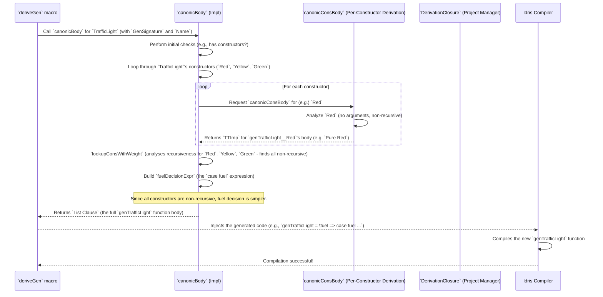

# Chapter 14: Single Type Generator Derivation

Welcome back! In [Chapter 13: Derivation Closure Management](13_derivation_closure_management_.md), we saw how `DepTyCheck` acts like a project manager, orchestrating the derivation of *all* the generators needed for a complex data type. We briefly touched upon `deriveOne`, the function responsible for building a generator for a *single* specific type. Now, in this chapter, we're going to zoom in and understand that crucial step: **Single Type Generator Derivation**.

## What Problem Does Single Type Generator Derivation Solve?

Imagine you're the master builder for a new house design. Your main task is to create the overall plan for *one specific type* of house. This involves:
1.  **Checking the blueprint:** Does this house design have any rooms (constructors)? If not, it's not a real house!
2.  **Assigning crews for each room:** For every room (constructor) in the blueprint, you need to plan how it will be built.
3.  **Handling special cases:** Some rooms (like a recursive attic that leads to another attic!) need special care, like limiting how many times you can repeat the "build attic" step (our "fuel").

The problem Single Type Generator Derivation solves is: **how does `DepTyCheck` take the blueprint of a single user-defined type and convert it into a complete, working generator function, handling its constructors, managing recursive calls, and integrating any tuning?** It's like the master plan for one house, laying out all the details for its construction.

Our central use case for this chapter is: **To understand the process `DepTyCheck` follows to generate all the necessary code for a `Gen` instance for a single given Idris type, from inspecting its constructors to deciding how to handle recursion.**

## The `DeriveBodyForType` Interface: The Master Builder's To-Do List

The core of this process is defined by the `DeriveBodyForType` interface. This interface specifies a single function, `canonicBody`, that any implementation must provide. This `canonicBody` is the master builder's instructions for creating the actual generator code.

### The `interface DeriveBodyForType`

```idris
-- From src/Deriving/DepTyCheck/Gen/ForOneType/Interface.idr

public export
interface DeriveBodyForType where
  canonicBody : DerivationClosure m => GenSignature -> Name -> m $ List Clause
```

**Explanation:**

*   `interface DeriveBodyForType`: This declares the interface for deriving a body for a type.
*   `canonicBody : DerivationClosure m => GenSignature -> Name -> m $ List Clause`: This is the crucial method.
    *   `DerivationClosure m`: This constraint means that whatever monad `m` we're using to implement `canonicBody`, it *must* have the capabilities of the `DerivationClosure` (our project manager from [Chapter 13: Derivation Closure Management](13_derivation_closure_management_.md)). This allows `canonicBody` to request other generators as needed.
    *   `GenSignature`: This is the blueprint for the generator we're building (from [Chapter 6: Generator Signature Definition](06_generator_signature_definition_.md)). It tells us about the target type and its parameters.
    *   `Name`: This is the internal `Name` that `DepTyCheck` has assigned to this specific generator function (e.g., `genTrafficLight`).
    *   `m $ List Clause`: The function returns a `List Clause` within the monad `m`. A `Clause` is Idris's internal representation of a function body (the right-hand side of a definition). So, `canonicBody` literally builds the code for the generator's body.

## The `canonicBody` Implementation: Building the Generator Step-by-Step

The `canonicBody` function (located in `src/Deriving/DepTyCheck/Gen/ForOneType/Impl.idr`) is where the main implementation for deriving a canonical (standard) generator for a single user-defined type lives. It orchestrates the entire process.

Let's break down the key steps within `canonicBody` conceptually:

```idris
-- Simplified conceptual steps within canonicBody

canonicBody sig n = do
  -- 1. Initial Checks
  --    - Fail if no constructors (e.g., 'data Void')
  --    - Fail if trying to derive a generator for `Gen` itself (recursive problem!)

  -- 2. Generate Claims for Per-Constructor Generators
  --    - For each constructor (e.g., `Red`, `Yellow`, `Green` for `TrafficLight`),
  --      create a 'claim' (a type signature) for a specific generator that *only* builds that constructor.
  --      e.g., `genTrafficLightRed : Fuel -> Gen MaybeEmpty TrafficLight`

  -- 3. Derive Bodies for Per-Constructor Generators
  --    - Implement the actual generation logic for EACH constructor using `canonicConsBody`.
  --      This is covered in detail in [Chapter 16: Constructor Body Derivation](16_constructor_body_derivation_.md).

  -- 4. Analyze Constructor Recursiveness and Fuel Handling
  --    - Figure out which constructors use recursion (where the type `T` contains `T`).
  --    - Decide if 'fuel' should be spent for that constructor to prevent infinite loops.
  --    - This analysis happens during `lookupConsWithWeight`, explained in [Chapter 15: Constructor Recursiveness Analysis](15_constructor_recursiveness_analysis_.md).

  -- 5. Handle Tuning for Weights (Probabilities)
  --    - Ensure any custom weighting functions (from [Chapter 10: Generator Tuning Interface](10_generator_tuning_interface_.md))
  --      are also requested for derivation.

  -- 6. Generate the Top-Level `case` Expression (Fuel Decision)
  --    - Create an Idris `case` expression that looks at the `Fuel` argument:
  --      - If `fuel` is `Dry`, only run non-recursive constructors (don't spend fuel).
  --      - If `fuel` is `More (S subFuel)`, run recursive constructors with `subFuel`,
  --        and non-recursive constructors with the original `More (S subFuel)`.
  --    - This selects an appropriate constructor generator based on `fuel` and probabilities.

  -- 7. Return the Complete Function Definition
  --    - Combine the generated `case` expression with the overall function signature.
```

Let's look at some key snippets from the real `canonicBody` implementation:

### Initial Checks

```idris
-- From src/Deriving/DepTyCheck/Gen/ForOneType/Impl.idr

canonicBody sig n = do
  -- check that there is at least one constructor
  Prelude.when .| null sig.targetType.cons .| fail "No constructors found for the type `\{show sig.targetType.name}`"

  -- check that desired `Gen` is not a generator of `Gen`s
  Prelude.when .| sig.targetType.name == `{Test.DepTyCheck.Gen.Gen} .| fail "Target type of a derived `Gen` cannot be a `Gen`"
```

**Explanation:**

*   `Prelude.when ... fail`: These are guard clauses.
*   `null sig.targetType.cons`: Checks if the target type has any constructors. If it's a `Void` type or something similar, it can't create a generator, so it fails appropriately.
*   `sig.targetType.name == `{Test.DepTyCheck.Gen.Gen}`: Prevents a problematic recursive case where `DepTyCheck` tries to derive a generator for `Gen` *itself*. This would be an infinite loop!

### Generating and Deriving Constructor-Specific Generators

```idris
-- From src/Deriving/DepTyCheck/Gen/ForOneType/Impl.idr

    -- generate claims for generators per constructors
    let consClaims = sig.targetType.cons <&> \con => export' (consGenName con) (canonicSig sig)

    -- derive bodies for generators per constructors
    consBodies <- for sig.targetType.cons $ \con => logBounds {level=Info} "deptycheck.derive.consBody" [sig, con] $
      canonicConsBody sig (consGenName con) con <&> def (consGenName con)
```

**Explanation:**

*   `sig.targetType.cons`: This is a list of all the constructors for the `targetType` (e.g., `Red`, `Yellow`, `Green`).
*   `consClaims`: For each constructor, `DepTyCheck` prepares a `consClaim`. This is essentially a type declaration for a helper function that will generate *only* that specific constructor. `consGenName con` generates a unique name for this helper (e.g., `genTrafficLight__Red`). `canonicSig sig` creates the type signature.
*   `consBodies`: This uses a `for` loop to iterate through each constructor. For each `con`, it calls `canonicConsBody`.
    *   `canonicConsBody`: This function is the actual workhorse for building the generator code for a *single constructor*. We will explore this in detail in [Chapter 16: Constructor Body Derivation](16_constructor_body_derivation_.md).
    *   `def (consGenName con)`: Wraps the body generated by `canonicConsBody` into a full Idris function definition.

### Fuel Decision Logic

This is a central part of `canonicBody`. It builds an Idris `case` expression that patterns matches on the `fuel` argument to decide which constructors to generate. This is critical for recursive types.

```idris
-- From src/Deriving/DepTyCheck/Gen/ForOneType/Impl.idr (simplified `fuelDecisionExpr` snippet)

    fuelDecisionExpr : (fuelArg : Name) -> List (Con, Either TTImp (Name -> TTImp)) -> TTImp
    fuelDecisionExpr fuelAr consRecs = do
      -- 'consRecs' tells us which constructors are recursive and need to spend fuel (Right),
      -- and which are non-recursive (Left, don't spend fuel).
      -- It also contains the tuning weights (probabilities) from [Chapter 10: Generator Tuning Interface](10_generator_tuning_interface_.md).

      iCase .| var fuelAr .| var `{Data.Fuel.Fuel} .| -- Patterns match on the 'fuel' argument

        [ -- Case 1: if fuel is `Dry` (no fuel left)
          let nonSpendCons = mapMaybe (\(con, w) => (con,) <$> getLeft w) consRecs in
          var `{Data.Fuel.Dry} .= callConstFreqs "\{logPosition sig} (dry fuel)".label (var fuelAr) nonSpendCons

        , -- Case 2: if fuel is `More (S subFuel)` (some fuel left)
          let subFuelArg = UN $ Basic $ "^sub" ++ show fuelAr in
          var `{Data.Fuel.More} .$ bindVar subFuelArg .= callFrequency "\{logPosition sig} (non-dry fuel)".label
            (consRecs <&> \(con, rec) => let (f, w) = weightAndFuel rec in (w, callConsGen f con))
        ]
```

**Explanation:**

*   `fuelDecisionExpr`: This function generates the `TTImp` (the Idris code) for the main `case` statement.
*   `iCase .| var fuelAr`: This builds a `case` expression that inspects the value of the `fuelAr` argument.
*   `var `{Data.Fuel.Dry} .= ...`: This is the clause for when `fuel` is `Dry`. In this scenario, only non-recursive constructors (`nonSpendCons`) are called, because recursive ones would get stuck. The `callConstFreqs` function then selects one of these `nonSpendCons` based on their tuned frequencies.
*   `var `{Data.Fuel.More} .$ bindVar subFuelArg .= ...`: This is the clause for when `fuel` is `More` (i.e., `More (S k)`).
    *   `bindVar subFuelArg`: It binds the remaining fuel (`k`) to a new variable `subFuelArg`.
    *   `callFrequency`: This function then picks a constructor based on probability, but for recursive constructors, it passes `subFuelArg` (the reduced fuel), ensuring fuel is spent. For non-recursive ones, it passes the original `fuelAr`. This distinction is crucial for recursion.
*   `consRecs`: This list contains tuples of `(Con, Either TTImp (Name -> TTImp))`. The `Either` part indicates:
    *   `Left TTImp`: If the constructor is non-recursive, it holds the `TTImp` for its weighting.
    *   `Right (Name -> TTImp)`: If the constructor is recursive, it holds a function that takes the `subFuel` argument and returns its weighting `TTImp`.

This `fuelDecisionExpr` is the core mechanism that intelligently dispatches to the correct constructor generator based on the `fuel` and the recursiveness of the constructors.

## Sequence Diagram: Single Type Derivation Workflow

Let's visualize the steps for deriving a generator for `TrafficLight`:



This diagram illustrates how `canonicBody` acts as the orchestrator for a single type's generator, delegating to constructor-specific derivation and handling the overall fuel logic.

## Conclusion

The `canonicBody` function, as the implementation of the `DeriveBodyForType` interface, is the master builder for generating code for a single type's generator. It carefully inspects the type's constructors, delegates the detailed generation for each constructor to specialized logic (which we'll see in a later chapter), and most importantly, implements the crucial `fuelDecisionExpr` to intelligently dispatch generation based on the current `Fuel` and the recursiveness of the constructors. This ensures that generators both terminate for recursive types and maintain type safety. This orchestration is central to `DepTyCheck`'s ability to automatically and robustly derive generators for complex Idris data structures.

Next, we'll dive into the details of how `DepTyCheck` identifies and analyzes recursive constructors in [Chapter 15: Constructor Recursiveness Analysis](15_constructor_recursiveness_analysis_.md).

[Next Chapter: Constructor Recursiveness Analysis](15_constructor_recursiveness_analysis_.md)

---

Generated by [AI Codebase Knowledge Builder](https://github.com/The-Pocket/Tutorial-Codebase-Knowledge)