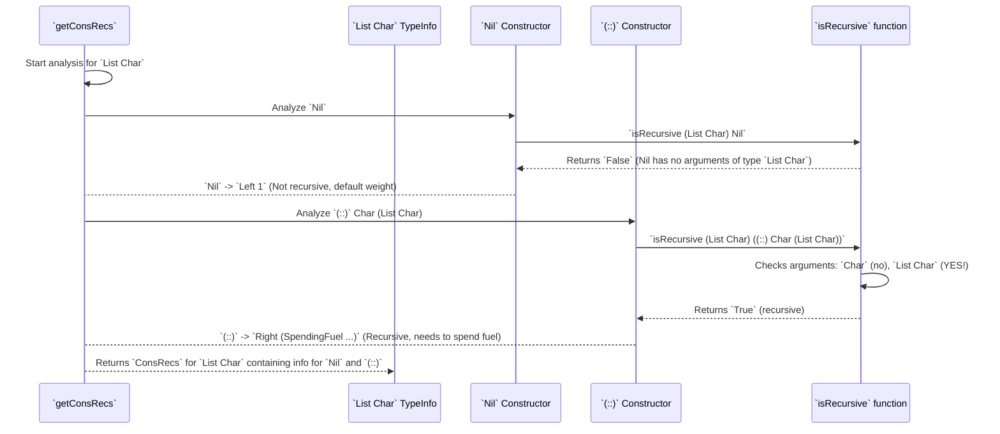

# Chapter 15: Constructor Recursiveness Analysis

Welcome back! In [Chapter 14: Single Type Generator Derivation](14_single_type_generator_derivation_.md), we got a high-level view of how `DepTyCheck` builds a generator for a single type, including its reliance on a special `fuel` argument to handle recursive types. Now, we're going to dive deep into *how* `DepTyCheck` figures out which parts of a type are recursive and how that influences generation: **Constructor Recursiveness Analysis**.

## What Problem Does Constructor Recursiveness Analysis Solve?

Imagine you're trying to build a generator for a `List` data type in Idris. A `List` is defined recursively:
```idris
data List a = Nil | (::) a (List a)
```
The `(::)` constructor (often written as `head :: tail`) is special because its second argument, `(List a)`, contains `List a` itself! If our generator just blindly called `genList` again and again for the `tail`, it would never stop. This is an infinite loop!

The problem Constructor Recursiveness Analysis solves is: **how can `DepTyCheck` automatically identify which constructors of a data type are recursive, and which arguments within those constructors refer back to the type being defined?** Once identified, `DepTyCheck` can then make informed decisions about how to generate these recursive calls, ensuring they eventually terminate.

Our central use case for this chapter is: **To understand how `DepTyCheck` looks at a data type's constructors (like `Nil` and `(::)` for `List`) and determines if they are "fuel-spending" (meaning they involve a recursive call and should reduce the fuel argument) or "structurally decreasing" (meaning they are recursive but naturally get smaller, helping with termination).** This analysis is crucial for assigning the correct "weights" (probabilities) and ensuring the generator eventually produces a finite value.

## The Core Idea: Looking for Self-References

At its heart, this analysis is about looking for self-references. If a constructor's arguments include the type itself, then that constructor is recursive.

Let's consider `List a`:
*   `Nil`: This constructor takes no arguments. It's not recursive.
*   `(::) a (List a)`: This constructor takes two arguments: `a` and `(List a)`. The second argument `(List a)` is exactly the type we're defining! So, `(::)` is a recursive constructor.

`DepTyCheck` needs to identify these cases.

### `RecWeightInfo`: How `DepTyCheck` Cares About Recursion

When analyzing a constructor, `DepTyCheck` assigns it a `ConWeightInfo` which contains a `RecWeightInfo` if the constructor is recursive. This `RecWeightInfo` helps categorize how the recursion should be handled:

```idris
-- From src/Deriving/DepTyCheck/Gen/ConsRecs.idr

public export
data RecWeightInfo : Type where
  SpendingFuel : ((leftFuelVarName : Name) -> TTImp) -> RecWeightInfo
  StructurallyDecreasing : (decrTy : TypeInfo) -> (wExpr : TTImp) -> RecWeightInfo
```

**Explanation:**

*   **`SpendingFuel`**: This applies to constructors where `DepTyCheck` needs to explicitly spend `Fuel` ([Chapter 14: Single Type Generator Derivation](14_single_type_generator_derivation_.md) covered this). If this constructor is chosen, the `fuel` argument must be reduced for the recursive calls. The `TTImp` represents the code for *how* to spend the fuel.
    *   **Analogy:** This is like a main road where you explicitly use up your "fuel" (miles) to get closer to your destination. Each 'mile' reduces your budget.
*   **`StructurallyDecreasing`**: This applies to special cases where the recursive argument is *guaranteed* to get "smaller" in a way that doesn't need explicit `Fuel` reduction, or perhaps it defines a "weight" based on that decreasing structure. `decrTy` is the `TypeInfo` for the structurally decreasing argument, and `wExpr` is the `TTImp` for its weight expression.
    *   **Analogy:** This is like a mountain path where you're always going downhill. You don't need a fuel budget because you're naturally progressing towards the bottom. For example, `Fin n` (numbers less than `n`) decreases `n` via `FSucc k` argument.

A constructor that is *not* recursive (like `Nil`) doesn't get a `RecWeightInfo` at all; it just gets a `Nat1` weight.

### `getConsRecs`: The Analysis Mastermind

The `getConsRecs` function (in `src/Deriving/DepTyCheck/Gen/ConsRecs.idr`) is the core mastermind that performs this analysis. It's called by `canonicBody` ([Chapter 14: Single Type Generator Derivation](14_single_type_generator_derivation_.md)) to gather all this information.

Let's look at a simplified view of `getConsRecs`:

```idris
-- From src/Deriving/DepTyCheck/Gen/ConsRecs.idr (simplified 'getConsRecs')

export
getConsRecs : Elaboration m => NamesInfoInTypes => m ConsRecs
getConsRecs = do
  consRecs <- for knownTypes $ \targetType => do
    -- Loop through each known type (e.g. from your type definition)
    -- 'knownTypes' is from NamesInfoInTypes interface

    crsForTy <- for targetType.cons $ \con => do
      -- Loop through each constructor for the targetType (e.g., Nil, ::)
      tuneImpl <- search $ ProbabilityTuning con.name -- Check for user tuning (from Ch10)

      isRec <- isRecursive {containingType=Just targetType} con
      -- The 'isRecursive' function does the actual check!

      w : Either Nat1 (TTImp -> TTImp, SortedSet $ Fin con.args.length) <- case isRec of
        False => -- Not recursive. Just assign weight (maybe tuned)
          pure $ Left $ maybe one (\impl => tuneWeight @{impl} one) tuneImpl
        True  => -- Is recursive!
          -- Now we need more logic to figure out if it's SpendingFuel or StructurallyDecreasing
          -- This often involves looking at how the recursive argument is passed
          pure (Right (  -- This part is simplified, real code is complex
                        \fuelArg => `(someWeightBasedOn ~fuelArg), -- Placeholder: weight depends on fuel
                        directRecArgs -- Which args are directly recursive.
                      ))
      pure (con ** w)

    -- Further analysis for StructurallyDecreasing
    -- (This part of the code is simplified heavily as it's very complex)
    -- It checks if recursive arguments are decreasing.

  pure $ MkConsRecs finalConsRecs $ deriveW (map (\(_ ** crs) => (fst crs, (snd crs))) consRecs)

```

**Explanation of the simplified `getConsRecs`:**

1.  **`for knownTypes $ \targetType => do`**: `getConsRecs` iterates over all the types that `DepTyCheck` knows about and might need to derive generators for.
2.  **`for targetType.cons $ \con => do`**: For each `targetType` (e.g., `List`), it looks at every one of its `con`structors (`Nil`, `(::)`).
3.  **`tuneImpl <- search $ ProbabilityTuning con.name`**: It first checks if the user has provided any custom `ProbabilityTuning` ([Chapter 10: Generator Tuning Interface](10_generator_tuning_interface_.md)) for this constructor. This tuning impacts the base weight.
4.  **`isRec <- isRecursive {containingType=Just targetType} con`**: This is the key function! It analyzes the constructor `con` to determine if it's recursive with respect to `targetType`.
5.  **`case isRec of`**:
    *   **`False` (Not recursive):** If `isRec` determines the constructor is *not* recursive (like `Nil`), `DepTyCheck` simply assigns it a weight (`Left Nat1`), possibly adjusted by `tuneImpl`.
    *   **`True` (Is recursive):** If it *is* recursive (like `(::)`), `DepTyCheck` then enters more complex logic to figure out if it's `SpendingFuel` or `StructurallyDecreasing`. This involves looking at the types of the constructor's arguments to see how the recursive call is structured. For example, if it's a `List` constructor, it might just assign `SpendingFuel`. If it's a type like `Fin n` which is defined by `S k` or `FZ`, it might recognize `S k` as `StructurallyDecreasing` because `k` is smaller than `n`.
6.  **`finalConsRecs`**: All this information (constructor, its weight, and `RecWeightInfo` if recursive) is collected into a `SortedMap` so that `canonicBody` can easily look it up later using `lookupConsWithWeight`.

### `isRecursive`: The Heart of the Analysis

The `isRecursive` function (not directly shown here, but implicitly called or part of the larger logic) is responsible for:
*   **Checking arguments:** For each argument of the constructor, it compares the argument's type against the `targetType`.
*   **Direct match:** If an argument's type is exactly the `targetType` (e.g., `List a` in `(::) a (List a)`), then it's a direct recursive call.
*   **Indirect match:** If an argument's type *contains* the `targetType` (e.g., `Maybe (List a)`), it's also considered recursive, though the handling might differ.
*   **Dependent parameters:** It also analyzes dependent parameters. For `Vec n a` whose constructor might be `VCons x (Vec (S n) a)`, this function identifies `(S n)` as recursive and notes if `n` is structurally decreasing.

## Central Use Case in Action (Conceptual `List Char` Example)

Let's trace how `getConsRecs` would analyze `data List Char = Nil | (::) Char (List Char)`:



This sequence shows how `getConsRecs` determines the recursive nature of each constructor, which then informs `canonicBody` how to generate the complex `fuel` logic.

## `lookupConsWithWeight`: Looking Up the Analysis Results

Once `getConsRecs` has done its job, `canonicBody` needs to retrieve the results. This is done via `lookupConsWithWeight`.

```idris
-- From src/Deriving/DepTyCheck/Gen/ConsRecs.idr

export
lookupConsWithWeight : ConsRecs => GenSignature -> Maybe $ List (Con, ConWeightInfo)
lookupConsWithWeight @{crs} sig = do
  let givs = mapIn finToNat sig.givenParams
  lookup' crs.conWeights sig.targetType.name <&> (`apply` givs)
```

**Explanation:**

*   `lookupConsWithWeight`: This function takes the `ConsRecs` (the full analysis results) and a `GenSignature` (for the type we're currently building a generator for).
*   It retrieves the list of `(Con, ConWeightInfo)` that was computed earlier by `getConsRecs` for the target type.
*   The `apply` operator here is important because some `ConsRecs` might be functions of given parameters ([Chapter 6: Generator Signature Definition](06_generator_signature_definition_.md)).

This function provides the necessary information for `canonicBody` to build the `fuelDecisionExpr` we saw in [Chapter 14: Single Type Generator Derivation](14_single_type_generator_derivation_.md), ensuring that recursive constructors appropriately spend fuel.

## Conclusion

Constructor Recursiveness Analysis is a fundamental module within `DepTyCheck` that empowers it to handle complex, often recursive, data types gracefully. By analyzing each constructor to determine if it's "fuel-spending" or "structurally decreasing," `DepTyCheck` can intelligently assign weights and generate the necessary `fuel` management logic. This prevents infinite loops and ensures that property-based tests produce valid, finite values, even for deeply nested or self-referential data structures. This meticulous analysis is crucial for `DepTyCheck`'s ability to automatically and robustly derive generators.

Next, we'll build on this analysis and dive into the specifics of how `DepTyCheck` generates the body of a generator for a *single constructor* within a type in [Chapter 16: Constructor Body Derivation](16_constructor_body_derivation_.md).

[Next Chapter: Constructor Body Derivation](16_constructor_body_derivation_.md)

---

Generated by [AI Codebase Knowledge Builder](https://github.com/The-Pocket/Tutorial-Codebase-Knowledge)