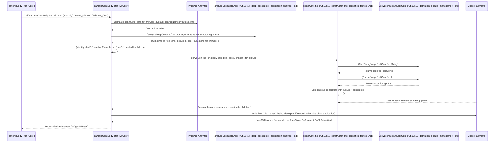

# Chapter 16: Constructor Body Derivation

Welcome back! In [Chapter 15: Constructor Recursiveness Analysis](15_constructor_recursiveness_analysis_.md), we learned how `DepTyCheck` figures out if a constructor is recursive and how that impacts fuel management. Now, building on that crucial analysis, we're going to dive into what happens *inside* that individual constructor: **Constructor Body Derivation**.

## What Problem Does Constructor Body Derivation Solve?

Imagine you're designing a recipe for a specific dish, say, a "Spicy Chicken Stir-Fry." While [Single Type Generator Derivation](14_single_type_generator_derivation_.md) is like planning the whole menu for your restaurant, Constructor Body Derivation is designing the detailed recipe for *just this one dish*.

This recipe needs to specify:
1.  **Ingredients:** What arguments does this stir-fry need (chicken, peppers, sauce)?
2.  **Special constraints:** Does the chicken need to be organic *and* free-range (GADT indices, `decEq` constraints)?
3.  **Ingredient preparation:** How do we get the chicken (derived externally?), the peppers (simple random choice?), the sauce (another sub-recipe)?
4.  **Putting it all together:** How do we combine these prepared ingredients to make the final stir-fry (the constructor call)?

The problem Constructor Body Derivation solves is: **how does `DepTyCheck` create the specific Idris code for a generator that produces *only one particular constructor* of a data type, handling all its arguments, any special conditions (like GADT type checks), and delegating to sub-generators for complex arguments?** It's like writing the perfect mini-program to instantiate a single constructor.

Our central use case for this chapter is: **To understand how `DepTyCheck` generates the body of a special-purpose generator that is dedicated to building a single constructor, ensuring its arguments are correctly generated, GADT constraints are met, and sub-generators are called efficiently.**

## The `canonicConsBody` Function: The Constructor's Recipe

The core function responsible for this detailed recipe creation is `canonicConsBody`. We saw it briefly in [Chapter 14: Single Type Generator Derivation](14_single_type_generator_derivation_.md) when it was called for each constructor. Now, we'll see what it does.

The function's signature tells us a lot about its inputs:

```idris
-- From src/Deriving/DepTyCheck/Gen/ForOneTypeCon/Impl.idr (simplified signature)

export
canonicConsBody : DeriveBodyRhsForCon => DerivationClosure m => GenSignature -> Name -> Con -> m $ List Clause
```

**Explanation:**

*   `DeriveBodyRhsForCon`: This is an interface (which we'll cover in [Chapter 18: Constructor RHS Derivation Tactics](18_constructor_rhs_derivation_tactics_.md)) that provides the actual tactics for generating the right-hand side of constructor bodies.
*   `DerivationClosure m`: As always, this gives our function the project management capabilities to request *other* generators as needed (from [Chapter 13: Derivation Closure Management](13_derivation_closure_management_.md)).
*   `GenSignature`: The blueprint for the overall type's generator (from [Chapter 6: Generator Signature Definition](06_generator_signature_definition_.md)).
*   `Name`: The unique name for *this specific constructor-generating function*.
*   `Con`: The `Con` record itself for the constructor we are currently building a generator for (e.g., `Red`, `MkUser`).
*   `m $ List Clause`: Returns the Idris code (a list of `Clause`s) for the body of this constructor's generator.

## Key Steps in `canonicConsBody`: Our Stir-Fry Recipe in Detail

Let's break down the process `canonicConsBody` follows to generate the constructor's generator body.

### 1. Normalize and Analyze Arguments

The first step is to get all the messy details about the constructor's arguments straightened out. Idris's internal representation can be complex, so `canonicConsBody` performs "normalization" to simplify types and extracts argument information.

```idris
-- From src/Deriving/DepTyCheck/Gen/ForOneTypeCon/Impl.idr (simplified)

canonicConsBody sig name con = do
  conFC <- getFC con.type -- Get File position for error messages
  con <- normaliseCon con -- Standardize constructor's type representation

  -- Extract the arguments of the type that defines the constructor.
  -- Example: For `data Vec : Nat -> Type -> Type`, `n` and `Type` are `conRetTypeArgs`.
  let (conRetTy, conRetTypeArgs) = unAppAny con.type

  -- Validate the number of such arguments.
  let Yes lenCorrect = conRetTypeArgs.length `decEq` sig.targetType.args.length
    | No _ => failAt conFC "INTERNAL ERROR: bad argument count"

  -- Identify the names of the constructor's own arguments.
  let conArgNames = fromList $ argName' <$> con.args

```
**Explanation:**

*   `normaliseCon con`: Simplifies the types within the constructor description.
*   `(conRetTy, conRetTypeArgs) = unAppAny con.type`: For a constructor like `MkVec x, xs : Vec n a`, this would separate `Vec` from `n` and `a`. `conRetTypeArgs` would be `[n, a]`.
*   `lenCorrect ...`: Checks if the number of type arguments matches what the `GenSignature` expected (`sig.targetType.args.length`).
*   `conArgNames = fromList $ argName' <$> con.args`: Gets the names of the arguments *to the constructor itself*. For `(::) {a} head tail`, `conArgNames` would be `[head, tail]`.

### 2. Deep GADT Index Analysis

This is perhaps the most complex and powerful part of `canonicConsBody`. Dependent types allow constructor arguments to influence the *type indices* of the data type itself. For example, in `data Fin : Nat -> Type`, the constructor `FSucc : Fin k -> Fin (S k)` means the `k` argument directly determines the `(S k)` type index.

`DepTyCheck` needs to analyze which of the *type arguments* (e.g., the `Nat` in `Fin Nat`) are determined by the *constructor's arguments*. This is called "Deep Constructor Application Analysis" and is covered in detail in [Chapter 17: Deep Constructor Application Analysis](17_deep_constructor_application_analysis_.md).

The important part is that `canonicConsBody` uses this analysis to figure out:
*   Which of the `GenSignature.givenParams` (the type arguments provided to the overall generator) are directly influenced by the constructor's arguments.
*   Which additional *free variables* (names not bound in the current scope) are introduced by the constructor's arguments.
*   Whether these need `decEq` checks.

The `deepConsApps` variable holds the results of this intricate analysis:

```idris
-- From src/Deriving/DepTyCheck/Gen/ForOneTypeCon/Impl.idr (simplified)

    let deepConsApps : Vect _ $ Either (String, TTImp, List Name) _ := sig.givenParams.asVect <&> \idx => do
      let argExpr = conRetTypeArg idx -- E.g., The 'n' in 'Vec n a'
      let (ei, fns) = runWriter $ runEitherT {e=String} {m=Writer _} $ analyseDeepConsApp True conArgNames argExpr
      -- `analyseDeepConsApp` (from Ch17) does the core analysis.
      -- It analyzes `argExpr` to see how it depends on 'conArgNames'.
      -- `fns` here are "free names" found.
      -- The `Either` indicates success or failure of this analysis.
```

**Explanation:** In essence, for each "given parameter" (`givenParam` from `GenSignature`), this code snippet examines its `conRetTypeArg` (how the parameter is applied in the constructor's return type). It uses `analyseDeepConsApp` to see how this `conRetTypeArg` depends on the constructor's own arguments (`conArgNames`).

### 3. Handle `decEq` Constraints (Equality Proofs)

If the deep analysis finds situations where some given arguments must be *equal* to each other (`decEq` checks), `DepTyCheck` needs to generate code to explicitly perform these equality checks. This is common with GADT indices.

```idris
-- From src/Deriving/DepTyCheck/Gen/ForOneTypeCon/Impl.idr (simplified)

  -- Identify arguments that need `decEq` checks
  ((givenConArgs, decEqedNames, _), bindExprs) <-
    runStateT (empty, empty, 0) {stateType=(SortedSet Name, SortedSet (Name, Name), Nat)} {m} $
      for deepConsApps $ \(appliedNames ** bindExprF) => do
        -- Logic to determine if a name needs to be part of a `decEq` check.
        -- If `name` is already "given" by a prior `decEq` check, use it.
        -- Otherwise, assign a temporary `substName` and add it to `decEqedNames`.
        -- (This is heavily simplified here)
  let bindExprs = \alreadyMatchedRenames => bindExprs <&> \f => f alreadyMatchedRenames

  -- Build the actual Idris `decEq` logic
  let deceqise : (lhs : Vect sig.givenParams.asList.length TTImp -> TTImp) -> (rhs : TTImp) -> Clause
      deceqise lhs rhs = step lhs empty $ orderLikeInCon decEqedNames where

        step withlhs matched [] = PatClause EmptyFC .| withlhs (bindExprs matched) .| rhs
        step withlhs matched ((orig, renam)::rest) =
          WithClause EmptyFC (withlhs $ bindExprs matched) MW
            `(Decidable.Equality.decEq ~(var renam) ~(var orig))
            Nothing []
            [ -- If decEq succeeds (happy case)
              step ((.$ `(Prelude.Yes Builtin.Refl)) . withlhs) (insert renam matched) rest
            , -- If decEq fails (empty case)
              PatClause EmptyFC .| withlhs (bindExprs matched) .$ `(Prelude.No _) .| `(empty)
            ]
```
**Explanation:**

*   `decEqedNames`: This `SortedSet (Name, Name)` stores pairs of names that need to be proven equal. The `step` function builds a chain of `with Decidable.Equality.decEq ...` clauses.
*   `WithClause ... (Decidable.Equality.decEq ~(var renam) ~(var orig))`: This generates the `with` argument, which is a call to `decEq`.
*   `Prelude.Yes Builtin.Refl`: The "happy case" (the constructor matches the GADT index) continues to the next `decEq` check.
*   `Prelude.No _ .| empty`: The "empty case" (the constructor does *not* match the GADT index) results in an `empty` generator. This correctly prunes impossible constructions.

This mechanism ensures that `DepTyCheck` only attempts to generate constructors that are type-correct for the current `givenParams`.

### 4. Delegate to Constructor RHS Derivation Tactics

Finally, after all the preparatory work, `canonicConsBody` delegates the actual generation of the constructor's right-hand side (the core logic of how to pick arguments and apply the constructor) to the `deriveConRhs` function. This function uses different "tactics" to build the body, which are covered in [Chapter 18: Constructor RHS Derivation Tactics](18_constructor_rhs_derivation_tactics_.md).

```idris
-- From src/Deriving/DepTyCheck/Gen/ForOneTypeCon/Impl.idr (simplified to show delegation)

  let fuelArg = "^cons_fuel^" -- Name for the fuel argument in this constructor's generator

  pure $
    [ -- Happy case: given arguments conform to GADT indices
      deceqise (callCanonic sig name $ bindVar fuelArg) !(consGenExpr sig con .| fromList givenConArgs .| var fuelArg)
    ]
    ++ if all isSimpleBindVar (bindExprs SortedSet.empty) then [] else
      -- Else case: if GADT indices don't conform, results in an empty generator
      [ callCanonic sig name implicitTrue (replicate _ implicitTrue) .= `(empty) ]

```
**Explanation (simplified for clarity):**

*   This part essentially creates two clauses for the constructor's generator function:
    1.  **The "happy path":** If all `decEq` checks pass (from `deceqise`), then `callCanonic sig name` proceeds to generate code using `consGenExpr`.
        *   `!(consGenExpr sig con .| fromList givenConArgs .| var fuelArg)`: This is where `deriveConRhs` (via `consGenExpr`) is implicitly triggered to produce the right-hand side of the generator, selecting values for constructor arguments (`fromList givenConArgs`), using the provided `fuelArg`, and wrapping the final constructor application.
    2.  **The "empty path":** If any `decEq` check fails, the generator returns `empty`. This prevents the generation of type-incorrect values.

## Sequence Diagram: Constructor Body Derivation Workflow

Let's imagine deriving the body for a constructor like `MkUser : String -> Int -> User` where `User` is `Gen MaybeEmpty User` and has GADT indices.



This sequence illustrates how `canonicConsBody` orchestrates multiple internal steps, from argument analysis and `decEq` handling to delegating to specialized tactics and sub-generator calls, to build the complete generator for a single constructor.

## Conclusion

Constructor Body Derivation, driven by the `canonicConsBody` function, is the detailed recipe writer for `DepTyCheck`. It meticulously crafts the Idris code for a generator corresponding to a single type constructor. This involves a sophisticated process of normalizing argument types, performing deep analysis of GADT indices (via [Ch17: Deep Constructor Application Analysis](17_deep_constructor_application_analysis_.md)), generating explicit `decEq` constraint checks to ensure type safety, and ultimately delegating the assembly of the constructor application to specialized tactics ([Ch18: Constructor RHS Derivation Tactics](18_constructor_rhs_derivation_tactics_.md)). This precise and robust mechanism is crucial for `DepTyCheck`'s ability to automatically generate correct and usable generators for even the most intricate Idris data types.

Next, we'll delve deeper into that intricate "Deep Constructor Application Analysis" that helps `canonicConsBody` understand how constructor arguments influence GADT indices.

[Next Chapter: Deep Constructor Application Analysis](17_deep_constructor_application_analysis_.md)

---

Generated by [AI Codebase Knowledge Builder](https://github.com/The-Pocket/Tutorial-Codebase-Knowledge)