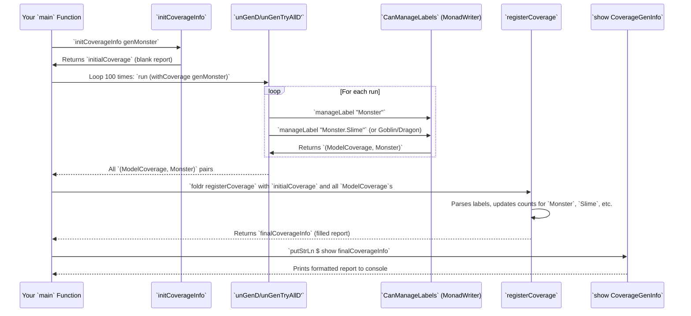

# Chapter 19: Generator Coverage Analysis

Welcome back! In [Chapter 18: Constructor RHS Derivation Tactics](18_constructor_rhs_derivation_tactics_.md), we explored the different strategies `DepTyCheck` uses to build the core logic for generating individual constructors. We've mastered creating generators. Now, how do we know if our generators are doing a good job? Are they exploring all the different parts of our data structures? This is where **Generator Coverage Analysis** comes in!

## What Problem Does Generator Coverage Analysis Solve?

Imagine you're developing a game with many different types of monsters:
```idris
data Monster = Slime | Goblin | Dragon
```
You write a `genMonster` to create test monsters. After running your tests a few times, you want to know:
*   Did `genMonster` *ever* produce a `Slime`?
*   Did it *ever* produce a `Goblin`?
*   What about a `Dragon`? (Maybe `Dragon` is super rare, and `genMonster` never picked it!)

If your generator isn't hitting all the possibilities, your tests might be missing important edge cases. You might think your code is solid, but actually, it's never been tested against a `Dragon`!

The problem Generator Coverage Analysis solves is: **how can we automatically track which types and constructors were actually generated during our property-based tests, and then get a report that tells us how thoroughly our generators are exploring our data types?** It's like having a little spy attached to your generator that takes notes on everything it produces, giving you a detailed report afterward.

Our central use case for this chapter is: **To run a `DepTyCheck` generator a few times and get a clear report showing whether all the constructors of our data types were generated, and how many times each one appeared.**

## Introducing `ModelCoverage` and `CoverageGenInfo`: Your Spy Report System

`DepTyCheck` provides a two-tiered system for tracking coverage:
1.  **`ModelCoverage`**: This is the raw list of "labels" that were triggered during generation. Labels, as you remember from [Chapter 8: Generator Labels](08_generator_labels_.md), are like sticky notes attached to different parts of your generator.
2.  **`CoverageGenInfo`**: This is a higher-level, organized report that takes the `ModelCoverage` (raw labels) and translates it into counts for specific types and constructors.

Let's start with `ModelCoverage`.

### 1. `ModelCoverage`: The Raw Sticky Notes Collector

When a generator runs, and a `Label` is encountered (as you learned in [Chapter 8: Generator Labels](08_generator_labels_.md)), it gets recorded. `ModelCoverage` is simply the collection of these recorded labels and how many times each occurred.

```idris
record ModelCoverage where
  constructor MkModelCoverage
  unModelCoverage : SortedMap Label Nat

export
Semigroup ModelCoverage where
  (<+>) = MkModelCoverage .: mergeWith (+) `on` unModelCoverage

export
Monoid ModelCoverage where
  neutral = MkModelCoverage empty
```

**Explanation:**

*   `unModelCoverage : SortedMap Label Nat`: This is the core. It's a `SortedMap` where the `Key` is a `Label` (e.g., "Monster.Slime") and the `Value` is a `Nat` (the count of how many times that label was seen).
*   `Semigroup` and `Monoid` instances: These make it easy to *combine* multiple `ModelCoverage` reports (e.g., from different runs of a generator). If `LabelA` appeared 3 times in one report and 2 times in another, combining them means `LabelA` appeared 5 times total.

Recall from [Chapter 8: Generator Labels](08_generator_labels_.md) that we have a `CanManageLabels` interface. To collect coverage, `DepTyCheck` provides an implementation of `CanManageLabels` that *writes* the labels to a `ModelCoverage`.

```idris
-- Simplified from original, focusing on the core
MonadWriter ModelCoverage m => CanManageLabels m where
  manageLabel l = tell $ MkModelCoverage $ singleton l 1
```

**Explanation:** This means if your monad `m` is also a `MonadWriter ModelCoverage` (meaning it can "write" `ModelCoverage` values to an accumulating log), then every time `manageLabel l` is called, it `tell`s (`writes`) a `ModelCoverage` containing just that `l` with a count of `1`. The `MonadWriter` then automatically combines these individual `ModelCoverage` entries using the `(<+>)` (`Semigroup`) instance we saw earlier!

### Running a Generator with Coverage: `unGenD`

To actually use this, you need to run your generator in a special way that collects `ModelCoverage`. `DepTyCheck` provides `unGenD` (and `unGenD'`) for this.

```idris
export
unGenD : MonadRandom m => MonadError () m => Gen em a -> m (ModelCoverage, a)
unGenD = map swap . runWriterT . unGen {m = WriterT ModelCoverage $ m}
```
**Explanation:** `unGenD` takes your `Gen em a` (generator) and returns `(ModelCoverage, a)`. It runs the generator and, at the same time, uses the `MonadWriter ModelCoverage` to collect all the labels into a `ModelCoverage` report.

### 2. `CoverageGenInfo`: The Organized Report

While `ModelCoverage` is useful, it's just raw labels. `CoverageGenInfo` takes these raw labels and presents them in a user-friendly way, organized by types and their constructors.

```idris
export
record CoverageGenInfo (0 g : k) where
  constructor MkCoverageGenInfo
  types        : SortedMap String TypeInfo
  constructors : SortedMap String (TypeInfo, Con)
  coverageInfo : SortedMap TypeInfo (Nat, SortedMap Con Nat)
```

**Explanation:**

*   `types : SortedMap String TypeInfo`: A map from type names (`String`) to their `TypeInfo`. This helps `DepTyCheck` look up details about a type.
*   `constructors : SortedMap String (TypeInfo, Con)`: A map from constructor names (`String`) to their `TypeInfo` and `Con` details. This links constructor names back to their full info.
*   `coverageInfo : SortedMap TypeInfo (Nat, SortedMap Con Nat)`: **This is the main report!**
    *   It's a `SortedMap` where the `Key` is a `TypeInfo` (representing a type, like `Monster`).
    *   The `Value` is a `(Nat, SortedMap Con Nat)`:
        *   The first `Nat` is the total count of times *any constructor of that type* was generated.
        *   The `SortedMap Con Nat` maps each `Con`structor (like `Slime`, `Goblin`) to the `Nat` count of how many times *that specific constructor* was generated.

#### Initializing `CoverageGenInfo` with `initCoverageInfo`

Before you can `registerCoverage` (which we'll see next), you need an empty `CoverageGenInfo` that knows *what types and constructors exist* in your generator. This is done with `initCoverageInfo`.

```idris
export %macro
initCoverageInfo : (0 x : g) -> Elab $ CoverageGenInfo x
initCoverageInfo _ = genTypeName g >>= coverageGenInfo
```

**Explanation:** This macro takes your generator `g` (e.g., `genMonster`) and uses reflection (`genTypeName g`) to figure out what types it involves. Then `coverageGenInfo` builds an initial `CoverageGenInfo` with all those types and their constructors, but with all counts set to zero. This is your blank report card.

#### Adding Labels to the Report Card: `registerCoverage`

After running `unGenD` and getting `ModelCoverage`, you "register" (or apply) this `ModelCoverage` to your `CoverageGenInfo`.

```idris
export
registerCoverage : ModelCoverage -> CoverageGenInfo g -> CoverageGenInfo g
registerCoverage mc cgi = foldr registerCoverage1 cgi $ toList mc.unModelCoverage where
  registerCoverage1 : (Label, Nat) -> CoverageGenInfo g -> CoverageGenInfo g
  registerCoverage1 (str, cnt) cgi = do
    let str = show str
    -- Try type
    let ty = maybe str (fastPack . fst) $ fastUnpack "[" `infixOf` str'
    let tyMod = case lookup ty cgi.types of
                  Just ti => { coverageInfo $= flip updateExisting ti $ mapFst (+cnt) }
                  Nothing => id
    -- Try constructor
    let co = maybe str (fastPack . fst) $ fastUnpack " " `infixOf` str'
    let coMod : (_ -> CoverageGenInfo g) := case lookup co cgi.constructors of
                  Just (ti, co) => { coverageInfo $= flip updateExisting ti $ mapSnd $ updateExisting (+cnt) co }
                  Nothing       => id
    tyMod $ coMod $ cgi
```

**Explanation:**
*   `registerCoverage` takes a `ModelCoverage` (the raw labels) and a `CoverageGenInfo` (your report card) and updates the report card.
*   It iterates through each `(Label, Nat)` pair in `ModelCoverage`.
*   For each label, it tries to parse the `Label` string to identify if it refers to a *type* or a *constructor*.
    *   (Labels are created by `deriveGen` usually in the format `TypeName`, `TypeName.ConstructorName`, like `Monster`, `Monster.Slime`).
*   If it matches a registered `TypeInfo` or `Con`structor, it updates the `Nat` counts within `cgi.coverageInfo`.
    *   `mapFst (+cnt)`: Updates the total count for the type.
    *   `mapSnd $ updateExisting (+cnt) co`: Updates the count for the specific constructor.

### Displaying the Report: `toString` and `Show`

Finally, `CoverageGenInfo` has a `Show` instance (`toString`) that formats this information into a readable string, optionally with colors.

```idris
toString : (colourful : Bool) -> CoverageGenInfo g -> String
toString col cgi = (++ "\n") $ joinBy "\n\n" $
                     mapMaybe (\ti => lookup ti cgi.coverageInfo <&> (ti,)) (SortedMap.values cgi.types) <&> \(ti, tyCovCnt, cons) => do
  -- ... (formatting logic using tyCovCnt and cons to build strings like "covered fully", "not covered") ...
```

**Explanation:** This function iterates through all the types in `cgi.coverageInfo` and constructs user-friendly strings like:
```
Monster (covered fully (100 times))
  - Slime: covered (30 times)
  - Goblin: covered (30 times)
  - Dragon: covered (40 times)

AnotherType (not covered)
  - ConstructorA: not covered
  - ConstructorB: not covered
```

## Central Use Case in Action: Example `Monster` Coverage

Let's tie it all together with our `Monster` example.

```idris
module MyMonsterGen

import Test.DepTyCheck.Gen
import Test.DepTyCheck.Gen.Coverage

%default total
%language ElabReflection

data Monster = Slime | Goblin | Dragon

genMonster : Fuel -> Gen MaybeEmpty Monster
genMonster = deriveGen

main : IO ()
main = do
  -- 1. Initialize an empty CoverageGenInfo for genMonster
  initialCoverage <- initCoverageInfo genMonster

  -- 2. Run the generator 100 times and collect ModelCoverage for each run
  let numRuns = 100
  let initialSeed = mkStdGen 42
  let coverageResults =
        take numRuns $
        unGenTryAllD' initialSeed (withCoverage genMonster)

  -- 3. Aggregate all ModelCoverage into one, and register to CoverageGenInfo
  let finalCoverageInfo = foldr
                            (\(_, res) => maybe id (\(mc, _) => registerCoverage mc))
                            initialCoverage
                            coverageResults

  -- 4. Print the final report
  putStrLn $ show finalCoverageInfo
```

**What happens when you run `main`:**
1.  `initCoverageInfo genMonster`: `DepTyCheck` inspects `genMonster` (and `Monster`) to pre-fill `initialCoverage` with `Monster`, `Slime`, `Goblin`, `Dragon` (all counts 0).
2.  `unGenTryAllD' initialSeed (withCoverage genMonster)`: This runs `genMonster` multiple times.
    *   `withCoverage genMonster`: This macro injects labels into `genMonster`'s generated code, so that when it runs, `ModelCoverage` is collected.
    *   `unGenTryAllD'`: This function runs the generator in `ModelCoverage` collecting mode, giving you a stream of `(ModelCoverage, Monster)` pairs.
3.  `foldr ... finalCoverageInfo`: This takes all the `ModelCoverage` results from the `numRuns` and combines them, then registers them against `initialCoverage`. Each `ModelCoverage` updates the counts for `Monster`, `Slime`, `Goblin`, `Dragon`.
4.  `putStrLn $ show finalCoverageInfo`: This prints the beautiful, formatted report to your console!

```
-- Example Output (conceptual, actual numbers will vary based on randomness)
Monster (covered fully (100 times))
  - Slime: covered (35 times)
  - Goblin: covered (31 times)
  - Dragon: covered (34 times)
```
This report instantly tells you that `genMonster` successfully generated all types of monsters, and how evenly (or unevenly) it did so. If `Dragon` had 0 counts, you'd know your generator (or its sizing/fuel) isn't hitting that crucial case!

The diagram for this workflow:



## Conclusion

Generator Coverage Analysis provides powerful tools to understand how well your `DepTyCheck` generators are exploring the possible values of your data structures. By using `ModelCoverage` to collect raw labels and `CoverageGenInfo` to aggregate these into a clear, type- and constructor-centric report, you gain invaluable insight into the effectiveness of your property-based tests. This "spy report" system helps ensure that all relevant parts of your data are being generated, catching potential blind spots in your testing strategy. With coverage analysis, you can be more confident that your generators are exercising all the critical paths and variations of your program's data.

Next, we'll shift our focus to project management again and look at the `Pack Collection Version Script`.

[Next Chapter: Pack Collection Version Script](20_pack_collection_version_script_.md)

---

Generated by [AI Codebase Knowledge Builder](https://github.com/The-Pocket/Tutorial-Codebase-Knowledge)