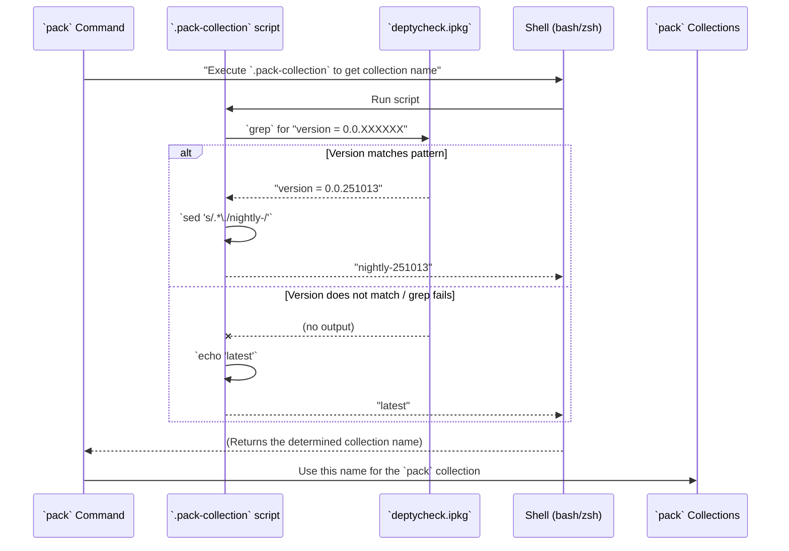

# Chapter 20: Pack Collection Version Script

Welcome back! In [Chapter 19: Generator Coverage Analysis](19_generator_coverage_analysis_.md), we learned how to get detailed reports on whether our generators are thoroughly exploring all the possible values of our data types. Now, we're going to shift gears back to project management and look at a small but important utility script that helps organize our project's versions: the **Pack Collection Version Script**.

## What Problem Does the Pack Collection Version Script Solve?

Imagine you're developing a software library, like `DepTyCheck`, and you release new versions over time (e.g., `0.0.1`, `0.0.2`, `1.0.0`). When people want to use your library, they need a way to specify *which version* they want. The Idris package manager `pack` (which we met in [Chapter 3: Pack Configuration](03_pack_configuration_.md)) organizes packages into "collections." A "collection" usually groups versions of packages.

The problem this script solves is: **how can we automatically extract the current version number of our `DepTyCheck` library and present it in a format `pack` can use to name a collection, or default to a "nightly" tag if no specific version is found?** It's like having an automated "version sticker printer" that always knows the current version of your software and prints a label like "Collection: mylib-0.0.251013" or "Collection: mylib-nightly" if it's a development build.

Our central use case for this chapter is: **To create a dynamic way to determine the `pack` collection name for `DepTyCheck` based on its version number from `deptycheck.ipkg`, falling back to a "nightly" tag for development builds.**

## The `.pack-collection` Script: Our Automated Version Sticker Printer

The `DepTyCheck` project has a small shell script named `.pack-collection` that does exactly this. It's a simple, two-line script!

```sh
#!/bin/sh

(grep 'version *= *\([0-9]\+.\)\+[0-9]\{6\}$' deptycheck.ipkg || echo 'latest') | sed 's/.*\./nightly-/'
```

Let's break down how this single, powerful line works.

### Part 1: Finding the Version or Defaulting to 'latest'

```sh
grep 'version *= *\([0-9]\+.\)\+[0-9]\{6\}$' deptycheck.ipkg || echo 'latest'
```
This part tries to find the version number in our `deptycheck.ipkg` file (which we learned about in [Chapter 1: DepTyCheck Idris Package](01_deptycheck_idris_package_.md)).

*   `grep 'version *= *\([0-9]\+.\)\+[0-9]\{6\}$' deptycheck.ipkg`:
    *   `grep`: This is a command-line tool for searching plain-text data for lines that match a regular expression.
    *   `'version *= *\([0-9]\+.\)\+[0-9]\{6\}$'`: This is a "regular expression" (a pattern) that `grep` looks for.
        *   `version *= *`: It looks for the word "version", followed by an equals sign, and optional spaces.
        *   `\([0-9]\+.\)\+`: This is the tricky part. It looks for one or more digits (`[0-9]\+`) followed by a dot (`.`), and this whole sequence (`\([0-9]\+.\)`) is repeated one or more times (`\+`). This matches patterns like `0.0.`
        *   `[0-9]\{6\}`: Finally, it looks for exactly six digits (`[0-9]`) right before the end of the line (`$`). This specific pattern `[0-9]\+.\)\+[0-9]\{6\}` matches `0.0.251013` from `deptycheck.ipkg`.
        *   `deptycheck.ipkg`: This is the file `grep` searches in.
    *   **If a match is found:** `grep` will print the matching line, like `version = 0.0.251013`.
    *   **If NO match is found (`grep` fails to find it):** The `||` (OR operator) comes into play.
*   `|| echo 'latest'`: If `grep` doesn't find the version number (e.g., if the line `version = ...` is commented out or missing, or doesn't match the specific six-digit suffix pattern), then `echo 'latest'` runs, and it prints the word `latest`.

So, the output of this first part is either something like `version = 0.0.251013` or `latest`.

### Part 2: Formatting the Output

```sh
| sed 's/.*\./nightly-/'
```
The `|` (pipe) takes the output from the first part and feeds it as input to the `sed` command.

*   `sed`: This is a 'stream editor' that performs text transformations.
*   `'s/.*\./nightly-/'`: This is a `sed` command to 'substitute' (`s`).
    *   `.*\.`: This matches any characters (`.*`) followed by the *last* dot (`\.`) on the line.
    *   `nightly-`: This is what the matched pattern is replaced with.

Let's see how this works with our two possible outputs from Part 1:

1.  **Input: `version = 0.0.251013`**
    *   `sed` matches `version = 0.0.` (everything up to the *last* dot).
    *   It replaces that with `nightly-`.
    *   **Output: `nightly-251013`**

2.  **Input: `latest`**
    *   There is no dot (`.`) in `latest`. So, the pattern `.*\./` does not match anything.
    *   `sed` does nothing.
    *   **Output: `latest`**

### Summary of the Script's Output

The `.pack-collection` script intelligently produces one of two outcomes:
*   **If a specific version `0.0.XXXXXX` is in `deptycheck.ipkg`:** It outputs `nightly-XXXXXX` (e.g., `nightly-251013`). This is useful for specific development builds.
*   **If no such specific version is found:** It outputs `latest`. This is a general tag.

## Central Use Case: Dynamically Setting the `pack` Collection

When `pack` builds or installs projects, it can use a "collection" name. This script provides that name.

Let's simulate this:



This sequence shows that the `pack` tool simply executes this small script to get a dynamically determined collection name. This is particularly useful in continuous integration/continuous deployment (CI/CD) pipelines where you might want to automatically tag development builds with their version.

## Internal Implementation: Simple Shell Logic

The "internal implementation" for this script is quite minimal, as it's a simple shell script! It relies on standard Unix tools:
*   `grep`: For pattern matching.
*   `||`: Shell's OR operator, for fallback.
*   `echo`: For printing text.
*   `|`: Pipe, for chaining commands.
*   `sed`: For stream editing (text replacement).

The script strategically uses regular expressions to isolate the numeric part of the version string `0.0.XXXXXX`, ensuring that only valid and specifically formatted versions are processed, otherwise `latest` is used. The `sed` command then transforms `version = 0.0.251013` into `nightly-251013`. The `nightly-` prefix indicates that it might be a development or intermediate build.

## Conclusion

The `.pack-collection` script for `DepTyCheck` is a lean and effective tool for dynamically determining `pack` collection names. By intelligently extracting the version number from `deptycheck.ipkg` using `grep` and `sed`, or by defaulting to a `'latest'` tag, it ensures that `pack` can consistently label and organize various versions of the library. This automation streamlines the management of different builds, especially in development workflows, acting as an automated "version sticker printer" for the project.

Next, we'll look at another simple configuration file that many projects, including `DepTyCheck`, use to maintain consistent code styles: [EditorConfig](21_editorconfig_.md).

[Next Chapter: EditorConfig](21_editorconfig_.md)

---

Generated by [AI Codebase Knowledge Builder](https://github.com/The-Pocket/Tutorial-Codebase-Knowledge)