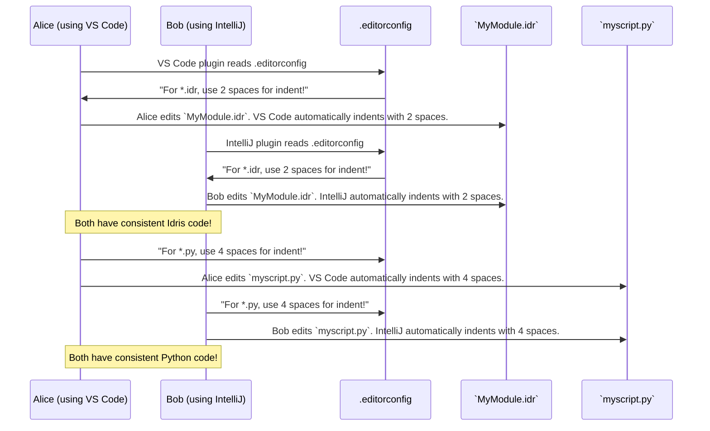

# Chapter 21: EditorConfig

Welcome back! In [Chapter 20: Pack Collection Version Script](20_pack_collection_version_script_.md), we looked at a small script that helped manage our project's versioning. Now, we're going to dive into a file many software projects use to keep their code looking neat and consistent: **EditorConfig**.

## What Problem Does EditorConfig Solve?

Imagine you're working on a team project, and everyone uses a different text editor. One person's editor might automatically use 4 spaces for indentation, another's might use 2 spaces, and a third might use tabs! When you combine everyone's code, it looks messy and hard to read, switching back and forth between different styles. This can lead to arguments about "tabs vs. spaces" or "how many spaces."

The problem EditorConfig solves is: **how can we enforce a consistent coding style (like how many spaces to indent, or what kind of line endings to use) across different text editors and IDEs (Integrated Development Environments) for all contributors to a project?** It's like having a universal style guide that automatically adjusts everyone's editor settings, so all the code looks the same, no matter who wrote it or what tool they used.

Our central use case for this chapter is: **To ensure that every developer working on `DepTyCheck` uses the same indentation (e.g., 2 spaces for Idris files, 4 spaces for Python files) and other formatting styles, making the codebase clean and easy to read for everyone.**

## The `.editorconfig` File: Your Universal Style Guide

The `.editorconfig` file is a plain text file that defines coding styles. It's usually placed in the root folder of a project. Most popular text editors and IDEs (like VS Code, IntelliJ, NeoVim, Sublime Text) have a plugin that reads this file and automatically adjusts their settings to match the project's style. If a plugin isn't available, the editor might ignore the file, but it's widely supported.

Let's look at the `DepTyCheck` project's `.editorconfig` file:

```ini
# top-most EditorConfig file
root = true

# Defaults for every file
[*]
end_of_line = lf
charset = utf-8

insert_final_newline = true
trim_trailing_whitespace = true

max_line_length = 152

# Idris source files
[*.{idr,ipkg,tex,yaff,lidr}]
indent_style = space
indent_size = 2

# Various configuration files
[{*.yml,.ecrc}]
indent_style = space
indent_size = 2

[*.{c,h}]
indent_style = space
indent_size = 4

[*.{md,rst}]
indent_style = space
indent_size = 2

# ... (more file type specific rules) ...
```

This file is written in a simple `.ini` like format. It's divided into sections, each defining rules for specific types of files.

### 1. `root = true`

```ini
# top-most EditorConfig file
root = true
```
*   `root = true`: This tells EditorConfig that this is the highest-level configuration file for the project. When your editor looks for `.editorconfig` files, it will stop searching upwards from this file's directory. This prevents settings from parent directories from overriding your project's specific rules.

### 2. `[*]` - Default Rules for All Files

```ini
# Defaults for every file
[*]
end_of_line = lf
charset = utf-8

insert_final_newline = true
trim_trailing_whitespace = true

max_line_length = 152
```
*   `[*]`: This is a wildcard section header. It means "these rules apply to *all* files" in the project, unless overridden by a more specific section.
*   `end_of_line = lf`: This sets the character(s) used to mark the end of a line. `lf` stands for "Line Feed." Different operating systems use different line endings, and `lf` (used by Unix/Linux and macOS) is a common standard for cross-platform projects. This avoids issues where files might look like they have extra characters or strange spacing on different OSs.
*   `charset = utf-8`: This specifies the character encoding. `utf-8` is the most common and widely supported character encoding for text files, allowing for a broad range of characters (like emojis or special symbols) without issues.
*   `insert_final_newline = true`: This ensures that every file ends with a blank line. This is good practice and helps version control systems (like Git) more easily track changes at the end of files.
*   `trim_trailing_whitespace = true`: This automatically removes any spaces or tabs at the end of a line. Trailing whitespace is invisible but can cause annoying "file changed" indicators in Git, even if no meaningful content was altered.
*   `max_line_length = 152`: This sets a guideline for how long a single line of code should be. Editors often help you stick to this by showing a visual line. This improves readability, especially on smaller screens or when looking at code side-by-side.

### 3. File Type Specific Rules

After the `[*]` defaults, `.editorconfig` defines rules for specific types of files. These rules override the defaults for matching files.

```ini
# Idris source files
[*.{idr,ipkg,tex,yaff,lidr}]
indent_style = space
indent_size = 2
```
*   `[*.{idr,ipkg,tex,yaff,lidr}]`: This section applies to files ending in `.idr`, `.ipkg`, `.tex`, `.yaff`, or `.lidr`. These are typically Idris source files and related documentation files.
*   `indent_style = space`: This specifies that indentation should be done using spaces, not tabs.
*   `indent_size = 2`: Each indentation level should be 2 spaces wide.

```ini
# Various configuration files
[{*.yml,.ecrc}]
indent_style = space
indent_size = 2
```
*   `[{*.yml,.ecrc}]`: Matches `YAML` files (`.yml`) and EditorConfig's own cached files (`.ecrc`). Also uses 2 spaces for indentation.

```ini
[*.{c,h}]
indent_style = space
indent_size = 4
```
*   `[*.{c,h}]`: Matches C source files (`.c`) and header files (`.h`). Here, the indentation size is 4 spaces, which is a common convention for C/C++ code. This shows how `EditorConfig` can have different rules for different languages within the same project.

```ini
[{Makefile,*.mk}]
indent_style = tab
```
*   `[{Makefile,*.mk}]`: Matches files named `Makefile` and those ending in `.mk`. For Makefiles, the traditional and required indentation is a `tab`, so `indent_style = tab` is correctly set here.

```ini
[expected]
trim_trailing_whitespace = false
max_line_length = off
```
*   `[expected]`: This applies to a specific file named `expected` (perhaps for storing expected test outputs). Here, `trim_trailing_whitespace` is set to `false` (meaning trailing spaces are *not* removed), and `max_line_length` is `off` (meaning lines can be any length). This is useful if the content of this file is very sensitive to exact formatting.

## Central Use Case in Action

Here's how `.editorconfig` solves our central use case for `DepTyCheck`:



This interaction ensures that regardless of personal editor preferences, the `DepTyCheck` codebase maintains a unified style, which contributes significantly to readability and reduces conflicts during code reviews or merges.

## Internal Implementation: How Editors Use `.editorconfig`

The burden of implementing EditorConfig rules falls on the editor plugins, not on `DepTyCheck` itself.

1.  **Plugin Installation:** Developers install an EditorConfig plugin for their specific editor (if it's not built-in).
2.  **File System Scan:** When a developer opens a file in a project, the plugin starts looking for `.editorconfig` files. It searches upwards from the directory of the opened file until it finds a `root = true` file or reaches the root of the file system.
3.  **Rule Application:** It gathers all the rules that apply to the opened file type from the `.editorconfig` file(s) it found. Rules in more specific sections override general rules.
4.  **Editor Settings Override:** The plugin then temporarily overrides the editor's default settings (like `tab_width`, `indent_style`, `end_of_line`) for that specific file (or project). This happens automatically, making the developer's experience seamless.

This system is external to the Idris compiler or `pack` manager. It's purely about developer ergonomics and code quality. The `.editorconfig` file itself is just a passive configuration file; it doesn't execute any code.

## Conclusion

The `.editorconfig` file, though humble, is a powerful tool for maintaining code consistency across different development environments in the `DepTyCheck` project. By defining universal style rules for indentation, line endings, character sets, and line lengths, it acts as a project-wide style guide that your editor automatically enforces. This ensures a clean, readable, and unified codebase, minimizing formatting debates and improving collaboration among contributors.

Next, we'll look at the `Git Ignore` file, which tells our version control system, Git, which files to intentionally *not* track in the project.

[Next Chapter: Git Ignore](22_git_ignore_.md)

---

Generated by [AI Codebase Knowledge Builder](https://github.com/The-Pocket/Tutorial-Codebase-Knowledge)