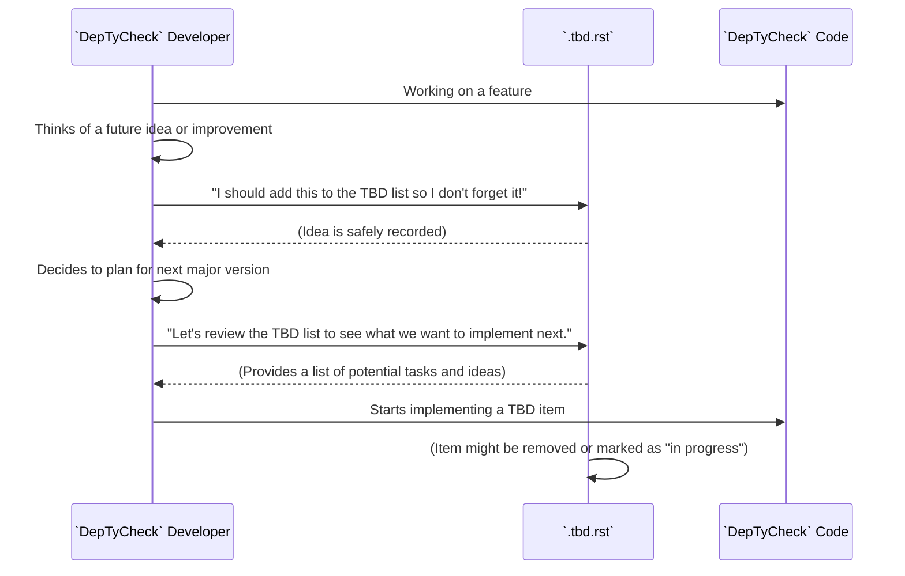

# Chapter 23: To Be Done (TBD)

Welcome back! In [Chapter 22: Git Ignore](22_git_ignore_.md), we learned how to keep our Git repository clean by telling it which files to ignore. Now, we're going to explore a very human-centric, yet critical, document within the `DepTyCheck` project: **To Be Done (TBD)**.

## What Problem Does the "To Be Done (TBD)" Document Solve?

Imagine you're building a house, and you have a detailed blueprint. But as you build, new ideas pop up: "Maybe a skylight here?", "We should add a smart thermostat later," or "That guest bathroom needs a new paint color." You don't want to forget these ideas, but they aren't part of the current urgent tasks. You need a place to jot them down so they can be considered for future work.

The problem the "To Be Done (TBD)" document solves is: **how can we keep a running list of future development ideas, potential enhancements, and unresolved tasks for the `DepTyCheck` project without cluttering the main code or current documentation?** It's like having a dedicated "ideas board" or a "future tasks notebook" for the project.

Our central use case for this chapter is: **To provide a single, easy-to-find place where `DepTyCheck` developers and contributors can see what's planned next, what brainstorming has happened, and what areas of the project are still evolving.**

## The `.tbd.rst` File: `DepTyCheck`'s Future Plans

The `DepTyCheck` project uses a file named `.tbd.rst` (the `.rst` means it's written in reStructuredText, a documentation format, but its content is like a simple bulleted list) to capture these future thoughts. It's a living document that outlines the project's evolving roadmap and tackles areas for continuous improvement.

Let's look at some examples from the `DepTyCheck` project's `.tbd.rst` file to understand its purpose.

```rst
- Отработка приёмов спецификации

  - Определённость значения переменной

    - Добавление понятия

    - Внесение соответствующих изменений в спецификацию

- Превращение рекурсивных ``Gen``'ов в Чёрч-кодированные, комбинирующиеся рекурсивными схемами.
  В частности, этим можно достигать хитрые комбинации, когда на определённой глубине корректных ``Gen``'ов используются специальные,
  генерирующие некорректные значения.

- Попытка разделения спецификации того, что есть в языке, от спецификации того, что нужно для пользовательских свойств.
```

(Note: The original `.tbd.rst` is in Russian. We'll translate for clarity and learning, but remember that the actual file content might be in a different language.)

Let's break down some of these points.

### 1. "Refining Specification Techniques"

```
- Refining Specification Techniques

  - Definiteness of a variable's value (e.g., if a variable is defined after an 'if' statement)

    - Adding the concept
    - Making corresponding changes to the specification
      - For example, that after `if`, only what is defined after *any* branch is defined.
    - Adding the property that a variable can only be used in an expression when it is defined.
```
*   **What this means:** `DepTyCheck` helps ensure Idris programs are correct. This `TBD` item suggests ways to make the "rules" (specifications) even better, especially around how variables are used. It's about ensuring the type system correctly tracks when a variable has a definite value.
*   **Why it's "To Be Done":** This is a complex area, potentially requiring changes to the core `DepTyCheck` logic that analyzes program properties. It's an idea for future improvement.

### 2. "Converting Recursive Generators to Church-encoded"

```
- Converting recursive `Gen`s to Church-encoded, combining with recursive schemes.
  In particular, this can achieve tricky combinations where, at a certain depth of correct `Gen`s, special ones are used that generate incorrect values.
```
*   **What this means:** In [Chapter 7: Test Generator Core](07_test_generator_core_.md), we learned about `Gen` (generators) and in [Chapter 15: Constructor Recursiveness Analysis](15_constructor_recursiveness_analysis_.md), we saw how recursion is handled with `Fuel`. This `TBD` item is a very advanced idea for how to make `DepTyCheck`'s generators even *more* flexible, especially for testing tricky or "incorrect" scenarios. "Church encoding" and "recursive schemes" are advanced functional programming techniques that could make `Gen`s more powerful.
*   **Why it's "To Be Done":** This is a significant architectural change to the `Gen` data type and its behavior, indicating a long-term research idea or major refactor.

### 3. "Separating language specification from user properties"

```
- Attempting to separate the specification of what is in the language from the specification of what is needed for user properties.

  For example, one can add some user property to a type, for example, the presence of an `if` construct (or, for example, the presence of a pattern for optimizer to trigger).

  It is desirable that these specifications can be added next to the "main" specification of the language, which does not change for adding new properties.
  Accordingly, generators will be specific to the combination of the "main" language specification and a set of user properties.
```
*   **What this means:** This is a core idea around how `DepTyCheck` defines (or "specifies") what a language is made of, and how user-defined tests relate to that. Currently, these might be closely linked. This `TBD` suggests a way to make them more independent. Imagine the base rules of Idris are one thing, and your specific test that checks "does my code use 'if' statements?" is another.
*   **Why it's "To Be Done":** This is a fundamental design goal for improving the modularity and extensibility of `DepTyCheck`, allowing users to define new properties without altering the core language definition.

### 4. "Parameterize generators with test sets"

```
- The generator parameter can be a "test set satisfying a given criterion."
  Accordingly, by construction, the generator of such "test set" data structures will generate entire test sets that satisfy the criterion.
```
*   **What this means:** This pushes the idea of generators further. Instead of just generating single values, this `TBD` suggests generating *entire collections* of values (a "test set") that *already meet some complex requirement* (a "criterion"). This would make testing even more powerful, as you could ask for "a list of numbers that are all prime and unique" directly from the generator.
*   **Why it's "To Be Done":** This is a complex new feature, requiring rethinking how generators are composed and what kind of criteria can be specified.

## Central Use Case: A Developer's Brainstorming Document

The `.tbd.rst` file is essentially `DepTyCheck`'s "brainstorming document" or "developer's to-do list."



This interaction highlights that the `.tbd.rst` file serves as a dynamic repository of ideas, guiding future development and helping developers coordinate their long-term vision for the project.

## Internal Implementation: A Simple Text File

The "internal implementation" of `.tbd.rst` is simply that it's a plain text file. It doesn't involve any complex code or parsing by tools (other than perhaps the `Read the Docs` system to display it nicely, as discussed in [Chapter 4: Read the Docs Configuration](04_read_the_docs_configuration_.md)).

*   **Human-readable:** Anyone can open it and understand it.
*   **Easy to edit:** Developers can quickly add, remove, or modify items using any text editor.
*   **Git-tracked:** Since it's a `.rst` file, it *is* tracked by Git, keeping a history of all proposed and completed future tasks, which is valuable for project transparency.

The power of the `.tbd.rst` file comes from its simplicity and its role as a centralized place for project evolution discussions among contributors. It manages expectations by openly stating what's not yet done, and it inspires future work by listing exciting new possibilities.

## Conclusion

The "To Be Done (TBD)" document (`.tbd.rst`) within the `DepTyCheck` project is a crucial, living artifact that outlines future development ideas, potential enhancements, and unresolved tasks. It serves as a developer's brainstorming document, a roadmap of desired features, and a transparent acknowledgment of areas that still require attention. By capturing these thoughts in a simple, Git-tracked format, `DepTyCheck` ensures that valuable ideas aren't lost and that the project's long-term vision is clear to all contributors.

Next, we'll look at the `Rename Script`, a small utility to help keep the project's internal names consistent.

[Next Chapter: Rename Script](24_rename_script_.md)

---

Generated by [AI Codebase Knowledge Builder](https://github.com/The-Pocket/Tutorial-Codebase-Knowledge)