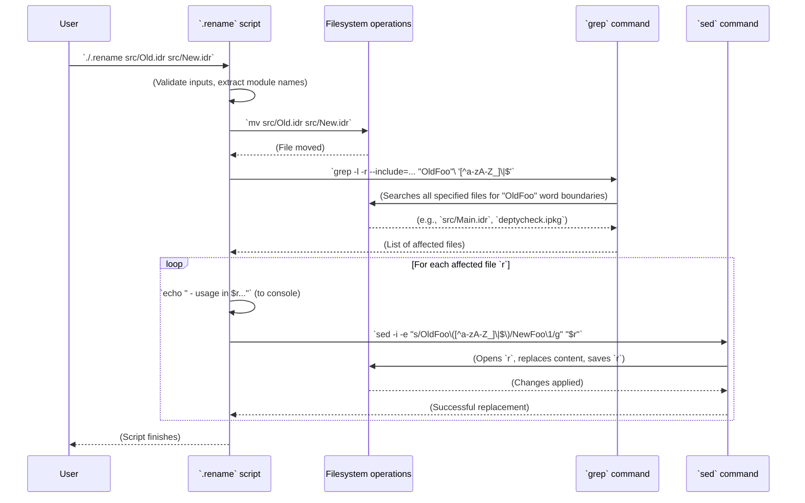

# Chapter 24: Rename Script

Welcome back! In [Chapter 23: To Be Done (TBD)](23_to_be_done__tbd__.md), we learned about the `.tbd.rst` document, which serves as a roadmap for future development in `DepTyCheck`. Now, we're going to look at a handy little script that helps manage one specific, but very common, aspect of project maintenance: **The Rename Script**.

## What Problem Does the Rename Script Solve?

Imagine you're building a house, and you've decided to rename the "Kitchen" to "Galley." It's not enough to just change the sign on the door! You also need to:
1.  Change every mention of "Kitchen" in your blueprint to "Galley."
2.  Update any instructions that refer to the "Kitchen" to now refer to the "Galley."

If you miss even one mention, someone trying to follow the instructions might get confused or go to the wrong place!

In a software project, data structures and modules (files) often get renamed as the project evolves. When you rename an Idris file (e.g., `src/OldName.idr` to `src/NewName.idr`), you're not just changing the file's name; you're also implicitly renaming its *module name* (e.g., `OldName` to `NewName`). If other files import or use `OldName`, their code will break! You'd have to manually go through every file in the project and change `import OldName` to `import NewName`, or `OldName.func` to `NewName.func`. This is tedious and error-prone.

The problem the Rename Script solves is: **how can we automatically rename an Idris source file and concurrently update all references to its old module name in other project files, preventing broken imports and ensuring code consistency?** It's like an automated "find-and-replace" across your entire codebase, but smarter, specifically for module renames.

Our central use case for this chapter is: **To rename an Idris source file (like `src/OldModule.idr` to `src/NewModule.idr`) and have the project automatically update all other files that referred to "OldModule" to now refer to "NewModule."**

## The `.rename` Script: Your Automated Refactoring Assistant

The `DepTyCheck` project uses a shell script named `.rename` to handle this. It takes two filenames as arguments: the old file path and the new file path.

```sh
#!/bin/sh

die() {
  echo "$2" >&2
  exit "$1"
}

stat -t ./*.ipkg > /dev/null 2> /dev/null || die 2 "No *.ipkg file found in the current dir"

FROM_FILE="$1"
TO_FILE="$2"

check_readability() {
  test -r "$1" || die 3 "Can't read file '$1'"
}

check_to_dotdot() {
  grep '\.\.' "$1" && die 4 "Filename cannot contain '..': $1"
}

filename_to_module() {
  echo "$1" | sed -e 's|^src/||' -e 's|\.idr$||' -e 's|/|\.|g'
}

check_readability "$FROM_FILE"

FROM_MODULE="$(filename_to_module "$FROM_FILE")"
TO_MODULE="$(filename_to_module "$TO_FILE")"

echo "Renaming $FROM_MODULE to $TO_MODULE..."

mv "$FROM_FILE" "$TO_FILE"
grep -l -r --include='*.idr' --include='*.lidr' --include='*.ipkg' --include='*.md' --include='*.typ' "$FROM_MODULE"'\([^a-zA-Z_]\|$\)' |
  while read -r r; do
    echo "  - usage in $r..."
    sed -i -e "s/$FROM_MODULE\([^a-zA-Z_]\|$\)/$TO_MODULE\1/g" "$r"
  done
```

Let's break down this script piece by piece.

### Part 1: Initial Setup and Input Validation

```sh
#!/bin/sh

die() {
  echo "$2" >&2
  exit "$1"
}

stat -t ./*.ipkg > /dev/null 2> /dev/null || die 2 "No *.ipkg file found in the current dir"

FROM_FILE="$1"
TO_FILE="$2"

check_readability() { # ... function definition ... }
check_to_dotdot() { # ... function definition ... }

check_readability "$FROM_FILE"
```
*   `#!/bin/sh`: This is the shebang line, telling the system to execute the script with `sh` (a standard Unix shell).
*   `die() { ... }`: A helper function to print an error message and exit the script.
*   `stat -t ./*.ipkg ... || die ... "No *.ipkg file found":` Checks if there's at least one `.ipkg` (Idris package definition) file in the current directory. This is a sanity check to ensure we're likely in the root of an Idris project.
*   `FROM_FILE="$1"` and `TO_FILE="$2"`: These lines capture the two arguments passed to the script: `$1` is the original filename, and `$2` is the new filename. For example, if you run `./.rename src/Old.idr src/New.idr`, then `FROM_FILE` becomes `src/Old.idr` and `TO_FILE` becomes `src/New.idr`.
*   `check_readability "$FROM_FILE"`: Ensures that the original file (`FROM_FILE`) actually exists and can be read.

### Part 2: Converting Filenames to Module Names

```sh
filename_to_module() {
  echo "$1" | sed -e 's|^src/||' -e 's|\.idr$||' -e 's|/|\.|g'
}

FROM_MODULE="$(filename_to_module "$FROM_FILE")"
TO_MODULE="$(filename_to_module "$TO_FILE")"

echo "Renaming $FROM_MODULE to $TO_MODULE..."
```
*   `filename_to_module()`: This is a crucial helper function. It takes a file path (like `src/My/Module.idr`) and transforms it into an Idris module name (like `My.Module`).
    *   `echo "$1"`: Prints the input filename.
    *   `sed -e 's|^src/||'`: Removes the leading `src/` part (if present).
    *   `sed -e 's|\.idr$||'`: Removes the `.idr` file extension from the end.
    *   `sed -e 's|/|\.|g'`: Replaces all forward slashes (`/`) with dots (`.`). This is how Idris module names are structured (e.g., `src/Foo/Bar.idr` becomes `Foo.Bar`).
*   `FROM_MODULE="..."` and `TO_MODULE="..."`: These lines call the `filename_to_module` function to get the old and new module names.
*   `echo "Renaming ..."`: Provides a helpful message to the user.

### Part 3: Performing the File Renaming and Content Update

```sh
mv "$FROM_FILE" "$TO_FILE"
grep -l -r --include='*.idr' --include='*.lidr' --include='*.ipkg' --include='*.md' --include='*.typ' "$FROM_MODULE"'\([^a-zA-Z_]\|$\)' |
  while read -r r; do
    echo "  - usage in $r..."
    sed -i -e "s/$FROM_MODULE\([^a-zA-Z_]\|$\)/$TO_MODULE\1/g" "$r"
  done
```
*   `mv "$FROM_FILE" "$TO_FILE"`: This is the actual file system rename. It moves (`mv`) the old file to the new location/name.
*   `grep -l -r ... "$FROM_MODULE"'\([^a-zA-Z_]\|$\)'`: This command finds all files that contain the `FROM_MODULE` string.
    *   `grep -l`: Prints only the names of files that contain a match, not the matching lines themselves.
    *   `-r`: Recurses into subdirectories.
    *   `--include='*.idr' ...`: Specifies which types of files to search (`.idr`, `.lidr` for Idris, `.ipkg` for package definitions, `.md` for Markdown, `.typ` for Typst files).
    *   `"$FROM_MODULE"'\([^a-zA-Z_]\|$\)'`: This is the crucial search pattern. It looks for `FROM_MODULE` followed by:
        *   `\(`...`\)`: A capturing group.
        *   `[^a-zA-Z_]`: Any character that is NOT a letter or an underscore. This ensures that we match `Foo.Bar ` (with a space), `Foo.Bar.Baz` (with a dot), or `Foo.Bar,` (with a comma), but *not* `Foo.BarBaz` (which would be a different name). This is a word boundary check for module names.
        *   `|`: OR
        *   `$`: End of line.
    *   The output of `grep` is a list of filenames, one per line.
*   `| while read -r r; do ... done`: This pipes the list of filenames from `grep` to a `while` loop. For each file `r` in that list:
    *   `echo "  - usage in $r..."`: Informs the user which file is being modified.
    *   `sed -i -e "s/$FROM_MODULE\([^a-zA-Z_]\|$\)/$TO_MODULE\1/g" "$r"`: This performs the in-place find-and-replace for the module name within the file `r`.
        *   `sed -i`: Edits the file *in place*.
        *   `-e "s/PATTERN/REPLACEMENT/g"`: The `sed` command to substitute (`s`) `PATTERN` with `REPLACEMENT`, globally (`g`) on each line.
        *   `$FROM_MODULE\([^a-zA-Z_]\|$\)`: This is the exact same pattern used by `grep`, representing the old module name followed by its terminator. Crucially, `\1` refers to whatever was captured by `\([^a-zA-Z_]\|$\)` (the non-letter/underscore character or the end of the line). This ensures that characters like spaces, dots, or commas immediately following the module name are preserved.
        *   `$TO_MODULE\1`: The replacement string inserts `TO_MODULE` followed by that captured character (if it exists).

## Central Use Case in Action

Let's assume we have `src/OldFoo.idr` and want to rename it to `src/NewFoo.idr`.

1.  **Initial state:**
    *   `src/OldFoo.idr` (content: `module OldFoo ...`)
    *   `src/Main.idr` (content: `import OldFoo ... OldFoo.func ...`)
    *   `deptycheck.ipkg` (content: `modules = OldFoo ...`)

2.  **Run the script:**
    ```bash
    ./.rename src/OldFoo.idr src/NewFoo.idr
    ```

3.  **Output in your terminal:**
    ```
    Renaming OldFoo to NewFoo...
      - usage in src/Main.idr...
      - usage in deptycheck.ipkg...
    ```

4.  **Final state:**
    *   `src/NewFoo.idr` (content: `module NewFoo ...`)
    *   `src/Main.idr` (content: `import NewFoo ... NewFoo.func ...`)
    *   `deptycheck.ipkg` (content: `modules = NewFoo ...`)

Voilà! The file is renamed, and all references are updated.

## Internal Implementation: Unix Philosophy

The `.rename` script is a great example of the "Unix philosophy": small tools doing one thing well, combined using pipes.



This sequence diagram illustrates the script's core logic: move the file, find all occurrences of the old module name, and replace them in place. The use of robust regular expressions ensures that only actual module names (not parts of other words) are replaced, and that surrounding characters are preserved.

## Conclusion

The `.rename` script in `DepTyCheck` is a small but powerful shell utility designed to safely refactor module names across the project. By automating the renaming of source files and the subsequent updating of all references to the old module name, it saves developers from tedious manual work and prevents common errors like broken imports. It's a testament to how simple yet effective tools can greatly enhance the maintainability and evolution of a codebase.

Next, we'll dive into some platform-specific utilities, starting with the `Chez Scheme GC Handler Patch`, which addresses a compatibility issue.

[Next Chapter: Chez Scheme GC Handler Patch](25_chez_scheme_gc_handler_patch_.md)

---

Generated by [AI Codebase Knowledge Builder](https://github.com/The-Pocket/Tutorial-Codebase-Knowledge)