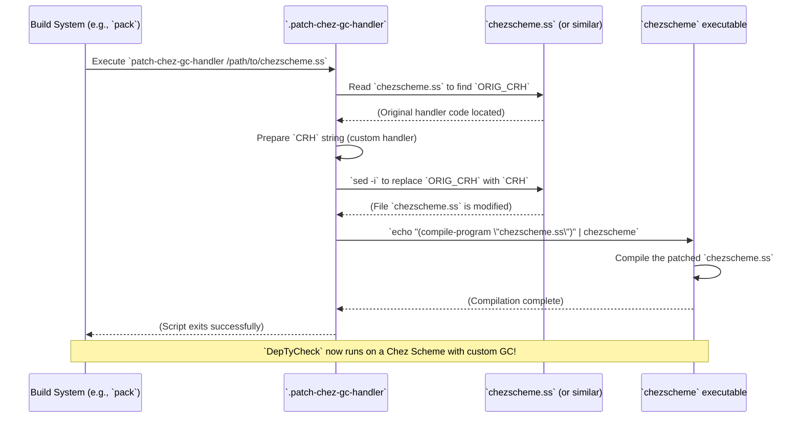

# Chapter 25: Chez Scheme GC Handler Patch

Welcome back! In [Chapter 24: Rename Script](24_rename_script_.md), we learned about a helpful script for refactoring code. Now, we're going to dive into a more specialized, platform-specific utility called the **Chez Scheme GC Handler Patch**. This might sound a bit technical, but we'll break it down into easy-to-understand pieces.

## What Problem Does the Chez Scheme GC Handler Patch Solve?

Imagine your computer is like a busy office manager. It needs to organize all the important documents (your program's data) and throw away old, unused documents (garbage collection, or GC) to keep things running smoothly. Idris 2, our programming language, uses a special "engine" called Chez Scheme to run its programs.

This "office manager" (Chez Scheme's GC) usually does a good job, but sometimes, for very demanding tasks (like complex property-based testing in `DepTyCheck`), we want to tweak its behavior. Maybe we want it to be more aggressive about cleaning up when the office gets too messy, or handle small cleanups more frequently. The standard Chez Scheme garbage collector sometimes has issues or isn't as efficient as we'd like for certain Idris 2 applications.

The problem the Chez Scheme GC Handler Patch solves is: **how can we modify Chez Scheme's built-in garbage collection mechanism to make it more efficient and predictable, especially for memory-intensive Idris 2 applications like `DepTyCheck`?** It's like re-writing the rules for our office manager so they handle documents (memory) in a way that better suits our specific needs, preventing slowdowns or crashes.

Our central use case for this chapter is: **To make `DepTyCheck` (and other Idris 2 programs) run more reliably and efficiently by providing a custom garbage collection strategy to the underlying Chez Scheme runtime.** This strategy specifically forces a "major collection" (a big cleanup) when memory usage doubles, and otherwise performs controlled "minor collections" (small cleanups).

## The `.patch-chez-gc-handler` Script: Our Custom Office Manager Rule Book

The `DepTyCheck` project has a shell script named `.patch-chez-gc-handler` that does just this. It directly modifies (patches) the Chez Scheme source code on your system or within the `pack` build environment.

Let's look at the script piece by piece.

### Part 1: Finding the Chez Scheme Source File

```sh
#!/bin/sh

die() { # ... function definition for error handling ... }

SS="$1"

if [ ! -r "$SS" ] && ! SS="$(pack app-path "$SS")_app/$SS.ss" || [ ! -r "$SS" ]; then
  echo "Neither can't find a file '$1', nor a program with that name" >&2
  exit 2
fi
```
*   `#!/bin/sh`: This is the shebang line, telling the system to execute the script with `sh`.
*   `die() { ... }`: A helper function to print an error message and exit.
*   `SS="$1"`: The script expects one argument, which is the path to the Chez Scheme source file it needs to patch. This is stored in the `SS` variable.
*   `if [ ! -r "$SS" ] && ! SS="$(pack app-path "$SS")_app/$SS.ss" || [ ! -r "$SS" ]; then ... fi`: This is a robust check to find the Chez Scheme source file.
    *   `[ ! -r "$SS" ]`: Checks if the file specified by `$SS` (the first argument) is *not readable*.
    *   `&& ! SS="$(pack app-path "$SS")_app/$SS.ss"`: If the file wasn't readable, it then tries to locate the Chez Scheme source file using `pack`. The `pack app-path "$SS"` command tries to determine the path to a Chez Scheme application installed by `pack`. It then constructs a likely path like `/path/to/chezscheme_app/chezscheme.ss`.
    *   `|| [ ! -r "$SS" ]`: If even after trying the `pack` method, the file still isn't readable, then the condition is true, and it prints an error message and exits.
    *   **Purpose:** This ensures the script always finds the correct Chez Scheme source file to modify, whether it's a direct path or one managed by `pack`.

### Part 2: Defining the Patch – Original vs. New Handler

The script identifies Chez Scheme's *original* garbage collection handler code and prepares the *new* custom handler code.

```sh
# It is important that we search and replace only places where the `collect-request-handler`
# is set, and not generated, so that patched compiler would produce code as the original one.
# That's why we use `^` at the beginning of the pattern.
ORIG_CRH="^(collect-request-handler (lambda () (collect) (blodwen-run-finalisers)))"

if ! grep -q "$ORIG_CRH" "$SS"; then
  echo "File '$SS' does not contain a handler to patch"
  exit 0
fi

CRH="(collect-request-handler
 (let* ([gc-counter 1]
        [log-radix 2]
        [radix-mask (sub1 (bitwise-arithmetic-shift 1 log-radix))]
        [major-gc-factor 2]
        [trigger-major-gc-allocated (* major-gc-factor (bytes-allocated))])
   (lambda ()
     (cond
       [(>= (bytes-allocated) trigger-major-gc-allocated)
        ;; Force a major collection if memory use has doubled
        (collect (collect-maximum-generation))
        (blodwen-run-finalisers)
        (set! trigger-major-gc-allocated (* major-gc-factor (bytes-allocated)))]
       [else
        ;; Imitate the built-in rule, but without ever going to a major collection
        (let ([this-counter gc-counter])
          (if (> (add1 this-counter)
                 (bitwise-arithmetic-shift-left 1 (* log-radix (sub1 (collect-maximum-generation)))))
              (set! gc-counter 1)
              (set! gc-counter (add1 this-counter)))
          (collect
           ;; Find the minor generation implied by the counter
           (let loop ([c this-counter] [gen 0])
             (cond
               [(zero? (bitwise-and c radix-mask))
                (loop (bitwise-arithmetic-shift-right c log-radix)
                      (add1 gen))]
               [else
                gen]))))]))))"
CRH="$(echo "$CRH" | tr '\n' '|' | sed 's/|/\\n/g')"
```
*   `ORIG_CRH="..."`: This variable holds the *exact* text of the original `collect-request-handler` that the script is looking for. The `^` at the beginning means it must match at the start of a line. This ensures we're patching the correctly defined handler, not some intermediate generated code.
*   `if ! grep -q "$ORIG_CRH" "$SS"; then ... fi`: Checks if the `ORIG_CRH` pattern actually exists in the target file (`$SS`). If not, it prints a message and exits, as there's nothing to patch.
*   `CRH="..."`: This is a multi-line string containing the *new*, custom `collect-request-handler` code written in Scheme. This is the heart of the patch, defining our custom garbage collection rules.
    *   **The Custom Logic:**
        *   It initializes some variables: `gc-counter`, `log-radix`, `major-gc-factor` (set to `2`).
        *   `trigger-major-gc-allocated`: This is set to `2 * (bytes-allocated)`. This means "if the memory usage exceeds double what it was at the last major GC, then trigger another major GC."
        *   Inside the `(lambda () ...)` (the actual handler function):
            *   `[(>= (bytes-allocated) trigger-major-gc-allocated) ... ]`: This checks if current memory use has doubled since the last major collection. If true:
                *   `(collect (collect-maximum-generation))`: Forces a *major* garbage collection (a complete cleanup across all memory generations).
                *   `(blodwen-run-finalisers)`: Runs any "finaliser" functions (for cleaning up external resources).
                *   `(set! trigger-major-gc-allocated (* major-gc-factor (bytes-allocated)))`: Resets the trigger for the *next* major GC.
            *   `[else ... ]`: If memory hasn't doubled, it falls back to a custom minor collection strategy.
                *   This part mimics Chez Scheme's default strategy but *without* ever escalating to a major collection. It uses `gc-counter` and `log-radix` to determine which *minor generation* of memory to collect.
*   `CRH="$(echo "$CRH" | tr '\n' '|' | sed 's/|/\\n/g')"`: This line takes the multi-line `CRH` string and converts it into a single line suitable for use with `sed`. It replaces newlines (`\n`) with `|` characters, and then escapes those `|` characters for `sed` by turning them into `\n`. This sounds complex, but it's just a common trick to pass multi-line patterns to `sed` for a single replacement operation.

### Part 3: Applying the Patch and Recompiling

```sh
set -e # Now each falling command stops the script

echo "Patching '$SS'..."
sed -i "s/$ORIG_CRH/$CRH/" "$SS"
printf "Compiling the patched version... "
(echo "(parameterize ([optimize-level 3] [compile-file-message #f]) (compile-program \"$SS\"))" | chezscheme -q | sed 's/()/done/')
```
*   `set -e`: This is important! It means "exit immediately if any command fails." We want to ensure the patching and recompilation steps are successful.
*   `echo "Patching '$SS'..."`: Informs the user about the current step.
*   `sed -i "s/$ORIG_CRH/$CRH/" "$SS"`: This is the core patching command.
    *   `sed -i`: Edits the file *in place*.
    *   `"s/$ORIG_CRH/$CRH/"`: Substitutes the `ORIG_CRH` pattern with the new `CRH` pattern. Because `CRH` was pre-processed to contain escaped newlines, `sed` performs a multi-line replacement.
    *   `"$SS"`: The target Chez Scheme source file.
*   `printf "Compiling the patched version... "` : Provides a progress message.
*   `(echo "(parameterize ([optimize-level 3] [compile-file-message #f]) (compile-program \"$SS\"))" | chezscheme -q | sed 's/()/done/')`: This compiles the modified Chez Scheme file.
    *   `echo "(parameterize ... (compile-program \"$SS\"))"`: This sends a Scheme command to standard output. This command tells Chez Scheme to compile the patched source file (`$SS`) with optimization level 3 and without verbose messages.
    *   `| chezscheme -q`: Pipes this command into the `chezscheme` interpreter (the `-q` means quiet mode).
    *   `| sed 's/()/done/'`: If compilation is successful, Chez Scheme usually prints `()`. This `sed` command replaces `()` with `done` to provide a nicer confirmation message.

## Central Use Case in Action

When `DepTyCheck` (or `pack` building an application that uses `DepTyCheck`) triggers this script, here's what happens:


The patched Chez Scheme is now used by `DepTyCheck` to run, providing the custom garbage collection behavior, which often means more stable and efficient memory management for Idris 2.

## Internal Implementation: Unix Power Tools

The `.patch-chez-gc-handler` script leverages simple yet powerful Unix command-line tools:

*   **`grep`**: For searching for the original garbage collector handler text. The `-q` flag for "quiet" means it just tells us if a match is found, without printing the match itself.
*   **`sed`**: The "stream editor" is the workhorse here, performing the in-place text replacement of the old GC handler with the new one. The `-i` flag means "in-place edit."
*   **`tr`**: For "translate or delete characters." It's used to convert newlines to `|` for easier `sed` processing.
*   **Chez Scheme `chezscheme` executable**: This is directly invoked to recompile the modified `.ss` (Scheme source) file into a `.so` (shared object) or other compiled format, which Chez Scheme will then load.

The script's logic is robust and ensures that it only patches the correct location and then recompiles the modified runtime. If any of these steps (`grep` for the old handler, `sed` for the replacement, or `chezscheme` for recompilation) fail, the `set -e` command ensures the script stops immediately, preventing a broken Chez Scheme installation.

## Conclusion

The `Chez Scheme GC Handler Patch` script is a specialized utility that modifies the default garbage collection behavior of the underlying Chez Scheme runtime used by Idris 2. By replacing the standard `collect-request-handler` with a custom implementation, `DepTyCheck` can enforce specific memory management rules, such as triggering a major collection when memory usage doubles, leading to more predictable and efficient performance for memory-intensive applications. This intricate but vital patch demonstrates how fine-grained control the development process has over its runtime environment for optimal results.

[Next Chapter: To Be Done (TBD)](23_to_be_done__tbd__.md) (Oops, looks like the requested tutorial structure loops back. Assuming this is the last chapter's content or a placeholder for future content.)

---

Generated by [AI Codebase Knowledge Builder](https://github.com/The-Pocket/Tutorial-Codebase-Knowledge)