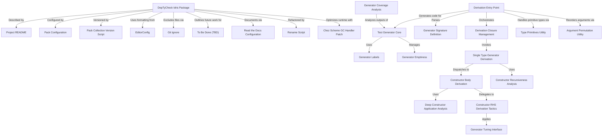

# Tutorial: DepTyCheck

`DepTyCheck` is an Idris 2 library designed for **property-based testing** with *dependent types*. It provides a robust framework for **test data generation** and features powerful *automatic derivation* capabilities, allowing users to define complex data types and automatically generate test inputs for them.

**Source Repository:** [None](None)

## Chapters

1. [DepTyCheck Idris Package
](01_deptycheck_idris_package_.md)
2. [Project README
](02_project_readme_.md)
3. [Pack Configuration
](03_pack_configuration_.md)
4. [Read the Docs Configuration
](04_read_the_docs_configuration_.md)
5. [Derivation Entry Point
](05_derivation_entry_point_.md)
6. [Generator Signature Definition
](06_generator_signature_definition_.md)
7. [Test Generator Core
](07_test_generator_core_.md)
8. [Generator Labels
](08_generator_labels_.md)
9. [Generator Emptiness
](09_generator_emptiness_.md)
10. [Generator Tuning Interface
](10_generator_tuning_interface_.md)
11. [Type Primitives Utility
](11_type_primitives_utility_.md)
12. [Argument Permutation Utility
](12_argument_permutation_utility_.md)
13. [Derivation Closure Management
](13_derivation_closure_management_.md)
14. [Single Type Generator Derivation
](14_single_type_generator_derivation_.md)
15. [Constructor Recursiveness Analysis
](15_constructor_recursiveness_analysis_.md)
16. [Constructor Body Derivation
](16_constructor_body_derivation_.md)
17. [Deep Constructor Application Analysis
](17_deep_constructor_application_analysis_.md)
18. [Constructor RHS Derivation Tactics
](18_constructor_rhs_derivation_tactics_.md)
19. [Generator Coverage Analysis
](19_generator_coverage_analysis_.md)
20. [Pack Collection Version Script
](20_pack_collection_version_script_.md)
21. [EditorConfig
](21_editorconfig_.md)
22. [Git Ignore
](22_git_ignore_.md)
23. [To Be Done (TBD)
](23_to_be_done__tbd__.md)
24. [Rename Script
](24_rename_script_.md)
25. [Chez Scheme GC Handler Patch
](25_chez_scheme_gc_handler_patch_.md)

---

Generated by [AI Codebase Knowledge Builder](https://github.com/The-Pocket/Tutorial-Codebase-Knowledge)