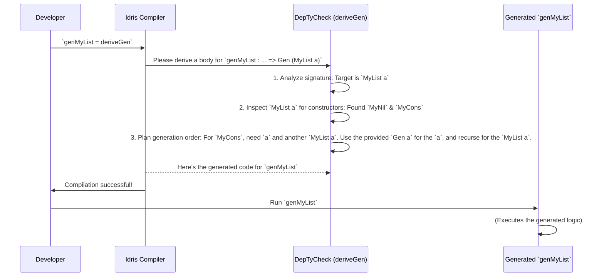

# Chapter 1: Automatic Generator Derivation

Welcome to the world of `DepTyCheck`! If you've ever spent hours writing test data by hand for your complex Idris types, you're in the right place. This chapter introduces the "magic wand" of the library: a tool that automates this tedious process, letting you focus on what really matters—building great software.

## The Chore of Creating Test Data

Imagine you've designed a simple data type to represent the state of a traffic light:

```idris
data TrafficLight = Red | Amber | Green
```

To test a function that uses `TrafficLight`, you'll need to generate `TrafficLight` values. For this simple case, you might write a function that randomly picks one of the three constructors.

But what if your data type is more complex, like a list?

```idris
data MyList a = MyNil | MyCons a (MyList a)
```

Now, generating a `MyList` isn't just about picking a constructor. If you pick `MyCons`, you also need to generate a value of type `a` and another `MyList a`. This gets complicated quickly, especially with dependently-typed structures where values must satisfy specific constraints. Writing these generators by hand is time-consuming, repetitive, and easy to get wrong.

This is the problem `DepTyCheck` solves with its most powerful feature.

## Your Magic Wand: `deriveGen`

Instead of writing complex generator recipes by hand, what if you could just define your data type and ask the library to create a generator *for* you? That's exactly what `deriveGen` does.

It's like having an AI architect on your team. You give the architect a product design (your Idris data type), and it automatically creates the entire factory blueprint (a generator) needed to build that product. This complex process happens at compile-time, where `DepTyCheck` analyzes your type, navigates its recursive parts and dependent constraints, and produces a correct, working generator.

## How to Wield the Wand

Using `deriveGen` is wonderfully simple. It's a three-step process:

1.  **Define your data type** (You've already done this!).
2.  **Declare a function signature** for the generator you want.
3.  **Implement it with `deriveGen`**.

Let's see it in action with our `TrafficLight` example.

First, we declare the signature for our generator. We'll call it `genTrafficLight`. It needs to return a generator for `TrafficLight` values. In `DepTyCheck`, this is written as `Gen TrafficLight`.

```idris
import Test.DepTyCheck

genTrafficLight : Fuel -> Gen TrafficLight
```

You'll notice a `Fuel` parameter. Think of `Fuel` as a battery for your generator. It prevents infinite loops when generating recursive data, like lists. We'll explore `Fuel` more later, but for now, just know that every generator needs it as its first argument. The actual recipes for building values are contained within the [Gen: The Core Generator Abstraction](02_gen__the_core_generator_abstraction_.md) data type.

Now for the magic. Instead of writing a complex implementation, we just assign `deriveGen`:

```idris
genTrafficLight = deriveGen
```

That's it! At compile time, `DepTyCheck` will inspect the `genTrafficLight` signature, see that you want to generate a `TrafficLight`, and automatically write the code to randomly produce `Red`, `Amber`, or `Green`.

## Handling More Complex Types

"Okay," you might be thinking, "that's neat for a simple `enum`, but what about my `MyList a` type?"

Let's try it! The `MyList a` type is parameterized by `a`. The architect can't build a `MyList a` if it doesn't know how to build the `a` values (the "windows" of our product). We need to provide it with a factory for `a`.

We do this by adding an "auto-implicit" argument to our signature, which tells `DepTyCheck`: "To build a `MyList a`, you will need a generator for `a`. Please find one or ask for one."

```idris
-- We tell deriveGen: "you'll be given a generator for `a`"
genMyList : (Fuel -> Gen a) => Fuel -> Gen (MyList a)
genMyList = deriveGen
```

The `(Fuel -> Gen a) =>` part is the key. It constrains `deriveGen`, telling it that a `Gen a` will be available. When you later use `genMyList`, you'll need to provide a generator, for example `genInteger`, and `deriveGen` will wire everything up correctly.

## What Happens Under the Hood?

The magic of `deriveGen` isn't *actually* magic; it's a sophisticated metaprogramming process. Let's peek behind the curtain. When the compiler sees `genMyList = deriveGen`, a sequence of events unfolds:



1.  **Analyze the Blueprint:** `deriveGen` first reads the function signature it needs to implement. It identifies the target type (`MyList a`), the given parameters, and any required external generators (like `Gen a`). This step is handled by functions like `checkTypeIsGen` which you can see in `src/Deriving/DepTyCheck/Gen.idr`. You can learn more about this in [Chapter 6: Generator Signature Representation
](06_generator_signature_representation_.md).

2.  **Find the Building Blocks:** It then inspects the definition of `MyList` and finds its constructors: `MyNil` and `MyCons`. These are the fundamental parts it can use to build values.

3.  **Plan the Assembly:** The derivation core, primarily in `canonicBody` inside `src/Deriving/DepTyCheck/Gen/ForOneType/Impl.idr`, decides how to combine these blocks.
    ```idris
    // A peek into: src/Deriving/DepTyCheck/Gen/ForOneType/Impl.idr
    canonicBody sig n = do
      -- Find all constructors for the type
      let cons = sig.targetType.cons
      ...
      -- For each constructor, create a helper generator
      consBodies <- for cons $ \con => ... canonicConsBody ...

      -- Create a big `case` expression on `Fuel` to decide which constructor to use
      let outmostRHS = fuelDecisionExpr ...
      ...
    ```
    It sees that `MyNil` is a simple, non-recursive value. It also sees `MyCons` is recursive, which means it might need to consume fuel. This analysis is crucial and is covered in more detail in [Chapter 7: Constructor Recursion Analysis
](07_constructor_recursion_analysis_.md).

4.  **Generate the Factory Code:** Finally, it generates the Idris code for the `genMyList` body. The generated code will contain logic that looks something like this (in simplified pseudocode):

    ```idris
    genMyList fuel =
      case fuel of
        Dry =>
          // No fuel left, must terminate. Use the non-recursive constructor.
          pure MyNil
        More newFuel =>
          // Fuel available, can choose either constructor.
          oneOf [ -- 50% chance
                  (pure MyNil),
                  -- 50% chance
                  (gen_a newFuel >>= \val =>
                   genMyList newFuel >>= \rest =>
                   pure (MyCons val rest))
                ]
    ```
    The logic for generating a single constructor's arguments in the right order is handled by a "tactic". The default, `LeastEffort`, is found in `consGenExpr` inside `src/Deriving/DepTyCheck/Gen/ForOneTypeConRhs/Impl.idr`. We'll explore how you can influence this in [Chapter 5: Derivation Customization
](05_derivation_customization_.md).

This entire process happens in the blink of an eye during compilation, giving you a ready-to-use generator without writing a single line of implementation logic.

## Conclusion

You've just taken your first step into a larger world of automated testing. You've learned that `deriveGen` is a powerful compile-time macro that acts as your personal "generator architect," freeing you from the tedious task of writing test data generators. By simply providing a data type and a function signature, you can get a robust, working generator for even complex, parameterized, and dependently-typed data.

Now that we've seen the magic of automatic derivation, you're probably wondering: what exactly is this `Gen` thing that `deriveGen` creates? In the next chapter, we'll pull back the curtain on this fundamental concept.

Next: [Chapter 2: Gen: The Core Generator Abstraction
](02_gen__the_core_generator_abstraction_.md)

---

Generated by [AI Codebase Knowledge Builder](https://github.com/The-Pocket/Tutorial-Codebase-Knowledge)