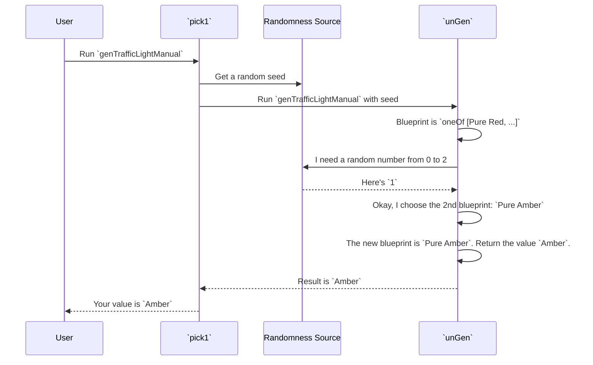

# Chapter 2: Gen: The Core Generator Abstraction

In the [previous chapter](01_automatic_generator_derivation_.md), we used `deriveGen` as a magic wand to automatically create generators for our data types. It's an incredibly powerful tool, but what is it actually creating? What is this `Gen` thing that gets produced?

This chapter pulls back the curtain. We'll explore the `Gen` data type, the fundamental building block at the heart of `DepTyCheck`. Understanding `Gen` will not only demystify the library but also empower you to write your own custom, powerful, and precise generators when `deriveGen` isn't quite what you need.

## The Blueprint for a Toy Factory

Think of a `Gen a` as a **blueprint for a toy factory**. The blueprint contains a set of instructions for making toys of type `a`.

-   A simple blueprint might say, "Always produce a red car."
-   A more interesting blueprint could say, "50% of the time, produce a red car; 50% of the time, produce a blue truck."
-   A truly advanced blueprint might say, "First, build a random chassis. If the chassis has four wheels, build a car body on top. If it has eighteen, build a semi-truck body."

The `Gen` type is how we write these blueprints in code. The factory itself—the machinery that reads the blueprint and starts production—is a function called `unGen`. It takes your blueprint, hooks it up to a source of randomness, and produces a stream of toys.

## The Building Blocks of a Generator

So, how do we write a blueprint? `DepTyCheck` provides a few core instructions (constructors) that you can combine to describe how to generate a value. Let's look at the most important ones.

Imagine we want to manually write the `genTrafficLight` generator from Chapter 1.

```idris
data TrafficLight = Red | Amber | Green
```

### `Pure`: The Simplest Blueprint

The simplest blueprint just produces a single, unchanging value. This is done with `Pure`.

```idris
-- A blueprint that ONLY ever creates the value `Red`.
genRed : Gen TrafficLight
genRed = Pure Red
```

`Pure Red` is a blueprint for a very boring factory: every single toy that comes off the assembly line is the `Red` value. It's predictable but essential.

### `oneOf`: A Choice of Blueprints

Things get more interesting when we introduce choice. The `oneOf` function takes a list of generators and creates a new one that randomly picks one of the options each time it's run.

Let's create a full `genTrafficLight`.

```idris
import Test.DepTyCheck.Gen -- expose Gen, Pure, oneOf, etc.

genTrafficLightManual : Gen TrafficLight
genTrafficLightManual = oneOf
  [ Pure Red
  , Pure Amber
  , Pure Green
  ]
```

Here, we've created a blueprint that tells the factory: "Randomly choose one of these three simple blueprints (`Pure Red`, `Pure Amber`, `Pure Green`) and follow its instructions." When we run this generator, we'll get a random `TrafficLight` value. This is exactly what `deriveGen` did for us automatically!

### `Bind` (`>>=`): The Adaptive Blueprint

This is the superstar of the `Gen` type and what makes it powerful enough for dependent types. `Bind` (which is often used with the operator `>>=` or `do` notation) lets you create blueprints that adapt based on previously generated values.

Let's imagine a more complex type: a pair containing a number and a list of booleans of that specific length.

```idris
-- A pair where the second element's type depends on the first element's value.
-- (n : Nat ** Vect n Bool)
```

How could we generate a value of this type? We can't generate the `Vect` until we know the value of `n`. This is where `Bind` shines.

1.  **Step 1:** Create a blueprint to generate a number, `n`.
2.  **Step 2:** Use `Bind` to "chain" this to a second blueprint.
3.  **Step 3:** The second blueprint takes the generated `n` as input and *then* creates a `Vect` of length `n`.

Here is how you'd write that using `do` notation, which is Idris's friendly syntax for chaining `Bind` operations.

```idris
import Data.Vect

genNatVect : Gen (n : Nat ** Vect n Bool)
genNatVect = do
  -- Step 1: Generate a random number from 1 to 5.
  n <- choose (1, 5)

  -- Step 2: Use that 'n' to generate a vector of booleans of that exact length.
  vec <- vectOf n (elements [True, False])

  -- Step 3: Package them together into the dependent pair.
  Pure (n ** vec)
```

Each line in the `do` block is a step on the factory's assembly line. The `<-` symbol means: "Run the blueprint on the right, and give the resulting toy the name on the left." The crucial part is that `vec`'s generator depends on the value of `n` from the previous step. This "adaptive blueprint" is the key to handling the complex constraints of dependent types.

## Running the Factory: `unGen` and `pick`

Once you have a blueprint (`Gen a`), how do you make toys? You use the `unGen` function, which is the factory's "ON" switch. However, `unGen` is a bit low-level. A friendlier way to run a generator is with the `pick` or `pick1` functions.

-   `pick1 : Gen a -> m a`: Runs a generator that is *guaranteed* to produce a value.
-   `pick : Gen a -> m (Maybe a)`: Runs a generator that *might* be empty (we'll see why in a moment), returning `Nothing` on failure.

```idris
-- Turn on the factory and get one random traffic light.
-- `pick1` needs a generator that can't fail.
-- We'll ignore the `Fuel` for now.
randomLight : IO TrafficLight
randomLight = pick1 (genTrafficLightManual fuel)

-- Expected output in the REPL:
-- > randomLight
-- Amber : TrafficLight
-- > randomLight
-- Red : TrafficLight
```

Behind the scenes, `pick1` grabs a source of randomness (a "seed"), calls `unGen` with your blueprint, and gives you back the result.

## A Look Under the Hood

What happens when `unGen` runs a blueprint? Let's trace a call to `unGen` with our `genTrafficLightManual`.



The core logic of `unGen` is essentially a big `case` statement that inspects the blueprint's structure. Here's a very simplified view of its implementation from `src/Test/DepTyCheck/Gen.idr`:

```idris
// A highly simplified look at `unGen`
unGen : MonadRandom m => Gen a -> m (Maybe a)
unGen Empty =
  -- This blueprint is a dead end. Fail.
  pure Nothing
unGen (Pure x) =
  -- This blueprint is a specific value. Succeed with it.
  pure (Just x)
unGen (OneOf alts) =
  -- This blueprint is a choice.
  -- 1. Get a random number to pick an alternative.
  -- 2.Recursively call unGen on the chosen alternative.
  ...
```

The definition of `Gen` itself in `src/Test/DepTyCheck/Gen.idr` is also revealing. It tracks more information than we've discussed, including a parameter for `Emptiness`.

```idris
-- A simplified view from: src/Test/DepTyCheck/Gen.idr
data Gen : Emptiness -> Type -> Type where
  Empty : Gen MaybeEmpty a
  Pure  : a -> Gen em a
  OneOf : ... => Gen em a
  Bind  : ... => Gen em a
  -- ... and others
```

Notice the `Empty` constructor and the `Emptiness` parameter. This hints that some blueprints might be impossible to fulfill. A blueprint for a `Vect 0 Bool` that *must* contain `True` is an impossible blueprint. The `Empty` generator represents this impossibility, and `DepTyCheck` uses the type system to track when a generator might be empty. This is a crucial feature we will explore next. More information about this can be found in [Chapter 3: Emptiness Tracking](03_emptiness_tracking_.md).

## Conclusion

You've now seen the engine that powers `DepTyCheck`. The `Gen` data type is not magic; it's a well-defined, composable "blueprint" for creating random data.

-   You can build simple recipes with `Pure` and `oneOf`.
-   You can build powerful, adaptive recipes for dependent types using `Bind` (`do` notation).
-   The `unGen` function (and its friendly wrappers like `pick`) acts as the factory, executing your blueprint to produce values.

While `deriveGen` is your go-to tool for everyday use, understanding how to build a `Gen` manually gives you the power to handle any testing scenario, no matter how complex or specific.

In this chapter, we touched on the idea of a generator being "empty" or "impossible." How does the library know this, and how can it use that information to help you? We'll dive into that in the next chapter.

Next: [Chapter 3: Emptiness Tracking](03_emptiness_tracking_.md)

---

Generated by [AI Codebase Knowledge Builder](https://github.com/The-Pocket/Tutorial-Codebase-Knowledge)