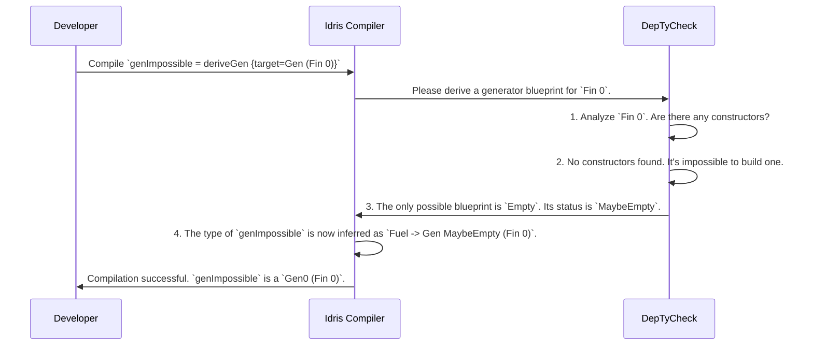

# Chapter 3: Emptiness Tracking

In the [previous chapter](02_gen__the_core_generator_abstraction_.md), we learned how to build our own generator "blueprints" using `Gen`. We saw that a `Gen a` is a recipe for making a value of type `a`. But what happens if you ask for a recipe for something impossible? What if you ask the factory to build a car with five wheels that is also a bicycle?

This chapter introduces one of `DepTyCheck`'s most important safety features: a compile-time system that watches out for impossible requests and warns you before your program ever runs.

## The Impossible Request

In programming, especially with dependent types, it's easy to accidentally define a type that can't possibly have any values. We call these types **uninhabited**.

The classic example is `Fin 0`. The type `Fin n` represents a number from `0` to `n-1`. So, `Fin 2` has two values (`0` and `1`), and `Fin 1` has one value (`0`). But what about `Fin 0`? It represents a number from `0` to `-1`. There are no such numbers! The type `Fin 0` is uninhabited.

So, what happens if we ask `DepTyCheck` to create a generator for it?

```idris
import Data.Fin

-- A generator for a type that can never be created.
genImpossible : Fuel -> Gen (Fin 0)
genImpossible = deriveGen
```

If a generator can't produce a value, we say it is **empty**. Trying to run an empty generator would be a waste of time and could lead to strange runtime bugs. How can we prevent this?

## The Emptiness Traffic Light

`DepTyCheck` solves this with a clever trick in the type system. It attaches a "traffic light" to every generator's blueprint, telling the compiler whether that generator is guaranteed to succeed. This traffic light is a type called `Emptiness` and has two states:

-   `NonEmpty` (Green Light): This generator is guaranteed to produce a value. The assembly line will never halt.
-   `MaybeEmpty` (Yellow Light): Caution! This generator *might* fail to produce a value. It could be empty.

This check happens at **compile time**. It's like having a factory inspector who checks your blueprints for impossible designs *before* you've spent any money building the factory.

This information is encoded directly into the `Gen` type we saw in the previous chapter. The full definition looks more like this:

```idris
-- A simplified view from: src/Test/DepTyCheck/Gen.idr
data Gen : Emptiness -> Type -> Type where
  -- ... constructors go here ...
```

The first parameter to `Gen` is its `Emptiness` status.

## Safety in Practice: `Gen1` vs. `Gen0`

To make this easy to work with, `DepTyCheck` provides two handy aliases:

-   `Gen1 a`: Shorthand for `Gen NonEmpty a`. The "1" means "at least one value is possible." This is a generator you can trust.
-   `Gen0 a`: Shorthand for `Gen MaybeEmpty a`. The "0" means "zero values are possible." This is a generator you must handle with care.

This isn't just for decoration; the compiler enforces it! Remember the `pick1` function for running a generator? Its full name hints at its nature: it requires a `Gen1`.

Let's see what happens when we create a generator that might be empty. The `suchThat` function filters a generator's output. Since the filter might remove every possible value, `suchThat` always produces a `Gen0`.

```idris
-- Generate a random number from 1 to 5...
genNumbers : Gen1 Nat
genNumbers = choose (1, 5)

-- ...but only keep it if it's greater than 10.
genFiltered : Gen0 Nat
genFiltered = suchThat genNumbers (\n => n > 10)
```
Our `genFiltered` is clearly impossible—it will never produce a value. `DepTyCheck` correctly flags its blueprint with `MaybeEmpty` (making it a `Gen0`).

Now, if we try to use this generator with a function that expects a guaranteed-to-succeed `Gen1`, the compiler will stop us dead in our tracks.

```idris
-- This will cause a COMPILE-TIME ERROR!
impossibleSample : IO Nat
impossibleSample = pick1 genFiltered
```

When you try to compile this, Idris will complain with a type mismatch error. It's telling you: "You gave me a `Gen0` (a yellow light), but `pick1` needs a `Gen1` (a green light)! I can't guarantee this will work."

This is the safety net in action! `DepTyCheck` has just prevented a potential runtime error.

The correct way to run a `Gen0` is with `pick`, which anticipates failure by returning a `Maybe` value.

```idris
-- This is correct and will compile.
possibleSample : IO (Maybe Nat)
possibleSample = pick genFiltered
```

When run, `possibleSample` will always produce `Nothing`, because the generator is empty.

## How Does the Magic Work?

`DepTyCheck` isn't using a crystal ball. It's following a set of logical rules at compile time.

1.  **Base Cases:** Some generators are known to be safe. `Pure x` always produces `x`, so it's `NonEmpty`. Others are known to be unsafe. `empty` is a special generator that *only* represents failure, so it's `MaybeEmpty`.

2.  **Combinators:** When you combine generators, `DepTyCheck` calculates the emptiness of the result.
    *   `oneOf [genA, genB]`: If *all* the generators in the list are `NonEmpty`, the result is `NonEmpty`. If even one *might* be empty, the whole thing is treated as potentially empty.
    *   `genA >>= f`: The result is only `NonEmpty` if both `genA` and the generators produced by `f` are `NonEmpty`.
    *   `suchThat g p`: This is *always* treated as `MaybeEmpty`, because the compiler can't know for sure if your filter `p` will ever be satisfied.

When you call `deriveGen`, it performs a similar analysis on your data type.



The core building blocks for this powerful feature are surprisingly simple. The `Emptiness` type itself is just a simple two-constructor `data` type.

```idris
-- From: src/Test/DepTyCheck/Gen/Emptiness.idr
public export
data Emptiness = NonEmpty | MaybeEmpty
```

And the `Gen` type has a special constructor just for representing an impossible blueprint.

```idris
-- A simplified view from: src/Test/DepTyCheck/Gen.idr
data Gen : Emptiness -> Type -> Type where
  Empty : Gen MaybeEmpty a -- The blueprint for failure.
  Pure  : a -> Gen em a    -- A simple, pure blueprint.
  -- ... and the others
```

When `deriveGen` analyzes `Fin 0` and finds no constructors, it has no choice but to use the `Empty` constructor, which is hard-coded to have the `MaybeEmpty` traffic light. This information then propagates up through the type system, protecting you from using it incorrectly. The rules for this propagation are defined as a type-level relation `NoWeaker`, which you can explore in `src/Test/DepTyCheck/Gen/Emptiness.idr`.

## Conclusion

You've now seen one of `DepTyCheck`'s core safety mechanisms. Emptiness Tracking isn't just an abstract concept; it's a practical safety net that uses the Idris type system to find logical errors in your generators at compile time.

-   It tracks whether a generator might fail (`MaybeEmpty`) or is guaranteed to succeed (`NonEmpty`).
-   It uses type aliases like `Gen1` (guaranteed) and `Gen0` (not guaranteed) to make this explicit.
-   It prevents you from using a potentially-failing generator where a guaranteed one is expected, turning runtime bugs into compile-time errors.

This feature gives you incredible confidence that your test data generation logic is sound. But what about the *quality* of the data? Is our generator exploring all the interesting corners of our data type? The next chapter will introduce tools to answer that very question.

Next: [Chapter 4: Generator Labeling & Coverage Analysis](04_generator_labeling___coverage_analysis_.md)

---

Generated by [AI Codebase Knowledge Builder](https://github.com/The-Pocket/Tutorial-Codebase-Knowledge)