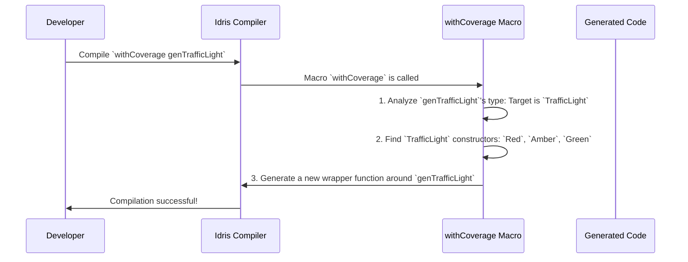

# Chapter 4: Generator Labeling & Coverage Analysis

In the [previous chapter](03_emptiness_tracking_.md), we saw how `DepTyCheck` acts like a factory inspector, ensuring your generator "blueprints" are logically sound and can actually produce values. It's a fantastic safety net. But this raises a new question: we know the factory *can* run, but is it doing a good job? Is it producing a wide variety of toys, or is it stuck making the same one over and over?

This chapter introduces a quality control system for your generators. We'll learn how to track exactly which parts of your data types are being built, helping you spot blind spots in your test data and dramatically improve the quality of your tests.

## The Blind Spot Problem

Imagine we're testing a program that simulates traffic flow. At its heart is the `TrafficLight` data type we've seen before.

```idris
data TrafficLight = Red | Amber | Green
```

We use `deriveGen` to create our generator, which we then use in hundreds of tests.

```idris
genTrafficLight : Fuel -> Gen1 TrafficLight
genTrafficLight = deriveGen
```

Our tests all pass. Great! But we have a nagging feeling. What if—due to some quirk in the random number generator or a subtle bug—our tests *never actually generated a `Green` light*? A whole section of our simulation's logic, the part that handles cars going, might be completely untested. We have a testing blind spot.

How can we discover this without manually reading through thousands of test logs?

## Sticking Labels on Everything

`DepTyCheck`'s solution is elegant: it automatically attaches a "label" to the values produced by a generator. Think of it like a quality control system in a factory.

1.  **Labeling:** Every time the factory builds a part, it puts a sticker on it saying which machine made it. For `DepTyCheck`, if a generator uses the `Red` constructor to build a `TrafficLight`, it metaphorically slaps a "Made with Red" sticker on it.
2.  **Collection:** At the end of the day, a manager collects all the stickers from the finished products.
3.  **Analysis:** The manager tallies up the stickers to see how many times each machine was used. "Machine `Red` was used 34 times, machine `Amber` 32 times... wait, machine `Green` was used 0 times! We need to investigate!"

This process gives you a clear report on your generator's "coverage"—how well it explores all the constructors of your data type.

## Using the Coverage Toolkit

Let's see how to apply this to our `TrafficLight` generator. It's a four-step process.

### Step 1: Wrap Your Generator with `withCoverage`

First, we tell `DepTyCheck` to add the automatic labeling logic. We do this by wrapping our existing generator with the `withCoverage` macro.

```idris
-- Original generator from Chapter 1
genTrafficLight : Fuel -> Gen1 TrafficLight
genTrafficLight = deriveGen

-- New generator with labeling enabled
genCovered : Fuel -> Gen1 TrafficLight
genCovered = withCoverage genTrafficLight
```

The new `genCovered` behaves exactly like `genTrafficLight`, but it secretly collects labels every time it produces a value.

### Step 2: Generate Samples and Collect Labels

Next, we run our new generator many times and collect the results. The `unGenTryND` function is perfect for this. It returns a lazy list of pairs, where each pair contains the collected labels (`ModelCoverage`) and the generated value.

```idris
import Test.DepTyCheck.Gen.Coverage

-- Run the generator 100 times and get the labels.
-- We only care about the labels, so we extract the first part of each pair (`fst`).
allCoverageData : ModelCoverage
allCoverageData = foldl (<+>) neutral (map fst (unGenTryND 100 seed (genCovered fuel)))
```
This code runs `genCovered` 100 times. After each run, it takes the "bag of stickers" (`ModelCoverage`) and merges it into one big collection, `allCoverageData`.

### Step 3: Prepare the Report Template

We need to tell `DepTyCheck` what we expect to see in the report. The `initCoverageInfo` macro looks at your generator's type and creates a blank report template, listing all the types and constructors it expects to find.

```idris
-- Create a blank report for our TrafficLight generator
reportTemplate : CoverageGenInfo _
reportTemplate = initCoverageInfo genTrafficLight
```

### Step 4: Fill and Print the Report

Finally, we use `registerCoverage` to fill in our blank template with the actual data we collected. Then we just print it!

```idris
-- Fill the blank template with our collected sticker data
finalReport : CoverageGenInfo _
finalReport = registerCoverage allCoverageData reportTemplate

-- Let's see the results!
main : IO ()
main = print finalReport
```

When you run this, you'll get a beautifully formatted and colored report right in your terminal. If `Green` was never generated, the output would look something like this:

```
Main.TrafficLight covered partially (68 times)
  - Main.Red: covered (35 times)
  - Main.Amber: covered (33 times)
  - Main.Green: not covered
```
The blind spot is now obvious! We immediately know that our generator needs adjustment or our test suite needs to be run for longer to ensure all cases are covered.

## What's Happening Under the Hood?

The magic behind this is a combination of compile-time code generation and runtime data collection.

### The `withCoverage` Macro

When the compiler sees `withCoverage genTrafficLight`, a special process kicks off:


The macro, defined in `src/Test/DepTyCheck/Gen/Coverage.idr`, doesn't change your original generator. Instead, it writes *new* Idris code that wraps it. The generated code looks conceptually like this:

```idris
-- Conceptual code generated by `withCoverage`
\fuel => do
  -- First, label the type itself
  label (fromString "Main.TrafficLight[?]")

  -- Run the original generator to get a value
  val <- genTrafficLight fuel

  -- Figure out which constructor was used and add the right label
  case val of
    Red   => label (fromString "Main.Red (...)") (Pure val)
    Amber => label (fromString "Main.Amber (...)") (Pure val)
    Green => label (fromString "Main.Green (...)") (Pure val)
```
This new generator blueprint does exactly what the original did, but it adds `label` instructions along the way. These instructions are what add "stickers" during execution.

### The `ModelCoverage` Report

The labels themselves are collected in a simple data structure. The `ModelCoverage` record is essentially just a wrapper around a map that counts how many times each `Label` was seen.

```idris
-- Simplified from: src/Test/DepTyCheck/Gen/Coverage.idr
public export
record ModelCoverage where
  constructor MkModelCoverage
  unModelCoverage : SortedMap Label Nat
```
When you run a labeled generator, the `unGen` function accumulates these counts into a `ModelCoverage` value, which is then returned to you alongside the generated value. The `label` function, part of the [Gen: The Core Generator Abstraction](02_gen__the_core_generator_abstraction_.md), handles this behind the scenes.

Finally, `registerCoverage` is a pure function that iterates over the `(Label, Nat)` pairs in your collected `ModelCoverage` and updates the counts in the pretty `CoverageGenInfo` report structure, preparing it for printing.

## Conclusion

You've now unlocked a powerful tool for ensuring high-quality tests. Generator Labeling and Coverage Analysis moves you beyond just asking "Can my tests run?" to answering "Are my tests *thorough*?"

-   **`withCoverage`** is a macro that automatically instruments your generator to track which constructors are used.
-   **`ModelCoverage`** is the raw data—a collection of labels and their counts.
-   **`initCoverageInfo`** and **`registerCoverage`** work together to produce a human-readable report that highlights blind spots in your test data generation.

By making coverage analysis a routine part of your testing workflow, you can build more robust and reliable software with confidence.

But what if our coverage report shows an imbalance we want to fix? For example, what if we want to generate `Red` more often than `Green`? How do we customize the behavior of `deriveGen`? We'll explore exactly that in the next chapter.

Next: [Chapter 5: Derivation Customization](05_derivation_customization_.md)

---

Generated by [AI Codebase Knowledge Builder](https://github.com/The-Pocket/Tutorial-Codebase-Knowledge)