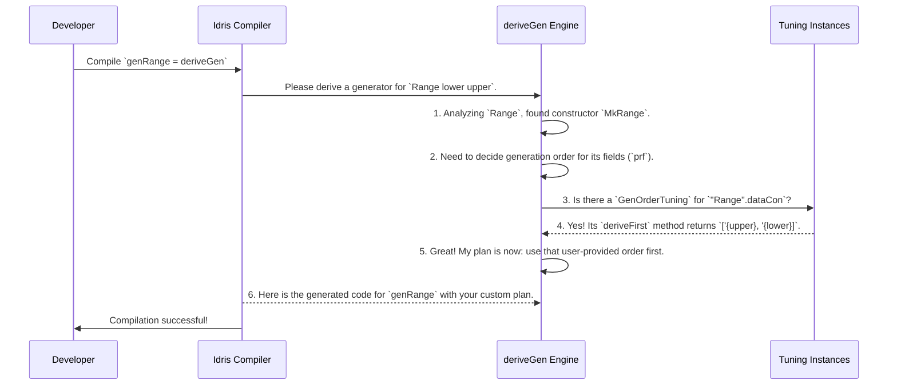

# Chapter 5: Derivation Customization

In the [previous chapter](04_generator_labeling___coverage_analysis_.md), we learned how to become quality control inspectors for our generators. We put on our hard hats, used `withCoverage` to label everything, and generated reports to find blind spots. This is fantastic for *identifying* problems—like discovering our factory never makes `Green` traffic lights.

But what's the next step? What if we want to *fix* an imbalance? Or what if the `deriveGen` engine, as smart as it is, needs a special instruction to build a particularly tricky part? This chapter introduces the control panel for the `deriveGen` engine, giving you the power to fine-tune its behavior.

## The Engine Knows a Lot, But Not Everything

The `deriveGen` engine is a master architect. It can look at a data type and automatically design a perfectly good generator for it. But even a master architect can benefit from a hint.

Imagine a data type representing a range where the `lower` bound must be less than the `upper` bound.

```idris
data Range : Nat -> Nat -> Type where
  MkRange : (prf : lower < upper) -> Range lower upper
```

To generate a `Range`, `deriveGen` needs to create a `lower` number, an `upper` number, and a proof `prf` that `lower < upper`. By default, it might try to generate `lower` first. Let's say it picks `10`. Then it generates `upper`. What should it pick? It doesn't know about the constraint yet, so it might pick `5`. Finally, it tries to generate the proof `10 < 5`, which is impossible! The generator fails and has to try again. This is inefficient.

Wouldn't it be better if we could tell the engine: "Hey, for this `MkRange` constructor, it's much easier if you generate the `upper` bound first. Then you can just pick a `lower` bound that's smaller." This is exactly what derivation customization allows.

## Your Control Knobs: `GenOrderTuning` and `ProbabilityTuning`

`DepTyCheck` gives you two main "control knobs" to influence the `deriveGen` engine. These are special Idris `interface`s that you can implement for your data types.

1.  **`GenOrderTuning`**: This knob controls the **order** in which a constructor's fields are generated. It's perfect for our `Range` example.
2.  **`ProbabilityTuning`**: This knob controls the **likelihood** of `deriveGen` choosing one constructor over another. It's great for balancing test data.

Let's learn how to use them.

### Knob 1: Controlling Field Order with `GenOrderTuning`

Let's solve our `Range` problem. We want to tell `deriveGen` to generate the `upper` field before the `lower` field. We do this by implementing the `GenOrderTuning` interface for the `MkRange` constructor.

```idris
import Deriving.DepTyCheck.Gen.Tuning

-- We are providing a hint FOR the 'MkRange' constructor
instance GenOrderTuning "Range".dataCon where
  -- This is a safety check to ensure "Range".dataCon is a real constructor
  isConstructor = itIsConstructor

  -- Here's our hint!
  deriveFirst _ _ = [`{upper}, `{lower}]
```

Let's break down this simple-looking but powerful piece of code.

*   `instance GenOrderTuning "Range".dataCon`: This line tells the compiler, "I am providing a custom generation order hint." `"Range".dataCon` is how we refer to the constructor of the `Range` type. (If `Range` had multiple constructors, we would use their specific names).
*   `isConstructor = itIsConstructor`: This is a small but important safety macro. It checks at compile-time that `"Range".dataCon` is actually a valid constructor, preventing typos.
*   `deriveFirst _ _ = [`{upper}, `{lower}]`: This is the core instruction. We're telling `deriveGen`: "When you build `MkRange`, please generate the fields in this specific order. Generate the one named `upper` first, then the one named `lower`." The `{...}` syntax creates a `Name` literal.

With this hint in place, `deriveGen` will now generate `upper` (e.g., `20`), then generate `lower` from a range that is guaranteed to be smaller (e.g., `choose (0, 19)`), and finally generate the proof, which is now trivial. The generator becomes much more efficient!

### Knob 2: Controlling Constructor Probability with `ProbabilityTuning`

Now, let's look at a different problem. Consider a simple `List` type.

```idris
data MyList a = MyNil | MyCons a (MyList a)
```

By default, `deriveGen` will create a generator that chooses `MyNil` and `MyCons` with a 50/50 probability. This tends to produce fairly long lists. What if we want to test with shorter lists more often? We can do this by making `MyNil` more likely to be chosen.

We use the `ProbabilityTuning` knob for this.

```idris
import Deriving.DepTyCheck.Gen.Tuning
import Data.Nat1

-- We are providing a hint FOR the 'MyNil' constructor specifically
instance ProbabilityTuning "MyList"."MyNil" where
  -- Safety check
  isConstructor = itIsConstructor

  -- Give 'MyNil' double its normal weight
  tuneWeight currentWeight = currentWeight * 2
```

Here's what this does:

*   `instance ProbabilityTuning "MyList"."MyNil"`: We're targeting a very specific constructor: `MyNil` inside the `MyList` type.
*   `tuneWeight currentWeight = currentWeight * 2`: `deriveGen` assigns a "weight" to each constructor, which is by default `1`. The `tuneWeight` function lets you change this. Here, we're taking the current weight and doubling it.

So, `MyCons` keeps its default weight of `1`, but `MyNil` now has a weight of `2`. The probability of choosing `MyNil` becomes `2 / (1 + 2)`, or ~67%. This will cause `deriveGen` to produce significantly shorter lists on average, which might be exactly what we want for our tests.

## A Look Under the Hood

How does this work? When `deriveGen` is called, it doesn't just look at the data type; it also goes on a hunt for these tuning instances.

Let's trace what happens when we derive a generator for our `Range` type.



The core logic for this happens inside `DepTyCheck`'s derivation machinery. In the file `src/Deriving/DepTyCheck/Gen/ForOneTypeConRhs/Impl.idr`, you can find the code that actually builds the generator for a constructor. There's a helper function that explicitly looks for your hint:

```idris
-- Simplified from: src/Deriving/DepTyCheck/Gen/ForOneTypeConRhs/Impl.idr

findUserImposedDeriveFirst : m (List (Fin con.args.length))
findUserImposedDeriveFirst = do
  -- Search for an implementation of `GenOrderTuning` for the current constructor
  Just impl <- search (GenOrderTuning (Con.name con))
    | Nothing => pure [] -- If none found, return an empty list

  -- If found, call `deriveFirst` and return the user's preferred order
  let userImposed = ... deriveFirst @{impl} ...
  pure userImposed
```
This `findUserImposedDeriveFirst` function is called early in the process. The list it returns (`userImposed`) is then placed at the very front of the generation plan, ensuring your hint is respected above the engine's default strategy.

The same principle applies to `ProbabilityTuning`. When `deriveGen` is deciding how to combine constructors (e.g., in a big `oneOf` blueprint), it first checks for a `ProbabilityTuning` instance for each one and adjusts its weight before calculating the final probabilities.

## Conclusion

You've now learned how to take the wheel and steer the `deriveGen` automatic derivation engine. While it's a powerful tool on its own, its true potential is unlocked when you provide it with crucial domain-specific hints.

-   **`GenOrderTuning`** lets you specify the generation order of a constructor's fields, which is essential for satisfying dependent constraints efficiently.
-   **`ProbabilityTuning`** lets you adjust the relative weights of constructors, allowing you to fine-tune the distribution of your generated test data.

These "control knobs" bridge the gap between fully automatic generation and the need for manual precision, giving you the best of both worlds.

So far, we've treated the signature of a generator (e.g., `Fuel -> Gen (MyList a)`) as a simple request. But how does `deriveGen` parse and understand this request? In the next chapter, we'll dive into how `DepTyCheck` represents and analyzes these signatures to kick off the entire derivation process.

Next: [Chapter 6: Generator Signature Representation](06_generator_signature_representation_.md)

---

Generated by [AI Codebase Knowledge Builder](https://github.com/The-Pocket/Tutorial-Codebase-Knowledge)