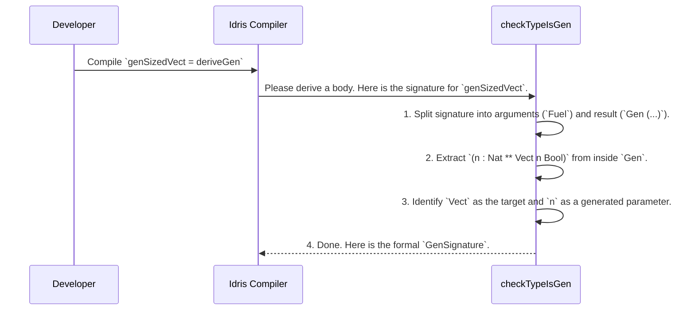

# Chapter 6: Generator Signature Representation

In the [previous chapter](05_derivation_customization_.md), we became factory managers, twisting the knobs of `deriveGen` with `GenOrderTuning` and `ProbabilityTuning` to fine-tune the production line. But this begs a question: how does the `deriveGen` engine get its initial instructions? How does it read the function signature you write and turn it into a concrete plan?

This chapter introduces the internal blueprint that makes it all possible. We'll explore the concept of the `GenSignature`, the standardized "work order" that `DepTyCheck` creates to understand exactly what you've asked it to build.

## From Handwritten Note to Formal Work Order

Imagine you're commissioning a custom piece of furniture. You might scribble a note to the carpenter: "Please build a bookshelf, 3 shelves high, using oak wood that I'll provide."

The carpenter's first step isn't to start sawing wood. It's to translate your informal note into a formal work order, like this:

-   **Product:** Bookshelf
-   **Parameters to Build:**
    -   `shelves`: 3
-   **Materials Provided by Client:**
    -   `wood`: Oak

This structured document is unambiguous. It's a contract that ensures both you and the carpenter agree on the final product.

`deriveGen` works the same way. Your function signature is the handwritten note. Before it can "build" a generator, it first translates that signature into a formal, internal work order called a `GenSignature`. This record precisely defines the task, leaving no room for error.

## Dissecting a Generator's Signature

Let's look at a signature for a generator that produces a `Vect` of a random `Nat` length. This is a common pattern in dependently typed programming.

```idris
import Data.Vect

-- A generator for a pair: a number `n`, and a Vect of that length.
genSizedVect : Fuel -> Gen (n : Nat ** Vect n Bool)
genSizedVect = deriveGen
```

This signature is our "handwritten note." When `deriveGen` sees this, it starts a parsing process to fill out its formal work order. It asks three key questions:

1.  **What's the Target Type?** What is the core data type we're trying to build?
    -   Answer: It's a `Vect`. The `Bool` part is an argument, but the *type family* is `Vect`.

2.  **What Parameters Must Be Generated?** Are there any values that need to be randomly created *before* the target type can be built?
    -   Answer: Yes, the value `n` of type `Nat`. Its value is not known upfront.

3.  **What Parameters Are Given?** Are there any arguments to the final type that are provided by the caller (i.e., listed as arguments to the generator function)?
    -   Answer: No, besides the mandatory `Fuel`.

From this analysis, `DepTyCheck` creates a `GenSignature` record that looks conceptually something like this:

-   **`targetType`:** `Vect`
-   **`givenParams`:** `{}` (an empty set)
-   **`generatedParams`:** `{n}`

This `GenSignature` is the an unambiguous contract. It tells the rest of the derivation engine: "Your job is to build a `Vect`. To do this, you must first generate a `Nat` to use for the `n` parameter."

## The `GenSignature` Record

This "work order" is a real data structure inside `DepTyCheck`. While the actual record is more complex, a simplified version gives a clear picture of its role. It's defined in `src/Deriving/DepTyCheck/Gen/Signature.idr`.

```idris
-- A simplified view of the work order
public export
record GenSignature where
  constructor MkGenSignature
  targetType  : TypeInfo -- Info about the type to build, e.g., Vect
  givenParams : SortedSet (Fin targetType.args.length) -- Which type arguments are provided?
```

-   `targetType`: This field doesn't just store the name `Vect`. It holds a rich `TypeInfo` structure containing the type's name, its constructors (`Nil`, `::`), and its arguments (`len`, `elem`).
-   `givenParams`: This is a set of indices telling the engine which of the type's arguments (like `len` or `elem`) are being passed into the generator function by the user.

From these two pieces of information, `DepTyCheck` can deduce the final piece of the puzzle: the `generatedParams`. It simply takes all the arguments of `targetType` and subtracts the `givenParams`.

## Under the Hood: The Signature Parser

This translation from your handwritten function signature to a formal `GenSignature` happens in a flash at compile-time. The function responsible for this is `checkTypeIsGen`, found in `src/Deriving/DepTyCheck/Gen.idr`.

Here's a step-by-step look at what it does when it encounters `genSizedVect = deriveGen`:



The `checkTypeIsGen` function uses powerful metaprogramming tools to inspect the structure of your types.

First, it breaks apart the function signature into its arguments and return type.

```idris
// Conceptual code from checkTypeIsGen
let (sigArgs, sigResult) = unPi sig
// For genSizedVect:
// sigArgs = [Fuel]
// sigResult = Gen (n : Nat ** Vect n Bool)
```

Next, it peels away the `Gen` wrapper to get to the core of what needs to be generated. It recognizes that `(n : Nat ** Vect n Bool)` is a dependent pair (`DPair`), meaning some parts need to be generated first.

```idris
// Conceptual code from checkTypeIsGen
let Just (paramsToBeGenerated, targetType) = unDPairUnAlt sigResult
// For genSizedVect, after peeling `Gen`:
// paramsToBeGenerated = [(n, Nat)]
// targetType = Vect n Bool
```

Finally, it analyzes `sigArgs` to find any "given" parameters and combines all this information to construct the formal work order. For our example, there are no given parameters, so the job is simple. This structured `GenSignature` is then passed a series of other functions—the "departments" in our factory—that handle tasks like [Constructor Recursion Analysis](07_constructor_recursion_analysis_.md) and code generation.

This initial parsing step is the foundation upon which the entire automatic derivation process is built. Without a clean, formal contract, the complex machinery that follows would have no idea where to start.

## Conclusion

You've now seen the secretarial work that happens before any "real" work begins. `deriveGen` is not just a code generator; it's also a sophisticated parser.

-   It reads the function signature you provide for your generator.
-   It translates this signature into a formal, internal "work order" called a `GenSignature`.
-   This `GenSignature` precisely specifies the **target type** to be built, the parameters that are **given** by the user, and the parameters that must be **generated** randomly.
-   This structured contract is the crucial first step that guides the entire derivation engine.

Now that the engine has a clear plan (`GenSignature`), its next task is to study the `targetType`'s own blueprints: its constructors. What happens if a constructor for a `List` refers back to `List` itself? How does the engine analyze and handle this recursion to avoid infinite loops? We'll explore this fascinating topic in the next chapter.

Next: [Chapter 7: Constructor Recursion Analysis](07_constructor_recursion_analysis_.md)

---

Generated by [AI Codebase Knowledge Builder](https://github.com/The-Pocket/Tutorial-Codebase-Knowledge)